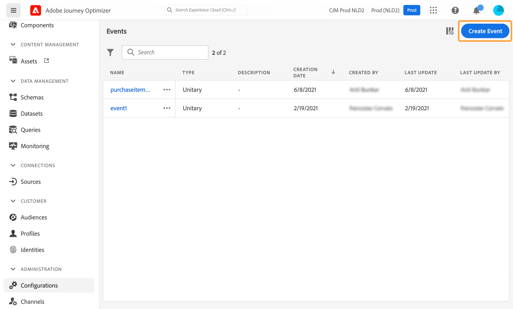
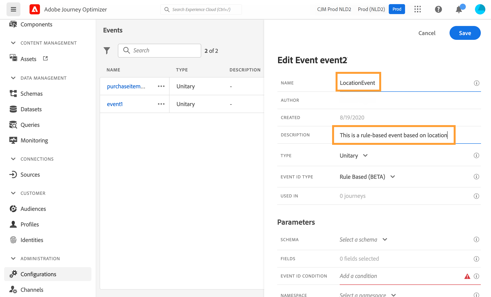

# Configure a unitary event {#configure-an-event}

>[!CONTEXTUALHELP]
>id="ajo_journey_event_unitary"
>title="Unitary events"
>abstract="The event configuration allows you to define the information Journey Optimizer will receive as events. You can use multiple events (in different steps of a journey) and several journeys can use the same event. Unitary events are linked to a specific profile. They can be rule-based or system-generated."

Unitary events are linked to a specific profile. They can be rule-based or system-generated.  Read more on unitary event [this section](../event/about-events.md).

Here are the first steps to configure a new event:

1. In the ADMINISTRATION menu section, select **[!UICONTROL Configurations]**. In the  **[!UICONTROL Events]** section, click **[!UICONTROL Manage]**. The list of events is displayed. 

   

1. Click **[!UICONTROL Create Event]** to create a new event. The event configuration pane opens on the right side of the screen.

   

1. Enter the name of your event. You can also add a description.

   

    >[!NOTE]
    >
    >Do not use spaces or special characters. Do not use more than 30 characters.

1. In the **[!UICONTROL Type]** field, choose **Unitary**.

   

1. In the **[!UICONTROL Event ID type]** field, select the event ID type you want to use: **Rule Based** or **System Generated**. Read more on event ID types in [this section](../event/about-events.md#event-id-type).

   

1. The number of journeys that use this event is displayed in the **[!UICONTROL Used in]** field. You can click the **[!UICONTROL View journeys]** icon to display the list of journeys using this event.

1. Define the schema and payload fields: this is where you select the event information (usually called a payload) journeys expects to receive. You will then be able to use this information in your journey. See [this section](../event/about-creating.md#define-the-payload-fields).

   

   >[!NOTE]
   >
   >When you select the **[!UICONTROL System Generated]** type, only schemas that have the eventID type field are available. When you select the **[!UICONTROL Rule Based]** type, all Experience Event schemas are available.

1. For rule-based events, click inside the **[!UICONTROL Event ID condition]** field. Using the simple expression editor, define the condition that will be used by the system to identify the events that will trigger your journey.
  

   In our example, we wrote a condition based on the profile's city. This means that whenever the system receives an event that matches this condition (**[!UICONTROL City]** field and **[!UICONTROL Paris]** value), it will pass it to journeys.

   >[!NOTE]
   >
   >The advanced expression editor is not available when defining the **[!UICONTROL Event ID condition]**. In the simple expression editor, not all operators are available, they depend on the data type. For example, for a string type of field, you can use "contains" or "equal to".

1. Add a namespace. This step is optional but recommended as adding a namespace allows you to leverage information stored in the Real-time Customer Profile Service. It defines the type of key the event has. See [this section](../event/about-creating.md#select-the-namespace).
1. Define the profile identifier: choose a field from your payload fields or define a formula to identify the person associated to the event. This key is automatically setup (but can still be edited) if you select a namespace. Indeed, journeys picks the key that should correspond to the namespace (for example, if you select an email namespace, the email key will be selected). See [this section](../event/about-creating.md#define-the-event-key). 

    

1. Click **[!UICONTROL Save]**.

    The event is now configured and ready to be dropped into a journey. Additional configuration steps are required to receive events. See [this page](../event/additional-steps-to-send-events-to-journey-orchestration.md).

## Define the payload fields {#define-the-payload-fields}

The payload definition allows you to choose the information the system expects to receive from the event in your journey and the key to identify which person is associated to the event. The payload is based on the Experience Cloud XDM field definition. For more information on XDM, refer to [Adobe Experience Platform documentation](https://experienceleague.adobe.com/docs/experience-platform/xdm/home.html){target="_blank"}.

1. Select an XDM schema from the list and click on the **[!UICONTROL Fields]** field or on the **[!UICONTROL Edit]** icon.

    

    All the fields defined in the schema are displayed. The list of fields varies from one schema to another. You can search for a specific field or use the filters to display all nodes and fields or only the selected fields. According to the schema definition, some fields may be mandatory and pre-selected. You cannot unselect them. All fields that are mandatory for the event to be received properly by journeys are selected by default.

    >[!NOTE]
    >
    >For system-generated events, make sure that you have added the "orchestration" field group to the XDM schema. This will ensure that your schema contains all the required information to work with [!DNL Journey Optimizer].

    

1. Select the fields you expect to receive from the event. These are the fields which the business user will leverage in the journey. They must also include the key that will be used to identify the person associated to the event (see [this section](../event/about-creating.md#define-the-event-key)).

    >[!NOTE]
    >
    >For system-generated events, the **[!UICONTROL eventID]** field is automatically added in the list of fields selected so that [!DNL Journey Optimizer] can identify the event. The system pushing the event should not generate an ID, it should use the one available in the payload preview. See [this section](../event/about-creating.md#preview-the-payload).

1. When you're done selecting the needed fields, click **[!UICONTROL Ok]** or press **[!UICONTROL Enter]**.

    The number of selected fields appears in the **[!UICONTROL Fields]** field.

    

## Select the namespace {#select-the-namespace}

The namespace allows you to define the type of key used to identify the person associated to the event. Its configuration is optional. It is required if you want to retrieve, in your journeys, additional information coming from the [Real-time Customer Profile](https://experienceleague.adobe.com/docs/experience-platform/profile/home.html){target="_blank"}. The namespace definition is not needed if you're only using data coming from a third-party system through a custom data source.

You can either use one of the predefined ones or create a new one using the Identity Namespace service. Refer to [Adobe Experience Platform documentation](https://experienceleague.adobe.com/docs/experience-platform/identity/home.html){target="_blank"}.

If you select a schema that has a primary identity, then the **[!UICONTROL Profiler identifier]** and **[!UICONTROL Namespace]** fields are pre-filled. If there is no identity defined, we select _identityMap > id_ as the primary key. Then you have to select a namespace and the key will be pre-filled (below the **[!UICONTROL Namespace]** field) using _identityMap > id_.

When selecting fields, primary identity fields are tagged. 

Select a namespace from the drop-down list.

Only one namespace is allowed per journey. If you use several events in the same journey, they need to use the same namespace. See [this page](../building-journeys/journey.md).

## Define the profile identifier {#define-the-event-key}

The key is the field or combination of fields is part of the event payload data and that will allow the system to identify the person associated to the event. The key can be, for example, the Experience Cloud ID, a CRM ID or an email address.

If you plan to leverage data stored in the Real-time Customer Profile database, you must select, as the event key, information you defined as a profile's identity in the [Real-time Customer Profile Service](https://experienceleague.adobe.com/docs/experience-platform/profile/home.html){target="_blank"}.

It will allow the system to perform the reconciliation between the event and the individual's profile. If you select a schema that has a primary identity, then the **[!UICONTROL Profile identifier]** and **[!UICONTROL Namespace]** fields are pre-filled. If there is no identity defined, we select _identityMap > id_ as the primary key. Then you have to select a namespace and the key will be pre-filled (below the **[!UICONTROL Namespace]** field) using _identityMap > id_.

When selecting fields, primary identity fields are tagged. 

If you need to use a different key, such as a CRM ID or an email address, you need to add it manually:

1. Click inside the **[!UICONTROL Profile identifier]** field or on the pencil icon.

    

1. Select the field chosen as the key in the list of payload fields. You can also switch to the advanced expression editor to create more complex keys (for example, a concatenation of two field of the events). See below, in this section.

    

When the event is received, the value of the key will allow the system to identify the person associated to the event. Associated to a namespace (see [this section](../event/about-creating.md#select-the-namespace)), the key can be used to perform queries on Adobe Experience Platform. See [this page](../building-journeys/about-journey-activities.md#orchestration-activities).
The key is also used to check that a person is in a journey. Indeed, a person cannot be at two different places in the same journey. As a result, the system does not allow the same key, for example the key CRMID=3224, to be at different places in the same journey.

You also have access to the advanced expression functions (**[!UICONTROL Advanced mode]**) if you want to perform additional manipulations. These functions let you manipulate the values used to carry out specific queries such changing formats, performing field concatenations, taking into account only a part of a field (for example the 10 first characters). See [Journey Orchestration documentation](../building-journeys/expression/expressionadvanced.md).  

## Preview the payload {#preview-the-payload}

The payload preview allows you to validate the payload definition.

>[!NOTE]
>
>For system-generated events, when you create an event, before viewing the payload preview, save your event and re-open it. This step is needed to generate an event ID in the payload.

1. Click the **[!UICONTROL View Payload]** icon to preview the payload expected by the system.

    

    You can notice that the fields selected are displayed.

    

1. Check the preview to validate the payload definition.

1. Then, you can share the payload preview with to the person responsible for the event sending. This payload can help them design the setup of an event pushing to [!DNL Journey Optimizer]. See [this page](../event/additional-steps-to-send-events-to-journey-orchestration.md).
