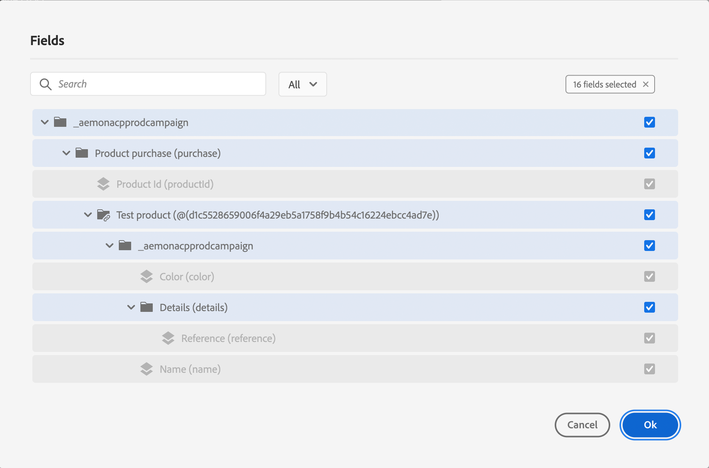

# About ExperienceEvent Schemas for [!DNL Journey Optimizer] Events {#about-experienceevent-schemas}

[!DNL Journey Optimizer] events are XDM Experience Events that are sent to Adobe Experience Platform via Streaming Ingestion.

As such, an important prerequisite for setting up events for [!DNL Journey Optimizer] is that you are familiar with Adobe Experience Platform’s Experience Data Model (or XDM) and how to compose XDM Experience Event schemas, as well as how to stream XDM-formatted data to Adobe Experience Platform.

## Schema requirements for [!DNL Journey Optimizer] Events  {#schema-requirements}

The first step in setting up an event for [!DNL Journey Optimizer] is to ensure that you have an XDM schema defined to represent the event, and a dataset created to record instances of the event on Adobe Experience Platform. Having a dataset for your events is not strictly necessary, but sending the events to a specific dataset will allow you to maintain users’ event history for future reference and analysis, so it is always a good idea. If you do not already have a suitable schema and dataset for your event, both of those tasks can be done in Adobe Experience Platform web interface. 

Any XDM schema that will be used for [!DNL Journey Optimizer] events should meet the following requirements:  

* The schema must be of the XDM ExperienceEvent class. 

   

* For system-generated events, the schema must include the Orchestration eventID field group. [!DNL Journey Optimizer] uses this field to identify events used in journeys.

   

* Declare an identity field for identifying the subject of the event. If no identity is specified, an identity map can be used. This is not recommended.

   

* If you would like this data to be available for lookup later in a Journey, mark the schema and dataset for profile. 

   

   

* Feel free to include data fields to capture any other context data you want to include with the event, such as information about the user, the device from which the event was generated, location, or any other meaningful circumstances related to the event. 

   

   

## Leverage schema relationships{#leverage_schema_relationships}

Adobe Experience Platform allows you to define relationships between schemas in order to use one dataset as a lookup table for another. 

Let's say your brand data model has a schema capturing purchases. You also have a schema for the product catalog. You can capture the product ID in the purchase schema and use a relationship to look up more complete product details from the product catalog. This allows you to create a segment for all customers who bought a laptop, for example, without having to explicitly list out all laptop IDs or capture every single product details in transactional systems.

To define a relationship, you need to have a dedicated field in the source schema, in this case the product ID field in the purchase schema. This field needs to reference the product ID field in the destination schema. The source and destination tables must be enabled for profiles and the destination schema must have that common field defined as its primary identity. 

Here is the product catalog schema enabled for profile with the product ID defined as the primary identity. 

Here is the purchase schema with the relationship defined on the product ID field.

>[!NOTE]
>
>Learn more on schema relationships in the [Experience Platform documentation](https://experienceleague.adobe.com/docs/platform-learn/tutorials/schemas/configure-relationships-between-schemas.html?lang=en).

In Journey Optimizer, you can then leverage all the fields from the linked tables:

* when configuring a business or unitary event, [Read more](../event/experience-event-schema.md#unitary_event_configuration) 
* when using conditions in a journey, [Read more](../event/experience-event-schema.md#journey_conditions_using_event_context) 
* in message personalization, [Read more](../event/experience-event-schema.md#message_personalization) 
* in custom action personalization, [Read more](../event/experience-event-schema.md#custom_action_personalization_with_journey_event_context) 

### Event configuration{#unitary_event_configuration}

The linked schema fields are available in unitary and business event configuration:

* when browsing through the event schema fields in the event configuration screen.
* when defining a condition for system-generated events.

The linked fields are not available:

* in the event key formula
* in event id condition (rule-based events)

To learn how to configure a unitary event, refer to this [page](../event/about-creating.md).

### Journey conditions using event context{#journey_conditions_using_event_context}

You can use data from a lookup table linked to an event used in a journey for condition building (expression editor).

Add a condition in a journey, edit the expression and unfold the event node in the expression editor. 

To learn how to define journey conditions, refer to this [page](../building-journeys/condition-activity.md).

### Message personalization{#message_personalization}

The linked fields are available when personalizing a message. The related fields are displayed in the context passed from the journey to the message.

To learn how to personalize a message with contextual journey information, refer to this [page](../personalization/personalization-use-case.md).

### Custom action personalization with journey event context{#custom_action_personalization_with_journey_event_context}

The linked fields are available when configuring the action parameters of a journey custom action activity. 

To learn how to use custom actions, refer to this [page](../building-journeys/using-custom-actions.md).
