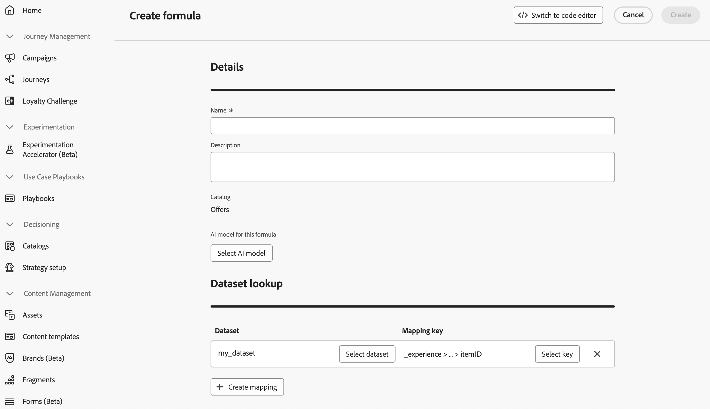

# Use Adobe Experience Platform data for Decisioning {#aep-data}

>[!CONTEXTUALHELP]
>id="ajo_exd_rules_dataset_lookup"
>title="Dataset Lookup"
>abstract="Using Adobe Experience Platform data in decision rules allows you to define eligibility criteria based on dynamic, external attributes, ensuring decision items are only shown when relevant. Create a mapping to define how the Adobe Experience Platform dataset joins with data in [!DNL Journey Optimizer]. Select the dataset with the attributes you need and choose a joining key that exists in both the decision item attributes and the dataset."

>[!CONTEXTUALHELP]
>id="ajo_exd_formula_dataset_lookup"
>title="Dataset Lookup"
>abstract="Ranking formulas define the priority of decision items. By using [!DNL Adobe Experience Platform] dataset attributes, you can dynamically adjust the ranking logic to reflect real-world conditions. Create a mapping to define how the Adobe Experience Platform dataset joins with data in [!DNL Journey Optimizer]. Select the dataset with the attributes you need and choose a joining key that exists in both the decision item attributes and the dataset"

>[!AVAILABILITY]
>
>This capability is currently available to all customers as a public beta. Please contact your account representative if you would like access.

[!DNL Journey Optimizer] allows you to leverage data from [!DNL Adobe Experience Platform] for Decisioning. This allows you to extend the definition of your decision attributes to additional data in datasets for bulk updates that change periodically without having to manually update the attributes one at a time. For example, availability, wait times, etc.

## Beta restrictions and guidelines {#guidelines}

Before you begin, take note of the following restrictions and guidelines:

* A decision policy can reference up to 3 datasets total, across all its decision rules and ranking formulas combined. For example, if your rules use 2 datasets, your formulas can only use 1 additional dataset.
* A decision rule can use 3 datasets.
* A ranking formula can use 3 datasets.
* When a decision policy is evaluated, the system will perform up to 1000 dataset queries (lookups) in total. Each dataset mapping used by a decision item counts as one query. Example: If a decision item uses 2 datasets, evaluating that offer counts as 2 queries toward the 1000-query limit.

## Enable a dataset for data lookup {#enable}

To use data from an [!DNL Adobe Experience Platform] dataset for decisioning, you must first enable it for lookup via an API call. For detailed instructions, refer to this section: [Leverage Adobe Experience Platform datasets in Journey Optimizer](../data/lookup-aep-data.md).

## Leverage Adobe Experience Platform data {#leverage-aep-data}

Once a dataset is enabled for lookup, you can use its attributes to enrich your decision logic with external data. This is especially useful for attributes that frequently change, such as product availability, or real-time pricing.

Attributes from Adobe Experience Platform datasets can be used in two parts of decision logic:

* **Decision rules**: Define whether a decision item is eligible to be shown.
* **Ranking formulas**: Prioritize decision items based on external data.

The next sections explain how to use Adobe Experience Platform data in both contexts.

### Decision rules {#rules}

Using Adobe Experience Platform data in decision rules allows you to define eligibility criteria based on dynamic, external attributes, ensuring decision items are only shown when relevant.

For example, let's say an online retailer wants to promote product recommendations based on local store inventory. A product should only be eligible for recommendation if it is in stock at the nearest location. A dataset containing daily inventory updates is uploaded to Adobe Experience Platform. The rule logic checks if the `inventory_count` for a given product is greater than 0 for the customer's preferred store. If so, the decision item is eligible.

To use Adobe Experience Platform data into decision rules, follow these steps:

1. Go to **[!UICONTROL Strategy setup]** / **[!UICONTROL Decision rules]** menu and select **[!UICONTROL Create rule with dataset]**.

    

1. Click **[!UICONTROL Create mapping]** to define how the Adobe Experience Platform dataset joins with data in [!DNL Journey Optimizer].

    * Select the dataset with the attributes you need.
    * Choose a joining key (e.g., product ID or store ID) that exists in both the decision item attributes and the dataset.

    
    
    >[!NOTE]
    >
    >You can create up to 3 mappings per rule.

1. Click **[!UICONTROL Continue]**. You can now access the dataset attributes in the **[!UICONTROL Dataset Lookup]** menu and use them in your rule conditions. [Learn how to create a decision rule](../experience-decisioning/rules.md#create)

    

### Ranking formulas {#ranking-formulas}

Ranking formulas define the priority of decision items. By using [!DNL Adobe Experience Platform] dataset attributes, you can dynamically adjust the ranking logic to reflect real-world conditions.

For example, let's say an airline uses a ranking formula to prioritize upgrade offers. If a customer has a high loyalty tier and current seat availability is low (based on a dataset updated hourly), they are given higher priority. The dataset includes fields like `flight_number`, `available_seats`, and `loyalty_score`.

To use Adobe Experience Platform data into ranking formulas, follow these steps:

1. Create or edit a ranking formula. In the **[!UICONTROL Dataset lookup]** section, click **[!UICONTROL Create mapping]**. 

1. Define the dataset mapping:

    * Select the appropriate dataset (e.g., seat availability by flight).
    * Choose a joining key (e.g., flight number or customer ID)  that exists in both the decision item attributes and the dataset.

    
    
    >[!NOTE]
    >
    >You can create up to 3 mappings per ranking formula.

1. Use the dataset fields to build your ranking formula as usual. [Learn how to create a ranking formula](ranking/ranking-formulas.md#create-ranking-formula)

    
