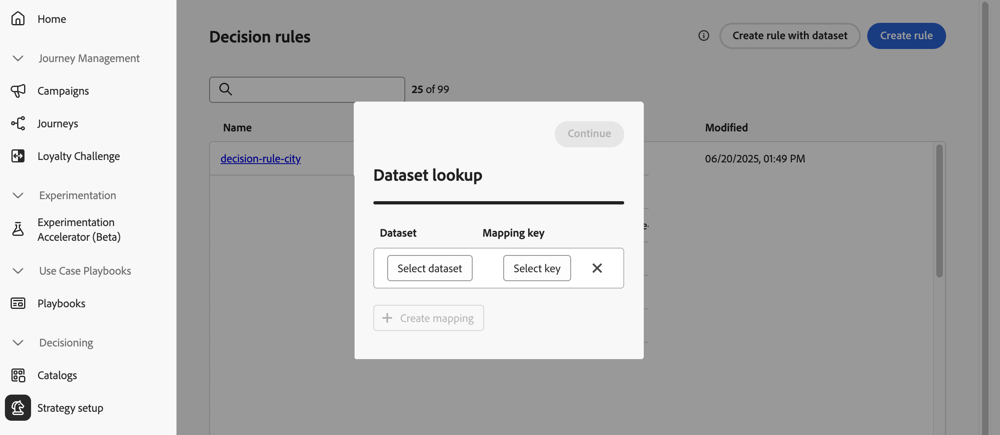
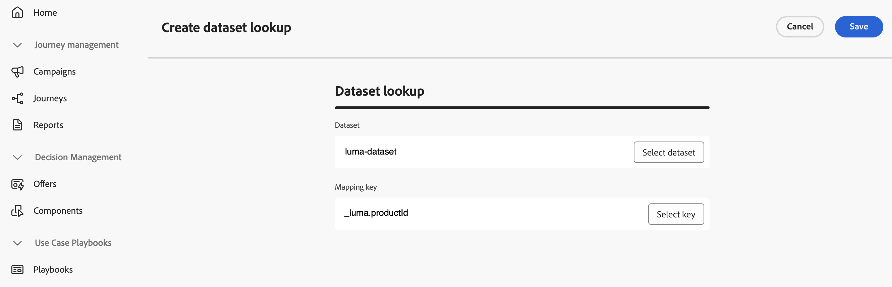
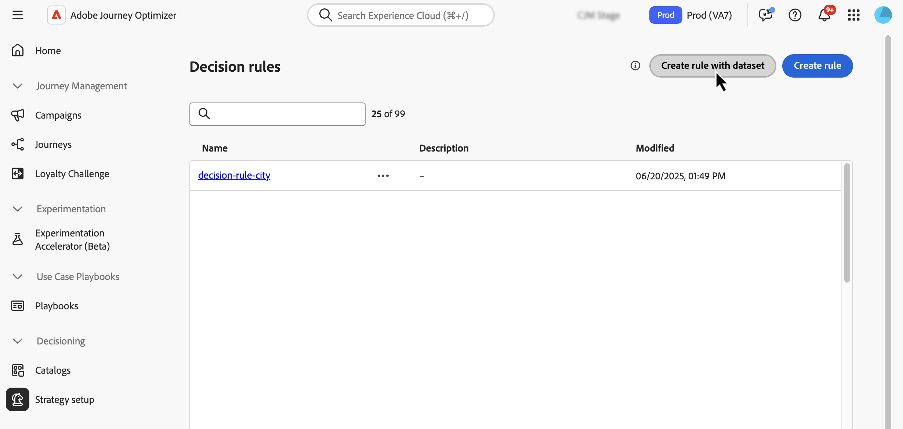
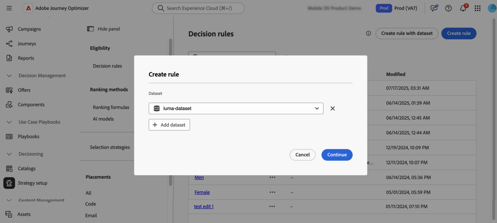
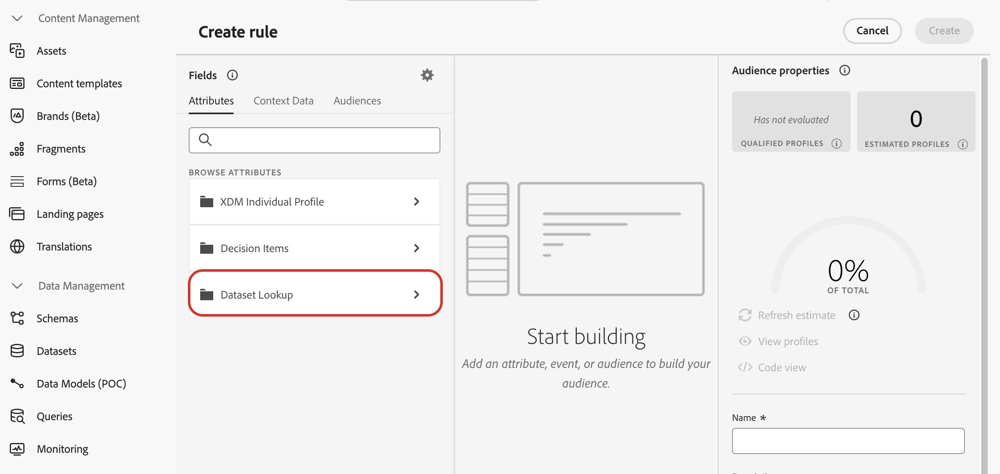
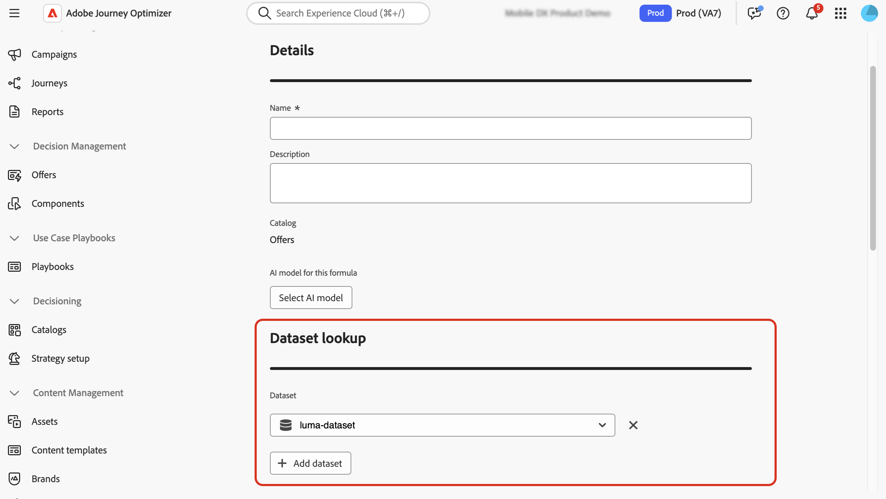
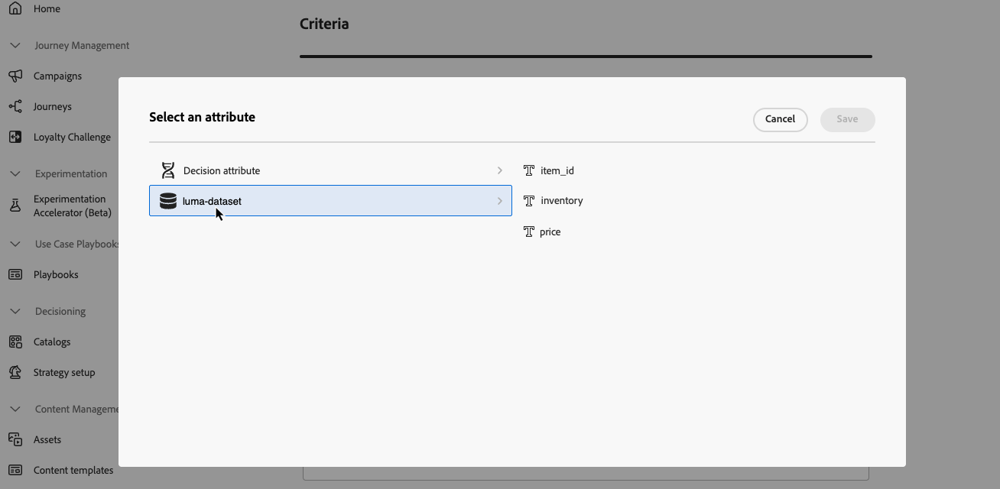
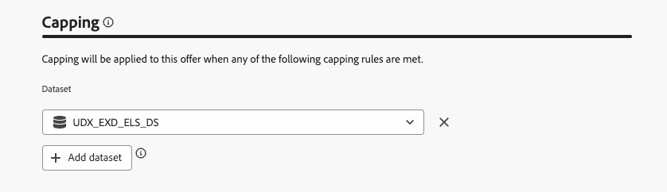
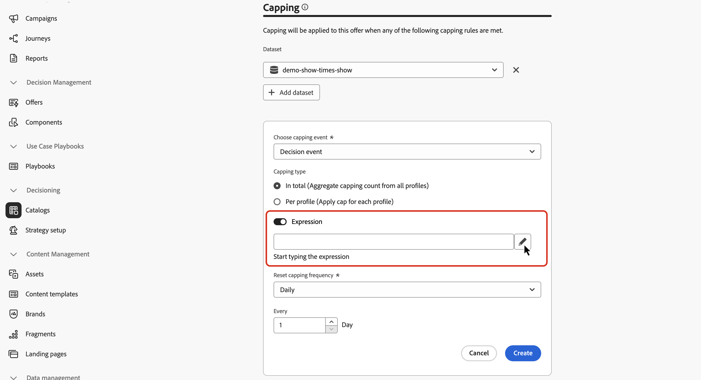
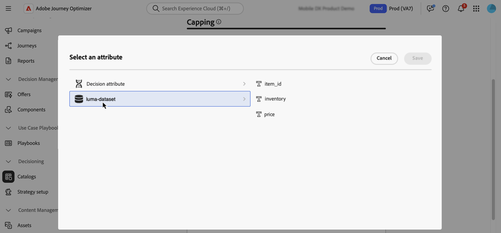

# Use Adobe Experience Platform data for Decisioning {#aep-data}

>[!CONTEXTUALHELP]
>id="ajo_exd_rules_dataset_lookup"
>title="Dataset Lookup"
>abstract="Using Adobe Experience Platform data in decision rules allows you to define eligibility criteria based on dynamic, external attributes, ensuring decision items are only shown when relevant. Create a mapping to define how the Adobe Experience Platform dataset joins with data in [!DNL Journey Optimizer]. Select the dataset with the attributes you need and choose a joining key that exists in both the decision item attributes and the dataset."

>[!CONTEXTUALHELP]
>id="ajo_exd_formula_dataset_lookup"
>title="Dataset Lookup"
>abstract="Ranking formulas define the priority of decision items. By using [!DNL Adobe Experience Platform] dataset attributes, you can dynamically adjust the ranking logic to reflect real-world conditions. Create a mapping to define how the Adobe Experience Platform dataset joins with data in [!DNL Journey Optimizer]. Select the dataset with the attributes you need and choose a joining key that exists in both the decision item attributes and the dataset"

>[!AVAILABILITY]
>
>This feature is currently available to all customers as a limited availability release.

[!DNL Journey Optimizer] allows you to leverage data from [!DNL Adobe Experience Platform] for Decisioning. This allows you to extend the definition of your decision attributes to additional data in datasets for bulk updates that change periodically without having to manually update the attributes one at a time. For example, availability, wait times, etc.

>[!IMPORTANT]
>
>[!DNL Journey Optimizer ]supports up to 1000 lookups for a single decision policy.

## Prerequisites

### Enable datasets for lookup

Before starting, datasets needed for decisioning must first be enabled for lookup. Follow the steps detailed in this section: [Use Adobe Experience Platform data](../data/lookup-aep-data.md).

### Create mappings

In order to use attributes from Adobe Experience Platform for decisioning, you need to create a mapping to define how the Adobe Experience Platform dataset joins with data in [!DNL Journey Optimizer]. To do so, follow these steps: 

1. Navigate to **[!UICONTROL Catalogs]** / **[!UICONTROL Dataset lookup]** then click **[!UICONTROL Create]**.

    

1. Configure the mapping: 

    1. Click **[!UICONTROL Select dataset]** to display all Adobe Experience Platform that have been enabled for lookup. Select the dataset with the attributes you need.

    1. Click **[!UICONTROL Select key]** to choose a joining key (e.g., flight number or customer ID) that exists in both the decision item attributes and the dataset.

    

1. Click **[!UICONTROL Save]**.

## Leverage Adobe Experience Platform data {#leverage-aep-data}

Once a dataset is enabled for lookup and mappings have been created, you can use the data to enrich your decision logic with external data. This is especially useful for attributes that frequently change, such as product availability, or real-time pricing.

Attributes from Adobe Experience Platform datasets can be used in two parts of decision logic:

* **Decision rules**: Define whether a decision item is eligible to be shown.
* **Ranking formulas**: Prioritize decision items based on external data.
* **Capping rules**: Use external data to calculate the threhold for capping rules.

The next sections explain how to use Adobe Experience Platform data in these contexts.

### Decision rules {#rules}

Using Adobe Experience Platform data in decision rules allows you to define eligibility criteria based on dynamic, external attributes, ensuring decision items are only shown when relevant.

For example, let's say an online retailer wants to promote product recommendations based on local store inventory. A product should only be eligible for recommendation if it is in stock at the nearest location. A dataset containing daily inventory updates is uploaded to Adobe Experience Platform. The rule logic checks if the `inventory_count` for a given product is greater than 0 for the customer's preferred store. If so, the decision item is eligible.

To use Adobe Experience Platform data into decision rules, follow these steps:

1. Go to **[!UICONTROL Strategy setup]** / **[!UICONTROL Decision rules]** menu and select **[!UICONTROL Create rule with dataset]**.

    

1. Click **[!UICONTROL Add dataset]** then select the dataset with the attributes you need.
    
    

1. Click **[!UICONTROL Continue]**. You can now access the dataset attributes in the **[!UICONTROL Dataset Lookup]** menu and use them in your rule conditions. [Learn how to create a decision rule](../experience-decisioning/rules.md#create)

    

### Ranking formulas {#ranking-formulas}

Ranking formulas define the priority of decision items. By using [!DNL Adobe Experience Platform] dataset attributes, you can dynamically adjust the ranking logic to reflect real-world conditions.

For example, let's say an airline uses a ranking formula to prioritize upgrade offers. If a customer has a high loyalty tier and current seat availability is low (based on a dataset updated hourly), they are given higher priority. The dataset includes fields like `flight_number`, `available_seats`, and `loyalty_score`.

To use Adobe Experience Platform data into ranking formulas, follow these steps:

1. Create or edit a ranking formula.

1. In the **[!UICONTROL Dataset lookup]** section, click **[!UICONTROL Add dataset]**. 

1. Select the appropriate dataset.

    

    >[!NOTE]
    >
    >If the dataset you are looking for does not display in the list, make sure you have enabled it for lookup and you have created a dataset lookup mapping. For more details, refer to the [Prerequisites](#prerequisites) section.

1. Use the dataset fields to build your ranking formula as usual. [Learn how to create a ranking formula](ranking/ranking-formulas.md#create-ranking-formula)

    

### Capping rules {#capping-rules}

Capping rules are used as constraints to define the maximum number of times a decision item can be presented. Using Adobe Experience Platform data in capping rules allows you to define capping criteria based on dynamic, external attributes. This is done by using an expression in your capping rule to calculate the desired capping threshold.

For example, a retailer may want to cap an offer based on real-time product inventory. Instead of setting a fixed threshold of 500, they use an expression referencing the `inventory_count` field from an Adobe Experience Platform dataset. If the dataset shows that 275 items remain in stock, the offer will only be delivered up to that number.

>[!NOTE]
>
>Capping rule **expressions** are currently available as a Limited Availability capability to all users, and are supported only for the **[!UICONTROL In total]** capping type.

To use Adobe Experience Platform data into capping rules expressions, follow these steps:

1. Create or edit a decision item.

1. When defining the item eligibility, click **[!UICONTROL Add dataset]** and select the appropriate dataset.

    

    >[!NOTE]
    >
    >If the dataset you are looking for does not display in the list, make sure you have enabled it for lookup and you have created a dataset lookup mapping. For more details, refer to the [Prerequisites](#prerequisites) section.

1. Select the **[!UICONTROL In total]** capping type then enable the **[!UICONTROL Expression]** option.

    

    >[!NOTE]
    >
    >If the dataset you are looking for does not display in the list, make sure you have enabled it for lookup and you have created a dataset lookup mapping. For more details, refer to the [Prerequisites](#prerequisites) section.

1. Edit the expression and use the dataset fields to build your expression.

    

1. Complete the configuration of your capping and rule decision item as usual. [Learn how to set capping rules](../experience-decisioning/items.md#capping)
