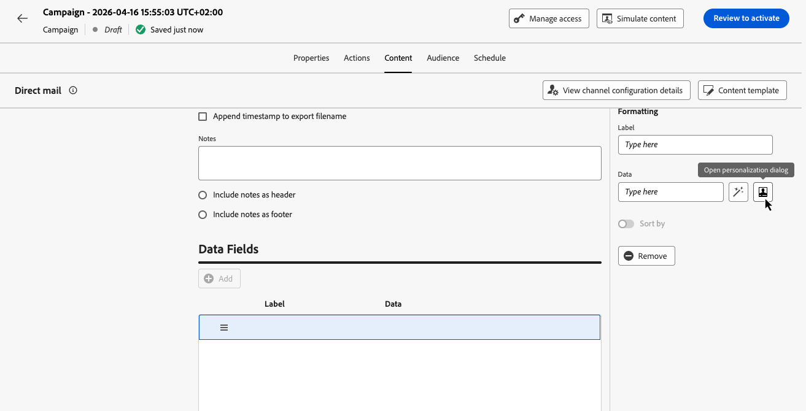
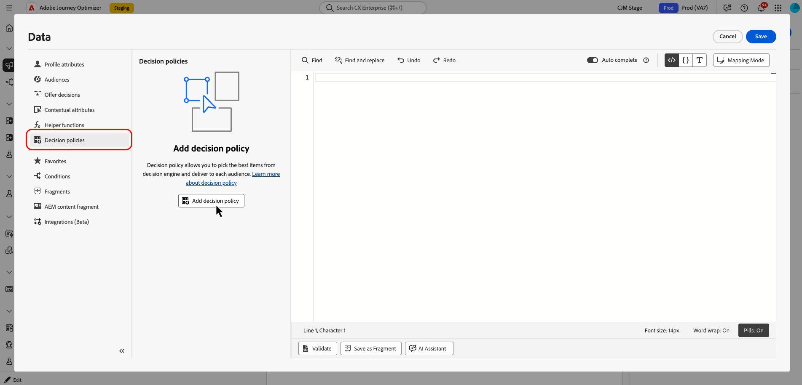

# Batch decisioning in direct mail {#batch-decisioning-direct-mail}

With batch decisioning, Decisioning selects the best decision item or items for each profile and includes those results in the direct mail extraction file. You can return multiple items per profile by setting **[!UICONTROL Number of items]** when configuring the decision policy. The exported file can be used for direct mail personalization or for batch use cases where you export profiles and decision attributes to another system. 

Batch decisioning in direct mail supports two main use cases:

* **Direct mail with decisioning** – Personalize physical mail per recipient. For example, choose the best image or offer for each profile using eligibility rules and ranking (priority or formulas). The extraction file includes profile data plus attributes from the selected decision item or items (for example, offer image URL) for your direct mail provider.
* **Batch export for downstream systems** – Export profiles and their decisioning results (for example, offer IDs, attributes) to use in another system. You run batch decisioning and export the file to your server; downstream tools (for example, a third party email service provider) consume that data for their own campaigns or processes.

>[!NOTE]
>
>This page focuses on the Decisioning-specific aspects of using batch decisioning with direct mail. For complete details on setting up and using the direct mail channel — including file routing, channel configuration, and extraction file setup — refer to [Get started with direct mail](../direct-mail/get-started-direct-mail.md) and [Create a direct mail message](../direct-mail/create-direct-mail.md).

## Workflow overview {#workflow}

1. **Create a direct mail campaign or journey**: create a journey or campaign, select the **[!UICONTROL Direct mail]** action, choose a direct mail configuration and define the audience.

    ➡️ [Learn how to create a direct mail message](../direct-mail/create-direct-mail.md)

1. **Add a decision policy**:

    1. Click **[!UICONTROL Edit content]** to configure the extraction file.
    1. Add a column to the extraction file and open the personalization editor using the  icon.

        

    1. Navigate to the **[!UICONTROL Decisioning]** menu to create a decision policy. In the policy configuration, set **[!UICONTROL Number of items]** if you need more than one decision item per profile, then configure the selection strategy and optional fallback.

        

    ➡️ [Learn how to add and configure a decision policy in direct mail](create-decision-policy.md#add)

1. **Personalize the direct mail file with decisioning attributes**: For columns that should contain the decision result, open the Personalization Editor, navigate to **[!UICONTROL Decision policies]** and select **[!UICONTROL Insert policy]** to add the code for your decision policy.

    Use the returned decision item attributes so that the selected offer information is included in the extraction file for each profile. When multiple items are returned, map attributes from each item in your columns using the policy `#each` loop.

    ➡️ [Learn how to use decision policies in messages - Direct mail tab](use-decision-policy.md)

1. Use **[!UICONTROL Simulate content]** with a test profile to preview the exported row (including the decisioning value).

    

    ➡️ [Learn how to preview and test your content](../content-management/preview-test.md)

1. Activate the campaign or publish the journey to generate and export the file (CSV or text-delimited) to your configured server.

    ➡️ [Learn how to review and activate a campaign](../campaigns/review-activate-campaign.md) | [Learn how to publish a journey](../building-journeys/publish-journey.md)

## Direct mail + decisioning example {#example-direct-mail}

Example: a fitness retailer sends a personalized postcard to each customer with one of ten possible images. They use Decisioning to pick the best image per profile.

1. Create 10 decision items (one per image), each with eligibility rules (for example, age, gender).
2. Add them to a collection and create a selection strategy with a ranking method (for example, manual priority or formula).
3. In a direct mail campaign or journey, enable decisioning and add a decision policy that uses this selection strategy.
4. In the extraction file, add a column whose data is the decision item attribute that holds the chosen image (for example, offer image URL). Other columns can be full name, address, state, zip, etc.
5. When the campaign runs, each profile gets one row in the export with the selected image for that profile. The direct mail provider uses this file to produce the physical mail.

You can use **[!UICONTROL Simulate content]** with a test profile to see the decisioning result (for example, the image) that would be exported for that profile.

## Batch export (middleware) use case {#example-batch-export}

Some customers use batch decisioning to export profiles and their decision results for use in other systems (for example, a CRM or email service provider). The flow is:

1. Configure direct mail (file routing + channel configuration) as above.
2. Create a direct mail campaign or journey and add a decision policy.
3. Add columns for profile fields and for the decision item attributes you need in the export.
4. Activate the campaign. The file is exported to your server (for example, Amazon S3 or SFTP).
5. Your downstream system retrieves the file and uses the profile and decisioning data for its own campaigns or processes.

This supports batch decisioning use cases through the direct mail channel with Experience Decisioning.

## Related documentation {#related}

* [Create a direct mail message](../direct-mail/create-direct-mail.md) – Configure the extraction file and enable decisioning
* [Create decision policies](create-decision-policy.md#add) – Add a decision policy in the Direct Mail tab
* [Direct mail configuration](../direct-mail/direct-mail-configuration.md) – File routing and channel configuration
* [Get started with Decisioning](gs-experience-decisioning.md) – Concepts and guardrails
