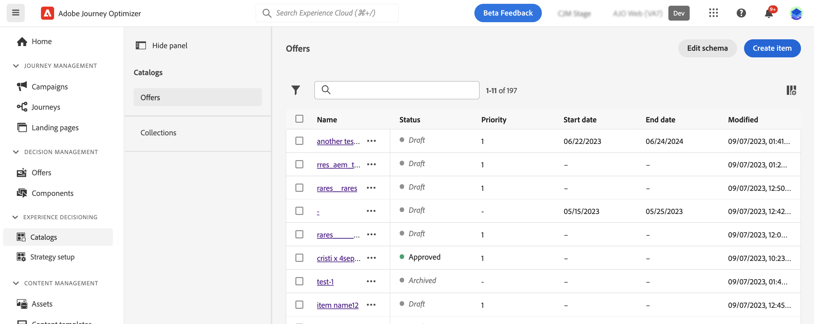
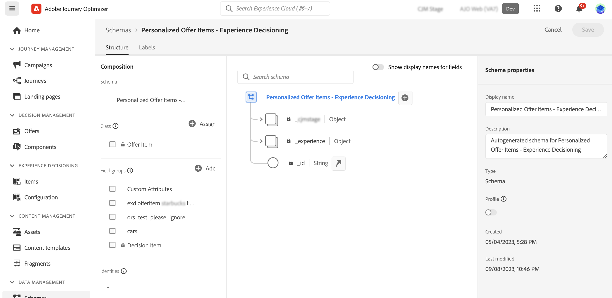

# Item catalog {#catalog}

In Decisioning, catalogs serve as central containers for organizing decision items. Each catalog is linked to an Adobe Experience Platform schema, encompassing all the attributes assignable to a decision item. 

For now, all created decision items are consolidated within a single "Offers" catalog, accessible via the **[!UICONTROL Catalogs]** menu.

## Guardrails & limitations

To ensure optimal performance and consistency, Decisioning enforces the following guardrails and limitations:

* **Supported data types**

    For now, Decisioning exclusively supports the following data types: String, Integer, Boolean, Date, DateTime, Decisioning Asset, and Object. Any field falling outside these data types will not be available for use when authoring a decision item or a catalog.

* **Custom attribute limit**
    
    Each decision item can include up to 100 custom attributes.

* **Nesting restrictions**

    A maximum of four levels of nesting is supported. Images are not supported at the last level.

## Access and edit the catalog's schema

To access the catalog's schema where decision items' attributes are stored, follow these steps:

1. From the items list, click the **[!UICONTROL Edit schema]** button located next to the **[!UICONTROL Create item]** button.

1. The catalog's schema opens in a new tab, following the structure below:

    * The **`_experience`** node includes standard decision items attributes such as name, start and end date, and description.    
    * The **`_<imsOrg>`** node houses custom decision items attributes. By default, no custom attributes are configured, but you can add as many as needed to suit your requirements. Once done, custom attributes appear in the decision item creation screen alongside the standard attributes.

    

1. To add a custom attribute to the schema, expand the **`_<imsOrg>`** node and click the "+" button at the desired location in the structure.

    

1. Fill in the necessary fields for the added attribute and click **[!UICONTROL Apply]**.

    The value that is input on an attribute with decisioning asset attribute is a public url. Most of the time this would point to an image.

    Detailed information on how to work with Adobe Experience Platform schemas is available in the [XDM System documentation](https://experienceleague.adobe.com/docs/experience-platform/xdm/ui/overview.html).

1. Once your desired custom attributes are added, save the schema. The new field is now available in the decision item creation screen, within the **[!UICONTROL Custom attributes]** section.

    The example below shows an item creation screen with custom attributes such as objects defined in the schema.

    

