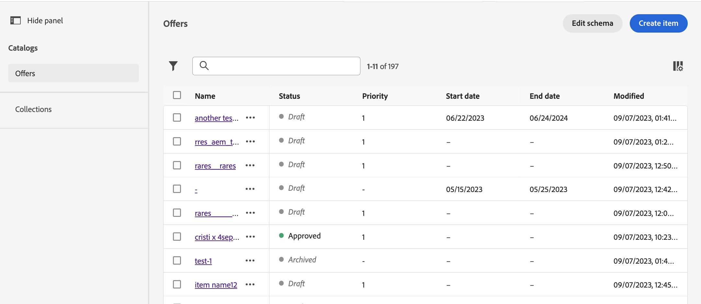
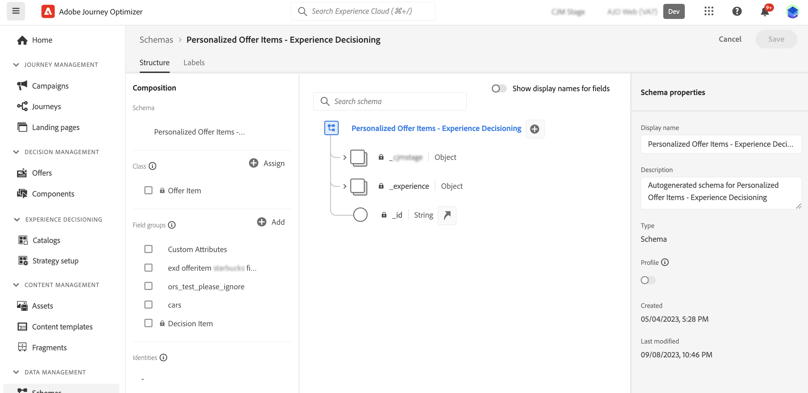
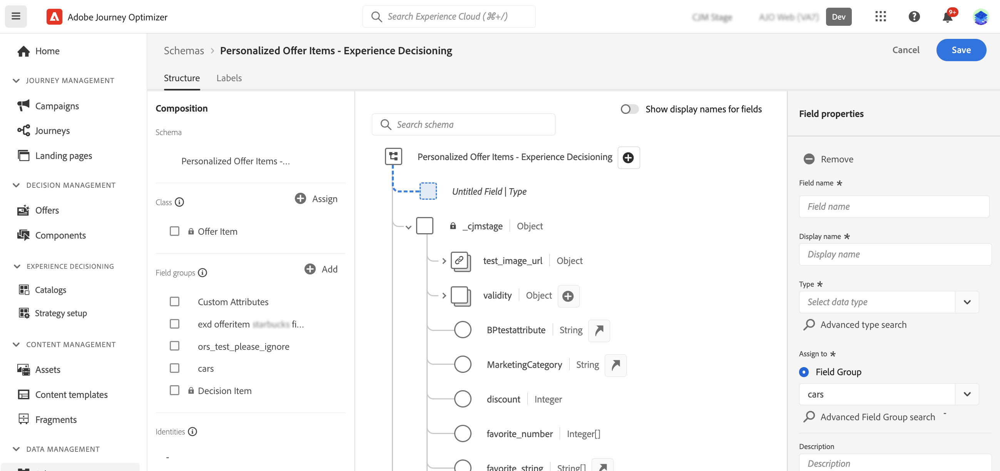
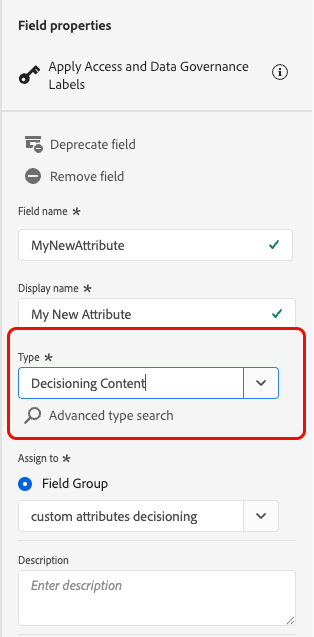
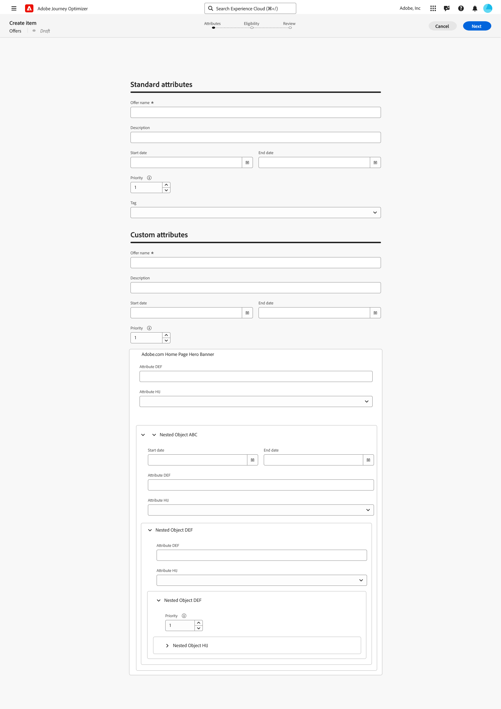

# Configure the item catalog {#catalog}

>[!BEGINSHADEBOX]

**On this page:** Configure the item catalog and edit its schema so you can organize your decision items and define the standard and custom attributes available when authoring them.

>[!ENDSHADEBOX]

>[!CONTEXTUALHELP]
>id="ajo_exd_item_custom_attributes"
>title="Access and edit the catalog's schema"
>abstract="Custom attributes are specific attributes tailored to your needs that you can assign to a decision item. They are created in the decision items' catalog schema."

In Decisioning, catalogs serve as central containers for organizing decision items. Each catalog is linked to an [!DNL Adobe Experience Platform] schema, encompassing all the attributes assignable to a decision item.

For now, all created decision items are consolidated within a single "Offers" catalog, accessible via the **[!UICONTROL Catalogs]** menu.

## Guardrails & limitations

To ensure optimal performance and consistency, Decisioning enforces the following guardrails and limitations:

* **Supported data types**

    For now, Decisioning exclusively supports the following data types: String, Integer, Boolean, Date, DateTime, Decisioning Asset, Decisioning Content, and Object. Any field falling outside these data types will not be available for use when authoring a decision item or a catalog.

    >[!NOTE]
    >
    >To make a field available for personalization, select the **[!UICONTROL Decisioning Content]** type. [Learn more](#access-catalog-schema)

* **Custom attribute limit**

    Each decision item can include up to 100 custom attributes.

* **Nesting restrictions**

    A maximum of four levels of nesting is supported. Images are not supported at the last level.

## Access and edit the catalog's schema {#access-catalog-schema}

To access the catalog's schema where decision items' attributes are stored, follow these steps:

1. From the items list, click the **[!UICONTROL Edit schema]** button located next to the **[!UICONTROL Create item]** button.

1. The catalog's schema opens in a new tab, following the structure below:

    * The **`_experience`** node includes standard decision items attributes such as name, start and end date, and description.
    * The **`_<imsOrg>`** node houses custom decision items attributes, where `<imsOrg>` is replaced by your organization's name (for example, `_luma` for the Luma company). By default, no custom attributes are configured, but you can add as many as needed to suit your requirements. Once done, custom attributes appear in the decision item creation screen alongside the standard attributes.

    

1. To add a custom attribute to the schema, expand your organization's node (for example, **`_luma`**) and click the "+" button at the desired location in the structure.

    

1. Fill in the necessary fields for the added attribute.

1. To make a custom attribute available for personalization, select the **[!UICONTROL Decisioning Content]** type. This will allow you to define the attribute value at delivery time using profile, context, journey, and audience data. [Learn more](items.md#personalization-attributes)

    {width=35%}

1. Click **[!UICONTROL Apply]**.

    The value that is input on an attribute with a decisioning asset attribute is a public URL. Most of the time, this would point to an image. Detailed information on how to work with [!DNL Adobe Experience Platform] schemas is available in the [XDM System documentation](https://experienceleague.adobe.com/docs/experience-platform/xdm/ui/overview.html).

1. Once your desired custom attributes are added, save the schema. The new field is now available in the [decision item creation](items.md#attributes) screen, within the **[!UICONTROL Custom attributes]** section.

    The example below shows an item creation screen with custom attributes such as objects defined in the schema.

    
