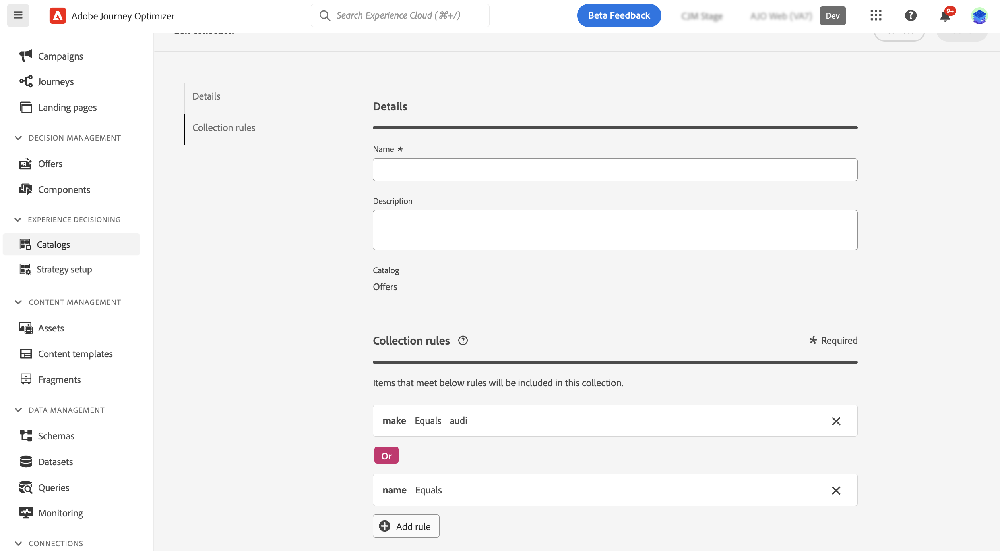

# Collections {#collections}

>[!CONTEXTUALHELP]
>id="ajo_exd_item_collections"
>title="Create collections"
>abstract="Collections allow you to categorize and group your decision items according to your preferences. These categories are created by crafting rules that leverage the attributes of decision items."

>[!CONTEXTUALHELP]
>id="ajo_exd_item_collection_rules"
>title="Define rules for your collection"
>abstract="Add one or multiple rules to determine the items to be included in the collection. Choose an item attribute to use as criterion. Select the desired operator and input the value to filter on. Add as many rules as necessary."

>[!CONTEXTUALHELP]
>id="ajo_exd_strategy_collection"
>title="Choose a collection"
>abstract="Select the collection that contains the offers to consider. This step is mandatory when creating a selection strategy. Collections allow you to categorize and group your decision items according to your preferences. For instance, you can create a collection that includes all decision items with the "Yoga" value in the "Category" custom attribute."

Collections allow you to categorize and group your decision items according to your preferences. These categories are created by crafting rules that leverage the attributes of decision items.

For instance, let's say you have added a "Category" custom attribute to your decision items' catalog schema. This allows you to create a collection that includes all decision items with the "Yoga" value in the "Category" attribute.

The list of collections is accessible from the **[!UICONTROL Catalogs]** menu.   

To create a collection, follow these steps:

1. Navigate to **[!UICONTROL Catalogs]** > **[!UICONTROL Collections]** and click **[!UICONTROL Create collection]**.
1. Provide a name and a description for the collection.
1. Add one or multiple rules to determine the items to be included in the collection. To do this:

    1. Choose an item attribute to use as criterion. The attributes list includes all standard and custom attributes defined in the catalog schema. [Learn more on the items' catalog](catalogs.md)
    1. Select the desired operator and input the value to filter on.
    1. Repeat these steps to add as many rules as necessary. When multiple rules are added, you can choose between the **And** and **Or** operators to combine them. To do this, click the operator badge to switch between the two choices.
    1. Click the **[!UICONTROL Preview collection]** button to display the items that meet the rules that you have defined.

    

1. Once the collection rules have been defined, click **[!UICONTROL Create]**. The collection now displays in the list.

>[!NOTE]
>
>Each item collection can contain up to 500 offer items. [Learn more on Decisioning guardrails & limitations](gs-experience-decisioning.md#guardrails)
