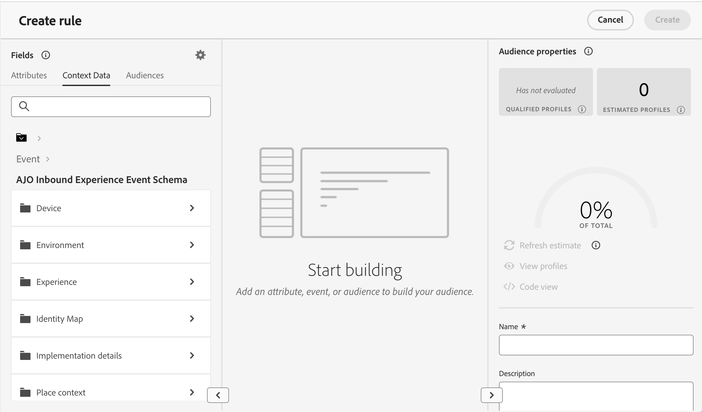
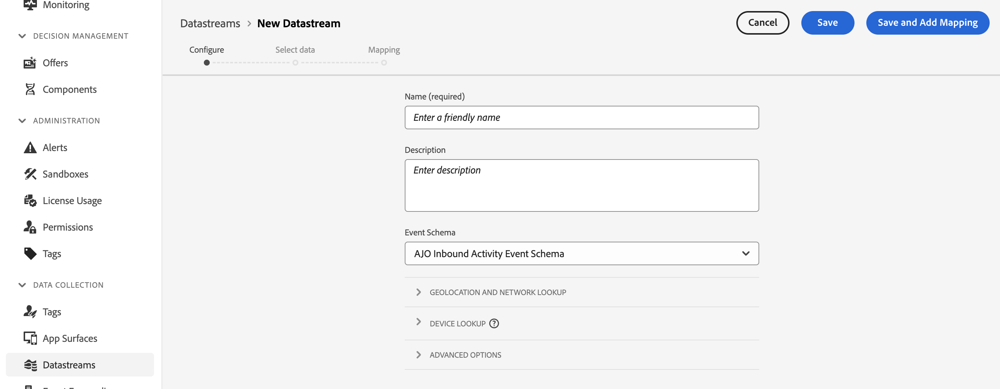

# Leverage context data in Decisioning {#context}

With Decisioning, you can leverage any information available in Adobe Experience Platform to perform various actions such as creating [decision rules](rules.md) or [ranking formulas](ranking.md). For example, you can design a decision rule that requires the current weather to be ≥80 degrees at the time the decision request is made.

>[!NOTE]
>
>Context data is defined in Adobe Experience Platform and is sent in at the time of a decision request. It does not include historical data.

To use context data, you first need to define the data you want to make available in Decisioning. Once done, this data seamlessly integrates into Decisioning in the **[!UICONTROL Context Data]** tab available when creating a decision rule. You can also leverage the data when editing a ranking formula.

The steps to feed Decisioning with Adobe Experience Platform data are as follows: 

1. Create an **Experience Event schema**  in Adobe Experience Platform and its associated **dataset**. [Learn how to create schemas](https://experienceleague.adobe.com/en/docs/experience-platform/xdm/ui/resources/schemas){target="_blank"}

1. Create a new Adobe Experience Platform datastream:

    1. Navigate to the **[!UICONTROL Datastreams]** menu and select **[!UICONTROL New Datastream]**.

    1. In the **[!UICONTROL Event Schema]** drop-down list, select the Experience Event schema created earlier then click **[!UICONTROL Save]**.

        

    1. Click **[!UICONTROL Add service]** and select "Adobe Experience Platform" as the service. In the **[!UICONTROL Event Dataset]** drop-down list, select the event dataset created earlier and enable the **[!UICONTROL Adobe Journey Optimizer]** option.

        

Once the datastream is saved, the selected dataset's information is automatically fetched and integrated into Decisioning, typically becoming available within approximately 24 hours.

For further guidance on how to work with Adobe Experience Platform, explore the following resources:

* [Experience Data Model (XDM) schemas](https://experienceleague.adobe.com/en/docs/experience-platform/xdm/schema/composition){target="_blank"}
* [Datasets](https://experienceleague.adobe.com/en/docs/experience-platform/catalog/datasets/overview){target="_blank"}
* [Datastreams](https://experienceleague.adobe.com/en/docs/experience-platform/datastreams/overview){target="_blank"}
