# Create decision policies {#create-decision}

>[!CONTEXTUALHELP]
>id="ajo_code_based_decision"
>title="What is a decision?"
>abstract="Decision policies contain all of the selection logic for the decisioning engine to pick the best content. Decision policies are campaign specific. Their goal is to select the best offers for each profile while the campaign authoring allows you to indicate how the selected decision items should be presented, including which item attributes to be included in the message."
>additional-url="https://experienceleague.adobe.com/en/docs/journey-optimizer/using/decisioning/offer-decisioning/get-started-decision/starting-offer-decisioning" text="About Decisioning"

>[!CONTEXTUALHELP]
>id="ajo_journey_decision_policy"
>title="Define a decision policy"
>abstract="A decision policy allows you to pick the best items from the Decisioning engine and deliver them to the right audience."
>additional-url="https://experienceleague.adobe.com/en/docs/journey-optimizer/using/decisioning/offer-decisioning/get-started-decision/starting-offer-decisioning" text="About Decisioning"

>[!CONTEXTUALHELP]
>id="ajo_exd_decision_policy"
>title="Decision policy"
>abstract="A decision policy allows you to pick the best items from decision engine and deliver to each audience."

>[!CONTEXTUALHELP]
>id="ajo_exd_placements"
>title="Placement"
>abstract="A placement determines where returned items from the decision engine appear in a message. You can track their performance across different placements in reporting."

>[!CONTEXTUALHELP]
>id="ajo_exd_decision_attribute"
>title="Select decision attributes from catalog"
>abstract="Decision attributes are stored in catalog's schema. Select an attribute you want to use here from the selected catalog."

Decision policies are containers for your offers that leverage the Decisioning engine to dynamically return the best content to deliver for each audience member. Their goal is to select the best offers for each profile, while the campaign/journey authoring allows you to indicate how the selected decision items should be presented, including which item attributes to be included in the message.

## Key steps {#key}

The main steps to leverage decision policies into your messages are as follows:

1. [Create a decision policy in an email or code-based experience](#add-decision)

    Set up a decision policy in your email or code-based experience by choosing the number of items to return, configuring selection strategies, fallback options, and evaluation order.

1. [Use the decision policy in your content](#use-decision-policy)
    
    Personalize your content with the decision policy output and attributes from the decision items you want to display in the message.

1. [Create reporting dashboards](cja-reporting.md)
    
    Build custom Customer Journey Analytics dashboards to measure performance and gain insights into how your decision policies and offers are being delivered and engaged with.

## Guardrails & limitations

* **Limited availability - Decision policy in emails** - For now, decision policy creation in emails is available in Limited Availability. Contact your Adobe representative to gain access.
* **Mirror pages** - For now, decision items do not render in email mirror pages.
* **Tracking & links type** -  To track links generated by decisioning, define them in the schema as "Decisioning Assets". Attribute-based links are not trackable.
* **Decision policy nesting in emails** - You cannot nest multiple decision policies within a parent email component that already has an associated decision policy.
* **Duplicated journeys/campaigns with decisioning** – If you duplicate a journey or campaign that includes a decision policy, the duplicated version references the original email or code-based experience, causing errors. Always reconfigure the decision policy after duplication.
* **Consent policies** – Updates to consent policies take up to 48 hours to take effect. If a decision policy references an attribute tied to a recently updated consent policy, the changes will not be applied immediately.

    Similarly, if new profile attributes that are subject to a consent policy are added to a decision policy, they will be usable, but the consent policy associated with them will not be enforced until the delay has passed.

    Consent policies are only available to organizations with the Adobe Healthcare Shield or Privacy and Security Shield add-on.

* **AI Ranking** - For now, AI ranking is not supported for the Email channel in journeys with decisioning.

## Create a decision policy in an email or code-based experience {#add-decision}

>[!CONTEXTUALHELP]
>id="ajo_code_based_item_number"
>title="Define the number of items to be returned"
>abstract="Select the number of decision items you want to be returned back. For example, if you select 2, the best 2 eligible offers will be presented for the current configuration."

>[!CONTEXTUALHELP]
>id="ajo_code_based_fallback"
>title="Select a fallback"
>abstract="A fallback item displays to the user when none of the selection strategies defined for that decision policy are qualified."

>[!CONTEXTUALHELP]
>id="ajo_code_based_strategy"
>title="What is a strategy?"
>abstract="The sequence of selection strategy determines which strategy would be evaluated first. At least one strategy is required. Decision items in combined strategies will be evaluated together."
>additional-url="https://experienceleague.adobe.com/en/docs/journey-optimizer/using/decisioning/offer-decisioning/get-started-decision/starting-offer-decisioning" text="Create strategies"

To present the best dynamic offer and experience to your emails' recipients and visitors on your website or mobile app, add a decision policy to an email or a code-based campaign or journey. To do so, follow the steps below.

### Create a decision policy {#add}

1. In a journey or campaign, add an **[!UICONTROL Email]** or **[!UICONTROL Code-base experience]** action.

1. For emails, toggle **[!UICONTROL Enable decisioning]** in the configuration screen. 

    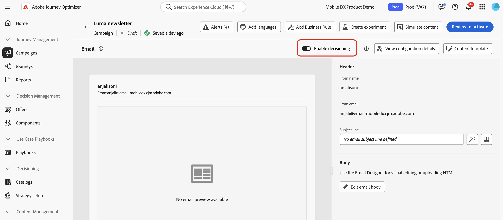

    >[!IMPORTANT]
    >
    >Enabling decisioning clears existing email content. If you have already designed your email, be sure to save your content as a template beforehand.
    >
    >Note that any decision policy configured within the email will not be saved in the template. If you apply the template to another email, you need to re-configure the policy.

1. Policies can be created in email and code-based experiences using the personalization editor. They can also be created in emails from a dedicated menu in the Email Designer. Expand the sections below for more details.

    +++Personalization editor

    1. Open the personalization editor and select **[!UICONTROL Decision policy]**.
    1. Click the **[!UICONTROL Add decision policy]** button to create a new policy.

        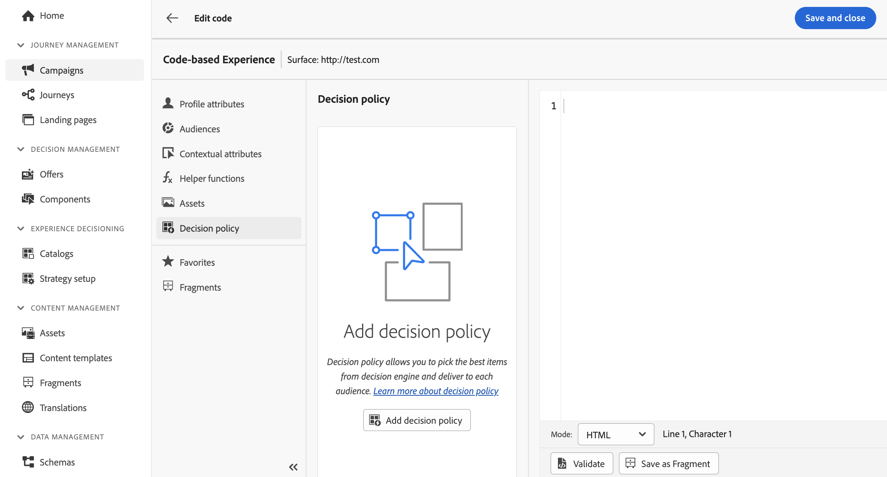

    +++
    
    +++Email Designer **[!UICONTROL Decisioning]** menu

    1. Select a component, click the **[!UICONTROL Decisioning]** icon in the toolbar or the properties pane then select **[!UICONTROL Add new policy]**.
    
    1. Select **[!UICONTROL Reuse decision output]** to reuse a decision policy that has already been created within this email.

        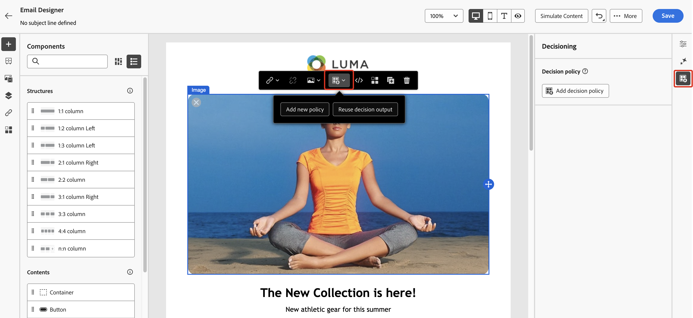

    +++

1. Provide a name and select a catalog (currently limited to the default **[!UICONTROL Offers]** catalog).

1. Select the number of items to return. For example, if you select 2, the best 2 eligible offers will be presented for the current configuration.

    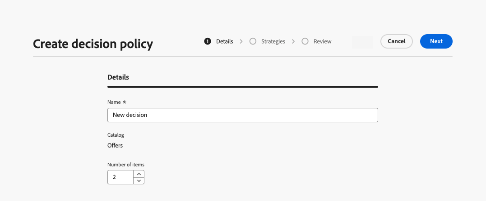

    For emails, multiple items can only be returned in a **[!UICONTROL Repeat grid]** content component. Expand the section below for more details:

    +++ Return multiple decision items in emails

    1. Drag a **[!UICONTROL Repeat Grid]** component to the canvas and configure it as desired using the **[!UICONTROL Settings]** pane. 

        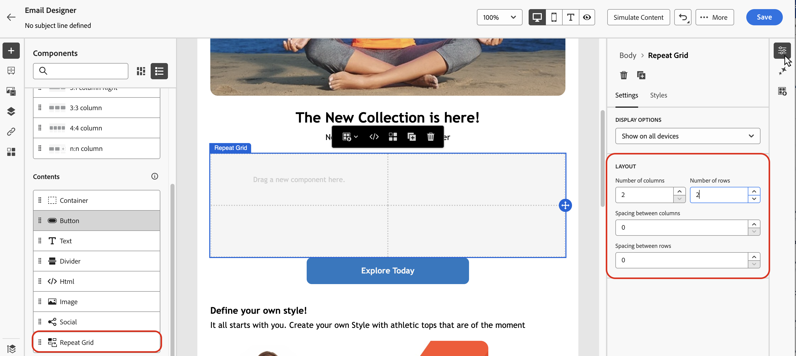

    1. Click the **[!UICONTROL Decisioning]** icon in the canvas toolbar or open the **[!UICONTROL Decisioning]** pane and select **[!UICONTROL Add decision policy]**.

    1. Specify the number of items to return in the **[!UICONTROL Number of items]** field then configure the decision policy as documented below. The maximum number of items you can select is limited by the number of tiles defined in the **[!UICONTROL Repeat grid]** component.

    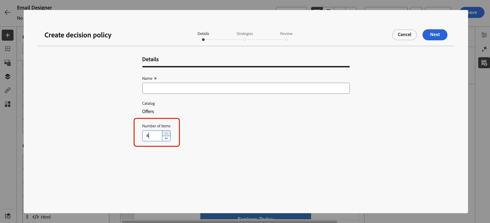

    +++

1. Click **[!UICONTROL Next]**.

### Select items and selection strategies {#select}

The **[!UICONTROL Strategy sequence]** section allows you to select the decision items and selection strategies to present with the decision policy.

1. Click **[!UICONTROL Add]** and choose the type of object to include in the policy:

    * **[!UICONTROL Selection strategy]**: Add one or multiple selection strategies. Decision strategies leverage collections associated with eligibility constraints and ranking methods to determine the items to be shown. You can select an existing selection strategy, or create a new one using the **[!UICONTROL Create selection strategy]** button. [Learn how to create selection strategies](selection-strategies.md)

    * **[!UICONTROL Decision item]**: Add single decision items to present without having to run through a selection strategy. You can only select one decision item at a time. Any eligibility constraints set for the item will apply.

    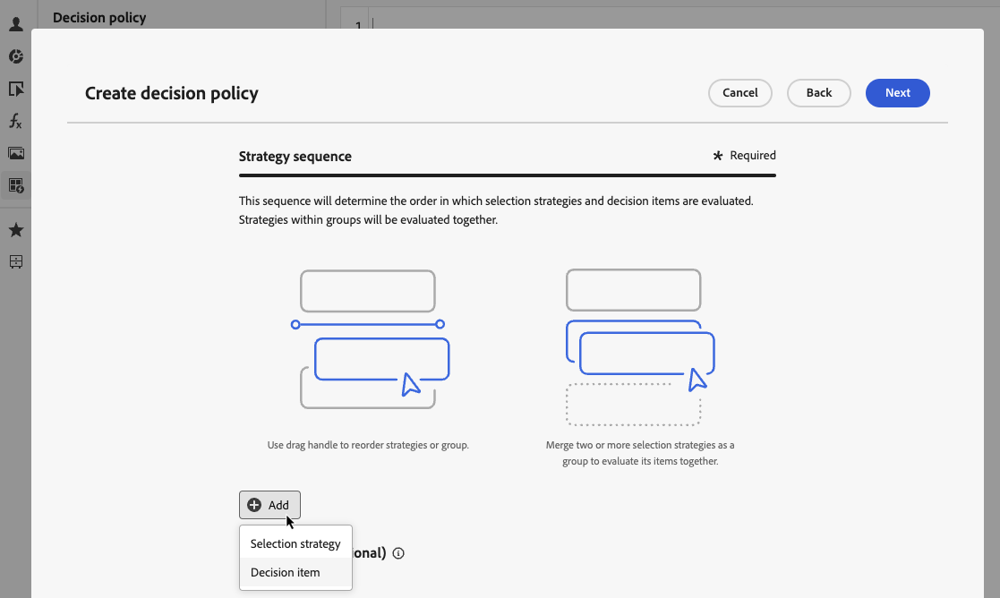

    >[!NOTE]
    >
    >A decision policy supports up to 10 selection strategies and decision items combined. [Learn more about Decisioning guardrails & limitations](gs-experience-decisioning.md#guardrails)

1. When adding several decision items and/or strategies, they will be evaluated in a specific order. The first object that was added to the sequence will be evaluated first, and so on. To change the default sequence, drag and drop the objects and/or the groups to reorder them as wanted. Expand the section below for more information.

    +++Manage evaluation order in a decision policy

    Once you have added decision items and selection strategies to your policy, you can arrange their order to determine their evaluation order and combine together selection strategies to evaluate them together.

    The **sequential order** in which items and strategies will be evaluated is indicated with numbers at the left of each object or group of objects. To move the position of a selection strategy (or a group of strategies) within the sequence, drag and drop it to another position.

    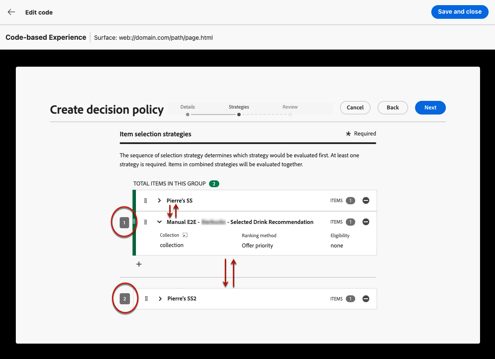

    >[!NOTE]
    >
    >Only selection strategies can be dragged and drop within a sequence. To change the position of a decision item, you need to remove it and add it back using the **[!UICONTROL Add]** button after adding the other items you want to evaluate before.

    You can also **combine** multiple selection strategies into groups so they are evaluated together and not separately. To do this, click the **`+`** button under a selection strategy to combine it with another one. You can also drag and drop a selection strategy on another one to group the two strategies into a group.

    >[!NOTE]
    >
    >Decision items cannot be grouped together with other items or selection strategies.

    Multiple strategies and their grouping determine the priority of the strategies and ranking of eligible offers. The first strategy has the highest priority and the strategies combined within the same group have the same priority.

    For example, you have two collections, one in strategy A and one in strategy B. The request is for two decision items to be sent back. Let's say there are two eligible offers from strategy A and three eligible offers from strategy B.

    * If the two strategy are **not combined** or in sequential order (1 and 2), the top two eligible offers from the first strategy will be returned in the first row. If there are not two eligible offers for the first strategy, the decision engine will move on to the next strategy in sequence to find as many offers are still needed, and ultimately will return a fallback if needed.

        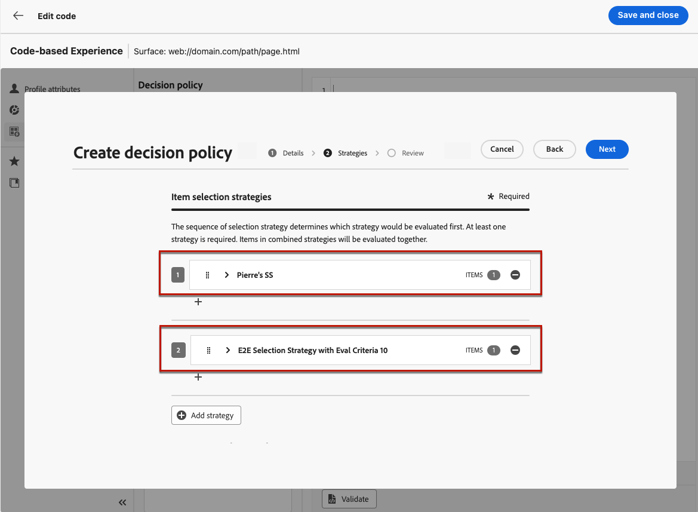

    * If the two collections are **evaluated at the same time**, as there are two eligible offers from strategy A and three eligible offers from strategy B, the five offers will all be stack ranged together based on the value determined by the respective ranking methods. Two offers are requested, therefore the top two eligible offers from these five offers will be returned.

        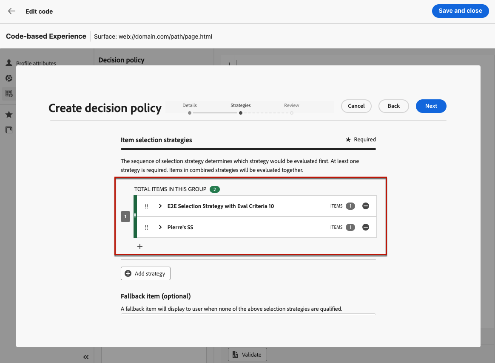

    **Example with multiple strategies**

    Now let's consider an example where you have multiple strategies divided into different groups. You defined three strategies. Strategy 1 and Strategy 2 are combined together in Group 1 and Strategy 3 is independent (Group 2). The eligible offers for each strategy and their priority (used in the ranking function evaluation) are as follows:

    * Group 1:
        * Strategy 1 - (Offer 1, Offer 2, Offer 3) - Priority 1
        * Strategy 2 - (Offer 3, Offer 4, Offer 5) - Priority 1

    * Group 2:
        * Strategy 3 - (Offer 5, Offer 6) - Priority 0

    The highest priority strategy offers is evaluated first and added to the ranked offers list.

    * **Iteration 1:**

        Strategy 1 and Strategy 2 offers are evaluated together (Offer 1, Offer 2, Offer 3, Offer 4, Offer 5). Let's say the result is:

        Offer 1 - 10
        Offer 2 - 20
        Offer 3 - 30 from Strategy 1, 45 from Strategy 2. The highest of both will be considered, so 45 is taken into account.
        Offer 4 - 40
        Offer 5 - 50

        The ranked offers are now as follows: Offer 5, Offer 3, Offer 4, Offer 2, Offer 1.

    * **Iteration 2:**

        Strategy 3 offers are evaluated (Offer 5, Offer 6). Let's say the result is:

        * Offer 5 - Will not be evaluated since it already exists in the result above.
        * Offer 6 - 60

        The ranked offers are now as follows: Offer 5 , Offer 3, Offer 4, Offer 2, Offer 1, Offer 6.

    +++

1. Click **[!UICONTROL Next]**

### Add fallback offers {#fallback}

Once you have selected decision items and/or selection strategies, you can add fallback offers to display if none of the above items or selection strategies are qualified.

You can select any item from the list, which displays all the decision items created on the current sandbox. If no selection strategy is qualified, the fallback is displayed to the user no matter the dates and eligibility constraint applied to the selected item<!--nor frequency capping when available - TO CLARIFY-->.

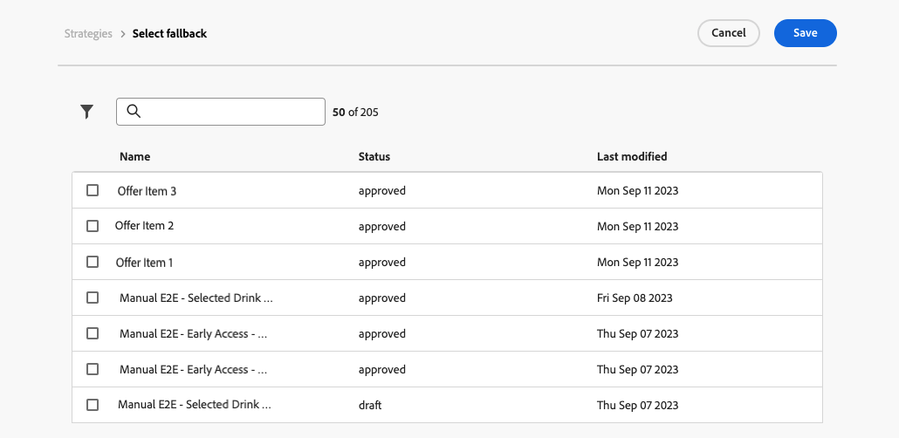

>[!NOTE]
> Fallbacks are optional. Up to the number of requested items can be selected. If none are eligible and no fallback is set, nothing will be displayed.

### Save and manage decision policies {#save}

When your decision policy is ready, save it and click **[!UICONTROL Create]**.

For emails, you need to define a placement for the component associated to the decision policy. To do so, click the **[!UICONTROL Decisioning]** buton in the component properties pane and select **[!UICONTROL Assign placement]**. [Learn how to work with placements](../experience-decisioning/placements.md)

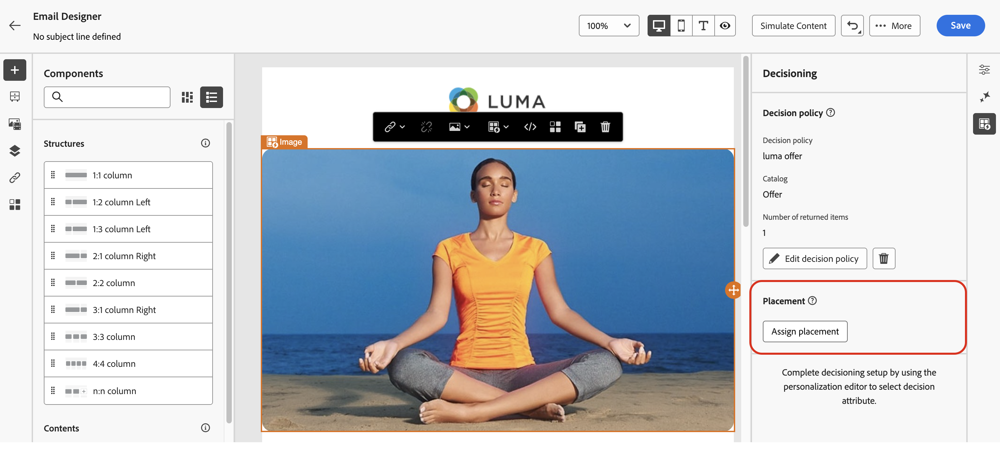

You can edit or delete a decision policy at any time using the ellipsis button in the personalization editor, or in the **[!UICONTROL Decisioning]** menu within the component properties pane.

>[!BEGINTABS]

>[!TAB Edit or delete a policy from the personalization editor]

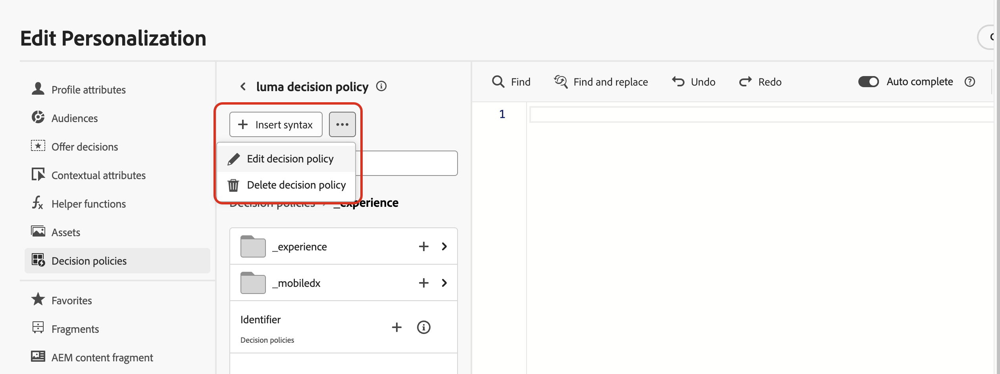

>[!TAB Edit or delete a policy from the component's properties]

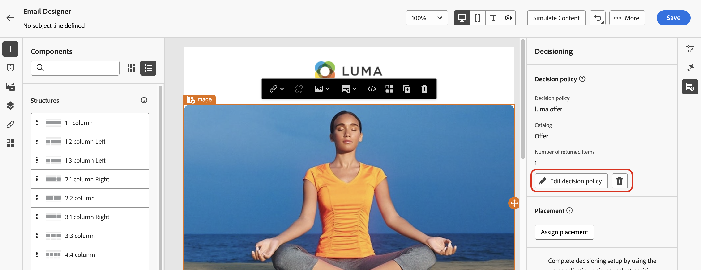

>[!ENDTABS]

## Use a decision policy in your content {#use-decision-policy}

Once created, the decision policy and the attributes linked to the returned decision items can be used in your content to personalize your content. To do so, follow these steps.

### Insert the decision policy code {#insert-code}

1. Open the personalization editor and access the **[!UICONTROL Decision policy]** menu.

1. For emails, click **[!UICONTROL Insert syntax]** to add the code corresponding to the decision policy. For code-based experiences, click **[!UICONTROL Insert policy]**.

    +++Insert decision policy code in emails

    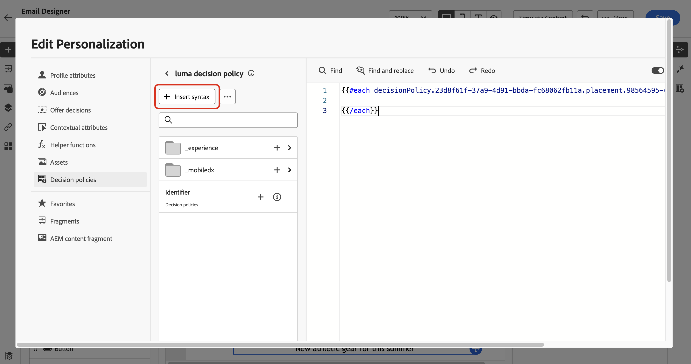

    For emails, if no placement has been associated to the component beforehand, select one from the list and click **[!UICONTROL Assign]**.

    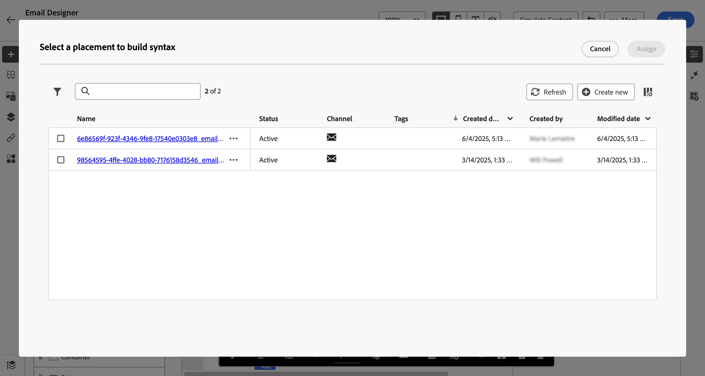

    +++

    +++Insert decision policy code in code-based experience

    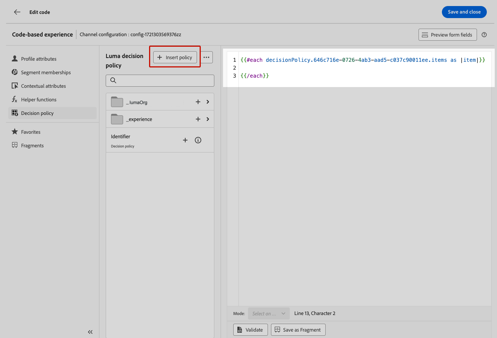

    +++

    >[!NOTE]
    >
    >If the code insertion button does not display, a decision policy may already have been configured for the parent component.

1. The code for the decision policy is added. This sequence will be repeated the number of times you want the decision policy to be returned. For example, if you chose to return back 2 items when [creating the decision](#add-decision), the same sequence will be repeated twice.

### Leverage decision items attributes {#attributes}

Now you can add all the decision attributes you want inside that code. The available attributes are stored in the **[!UICONTROL Offers]** catalog's schema. Custom attributes are stored in the **`_<imsOrg`>** folder and standard attributes in the **`_experience`** folder. [Learn more about the Offers catalog's schema](catalogs.md)

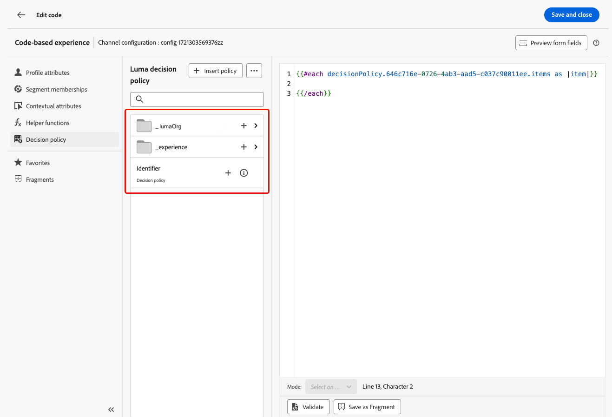

>[!NOTE]
>
>For decision policy Item tracking, the `trackingToken`attribute needs to be added as following for decision policy content:
>`trackingToken: {{item._experience.decisioning.decisionitem.trackingToken}}`

1. Click each folder to expand it. Place the cursor of your mouse at the desired location and click the + icon next to the attribute you want to add. You can add as many attributes as you want to the code.

    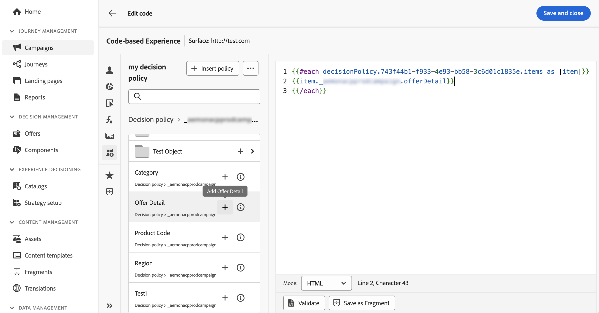

1. Make sure you wrap the `#each` loop inside a pair of square brackets `[ ]`, and add a comma right before the closing `/each`.

    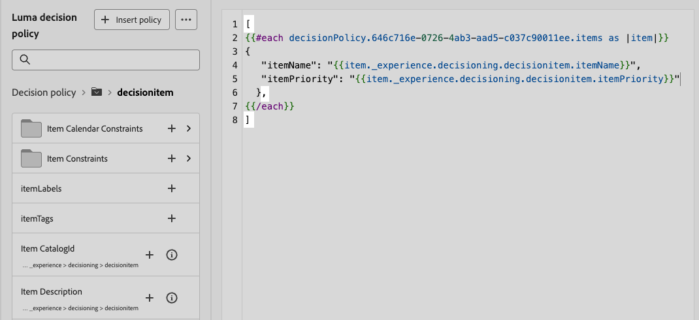

1. You can also add any other attribute available in the personalization editor, such as profile attributes.

    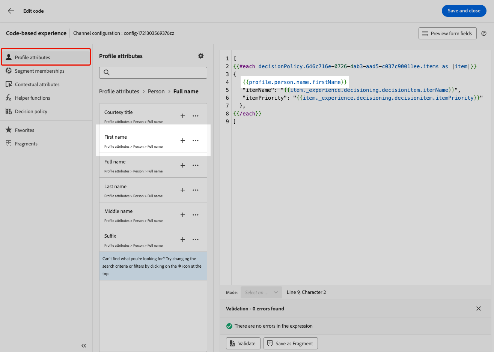

### Leverage fragments {#fragments}

If your decision policy contains decision items including fragments, you can leverage these fragments in the decision policy code. [Learn more on fragments](../content-management/fragments.md)

>[!AVAILABILITY]
>
>This capability is currently only available for a set of organizations (Limited Availability). For more information, contact your Adobe representative.

For example, let's say you want to display different contents for several mobile device models. Make sure you added fragments corresponding to those devices to the decision item that you are using in the decision policy. [Learn how](items.md#attributes).

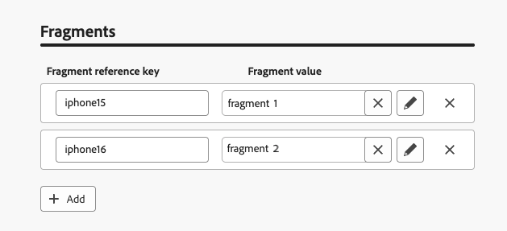{width=70%}

Once done, you can use either one of the following methods:

>[!BEGINTABS]

>[!TAB Directly insert the code]

Simply copy-paste the code block below into the decision policy code. Replace `variable`with the fragment ID and `placement` with the fragment reference key:

```

{{fragment id = variable}}
```

>[!TAB Follow the detailed steps]

1. Navigate to the **[!UICONTROL Helper functions]** and add the **Let** function ` {{variable}}` to the code pane, where you can declare the variable for your fragment.

    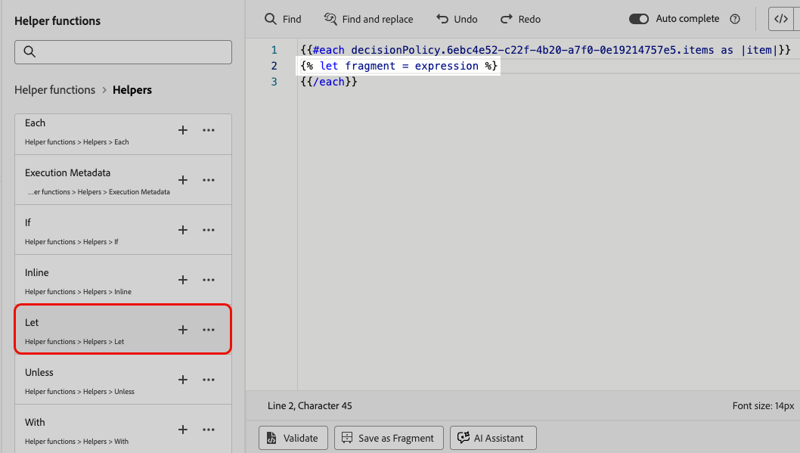

1. Use the **Map** > **Get** function `` to build your expression. The map is the fragment referenced in the decision item and the string can be the device model you entered in the decision item as the **[!UICONTROL Fragment reference key]**.

    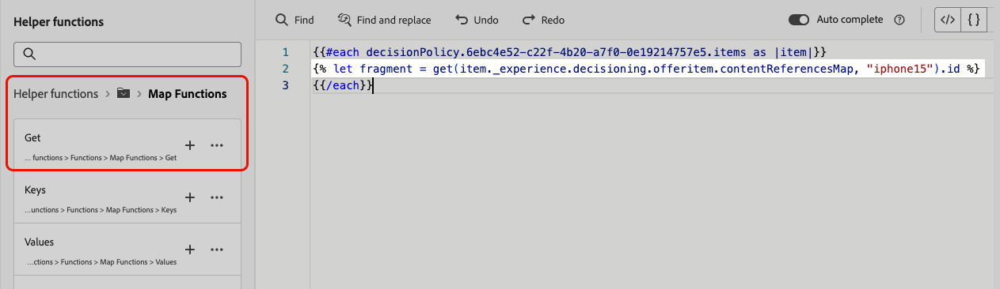

1. You can also use a contextual attribute which would contain this device model ID.

    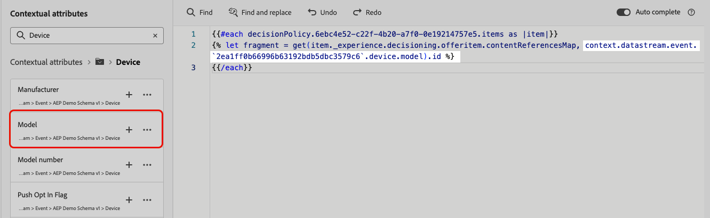

1. Add the variable that you chose for your fragment as the fragment ID.

    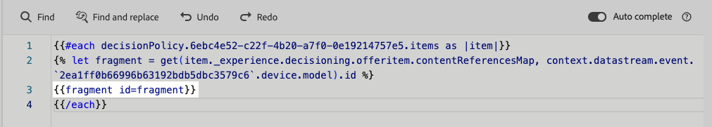

>[!ENDTABS]

The fragment ID and reference key will be selected from the decision item's **[!UICONTROL Fragments]** section.

>[!WARNING]
>
>If the fragment key is incorrect or if the fragment content is not valid, rendering will fail causing error in the Edge call.

## Final steps {#final-steps}

Once that your content is ready, review and publish your campaign or journey:

* [Publish a journey](../building-journeys/publishing-the-journey.md)
* [Review activate a campaign](../campaigns/review-activate-campaign.md)
* [Publish and activate a code-based experience](../code-based/publish-code-based.md)

For code-based experiences, as soon as your developer makes an API or SDK call to fetch content for the surface defined in your channel configuration, the changes will be applied to your web page or app.

>[!NOTE]
>
>Currently you cannot simulate content from the user interface in a [code-based experience](../code-based/create-code-based.md) campaign or journey using decisions. A workaround is available in [this section](../code-based/code-based-decisioning-implementations.md).

To see how your decisions are performing, you can create custom [Customer Journey Analytics reporting dashboards](cja-reporting.md).
