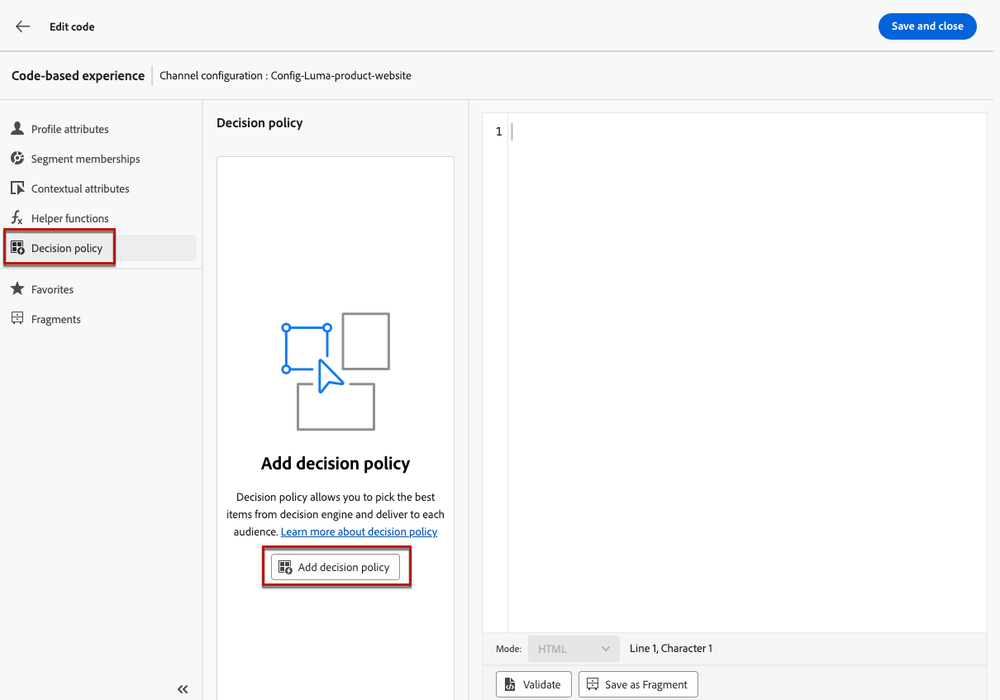
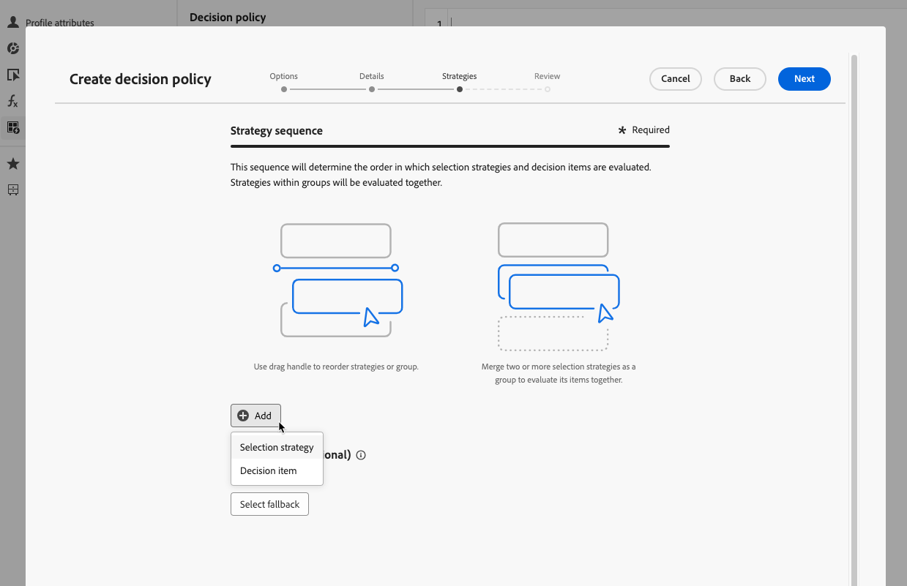
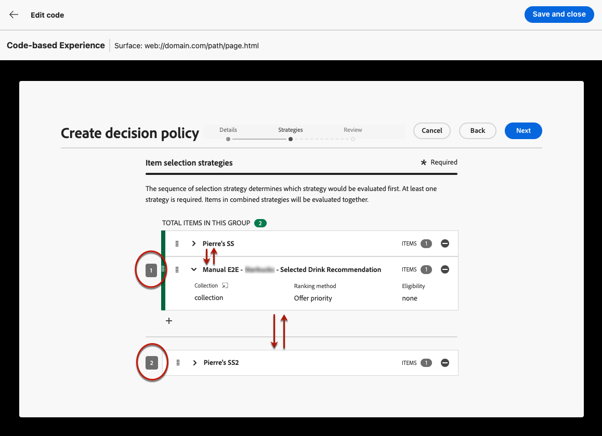
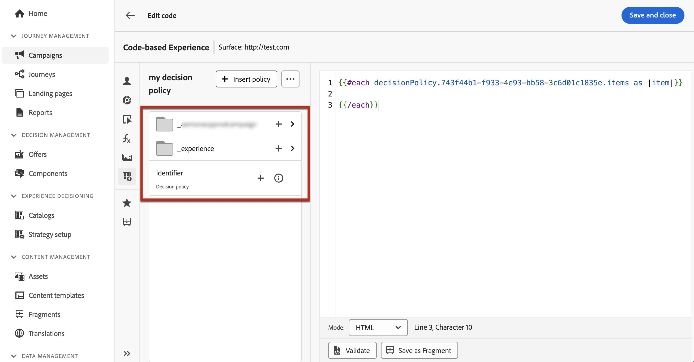

# Create decision policies {#create-decision}

>[!CONTEXTUALHELP]
>id="ajo_code_based_decision"
>title="What is a decision?"
>abstract="Decision policies contain all of the selection logic for the decisioning engine to pick the best content. Decision policies are campaign specific. Their goal is to select the best offers for each profile while the campaign authoring allows you to indicate how the selected decision items should be presented, including which item attributes to be included in the message."
>additional-url="https://experienceleague.adobe.com/en/docs/journey-optimizer/using/decisioning/offer-decisioning/get-started-decision/starting-offer-decisioning" text="About Decisioning"

Decision policies are containers for your offers that leverage the Decisioning engine in order to pick the best content to deliver, depending on the audience.

Decision policies contain all of the selection logic for the decisioning engine to pick the best content. Decision policies are campaign specific. Their goal is to select the best offers for each profile while the campaign authoring allows you to indicate how the selected decision items should be presented, including which item attributes to be included in the message.

>[!NOTE]
>
>In the [!DNL Journey Optimizer] user interface, decision policies are labelled as decisions<!--but they are decision policies. TBC if this note is needed-->.

The main steps to leverage decision policies into your code-based campaigns are as follows:

1. [Create a decision policy into a code-based campaign](#add-decision)
1. [Use the decision policy into the code-based campaign](#use-decision-policy)
1. [Create custom Customer Journey Analytics reporting dashboards](#cja)

## Add a decision policy to a code-based campaign {#add-decision}

>[!CONTEXTUALHELP]
>id="ajo_code_based_item_number"
>title="Define the number of items to be returned"
>abstract="Select the number of decision items you want to be returned back. For example, if you select 2, the best 2 eligible offers will be presented for the current configuration."

>[!CONTEXTUALHELP]
>id="ajo_code_based_fallback"
>title="Select a fallback"
>abstract="A fallback item displays to the user when none of the selection strategies defined for that decision policy are qualified."

>[!CONTEXTUALHELP]
>id="ajo_code_based_strategy"
>title="What is a strategy?"
>abstract="The sequence of selection strategy determines which strategy would be evaluated first. At least one strategy is required. Decision items in combined strategies will be evaluated together."
>additional-url="https://experienceleague.adobe.com/en/docs/journey-optimizer/using/decisioning/offer-decisioning/get-started-decision/starting-offer-decisioning" text="Create strategies"
>additional-url="https://experienceleague.adobe.com/en/docs/journey-optimizer/using/decisioning/offer-decisioning/get-started-decision/starting-offer-decisioning" text="Evaluation order"

To present the best dynamic offer and experience to your visitors on your website or mobile app, add a decision policy to a code-based campaign. To do so, follow the steps below.

### Create the decision policy {#add}

1. Create a campaign and select the **[!UICONTROL Code-base experience]** action. [Learn more](../code-based/create-code-based.md)

1. From the [code editor](../code-based/create-code-based.md#edit-code), select the **[!UICONTROL Decision policy]** icon and click **[!UICONTROL Add decision policy]**.

    

1. Fill in the details for your decision policy: add a name and select a catalog.

    >[!NOTE]
    >
    >Currently only the default **[!UICONTROL Offers]** catalog is available.

1. Select the number of items you want to be returned back. For example, if you select 2, the best 2 eligible offers will be presented for the current configuration. Click **[!UICONTROL Next]**.

    

### Select items and selection strategies {#select}

The **[!UICONTROL Strategy sequence]** section allows you to select the decision items and selection strategies to present with the decision policy.

1. Click the **[!UICONTROL Add]** button then choose the type of object to include in the policy:

    * **[!UICONTROL Selection strategy]**: Add one or multiple selection strategies. Decision strategies leverage collections associated with eligibility constraints and ranking methods to determine the items to be shown. You can select an existing selection strategy, or create a new one using the **[!UICONTROL Create selection strategy]** button.[Learn how to create selection strategies](selection-strategies.md)

    * **[!UICONTROL Decision item]**: Add single decision items to present without having to run through a selection strategy. You can only select one decision item at a time. Any eligibility constraints set for the item will apply.

    

    >[!NOTE]
    >
    >At least one decision item or strategy is required. You cannot add more than 10 strategies.

1. When adding several decision items and/or strategies, they will be evaluated in a specific order. The first object that was added to the sequence will be evaluated first, and so on.     To change the default sequence, you can drag and drop the objetcs and/or the groups to reorder them as wanted. [Learn more on decision policy evaluation order](#evaluation-order)

### Manage evaluation order in a decision policy {#evaluation-order}

Once you have added decision items and selection strategies to your policy, you can arrange their order to determine their evaluation order and combine together selection strategies to evaluate them together.

The **sequential order** in which items and strategies will be evaluated is indicated with numbers at the left of each object or group of objects. To move the position of a selection strategy (or a group of strategies) within the sequence, drag and drop it to another position.

>[!NOTE]
>
>Only selection strategies can be dragged and drop within a sequence. To change the position of a decision item, you need to remove it and add it back using the **[!UICONTROL Add]** button after adding the other items you want to evaluate before.

You can also **combine** multiple selection strategies into groups so they are evaluated together and not separately. To do this, click the **`+`** button under a selection strategy to combine it with another one. You can also drag and drop a selection strategy on another one to group the two strategies into a group.

>[!NOTE]
>
>Decision items cannot be grouped together with other items or selection strategies.

Multiple strategies and their grouping determine the priority of the strategies and ranking of eligible offers. The first strategy has the highest priority and the strategies combined within the same group have the same priority.

For example, you have two collections, one in strategy A and one in strategy B. The request is for two decision items to be sent back. Let's say there are two eligible offers from strategy A and three eligible offers from strategy B.

* If the two strategy are **not combined** or in sequential order (1 and 2), the top two eligible offers from the first strategy will be returned in the first row. If there are not two eligible offers for the first strategy, the decision engine will move on to the next strategy in sequence to find as many offers are still needed, and ultimately will return a fallback if needed.

    

* If the two collections are **evaluated at the same time**, as there are two eligible offers from strategy A and three eligible offers from strategy B, the five offers will all be stack ranged together based on the value determined by the respective ranking methods. Two offers are requested, therefore the top two eligible offers from these five offers will be returned.

    

+++ **Example with multiple strategies**

Now let's consider an example where you have multiple strategies divided into different groups.

You defined three strategies. Strategy 1 and Strategy 2 are combined together in Group 1 and Strategy 3 is independent (Group 2).

The eligible offers for each strategy and their priority (used in the ranking function evaluation) are as follows:

* Group 1:
    * Strategy 1 - (Offer 1, Offer 2, Offer 3) - Priority 1
    * Strategy 2 - (Offer 3, Offer 4, Offer 5) - Priority 1

* Group 2:
    * Strategy 3 - (Offer 5, Offer 6) - Priority 0

The highest priority strategy offers is evaluated first and added to the ranked offers list.

**Iteration 1:**

Strategy 1 and Strategy 2 offers are evaluated together (Offer 1, Offer 2, Offer 3, Offer 4, Offer 5). Let's say the result is:

Offer 1 - 10
Offer 2 - 20
Offer 3 - 30 from Strategy 1, 45 from Strategy 2. The highest of both will be considered, so 45 is taken into account.
Offer 4 - 40
Offer 5 - 50

The ranked offers are now as follows: Offer 5, Offer 3, Offer 4, Offer 2, Offer 1.

**Iteration 2:**

Strategy 3 offers are evaluated (Offer 5, Offer 6). Let's say the result is:

* Offer 5 - Will not be evaluated since it already exists in the result above.
* Offer 6 - 60

The ranked offers are now as follows: Offer 5 , Offer 3, Offer 4, Offer 2, Offer 1, Offer 6.

+++

### Add fallback offers {#fallback}

Once you have selected decision items and/or selection strategies, you can add fallback offers that will display to users if none of the above items or selection strategies are qualified.

You can select any item from the list, which displays all the decision items created on the current sandbox. If no selection strategy is qualified, the fallback is displayed to the user no matter the dates and eligibility constraint applied to the selected item<!--nor frequency capping when available - TO CLARIFY-->.

>[!NOTE]
>
>A fallback is optional. If no fallback is selected and if no strategy is qualified, nothing will be displayed by [!DNL Journey Optimizer]. You can add up to the number of items the decision policy is requesting. This guarantees a certain number of items to be returned if desired for the use case. 

When your deicison policy is ready, save it and click **[!UICONTROL Create]**. Now that the decision policy is created, you can use the decision attributes inside your code-based experience content. [Learn more](#use-decision-policy)

## Use the decision policy in the code editor {#use-decision-policy}

Once created, the decision policy can be used in the [personalization editor](../code-based/create-code-based.md#edit-code). To do so, follow the steps below.

>[!NOTE]
>
>Code-based experience leverages the [!DNL Journey Optimizer] personalization editor with all its personalization and authoring capabilities. [Learn more](../personalization/personalization-build-expressions.md)

1. Click the **[!UICONTROL Insert policy]** button. The code corresponding to the decision policy is added.

    

    >[!NOTE]
    >
    >This sequence will be repeated the number of times you want the decision policy to be returned. For example, if you chose to return back 2 items when [creating the decision](#add-decision), the same sequence will be repeated twice.

1. Now you can add all the decision attributes you want inside that code. The available attributes are stored in the **[!UICONTROL Offers]** catalog's schema. Custom attributes are stored in the **`_<imsOrg`>** folder and standard attributes in the **`_experience`** folder. [Learn more on the Offers catalog's schema](catalogs.md)

    

    >[!NOTE]
    >
    >For decision policy Item tracking, the `trackingToken`attribute needs to be added as following for decision policy content:
    >`trackingToken: {{item._experience.decisioning.decisionitem.trackingToken}}`

1. Click each folder to expand it. Place the cursor of your mouse at the desired location and click the + icon next to the attribute you want to add. You can add as many attributes as you want to the code.

    

1. You can also add any other attribute available in the personalization editor, such as profile attributes.

    

## Reporting in Customer Journey Analytics {#cja}

If you are working with Customer Journey Analytics, you can create custom reporting dashboards for your code-based campaigns leveraging Decisioning.

The main steps are listed below. Detailed information on how to work with Customer Journey Analytics is available in the [Customer Journey Analytics documentation](https://experienceleague.adobe.com/en/docs/analytics-platform/using/cja-landing){target="_blank"}.

1. Create and configure a **connection** in Customer Journey Analytics. This allows you to connect to the dataset you want reports for. [Learn how to create a connection](https://experienceleague.adobe.com/en/docs/analytics-platform/using/cja-connections/create-connection){target="_blank"}

1. Create a **data view** and associate it to the connection created earlier. In the **[!UICONTROL Components]** tab, choose the relevant schema fields you want to show up in reporting. For Decisioning, make sure you include the **propositioninteract** and **propositiondisplay** fields. [Learn how to create and configure data views](https://experienceleague.adobe.com/en/docs/analytics-platform/using/cja-dataviews/create-dataview){target="_blank"}

1. Combine data components, tables and visualizations in **workspace projects** to create and share reports for your code-based campaign.[Learn how to create workspace projects](https://experienceleague.adobe.com/en/docs/analytics-platform/using/cja-workspace/build-workspace-project/create-projects){target="_blank"}
