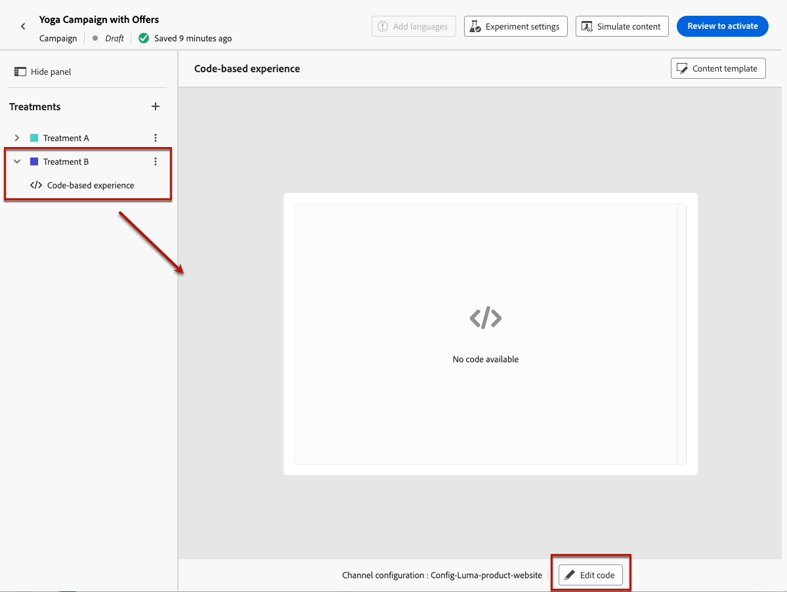

# Decisioning use case {#experience-decisioning-uc}

This use case presents all the steps needed to use Decisioning with the [!DNL Journey Optimizer] code-based channel.

In this example, you are unsure if a specific ranking formula will perform better than the pre-assigned offer priorities. To measure which one performs best for your target audience, you create a campaign using [Content Experiment](../content-management/content-experiment.md) where you define two delivery treatments:

* The first treatment uses priority as the ranking method.
* The second treatment uses a formula as the ranking method.

## Create selection strategies

First, you need to build two selection strategies: one with priority as the ranking method, and another one with a formula as the ranking method.

>[!NOTE]
>
>You can also create single decision items without having to run through a selection strategy. The priority set for each item will apply.

### Create a strategy using priority

To build the first selection strategy with priority as the ranking method, follow the steps below.

1. Create a decision item. [Learn how](items.md)

1. Set the **[!UICONTROL Priority]** of the decision item compared to others. If a profile qualifies for multiple items, a higher priority grants the item precedence over others.

    {width="90%"}

    >[!NOTE]
    >
    >The priority is an integer data type. All attributes that are integer data types should contain integer values (no decimals).

1. Set the decision item's eligibility:

    * Define audiences or rules to restrict the item to specific profiles only. [Learn more](items.md#eligibility)

    * Set capping rules to define the maximum number of times an offer can be presented. [Learn more](items.md#capping)

1. If needed, repeat the steps above to create additional decision items.

1. Create a **collection** where your decision item(s) will be included. [Learn more](collections.md)

1. Create a [selection strategy](selection-strategies.md#create-selection-strategy) and select the [collection](collections.md) that contains the offer(s) to consider.

1. [Choose the ranking method](#select-ranking-method) to use to select the best offer for each profile. In this case, select **[!UICONTROL Offer priority]**: if multiple offers are eligible for this strategy, the Decisioning engine uses the value set as **[!UICONTROL Priority]** in the offer(s). [Learn more](selection-strategies.md#offer-priority)

    {width="90%"}

### Create another strategy using a formula

To build the second selection strategy with select a formula as the ranking method, follow the steps below.

1. Create a decision item. [Learn how](items.md)

    <!--Do you need to set the same **[!UICONTROL Priority]** as for the first decision item, or it won't be considered at all?-->

1. Set the decision item's eligibility:

    * Define audiences or rules to restrict the item to specific profiles only. [Learn more](items.md#eligibility)

    * Set capping rules to define the maximum number of times an offer can be presented. [Learn more](items.md#capping)

1. If needed, repeat the steps above to create additional decision items.

1. Create a **collection** where your decision item(s) will be included. [Learn more](collections.md)

1. Create a [selection strategy](selection-strategies.md#create-selection-strategy) and select the [collection](collections.md) that contains the offer(s) to consider.

1. [Choose the ranking method](#select-ranking-method) you want to use to select the best offer for each profile. In this case, select **[!UICONTROL Formula]** to use a specific calculated score to determine which eligible offer to deliver. [Learn more](selection-strategies.md#ranking-formula)

    {width="90%"}

## Build a code-based experience campaign

<!--To present the best dynamic offer and experience to your visitors on your website or mobile app, add a decision policy to a code-based campaign.

Define two delivery treatments each containing a different decision policy.-->

Once you configured the two selection strategies, create a code-based experience campaign where you define a different treatment for each strategy, in order to compare which one performs best.

1. Create a campaign, and select the **[!UICONTROL Code-base experience]** action. [Learn more](../code-based/create-code-based.md)

1. From the campaign summary page, click **[!UICONTROL Create experiment]** to start configuring your content experiment. [Learn more](../content-management/content-experiment.md)

    {width="90%"}

1. From the campaign summary page, select a code-based configuration, and click **[!UICONTROL Edit content]**.

    {width="90%"}

1. From the content edition window, to start personalizing **Treatment A**, click **[!UICONTROL Edit code]**.

    {width="90%"}

1. From the [code editor](../code-based/create-code-based.md#edit-code), select **[!UICONTROL Decision policy]**, click **[!UICONTROL Add decision policy]** and fill in the decision details. [Learn more](create-decision.md#add)

   {width="90%"}

1. In the **[!UICONTROL Strategy sequence]** section, click the **[!UICONTROL Add]** button, and choose **[!UICONTROL Selection strategy]**. [Learn more](create-decision.md#select)

    {width="80%"}

    >[!NOTE]
    >
    >You can also select **[!UICONTROL Decision item]** to add single items without having to run through a selection strategy. The priority set for each item will apply.

1. Select the first strategy that you created.

    {width="90%"}

1. Save your changes and click **[!UICONTROL Create]**. The new decision is added under **[!UICONTROL Decision policy]**.

1. Click the **[!UICONTROL Insert policy]** button. The code corresponding to the decision policy is added. Then add all the attributes you want to the code, including profile attributes. [Learn more](create-decision.md#use-decision-policy)

    {width="90%"}

1. Save your changes.

1. Go back to the content edition window, select the + button to add **Treatment B**, select it and click **[!UICONTROL Edit code]**.

    {width="90%"}

1. Repeat the steps above to create another decision policy and select the second selection strategy that you created. <!--Do you need to create exactly the same content to compare only the ranking method?-->

1. Save your changes and [publish your code-based-experience campaign](../code-based/publish-code-based.md).

You can track how your campaign is performing with the [experimentation campaign report](../reports/campaign-global-report-cja-experimentation.md) and [report on decisioning](cja-reporting.md). <!--TBC how to check which treatment performs best-->