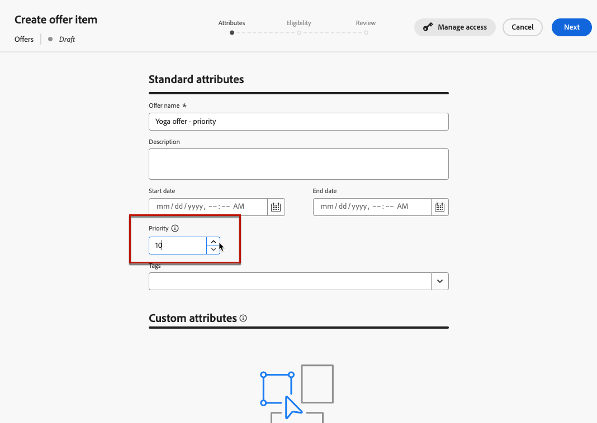
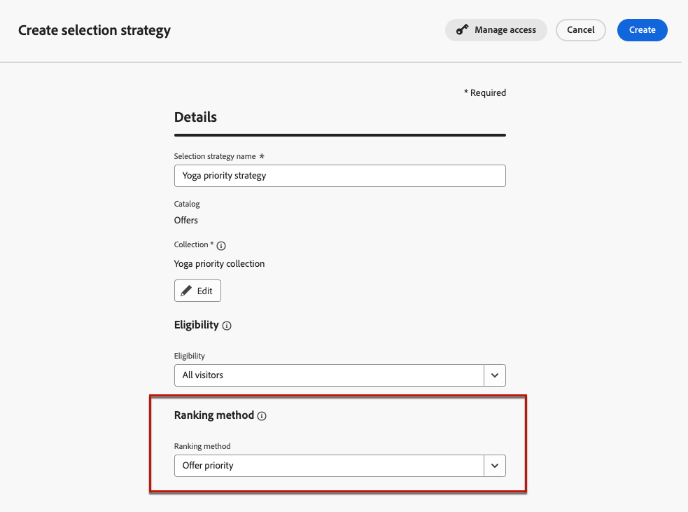
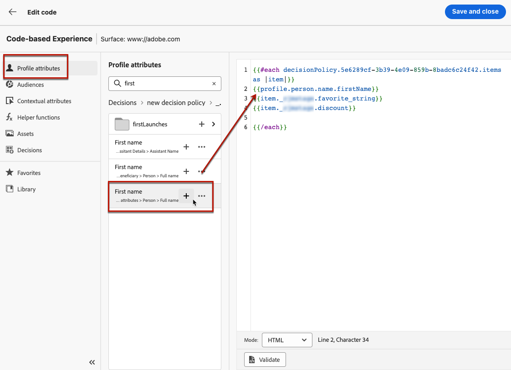

# Decisioning use case {#experience-decisioning-uc}

This use case presents all the steps needed to use Decisioning with the [!DNL Journey Optimizer] code-based channel.

<!--In this use case, you create a campaign where you define two delivery treatments - each containing a different decision policy in order to measure which one performs best for your target audience.-->

In this use case, you are unsure if a specific ranking formula will perform better than the pre-assigned offer priorities.

To measure which one performs best for your target audience, create a campaign where you define two delivery treatments:

<!--Set up the experiment such that:-->

* The first treatment contains one selection strategy with priority as the ranking method.
* The second treatment contains a different selection strategy for which a formula is the ranking method.

## Create selection strategies

First, you need to build two selection strategies: one with priority as the ranking method, and another one with a formula as the ranking method.

### Create the first selection strategy

In the first selection strategy, select priority as the ranking method. Follow the steps below.

1. Create a decision item. [Learn how](items.md)

1. Set the **[!UICONTROL Priority]** of the decision item compared to others. If a profile qualifies for multiple items, a higher priority grants the item precedence over others.

    

    >[!NOTE]
    >
    >The priority is an integer data type. All attributes that are integer data types should contain integer values (no decimals).

1. Define audiences or rules to restrict the item to specific profiles only. [Learn how to set the decision item's eligibility](items.md#eligibility)

1. Set capping rules to define the maximum number of times an offer can be presented. [Learn how](items.md#capping)

<!--1. If needed, repeat the steps above to create one or more additional decision items.-->

1. Create a **collection** where your decision item(s) will be included. [Learn more](collections.md)

1. Create a **selection strategy**. [Learn how](selection-strategies.md#create-selection-strategy)

1. Select the [collection](collections.md) that contains the offer(s) to consider.

1. [Choose the ranking method](#select-ranking-method) to use to select the best offer for each profile. In this case, select **[!UICONTROL Offer priority]**. [Learn more](selection-strategies.md#offer-priority)

    

    <!--If multiple offers are eligible for this strategy, the [Offer priority](#offer-priority) method uses the value defined in the offers.-->

### Create the second selection strategy

In the second selection strategy, select a formula as the ranking method. Follow the steps below.

1. Create a decision item. [Learn how](items.md)

<!--1. Set the same **[!UICONTROL Priority]** as for the first decision item. TBC?-->

1. Define audiences or rules to restrict the item to specific profiles only. [Learn how to set the decision item's eligibility](items.md#eligibility)

1. Set capping rules to define the maximum number of times an offer can be presented. [Learn how](items.md#capping)

<!--1. If needed, repeat the steps above to create one or more additional decision items.-->

1. Create a **collection** where your decision item(s) will be included. [Learn more](collections.md)

1. Create a **selection strategy**. [Learn how](selection-strategies.md#create-selection-strategy)

1. Select the [collection](collections.md) that contains the offer(s) to consider.

1. [Select the ranking method](#select-ranking-method) you want to use to select the best offer for each profile. In this case, select **[!UICONTROL Formula]** to use a specific calculated score to choose which eligible offer to deliver. [Learn more](selection-strategies.md#ranking-formula)

    

<!--
## Create decision items and selection strategies

You first need to create items, group them together in collections, set up rules and ranking methods. These elements will allow you to build selection strategies.

1. Navigate to **[!UICONTROL Decisioning]** > **[!UICONTROL Catalogs]** and create several decision items. Set constraints using audiences or rules to restrict each item to specific profiles only. [Learn more](items.md)

1. From the items list, click the **[!UICONTROL Edit schema]** button  and edit the custom attributes if needed. [Learn how to work with catalogs](catalogs.md)

1. Create **collections** to categorize and group your decision items according to your preferences. [Learn more](collections.md)

1. Create **decision rules** to determine to whom a decision item can be shown. [Learn more](rules.md)

1. Create **ranking methods** and apply them within decision strategies to determine the priority order for selecting decision items. [Learn more](ranking.md)

1. Build **selection strategies** that leverage collections, decision rules, and ranking methods to identify the decision items suitable for displaying to profiles. [Learn more](selection-strategies.md)
-->

## Create decision policies

<!--To present the best dynamic offer and experience to your visitors on your website or mobile app, add a decision policy to a code-based campaign.

Define two delivery treatments each containing a different decision policy.-->

1. Create a campaign, and select the **[!UICONTROL Code-base experience]** action. [Learn more](../code-based/create-code-based.md)

1. From the **[!UICONTROL Edit content]** window, start personalizing the treatment A.

1. Select the **[!UICONTROL Decisions]** icon, click **[!UICONTROL Create a decision]** and fill in the decision details. [Learn more](create-decision.md)

   

1. Select the first strategy that you created. Click **[!UICONTROL Add strategy]**.

1. Click **[!UICONTROL Create]**. The new decision is added under **[!UICONTROL Decisions]**.

    

1. Click the more actions icon (three dots) and select **[!UICONTROL Add]**. Now you can add all the decision attributes you want inside this.

    

1. You can also add any other attribute available in the personalization editor, such as profile attributes.

    

1. From the campaign summary page, click **[!UICONTROL Create experiment]** to start configuring your content experiment. [Learn more](../content-management/content-experiment.md)

1. From the **[!UICONTROL Edit content]** window, select treatment B , and repeat the steps above to create another decision.

1. Select the second strategy that you created. Click **[!UICONTROL Add strategy]**.

1. Save your content.
