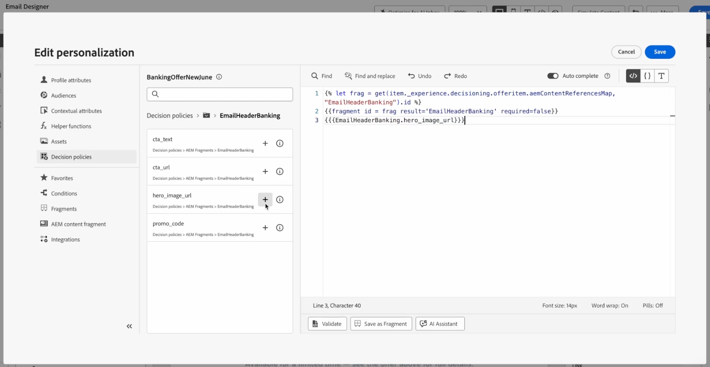
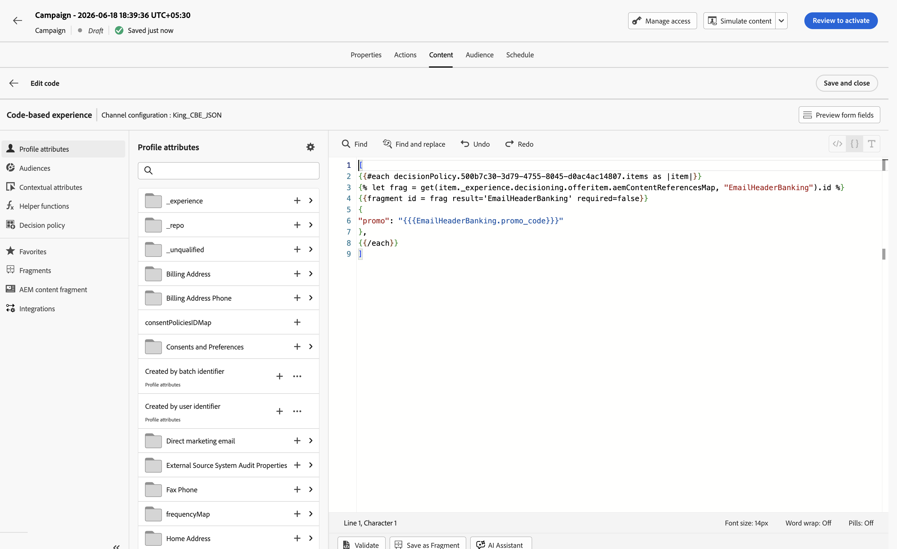
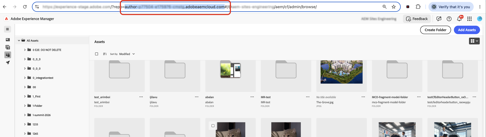
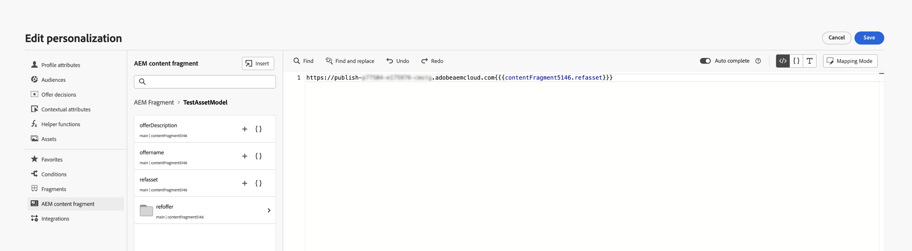
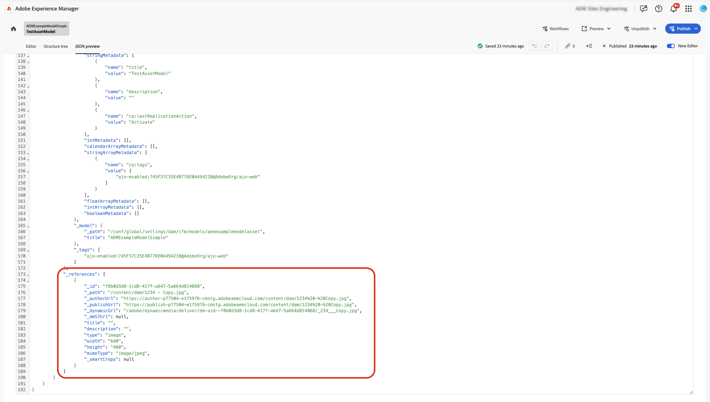
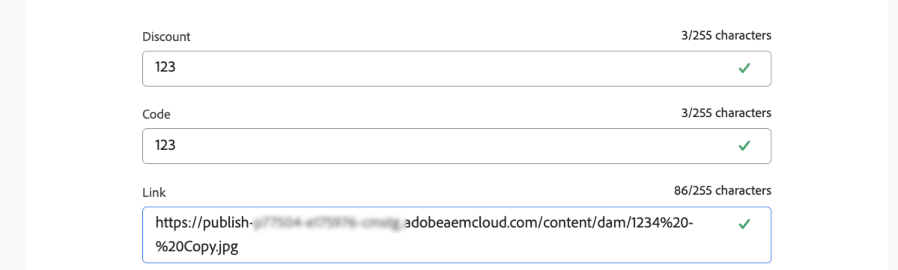
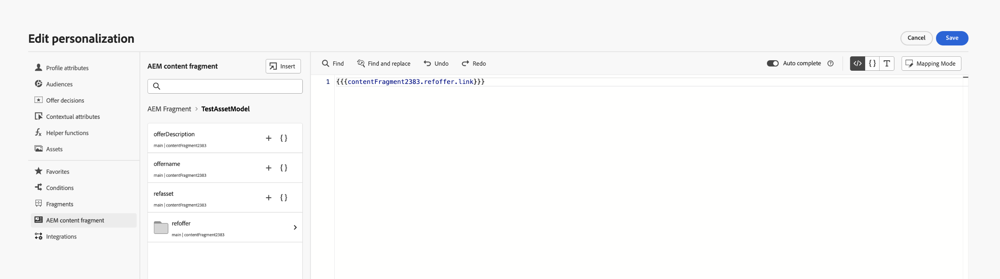

# Leverage fragments in decision policies {#fragments}

>[!BEGINSHADEBOX]

**On this page:** Leverage Journey Optimizer content fragments and AEM Content Fragments within decision policies, so you can personalize and optimize the content decisioning delivers across channels.

>[!ENDSHADEBOX]

Decision items support two types of fragment content that can be leveraged when authoring messages within a decision policy:

* **Journey Optimizer content fragments** — reusable expression fragments created in Journey Optimizer and added to the decision item's **[!UICONTROL Fragments]** section. [Learn more about AJO content fragments](../content-management/fragments.md)
* **AEM Content Fragments** — content authored in Adobe Experience Manager, mapped to the decision item's attributes, and selected in the personalization editor by key name. [Learn how to tie an AEM Content Fragment to a decision item](items.md#aem-fragments)

## Journey Optimizer content fragments {#ajo-fragments}

If your decision policy contains decision items including AJO content fragments, you can leverage these fragments when authoring a message within the decision policy across all channels where Decisioning is available (code-based experience, Email, Push, SMS, and journeys).

For example, let's say you want to display different contents for several mobile device models. Add the specified fragments, each pertaining to a different phone model, to the decision item you are using in the decision policy. [Learn how to add fragments to a decision item](items.md#attributes).

{width=70%}

Once done, you can use either one of the following methods:

>[!BEGINTABS]

>[!TAB Directly insert the code]

Simply copy-paste the code block below into the decision policy code. Replace `variable` with the fragment ID and `placement` with the fragment reference key:

```handlebars

{{fragment id = variable required=false}}
```

>[!TAB Follow the detailed steps]

1. Navigate to the **[!UICONTROL Helper functions]** and add the **Let** function ` {{variable}}` to the code pane, where you can declare the variable for your fragment.

    

1. Use the **Map** > **Get** function `` to build your expression. The map is the fragment referenced in the decision item. The string can be the device model you entered in the decision item as the **[!UICONTROL Fragment reference key]**.

    

1. You can also use a contextual attribute which would contain this device model ID.

    

1. Add the variable that you chose for your fragment as the fragment ID.

    

>[!ENDTABS]

The fragment ID and reference key will be selected from the decision item's **[!UICONTROL Fragments]** section.

>[!WARNING]
>
>If the fragment key is incorrect or if the fragment content is not valid, rendering may fail and cause an error in the Edge call.
>
>To avoid failures when a fragment is temporarily unavailable, the `required=false` flag is used so the fragment is skipped instead. [Learn more about temporarily unavailable fragments](#temporary-unavailable-fragments)

### Usage and guardrails {#fragments-guardrails}

The following guardrails apply specifically to **AJO content fragments** used in decision items.

+++Simulate content and expression fragments in emails

For the **Email** channel, expression fragments associated with a decision item display correctly when you **[!UICONTROL Send proof]** or when the campaign is activated. However, **[!UICONTROL Simulate content]** does not display the expression fragment from the decision item.

+++

+++Visual fragments and decision items in emails

You cannot assign a **[!UICONTROL Visual fragment]** to a decision item, only **expression fragments** are supported in this context.

+++

+++Decision item and context attributes

Decision item attributes and contextual attributes are not supported by default in [!DNL Journey Optimizer] fragments. However, you can use global variables instead, such as described below.

Let's say you want to use the *sport* variable in your fragment.

1. Reference this variable in the fragment, for example:

    ```text
    Elevate your practice with new {{sport}} gear!
    ```

1. Define the variable with the **Let** function within the decision policy block. In the example below, *sport* is defined with the decision item attribute:

    ```handlebars
    {#each decisionPolicy.13e1d23d-b8a7-4f71-a32e-d833c51361e0.items as |item|}}
    
    {{fragment id = get(item._experience.decisioning.offeritem.contentReferencesMap, "placement1").id }}
    {{/each}}
    ```

+++

+++Decision item fragment content validation

* Due to the dynamic nature of these fragments, when used in a campaign, message validation during campaign content creation is skipped for fragments referenced in decision items.

* The validation of the fragment content happens only during the fragment creation and publication.

* For JSON-type expression fragments, the content is syntactically validated upon saving the fragment. Validation errors are displayed as alerts.

At runtime, the campaign content (including fragment content from decision items) is validated. In case of a validation failure, the campaign will not get rendered.

+++

+++Temporarily unavailable fragments are skipped {#temporary-unavailable-fragments}

When journeys or campaigns reference fragments attached to decision items, there can be short synchronization delays before updated fragments are available on Edge.

To avoid failures when a fragment is temporarily unavailable, fragments now have the `required` flag set to `false` by default so that they are skipped instead of causing the journey or campaign to fail.

This means that if the fragment is temporarily unavailable on Edge, it is simply ignored. If the fragment is available, it renders normally.

**Example**

If your decision policy qualifies for two offers and each has a fragment—for example, "20% off" and "30% off"—and the second fragment is temporarily unavailable, with `required=false` the system renders the available offer (20% off) and skips the other fragment (30% off) instead of failing the journey or campaign. This improves reliability when content is still synchronizing.

+++

>[!NOTE]
>
>You can still mark a fragment as mandatory by setting the `required` flag to `true`. However, if a fragment is temporarily missing, it may cause journey or campaign rendering to fail.

## AEM Content Fragments {#aem-fragments-decisioning}

>[!AVAILABILITY]
>
>This feature is available for outbound channels with Decisioning support.

Before leveraging AEM Content Fragments in a decision policy, make sure you have:

* Created your Content Fragment in Adobe Experience Manager and tagged it with `ajo-enabled:{OrgId}/{SandboxName}` so that it is discoverable by Journey Optimizer. [Learn how to create and assign a tag](../integrations/aem-fragments.md#create-tag)
* Tied the fragment to the **[!UICONTROL AEM Fragments]** section of the offer item by assigning it a unique reference name. [Learn how to tie an AEM Content Fragment to a decision item](items.md#attributes)

In the personalization editor, all AEM Content Fragments associated with the decision items selected by the policy are available. One folder appears per fragment key name.

➡️ [Discover how to use AEM Content Fragments with Journey Optimizer Decisioning in video](#video)

In this example, the decision policy includes two decision items that have AEM fragments tied to them through their reference name.


1. Click the + button to add the desired fragment into your expression.

    Since a single reference name may have multiple fragments tied to it across different offer items, Decisioning determines the best one to deliver to each customer based on the decision policy's ranking criteria.

1. Once the fragment has been selected, you can leverage its attributes, such as image URLs, text fields, or other content, and use Decisioning to surface the right content to the right customer at the right time.

    

1. Before activating your campaign or journey, use either simulation method to preview how AEM Content Fragment field values will render. [Learn more on simulating content](../content-management/preview-test.md)

### Use AEM Content Fragments across channels {#aem-fragments-channels}

How you insert AEM Content Fragment attributes from a decision policy depends on the channel you are working in.

>[!BEGINTABS]

>[!TAB Email]

To insert AEM Content Fragment attributes into your email using a decision policy:

1. Open your email draft in the Email Designer and click the **[!UICONTROL Decisioning]** icon in the right rail to open the decision policy panel.
1. Select the selection strategy you assembled and specify a **placement** to define the area of the email where the offer will populate.
1. Click the **+** icon and select the specific field from the AEM content fragment that should render in that area — for example, the hero image URL field.

    

1. Before publishing, click **[!UICONTROL Simulate content]** to preview the result and verify that the highest-priority offer and its content fragment render as expected for a test profile.

>[!TAB Code-based experience (JSON)]

When building a JSON-based code-based experience, use the following structure to render AEM Content Fragment attributes from a decision policy.

```handlebars
[
{{#each decisionPolicy.YOUR_POLICY_ID.items as |item|}}

{{fragment id = frag result='YOUR_REFERENCE_KEY' required=false}}
{
  "fieldName": "{{{YOUR_REFERENCE_KEY.fieldName}}}"
},
{{/each}}
]
```

>[!NOTE]
>
>AEM Content Fragments use `aemContentReferencesMap` to look up fragments by reference key. This is different from `contentReferencesMap`, which is used for Journey Optimizer content fragments.

Keep the following in mind when building your JSON payload:

* Place the JSON array brackets `[` and `]` **outside** the `#each` loop.
* Use **triple braces** `{{{ }}}` for field values inside JSON strings to prevent HTML escaping of special characters and ensure valid JSON output.
* The `result='YOUR_REFERENCE_KEY'` parameter captures the resolved fragment content under that name so you can reference its fields with `YOUR_REFERENCE_KEY.fieldName`.



>[!TAB Code-based experience (HTML)]

For HTML-based code-based experiences, use standard double braces for field rendering:

```handlebars
{{#each decisionPolicy.YOUR_POLICY_ID.items as |item|}}

{{fragment id = frag result='YOUR_REFERENCE_KEY' required=false}}
<div>{{YOUR_REFERENCE_KEY.fieldName}}</div>
{{/each}}
```

>[!ENDTABS]

### Use assets from AEM Content Fragments {#aem-cf-assets}

AEM Content Fragments may include image fields that reference assets stored in AEM. Because Journey Optimizer receives only the **relative path** of those assets, images may not load unless the full publish URL is prepended.

>[!NOTE]
>
>Native resolution of AEM asset references inside Content Fragments is not yet supported. The approaches below are workarounds available until that support is added.

>[!BEGINTABS]

>[!TAB Prepend the AEM publish domain]

1. From your AEM instance URL, identify the author domain — for example, `author-p12345-e67890.adobeaemcloud.com`.

    

1. Replace `author` with `publish` to obtain the publish domain: `publish-p12345-e67890.adobeaemcloud.com`.

1. In the Journey Optimizer personalization editor, prepend that publish domain to the asset reference field from the Content Fragment.

    

The image will now resolve to its full publish URL at delivery time.

>[!TAB Store the publish URL in a text field]

1. Open your Content Fragment in AEM.
1. Go to the JSON preview and check the **References** section to locate the published asset URL.

    

1. Copy the publish URL and paste it into a dedicated text field within the Content Fragment.

    

1. In Journey Optimizer, reference that text field directly as the image source in your personalization expression.

    

This approach avoids manual URL construction and keeps the publish URL within the Content Fragment itself.

>[!ENDTABS]

## How-to video {#video}

Learn how to use Adobe Experience Manager Content Fragments with Journey Optimizer Decisioning to personalize and optimize content.

>[!VIDEO](https://video.tv.adobe.com/v/3492215/?learn=on&enablevpops)
