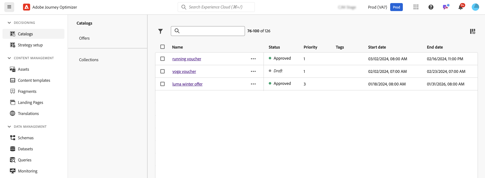
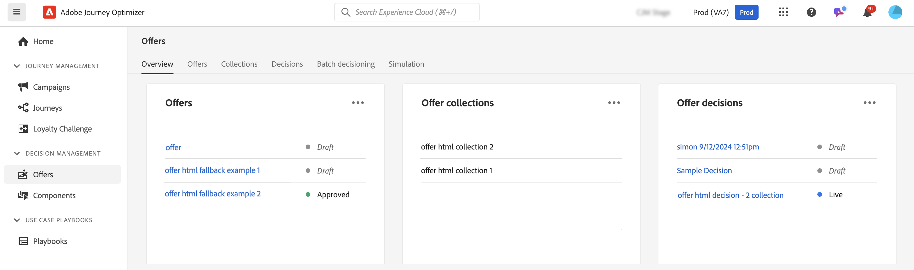

# Get started with decision capabilities in [!DNL Journey Optimizer] {#gs-decision}

>[!BEGINSHADEBOX]

**On this page:** Compare the Decisioning and Decision management capabilities in Journey Optimizer so you can choose the right approach for delivering personalized offers across your channels.

>[!ENDSHADEBOX]

The decision capabilities in [!DNL Journey Optimizer] empower you to deliver the best offers and personalized experiences to your customers across all touchpoints, at precisely the right moments. These capabilities simplify personalization through a centralized catalog of marketing offers and an advanced decision engine, which uses rules and ranking criteria to deliver the most relevant content for each individual.

Key benefits:

* Improved campaign performance by delivering personalized offers across multiple channels,
* Improved workflows: instead of creating multiple deliveries or campaigns, marketing teams can improve workflows by creating a single delivery and vary the offers in different parts of the template,
* Control over the number of times an offer is shown across campaigns and customers.

Currently, [!DNL Journey Optimizer] provides the two core solutions detailed below.

## Decisioning {#decisioning}

Our next-generation decision framework, designed to unify existing Journey Optimizer workflows and lay the foundation for managing additional content catalogs. Decisioning offers:

* Schema-based item catalog management: Increase flexibility by associating customized metadata with each offer
* Flexible collection rules: Easily group offers for future evaluation based on various criteria
* Updated decision policy and selection strategy configuration: Allow reusability of decision components
* Experimentation capabilities: Test decision logic against other content components to measure performance

Decisioning is available to all customers for the **Code-based Experience**, **Email**, **Push notification**, and **SMS** channels. For full details about the release cycle and availability phases, see [Journey Optimizer release cycle](../rn/releases.md).

➡️ [Get started with Decisioning](../experience-decisioning/gs-experience-decisioning.md)

>[!NOTE]
>
>To migrate from Decision management to Decisioning, refer to the [migration documentation](../experience-decisioning/migrate-to-decisioning.md) and [Migration API guide](../experience-decisioning/decisioning-migration-api.md).

## Decision management {#decision-management}

Our established feature in Journey Optimizer, Decision Management uses a central library of marketing offers and a decision engine that applies rules and constraints to real-time customer profiles, leveraging Adobe Experience Platform data to deliver the right offer at the right time.

Decision Management supports the following channels: Email, In-App messaging, Push notifications, SMS, and Direct mail.

➡️ [Get started with Decision management](../offers/get-started/starting-offer-decisioning.md)
