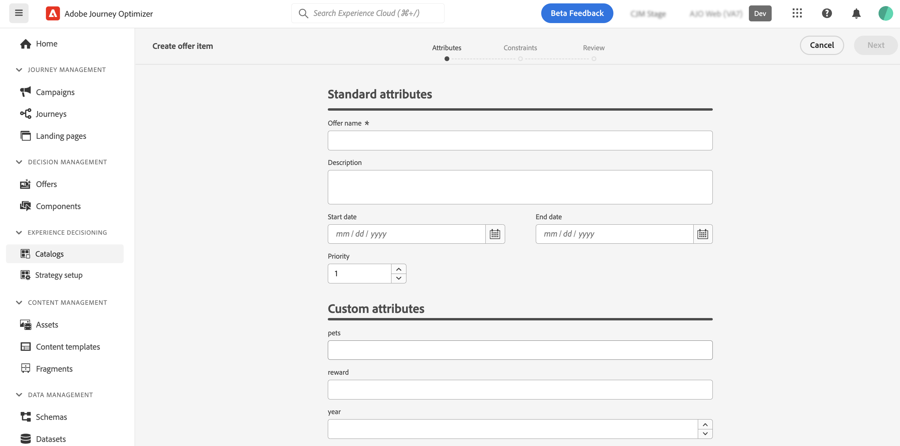
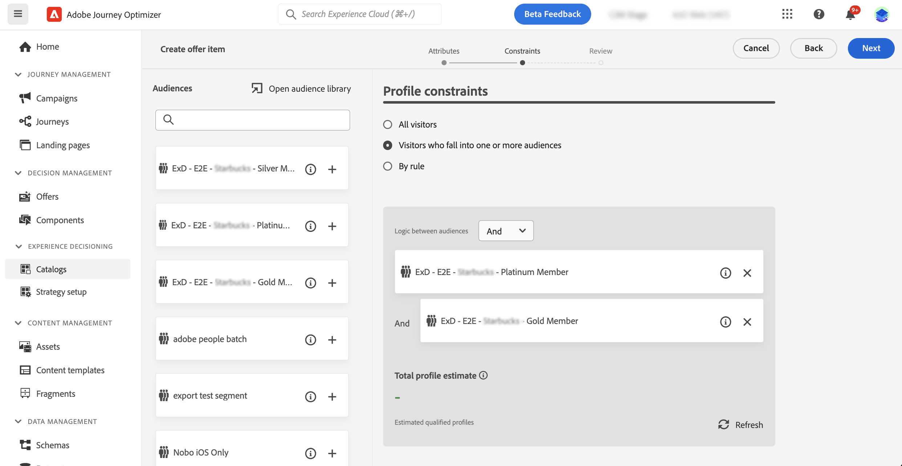
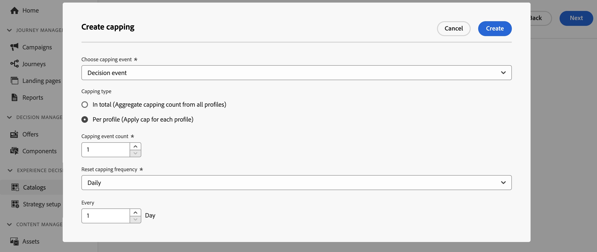

# Create your first decision item {#items}

>[!CONTEXTUALHELP]
>id="ajo_exd_items"
>title="Manage decision items"
>abstract="Journey Optimizer allows you to create marketing offers, known as decision items, that you can create and organize into a centralized catalog and collections. Currently, all created decision items are consolidated within a single "Offers" catalog. From this screen, you can also access the catalog's schema using the **Edit schema** button and create custom attributes for your decision items."
>additional-url="https://experienceleague.adobe.com/docs/journey-optimizer/using/decisioning/experience-decisioning/decision-items/catalogs.html" text="Configure the item catalog"

Journey Optimizer allows you to create marketing offers, known as decision items, that you can create and organize into a centralized catalog and collections. They are made up of standard and custom attributes designed to align precisely with your needs. Additionally, they incorporate profile constraints that allow you to define to whom a decision item can be shown.

Before creating a decision item, make sure you have created a **decision rule** if you want to set conditions to determine to whom the decision item can be shown. [Learn how to create decision rules](rules.md). 

To create a decision item, navigate to **[!UICONTROL Decisioning]** > **[!UICONTROL Catalogs]**, then click **[!UICONTROL Create item]** then follow the steps detailed in the sections below.

## Define the decision item's attributes {#attributes}

>[!CONTEXTUALHELP]
>id="ajo_exd_item_priority"
>title="Define the decision item's priority"
>abstract="If a profile qualifies for multiple items, the priority enables to compare this decision item to others. A higher priority grants the item precedence over others."

>[!CONTEXTUALHELP]
>id="ajo_exd_item_custom_attributes"
>title="Define the custom attributes"
>abstract="Custom attributes are specific attributes tailored to your needs that you can assign to a decision item. They are created in the decision items' catalog schema. This section only displays if you have added at least one custom attribute to the catalog schema."
>additional-url="https://experienceleague.adobe.com/docs/journey-optimizer/using/decisioning/experience-decisioning/decision-items/catalogs.html" text="Configure the item catalog"

Start by defining the decision item's standard and custom attributes :

1. Provide a name and a description.
1. Specify start and end dates. The item will only be considered by the decisioning engine within these dates.
1. Set the **[!UICONTROL Priority]** of the decision item compared to others, if a profile qualifies for multiple items. A higher priority grants the item precedence over others.

    >[!NOTE]
    >
    >The priority is an integer data type. All attributes that are integer data types should contain integer values (no decimals).
    
1. The **Tags** field allows you to assign Adobe Experience Platform Unified Tags to your decision items. This allows you to easily classify them and improve search. [Learn how to work with tags](../start/search-filter-categorize.md#tags) 

1. Specify custom attributes (optional). Custom attributes are specific attributes tailored to your needs that you can assign to a decision item. They are defined in the decision items' catalog schema. [Learn how to work with catalogs](catalogs.md)

1. Once the decision item's attributes are defined, click **[!UICONTROL Next]**.

## Configure the decision item's eligibility {#eligibility}

>[!CONTEXTUALHELP]
>id="ajo_exd_item_constraints"
>title="Add audiences or decision rules"
>abstract="By default, all profiles are eligible to receive the decision item, but you can use audiences or rules to restrict the item to specific profiles only."
>additional-url="https://experienceleague.adobe.com/docs/journey-optimizer/using/audiences-profiles-identities/audiences/about-audiences.html" text="Use audiences"
>additional-url="https://experienceleague.adobe.com/docs/journey-optimizer/using/decisioning/experience-decisioning/selection/rules.html" text="Use decision rules"

By default, all profiles will be eligible to receive the decision item, but you can use audiences or rules to restrict the item to specific profiles only, both solutions corresponding to different usages. Expand the section below for more information:

+++Using audiences vs decisiong rules

Basically, the output of an audience is a list of profiles, whereas a decision rule is a function executed on demand against a single profile during the decisioning process.

* **Audiences**: On one hand, audiences are a group of Adobe Experience Platform profiles that match a certain logic based on profile attributes and experience events. However, Offer Management does not recompute the audience, which may not be up-to-date when presenting the offer.

* **Decision rules**: On the other hand, a decision rule is based on data available in Adobe Experience Platform and determines to whom an offer can be shown. Once selected in an offer or a decision for a given placement, the rule is executed every single time a decision is made, which ensures that each profile gets the latest and the best offer.

+++

* To limit the presentation of the decision item to the members of one or several Adobe Experience Platform audiences, select the **[!UICONTROL Visitors who fall into one or multiple audiences]** option, then add one or several audiences from the left pane and combine them using the **[!UICONTROL And]** / **[!UICONTROL Or]** logical operators. [Learn more on audiences](../audience/about-audiences.md).

* To associate a specific decision rule to the decision item, select **[!UICONTROL By rule]**, then drag the desired rule from the left pane into the central area. [Learn more on decision rules](rules.md).

When you select audiences or decision rules, you can see information on the estimated qualified profiles. Click **[!UICONTROL Refresh]** to update data.

>[!NOTE]
>
>Profile estimates are unavailable when rule parameters include data not in the profile such as context data. For example, an eligibility rule that requires the current weather to be ≥80 degrees.

## Set capping rules {#capping}

Capping is used as a constraint to define the maximum number of times an offer can be presented. Limiting the number of times users get specific offers allows you to avoid over-solicitating your customers and thus to optimize each touchpoint with the best offer. You can create up to 10 cappings for a given decision item.

>[!NOTE]
>
>
>The capping counter value can take up to 3 seconds to update. For example, let's say you are displaying a web banner showcasing an offer on your website. If a given user browses to the next page of your website in less than 3 seconds, the counter value will not be incremented for that user.

To set capping rules for the decision item, click the **[!UICONTROL Create capping]** button then follow these steps:

1. Define which **[!UICONTROL Capping event]** will be taken into account to increase the counter.

    * **[!UICONTROL Decision event]** (default value): Maximum number of times an offer can be presented.
    * **[!UICONTROL Impression]** (inbound channels only): Maximum number of times the offer can be displayed to a user.
    * **[!UICONTROL Clicks]**: Maximum number of times the decision item can be clicked by a user.
    * **[!UICONTROL Custom event]**: You can define a custom event that will be used to cap the number of times the item is sent. For example, you can cap on the number of redemptions until they equal 10000, or until a given profile has redeemed 1 time. To do so, use [Adobe Experience Platform XDM](https://experienceleague.adobe.com/docs/experience-platform/xdm/home.html){target="_blank"} schemas to build a custom event rule.

    >[!NOTE]
    >
    >For all capping events except decision event, the decision management feedback may not be automatically collected, which could result in the capping counter not being correctly incremented. To make sure each capping event is tracked and accounted for in the capping counter, ensure that the schema used to collect experience events includes the correct field group for that event. Detailed information on data collection is available in Journey Optimizer Decision management documentation:
    >* [Decision management data collection](../offers/data-collection/data-collection.md)
    >* [Configure data collection](../offers/data-collection/schema-requirement.md)

1. Choose the capping type:

    * Select **[!UICONTROL In total]** to define how many times the item can be proposed across the combined target audience, meaning across all users. For example, if you are an electronics retailer having a 'TV doorbuster deal', you want the offer to be only returned 200 times across all profiles.

    * Select **[!UICONTROL Per profile]** to define how many times the offer can be proposed to the same user. For example, if you are a bank with a 'Platinum credit card' offer, you don't want this offer to be shown more than 5 times per profile. Indeed, you believe that if the user has seen the offer 5 times and not acted on it, they have a higher chance to act on the next best offer.

1. In the **[!UICONTROL Capping count limit]** field, specify the number of times the offer can be presented to all users or per profiles, depending on the selected capping type. The number must be an integer greater than 0.

    For example, you defined a custom capping event such as the number of checkouts is taken into account. If you enter 10 in the **[!UICONTROL Capping count limit]** field, no more offers will be sent after 10 checkouts.

1. In the **[!UICONTROL Reset capping frequency]** drop-down list, set the frequency at which the capping counter is reset. To do this, define the time period for the counting (daily, weekly or monthly) and enter the number of days/weeks/months of your choice. For example, if you want the capping count to be reset every 2 weeks, select **[!UICONTROL Weekly]** from the corresponding drop-down list and type **2** in the other field.

    >[!NOTE]
    >
    >The frequency capping counter reset happens at **12am UTC**, on the day that you defined or on the first day of the week/month when applicable. The week start day is **Sunday**. Any duration you choose cannot exceed **2 years** (i.e. the corresponding number of months, weeks or days).
    >
    >After publishing your decision item, you will not be able to change the time period (monthly, weekly or daily) you selected for the frequency. You can still edit the frequency capping if the item has the **[!UICONTROL Draft]** status and was never published before with frequency capping enabled.

1. Click **[!UICONTROL Create]** to confirm the capping rule creation. You can create up to 10 rules for a single decision item. To do so, click the **[!UICONTROL Create capping]** button and repeat the steps above.

    

1. Once the decision item's eligibility and capping rules are defined, click **[!UICONTROL Next]** to review and save the item.

1. The decision item now appears in the list, with the **[!UICONTROL Draft]** status. When it is ready to be presented to profiles, click the ellipsis button and select **[!UICONTROL Approve]**. 

    

<!--* Identifying how many times a given customer has been shown a decision item. 
If a marketer wants to determine how many times a specific customer has been shown an offer, they can do that. Go to Profiles menu, Attributes tab. You'll see all counter values. The alphanumeric string is associated to the offer. To make the map, go to an item, in the URL check the last alphanumeric strings. D stands for day, w stands for week, m for month. "Ce" custom event-->

## Manage decision items {#manage}

From the decision items list, you can edit a decision item, change its status (**Draft**, **Approved**, **Archived**), duplicate or delete it.

To modify a decision item, open it, make your modifications and save it.

Selecting a decision item or clicking the ellipsis button enables the actions described below.

* **[!UICONTROL Approve]**: Sets the decision item's status to Approved.
* **[!UICONTROL Undo approve]**: Sets the decision item's status back to **[!UICONTROL Draft]**.
* **[!UICONTROL Duplicate]**: Creates a decision item with identical attributes and constraints. By default, the new item has the **[!UICONTROL Draft]** status.
* **[!UICONTROL Delete]**: Removes the decision item from the list.

    >[!IMPORTANT]
    >
    >Once deleted, the decision item and its content are not accessible anymore. This action cannot be undone. If the decision item is used in a collection or a decision, it cannot be deleted. You must remove the decision item from any objects first.

* **[!UICONTROL Archive]**: Sets the decision item status to **[!UICONTROL Archived]**. The decision item is still available from the list, but you cannot set its status back to **[!UICONTROL Draft]** or **[!UICONTROL Approved]**. You can only duplicate or delete it.
