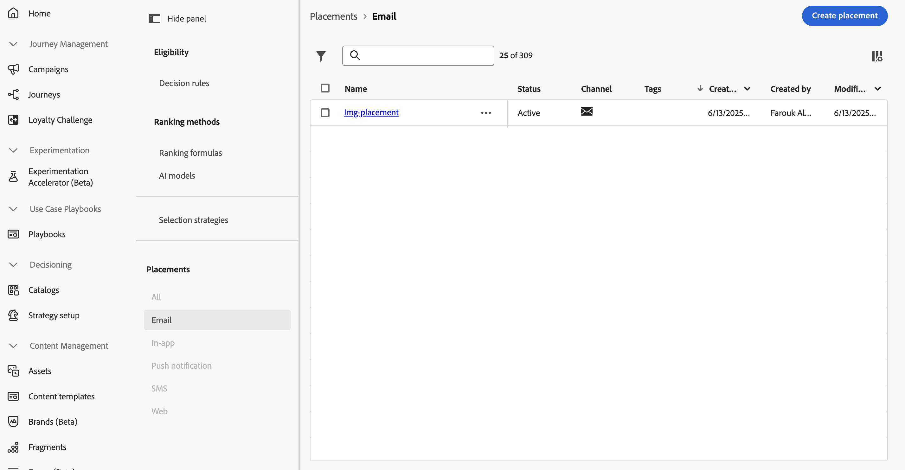
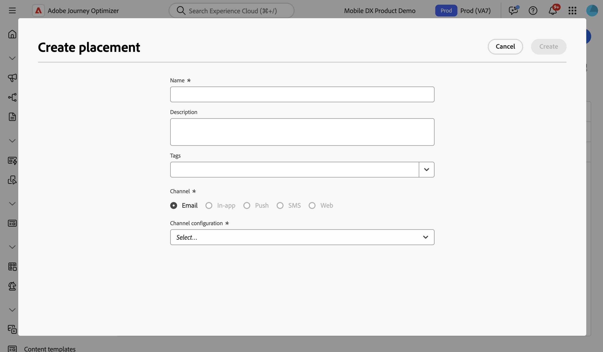
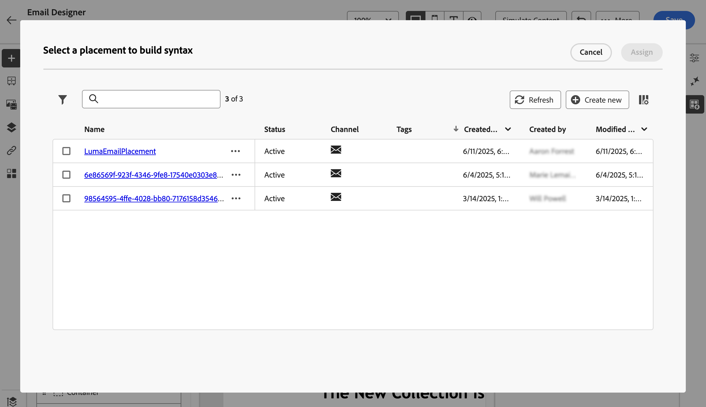

# Work with placements {#create-decision}

## About placements {#about}

A placement is a container that is used to showcase decision items. It helps ensure that the right offer content shows up in the right location within your message.

When you add a decision policy to an email, you need to associate a placement to the component that will showcase the returned decision items. This allows you, for example, to track decision item performances across different placements in reporting.

The list of placements is accessible in the **[!UICONTROL Strategy setup]** menu. Filters are available to help you retrieve placements according to a specific channel surface or tags.

>[!NOTE]
>
>For now  placements are available for the email channel only.

## Create a placement {#create}

To create a placement, follow these steps:

1. Browse to the **[!UICONTROL Strategy setup]** menu, select **[!UICONTROL Email]**, and click the **[!UICONTROL Create placement]** button.

    You can also create a placement directly from the email designer when adding a decision policy. [Learn how to associate a placement to an email component ](../experience-decisioning/create-decision.md#save)

1. Define the placement's properties:

    

    * **[!UICONTROL Name]**: The name of the placement. Make sure to define a meaningful name to retrieve it more easily.
    * **[!UICONTROL Description]**: A description of the placement.
    * **[!UICONTROL Tags]**: Assign Adobe Experience Platform Unified Tags to the placement. This allows you to easily classify them and improve search. [Learn how to work with tags](../start/search-filter-categorize.md#tags) 
    * **[!UICONTROL Channel]**: The channel for which the placement will be used. For now placements are only available for emails.
    * **[!UICONTROL Channel configuration]**: Associate a channel configuration to the placement. [Learn how to set up channel configurations](../configuration/channel-surfaces.md).

1. Click **[!UICONTROL Create]**.

Once the placement is created, it displays in the placements list when adding a decision policy into an email. You can select it to display its properties and edit it. [Learn how to create decision policies](../experience-decisioning/create-decision.md)

