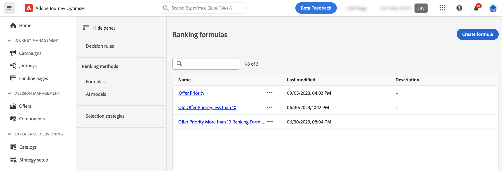
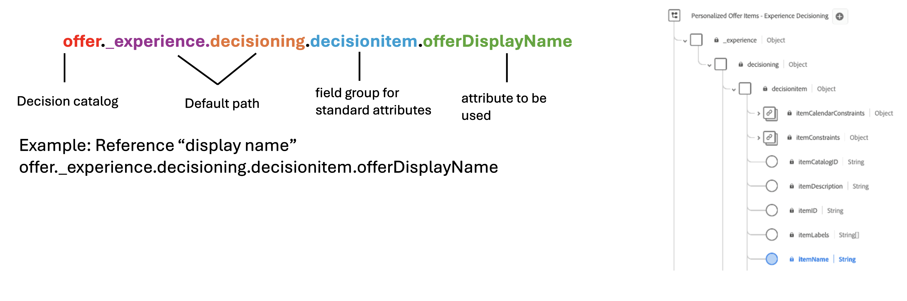

# Ranking methods {#rankings}

>[!CONTEXTUALHELP]
>id="ajo_exd_config_formulas"
>title="Create ranking formulas"
>abstract="Formulas allow you to define rules that will determine which item should be presented first, rather than taking into account the item's priority scores. Once a ranking method has been created, you can assign it to a selection strategy to define which items should be selected first."

Ranking methods allow you to rank items to display for a given profile. Once a ranking method has been created, you can assign it to a selection strategy to define which items should be selected first.

Two types of ranking methods are available:

* **Formulas** allow you to define rules that will determine which item should be presented first, rather than taking into account the item's priority scores.

* **AI models** allow you to use trained model systems that will leverage multiple data points to determine which item should be presented first.

## Create ranking methods {#create}

To create a ranking method, follow these steps:

1. Navigate to the **[!UICONTROL Strategy setup]** menu then select the **[!UICONTROL Formulas]** or **[!UICONTROL AI models]** menu depending on the type of ranking you want to use.

1. Click the **[!UICONTROL Create formula]** or **[!UICONTROL Create AI model]** button in the upper-right corner of the screen.

    

1. Configure the formula or AI model to suit your needs then save it.

    Detailed information on how to create ranking formulas and AI models are available in the decision management documentation:

    * [Ranking formulas](../offers/ranking/create-ranking-formulas.md)
    * [AI models](../offers/ranking/ai-models.md)

+++ Optimizing models on custom [!DNL Customer Journey Analytics] metrics

>[!NOTE]
>
>This capability is only available to [!DNL Customer Journey Analytics] customers with admin rights.
>
>Before starting, make sure you have integrated Journey Optimizer with Customer Journey Analytics in order export Journey Optimizer datasets into your default data views. [Learn how to leverage [!DNL Journey Optmizer] data in [!DNL Customer Journey Analytics]](../reports/cja-ajo.md)

Personalized optimization models are a type of AI model that allow you to define business goals and utilizes customer data to train business-oriented models to serve personalized offers and maximize KPIs. Detailed information on how to create a personalized AI model are available in the [decision management documentation](../offers/ranking/personalized-optimization-model.md).

By default, personalized optimization models use **offer clicks** as the optimization metric. If you are working with [!DNL Customer Journey Analytics], [!DNL Decisioning] allows you to leverage your own custom metrics to optimize your model on.

To do this, access the personalized AI model creation screen and expand the **[!UICONTROL Conversion event]** drop-down. All metrics from your default [!DNL Customer Journey Analytics] [data view](https://experienceleague.adobe.com/en/docs/analytics-platform/using/cja-dataviews/data-views){target="_blank"} display in the list. Select the metric that you want to optimize your model on, then complete the AI model creation as usual.

>[!NOTE]
>
>By default, metrics in [!DNL Customer Journey Analytics] use a "Last Touch" attribution model, which assigns 100% of the credit to the touchpoint that occurs most recently before conversion.
>
>While it is possible to modify the attribution model, not all attribution models are ideal for AI model optimization. We recommend carefully selecting an attribution model that aligns with your optimization goals to ensure model accuracy and performance.
>
>For more details on available attribution models and guidance on their use, refer to the [[!DNL Customer Journey Analytics] documentation](https://experienceleague.adobe.com/en/docs/analytics-platform/using/cja-dataviews/component-settings/attribution){target="_blank"}

+++

## Leverage decision items attributes in formulas {#items}

Ranking formulas are expressed in **PQL syntax** and can leverage various attributes such as profile attributes, [context data](context-data.md) and attributes related to your decision items.

To leverage attributes related to your decision items in formulas, make sure you follow the syntax below in your ranking formula's code. Expand each section for more information:

+++Leverage decision items standard attributes

+++

+++Leverage decision items custom attributes

+++
