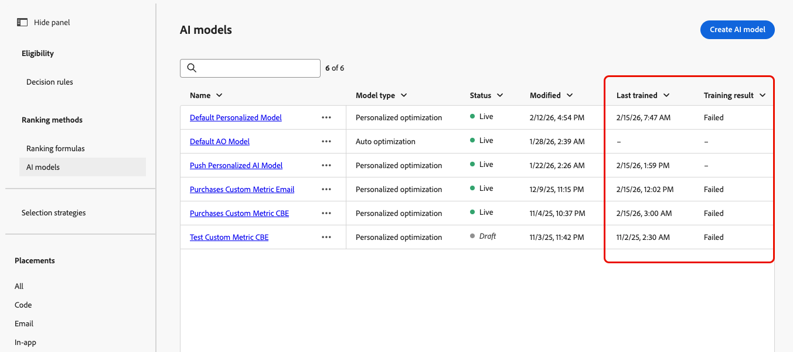
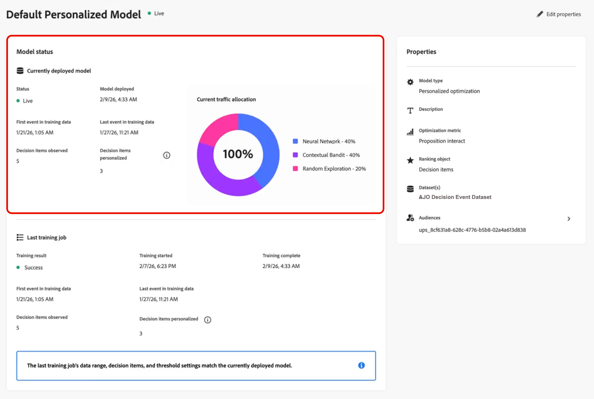
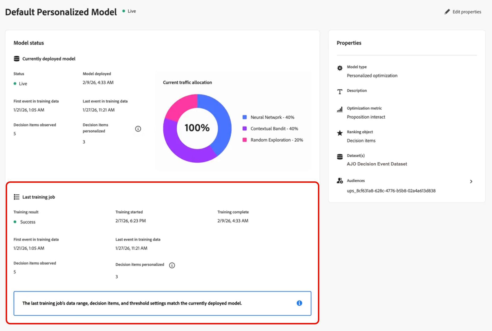
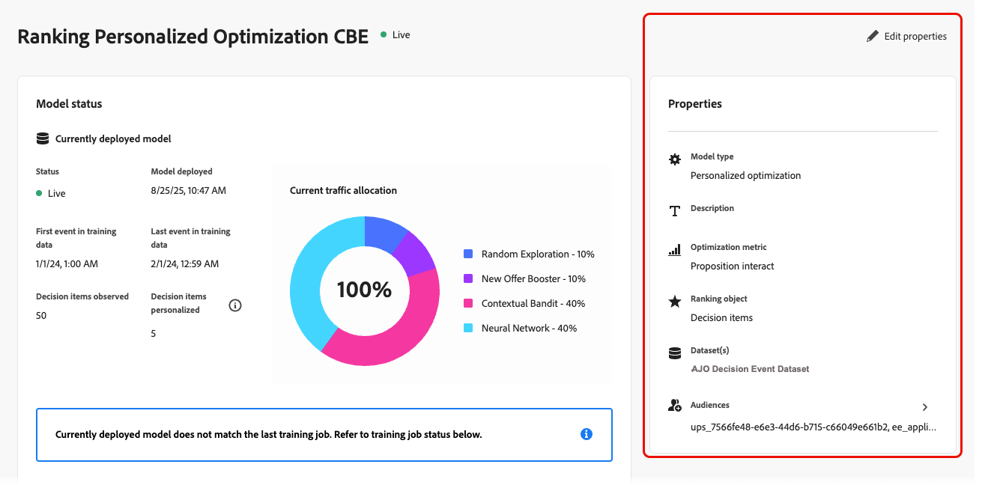
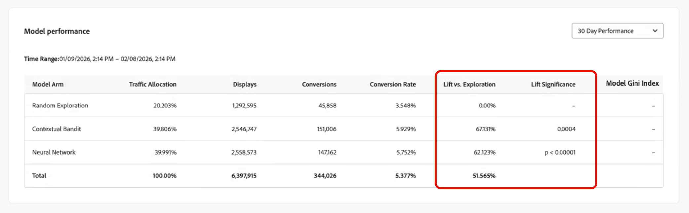
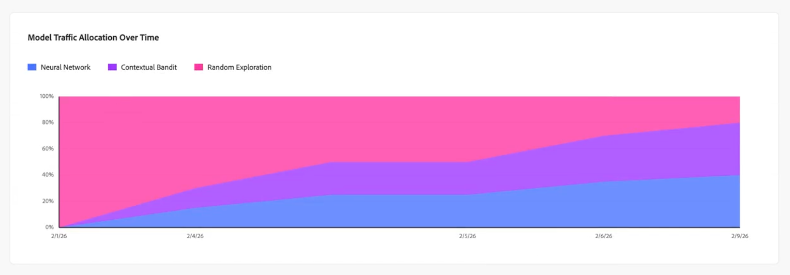
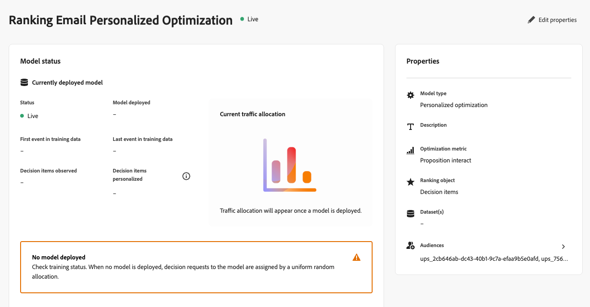
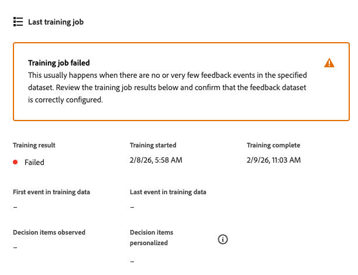
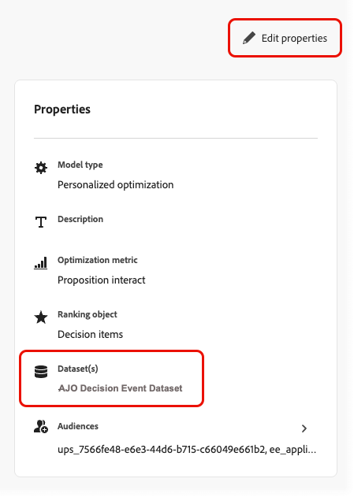

# Monitor your AI models {#ai-model-observability}

Whether you're a marketer, data scientist, or decisioning administrator, understanding how your personalized optimization models perform and behave helps you select the best offers for each customer using AI.

To do this, you can monitor the health, training status, and evolution of your AI models directly in [!DNL Journey Optimizer].

This gives you a clear view of whether your model is working, when it was last trained, what happened during training, how it is driving your business outcome (for example, conversions or revenue), and troubleshoot when it is not working<!-- (for example, unexpected decision item count, training data date range, or insufficient events)-->.

>[!AVAILABILITY]
>
>Currently this capability is supported for [personalized optimization](personalized-optimization-model.md) models only.

➡️ [Discover this feature in video](#video)

## View the training status {#from-ai-model-list}

Once a model is set to live, it enters an ongoing lifecycle: data is collected and the model is retrained periodically to optimize offers' ranking. You can check the training status of your personalized optimization models in the AI model list.

1. Go to **[!UICONTROL Decisioning]** > **[!UICONTROL Strategy setup]** > **[!UICONTROL AI models]** to open the AI model inventory.

1. You can view all your available AI models and their status.

1. For each **[!UICONTROL Live]** AI model of the personalized optimization type, two columns let you see:
   * when the last training job ran (**[!UICONTROL Last trained]**), and
   * whether each model has successfully trained or not (**[!UICONTROL Training result]**).

    

    This allows you to quickly identify models that need further investigation or troubleshooting.

## Access a model status report {#access-ai-model-details}

Click into a personalized optimization AI model from the list. From there, you can view the elements listed below:

* **[!UICONTROL Currently deployed model]** - This section shows the currently deployed model, when it was deployed, what date range of data it uses, how many decision items (offers) are included and personalized, and the current traffic allocation across submodels<!-- (random exploration, new offer booster?, contextual bandit, neural network)-->.

    

    In this example, the model was trained on five decision items, and the model has enough traffic to develop personalized predictions for three of the decision items. The remaining two decision items are served at random.

    You can also see that the model is currently allocating 40% of traffic to the personalized neural network, 40% of traffic to the contextual bandit, and 20% of traffic to random exploration.

* **[!UICONTROL Last training job]** - This section shows the status of the last training job, when it ran, and any error messages. [Learn more about error states](#check-for-error-states)

    

    In this example, you can observe that the deployed model matches the training job as expected.

* **[!UICONTROL Properties]** - This section shows the model's properties, such as the dataset used, the optimization metric, and the audiences used to train the personalized optimization model.

    

    Click **[!UICONTROL Edit properties]** to modify these elements. You will be redirected to the create AI model screen. [Learn more](create-ai-models.md)

* **[!DNL Model performance]** - This section shows the performance of each arm of the model over time, such as the traffic allocation and the conversion rate for each submodel. You can toggle between the **last 7 days** and the **last 30 days**. The lift and statistical significance are the key indicators of whether the model is actually improving your marketing outcome.

    

    In this example, you can see that over the last 30 days, the personalized submodels are delivering more than a 60% uplift in conversion rate, and this uplift is statistically significant, which means that this AI model is driving an impact for your business.
    
* **[!UICONTROL Model traffic allocation over time]** - This section shows how the your model has evolved over time. When a model is first deployed, 100% of traffic is random because no offer data has been collected yet. After the first retrain, traffic usually shifts toward the personalized arms.

    

    In this example, you can see that the traffic allocation has shifted from 100% random exploration to neural network and contextual bandit traffic as the model was retrained over time.

## Understand training errors {#check-for-error-states}

To view error details for a personalized optimization AI model whose last training job failed, follow the steps below.

1. Click into the model from the list. The model status details are displayed.

    {width="95%"}

    In this example, you can see that no model is deployed because the last training job failed.

    >[!NOTE]
    >
    >When no model is deployed, decision requests are served using uniform random traffic allocation.

1. Go through the error details in the **[!UICONTROL Last training job]** section.

    {width="70%"}

    A training job usually fails when there are no feedback events in the dataset that you selected for this model. It means that you need to populate the dataset or select a new dataset with appropriate conversion events.

1. You can check which dataset is selected in the model's **[!UICONTROL Properties]**. Click **[!UICONTROL Edit properties]** to select another dataset. [Learn more](create-ai-models.md)

    {align="left" width="45%"}

## Frequently asked questions {#faq}

+++ Which AI models can I monitor?

AI model monitoring is currently supported for [personalized optimization](personalized-optimization-model.md) models only. Other ranking model types do not yet expose the model status report.
+++

+++ Why did my model's training job fail?

Training jobs often fail when the dataset selected for the model has no or very few feedback (conversion) events. Check the **[!UICONTROL Last training job]** section for the error details, then review the model's **[!UICONTROL Properties]** to confirm the dataset and optimization metric. Populate the dataset with the right events or [select a different dataset](create-ai-models.md) with appropriate conversion data.
+++

+++ How does AI model monitoring relate to campaign and journey reports?

AI model monitoring differs from campaign or journey reporting. A single AI model can be used across multiple campaigns or multiple journeys, and campaign or journey reports do not show which model was used for a given delivery. Use the AI model status monitoring to understand and monitor the model itself; use [campaign reports](../../reports/campaign-global-report-cja.md) and [journey reports](../../reports/journey-global-report-cja.md) for delivery-level metrics.
+++

+++ My optimization metric is a continuous metric like revenue or order value, not a binary metric like clicks or conversions. How do I interpret the reported Conversions and Conversion rate values?

When using a continuous metric like revenue or order value, the model attempts to predict the estimated value associated with presentation of a given offer (not the probability of conversion). The reported "Conversions" value is the total revenue (or order value) associated with the recorded offer displays for each model arm. The reported "Conversion rate" is the Conversions value divided by the Displays value and may exceed 100% in the case of continuous metric.
+++

+++ What is Lift significance?

Lift significance is the statistical significance of the reported lift versus random exploration. The significance is calculated using a Chi-squared test of proportion differences, which provides an identical result to the significance calculation of a Z-test for two population proportions.
+++

+++ What is the model Gini index? What is a "good" value of Gini index?

The model Gini index (also known as a Gini coefficient) is an offline measure of the predictive power of a model. The model Gini index ranges from 0 (no predictive power) to 1 (perfectly predicts the conversion or metric value for every offer for every customer). There is no universal "good" Gini index value, as different decisioning use cases result in different user behavior and therefore different model results. Within the same use case, higher Gini index values indicate a higher quality model.
+++

+++ How is the Gini index computed?

The Gini index for each model arm is computed differently depending on whether the optimization metric is binary or continuous:

**Binary optimization metric** (e.g. clicks, orders): The Gini index is computed based on the area under the curve (AUC) of the receiver-operating characteristic (ROC) curve, normally referred to as ROC AUC or simply AUC for short. ROC AUC ranges from 0.5 (random model with zero predictive power) to 1.0 (perfect predictive power). ROC AUC is converted to a Gini index using the formula Gini = 2 x (ROC AUC) - 1.

**Continuous optimization metric** (e.g. revenue, order value): The Gini index is computed based on the area under the Lorenz curve associated to the model's cumulative predicted positives vs. the cumulative true positives in the population. The area under the Lorenz curve ranges from 0.0 (perfect predictive power) to 0.5 (random model with zero predictive power). Lorenz AUC is converted to a Gini index using the formula Gini = 1 - 2 x (Lorenz AUC).
+++

+++ Which is a better measure of model quality: Gini index or Lift / Lift significance?

Typically, online measures of model quality, such as lift and lift significance, are considered the "gold standard" method for measuring model quality. Gini indices are reported to provide an additional data point for customer data science teams evaluating decisioning models.
+++

<!--
## Understanding statuses and errors {#statuses-errors}

* **Success** – The latest training job completed successfully. The model is trained and deployed for ranking.
* **Failed** – The latest training job failed (for example, no events in the datasets). The UI shows an error message and a request ID; use these when troubleshooting or contacting support.
* **In progress** – A training job is running. Some metrics may be temporarily unavailable until it finishes.
* **Pending** – No result yet (for example, model recently activated or settings recently changed).

If no model has been successfully deployed yet, the "currently deployed model" section and some performance fields will be empty or show the initial-state messaging.
-->

## How-to video {#video}

Learn how to monitor your AI ranking models and interpret training status and performance in [!DNL Journey Optimizer].

>[!VIDEO](https://video.tv.adobe.com/v/3479849?quality=12)

## Related documentation {#related}

* [About AI models](ai-models.md)
* [Personalized optimization model](personalized-optimization-model.md)
* [Create AI models](create-ai-models.md)
* [Create a dataset to collect events](../data-collection/create-dataset.md)
