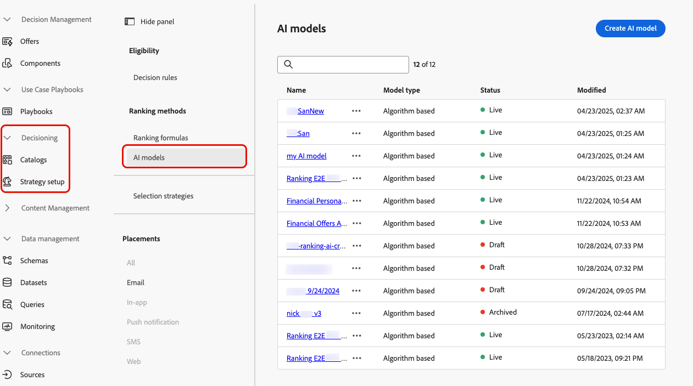
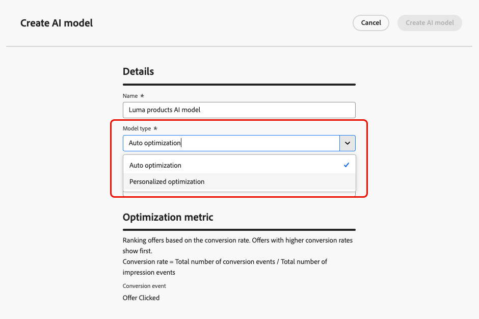
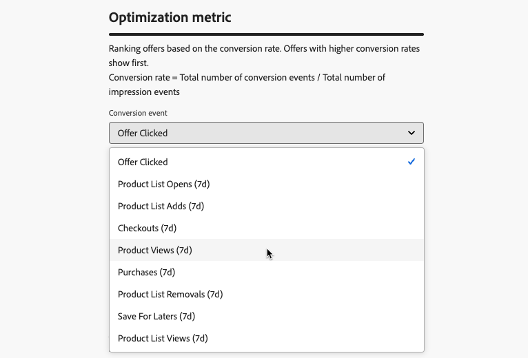
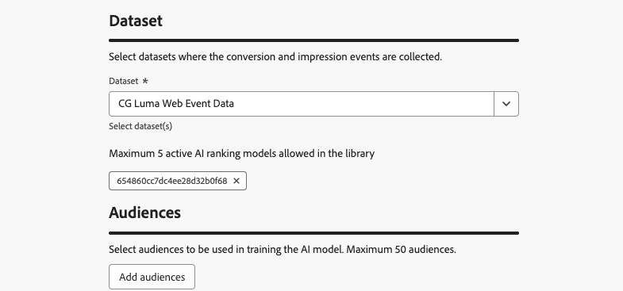

# Build AI models {#create-ai-models}

[!DNL Journey Optimizer] enables you to create **AI models** to rank offers based on your business goals.

>[!CAUTION]
>
>To create, edit, or delete AI models, you must have the **Manage Ranking Strategies** permission. [Learn more](../../administration/high-low-permissions.md#manage-ranking-strategies)

## Create an AI model {#create-ranking-strategy}

>[!CONTEXTUALHELP]
>id="ajo_exd_ai_model_metric"
>title="Optimization metric"
>abstract="[!DNL Journey Optimizer] rank offers based on the **conversion rate** (Conversion rate = Total number of conversion events / Total number of impression events). The conversion rate is calculated using two types of metrics: **Impression events** (offers that are displayed) and **Conversion events** (offers that result in clicks via email or web). These events are automatically captured using the Web SDK or the Mobile SDK that has been provided."

To create an AI model, follow the steps below:

1. Create a dataset where conversion events will be collected. [Learn how](../data-collection/create-dataset.md)

1. Navigate to the **[!UICONTROL Decisioning]** > **[!UICONTROL Strategy setup]** menu and select **[!UICONTROL AI models]**.

    

    All the AI models created so far are listed.

1. Click the **[!UICONTROL Create AI model]** button.

1. Specify a unique name and if needed a description for the AI model.

1. Select the type of AI model you want to create:
    
    * **[!UICONTROL Auto-optimization]** optimizes offers based on past offer performance. [Learn more](auto-optimization-model.md)
    * **[!UICONTROL Personalized optimization]** optimizes and personalizes offers based on audiences and offer performance. [Learn more](personalized-optimization-model.md)

    

1. The **[!UICONTROL Optimization metric]** section provides information on the conversion event used by the AI model to calculate offers' ranking.

    [!DNL Journey Optimizer] rank offers based on the **conversion rate** (Conversion rate = Total number of conversion events / Total number of impression events). The conversion rate is calculated using two types of metrics:
    * **Impression events** (offers that are displayed)
    * **Conversion events** (offers that result in clicks via email or web).

    These events are automatically captured using the Web SDK or the Mobile SDK that has been provided. Learn more in the [Adobe Experience Platform Web SDK](https://experienceleague.adobe.com/docs/experience-platform/edge/home.html) overview.

    +++ Optimizing models on custom [!DNL Customer Journey Analytics] metrics

    >[!NOTE]
    >
    >This capability is only available to [!DNL Customer Journey Analytics] customers with admin rights.
    >
    >Before starting, make sure you have integrated Journey Optimizer with Customer Journey Analytics in order export Journey Optimizer datasets into your default data views. [Learn how to leverage [!DNL Journey Optmizer] data in [!DNL Customer Journey Analytics]](../../reports/cja-ajo.md)

    **[!UICONTROL Personalized optimization]** models are a type of AI model that allow you to define business goals and utilizes customer data to train business-oriented models to serve personalized offers and maximize KPIs.

    By default, personalized optimization models use **offer clicks** as the optimization metric. If you are working with [!DNL Customer Journey Analytics], [!DNL Decisioning] allows you to leverage your own custom metrics to optimize your model on.

    To do this, select the **[!UICONTROL Personalized optimization]** model type and expand the **[!UICONTROL Conversion event]** drop-down. All metrics from your default [!DNL Customer Journey Analytics] [data view](https://experienceleague.adobe.com/en/docs/analytics-platform/using/cja-dataviews/data-views){target="_blank"} display in the list. Select the metric that you want to optimize your model on.

    {width=85%}

    >[!NOTE]
    >
    >By default, metrics in [!DNL Customer Journey Analytics] use a "Last Touch" attribution model, which assigns 100% of the credit to the touchpoint that occurs most recently before conversion.
    >
    >While it is possible to modify the attribution model, not all attribution models are ideal for AI model optimization. We recommend carefully selecting an attribution model that aligns with your optimization goals to ensure model accuracy and performance.
    >
    >For more details on available attribution models and guidance on their use, refer to the [[!DNL Customer Journey Analytics] documentation](https://experienceleague.adobe.com/en/docs/analytics-platform/using/cja-dataviews/component-settings/attribution){target="_blank"}

    +++

1. Select the dataset(s) where the conversion and impression events are collected. Learn how to create such datasets in [this section](../data-collection/create-dataset.md).

    {width=85%}
    
    >[!CAUTION]
    >
    >Only the datasets created from schemas associated with the **[!UICONTROL Experience Event - Proposition Interactions]** field group (previously known as mixin) are displayed in the drop-down list.

1. If you are creating a **[!UICONTROL Personalized optimization]** AI model, select the segment(s) to use to train the AI model. 

    <!--➡️ [Discover this feature in video](#video)-->

    >[!NOTE]
    >
    >You can select up to 5 audiences.

1. Save and activate the AI model.

<!--At this point, you must have:

* created the AI model,
* defined which type of event you want to capture - offer displayed (impression) and/or offer clicked (conversion),
* and in which dataset you want to collect the event data.-->

Now each time an offer is displayed and/or clicked, you want the corresponding event to be automatically captured by the **[!UICONTROL Experience Event - Proposition Interactions]** field group using the [Adobe Experience Platform Web SDK](https://experienceleague.adobe.com/docs/experience-platform/edge/web-sdk-faq.html#what-is-adobe-experience-platform-web-sdk%3F){target="_blank"} or Mobile SDK.

To be able to send in event types (offer displayed or offer clicked), you must set the correct value for each event type in an experience event that is sent into Adobe Experience Platform. [Learn how](../data-collection/schema-requirement.md)

<!--
## How-to video {#video}

Learn how to create a personalized optimization model and how to apply it to a decision.

>[!VIDEO](https://video.tv.adobe.com/v/3419954?quality=12)-->
