# Create ranking formulas {#create-ranking-formulas}

>[!BEGINSHADEBOX]

**On this page:** Create ranking formulas with the AI formula builder that combine AI model scores, offer priorities, profile attributes, and contextual signals, so you can control which offer is presented first and align decisioning with both your business goals and your customers' needs.

>[!ENDSHADEBOX]

**Ranking formulas** allow you to define rules that determine which offer should be presented first, rather than taking into account the priority scores.

To create these rules, the AI formula builder in **[!UICONTROL Adobe Journey Optimizer]** provides greater flexibility and control in how offers are ranked. Instead of relying only on a static offer priority, you can now define custom ranking formulas that combine AI model scores, offer priorities, profile attributes, offer attributes, and contextual signals through a guided interface.

This approach allows you to dynamically adjust offer ranking based on any combination of AI-driven propensity, business value, and real-time context, making it easier to align decisioning with both marketing goals and customer needs. The AI formula builder supports simple or advanced formulas depending on how much control you want to apply.

Once a ranking formula has been created, you can assign it to a [selection strategy](../selection-strategies.md). If multiple offers are eligible to be presented when using this selection strategy, the decisioning engine will use the selected formula to calculate which offer to deliver first.

➡️ [Discover this feature in video](#video)

## Guardrails and limitations {#ranking-guardrails}

Before creating ranking formulas, keep the following constraints in mind:

* The AI formula builder does not support [personalized optimization models](personalized-optimization-model.md) that use continuous metrics.
* When an AI model is used in a ranking formula, data are not reflected in the [Conversion rate for Holdout and Model Driven traffic](../../reports/campaign-global-report-cja-code.md#conversion-rate) report.
* The nesting depth in a ranking formula is limited to 30 levels, measured by counting `)` in the PQL string.
* A ranking formula string can be up to 8KB for UTF-8 encoded characters (8,000 ASCII characters or 2,000-4,000 non-ASCII characters).
* Lookback periods are not supported in ranking formulas (for example, experience events from the last month). Attempts to save such formulas trigger an error.
* [AI-powered formula optimization](#optimize) applies only to ranking formulas whose code-based PQL expression is larger than **2 KB** in UTF-8 encoded size; smaller formulas are not analyzed.

## Create the ranking formula and set properties {#create-ranking-formula}

>[!CONTEXTUALHELP]
>id="ajo_exd_config_formulas"
>title="Create ranking formulas"
>abstract="Formulas allow you to define rules that will determine which decision item should be presented first, rather than taking into account the items' priority scores. Once a ranking formula has been created, you can assign it to a selection strategy."

To create a ranking formula, follow the steps below.

1. Access the **[!UICONTROL Strategy setup]** menu, then select **[!UICONTROL Ranking formulas]** tab. The list of previously created formulas is displayed.

    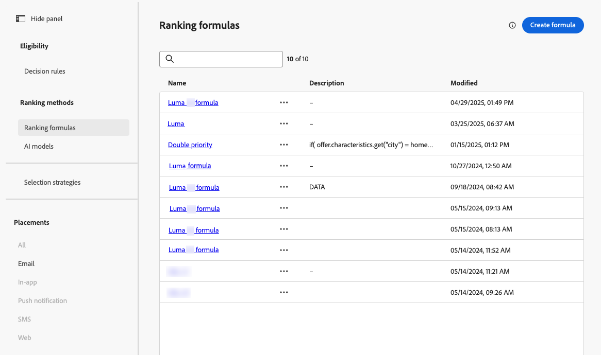

1. Click **[!UICONTROL Create formula]**.

1. Specify the formula name, and add a description if desired.

    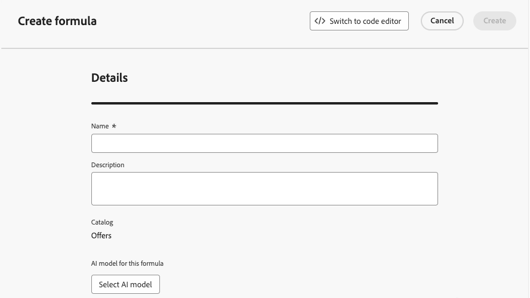{width="80%"}

1. Optionally, click **[!UICONTROL Select AI model]** to set the model that will be used as a reference to build your ranking formula.

    Every time you refer to a model score when defining your formula below, the AI model that you selected will be used.

1. Define the conditions that will determine the ranking score for the matching decision items. You can:

    * Fill in the **[!UICONTROL Criteria]** section using the [formula builder](#ranking-select-criteria), and/or
    * Click **[!UICONTROL Switch to code editor]** to define or refine ranking logic with [PQL in the code editor](#ranking-code-editor).

## Use Adobe Experience Platform data {#aep-data}

In the **[!UICONTROL Dataset lookup]** section, you can use data from Adobe Experience Platform to dynamically adjust the ranking logic to reflect real-world conditions.

This is especially useful for attributes that frequently change, such as product availability or real-time pricing. [Learn how to use Adobe Experience Platform data for decisioning](../aep-data-exd.md)

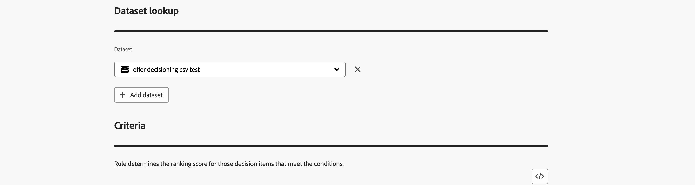

## Define criteria using the formula builder {#ranking-select-criteria}

Define the **criteria** that will determine the ranking score for the matching decision items.

With an intuitive interface, you can fine-tune decisioning by adjusting AI scores (propensity), offer value (priority), contextual levers, and external profile propensities — individually or in combination — to optimize every interaction. <!--Whether you are maximizing revenue, promoting strategic offers, or balancing business goals with real-time context, the formula builder gives you total control in defining ranking strategies.-->

<!--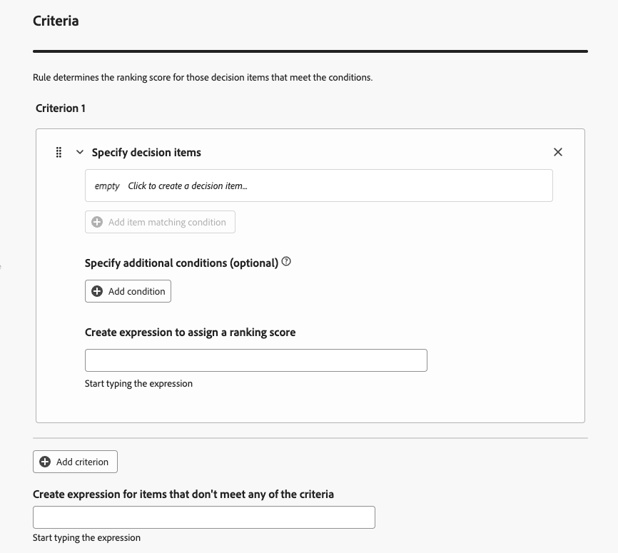{width="80%"}-->

1. If needed, click **[!UICONTROL Switch to code editor]** to add an expression that uses **PQL syntax** alongside the formula builder. This option complements the user interface fields in the steps below, so you can combine both approaches in the same ranking formula. For more on how to use PQL syntax, refer to the [dedicated documentation](https://experienceleague.adobe.com/docs/experience-platform/segmentation/pql/overview.html). Syntax for decision item attributes and copy-paste examples are provided in the [Use the code editor](#ranking-code-editor) section.

    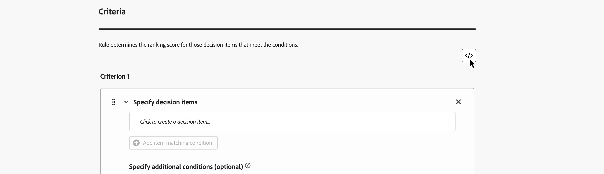

    >[!NOTE]
    >
    >Switching to the code editor adds expression-based input to your criteria and does not remove the other user interface fields.

1. In the **[!UICONTROL Criterion 1]** section, specify the decision items that you want to apply a ranking score to by doing the following:
    * select a [decision item attribute](../items.md#attributes)
    * select a logical operator
    * add a matching condition - you can either type a value, or select a profile attribute or [context data](../context-data.md)

    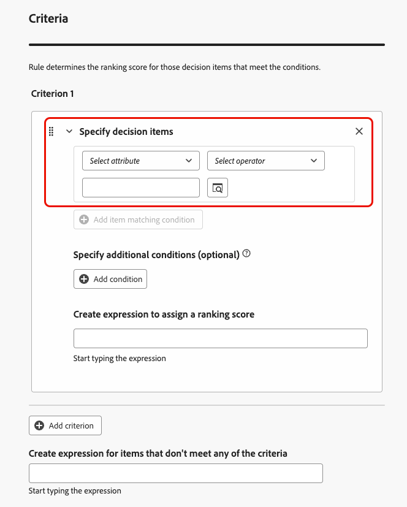{width="70%"}

1. Optionally, you can specify additional elements to refine the matching conditions for your criteria to be true.

    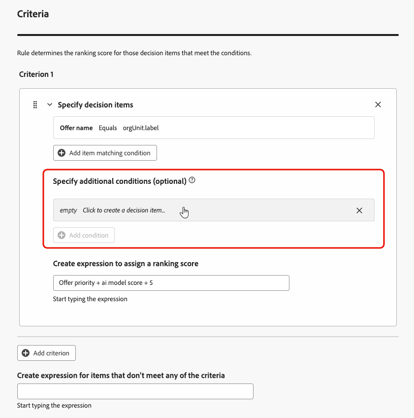{width="80%"}

    For example, you defined Criterion 1 such as the *Weather* custom attribute *Equals* the *warm* condition. Additionally, you can add another condition such as if the first condition is met and if the temperature exceeds 75 degrees at the time of the request, then Criterion 1 is true.<!--Add a screenshot with the example-->

1. Create an expression that will assign a ranking score to the decision items that meet the condition defined above. You can reference any of the following:

    * the score that came out of the AI model that you optionally selected in the **[!UICONTROL Details]** section [above](#create-ranking-formula);
    * the decision item's priority, which is a value manually assigned when [creating a decision item](../items.md#attributes); <!--If a profile qualifies for multiple decision items, a higher priority grants the item precedence over others.-->
    * any attribute that might live on the profile, such as any externally derived propensity score;
    * a static value that you can assign in a free format;
    * any combination of all the above.

    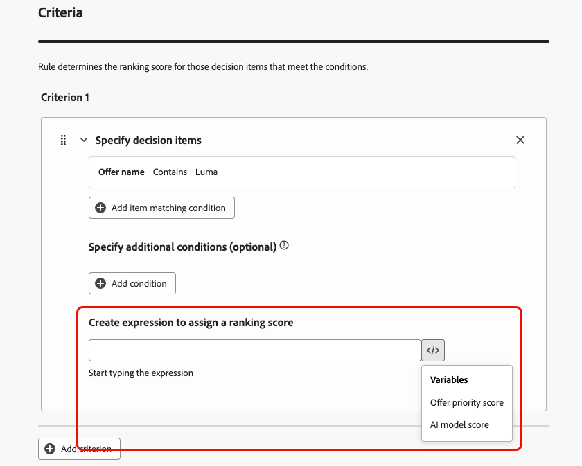{width="70%"}

    >[!NOTE]
    >
    >Click the icon next to the field to add predefined variables.

1. Click **[!UICONTROL Add criterion]** to add one or more criteria as many times as needed. The logic is as follows:
    * If the first criterion is true for a given decision item, it takes precedence over the next ones.
    * If not true, the decisioning engine moves on to the second criterion, and so on.

1. In the last field, you can build an expression that will be assigned to all decision items that do not meet the above criteria.

    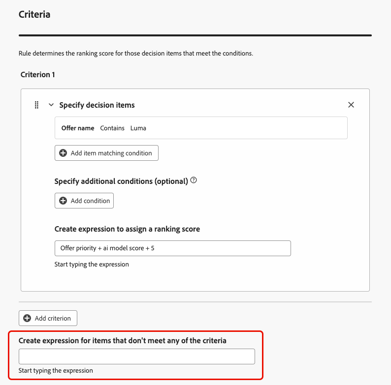{width="70%"}

    +++Ranking formula example

    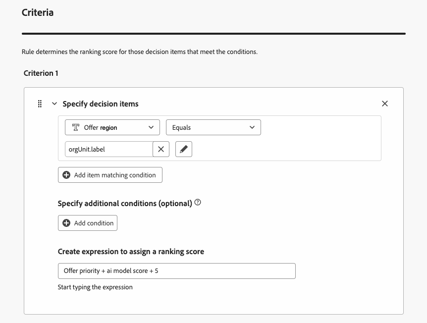{width="80%"}

    If the decision item's region (custom attribute) equals the profile's geographical label (profile attribute), the ranking score expressed here (which is a combination of the decision item priority, the AI model score and a static value) will be applied to all decision items meeting that condition.

    +++

1. When your formula is ready, click **[!UICONTROL Create]**.

You can now access the ranking formula from the list to view its details, and edit or delete it. It is ready to be used in a [selection strategy](../selection-strategies.md) to rank eligible decision items.

## Define criteria using the code editor {#ranking-code-editor}

Use **[!UICONTROL Switch to code editor]** when you want to write or edit ranking logic as a **PQL** expression.

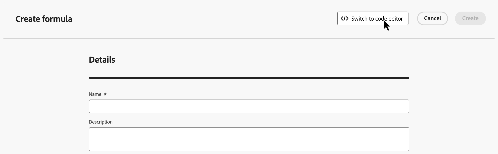

>[!NOTE]
>
>This action will prevent you from reverting back to the default builder view for this formula.

You can leverage profile attributes, [context data](../context-data.md), and [decision item attributes](../items.md#attributes).

For example, you want to boost the priority of all offers with the "hot" attribute if the actual weather is hot. To do this, the **contextData.weather=hot** was passed in the decisioning call.

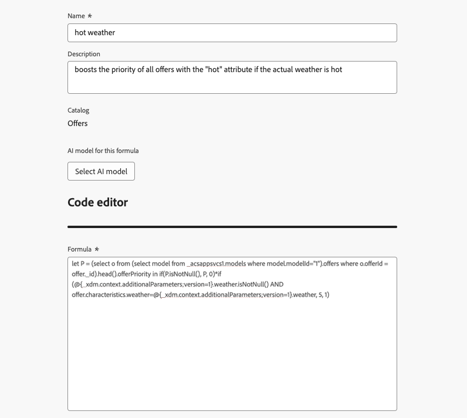{width="80%"}

To leverage attributes related to your decision items in formulas, make sure you follow the correct syntax in your ranking formula's code. Expand each section for more information:

+++Leverage decision items standard attributes

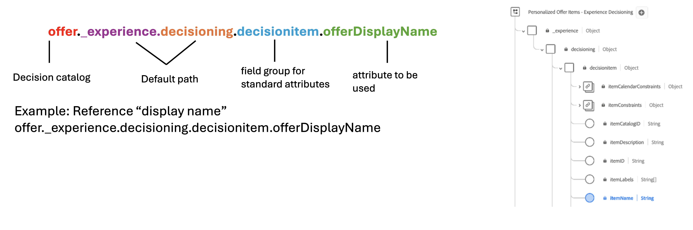

+++

+++Leverage decision items custom attributes

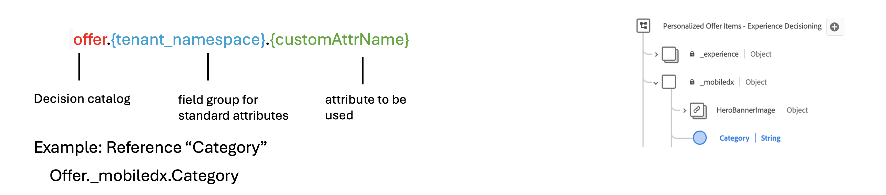

+++

You can create many different code-based ranking formulas according to your needs. Below are some examples.

+++Boost offers with certain offer attribute based on profile attribute

If the profile lives in the city corresponding to the offer, then double the priority for all offers in that city.

**Ranking formula:**

```
if( offer.characteristics.get("city") = homeAddress.city, offer.rank.priority * 2, offer.rank.priority)
```

+++

+++Boost offers where the end date is less than 24 hours from now

**Ranking formula:**

```
if( offer.selectionConstraint.endDate occurs <= 24 hours after now, offer.rank.priority * 3, offer.rank.priority)
```

+++

+++Boost offers based on the customers propensity to purchase the product being offered

You can boost the score for an offer based on a customer propensity score.

In this example, the instance tenant is *_salesvelocity* and the profile schema contains a range of scores stored in an array:

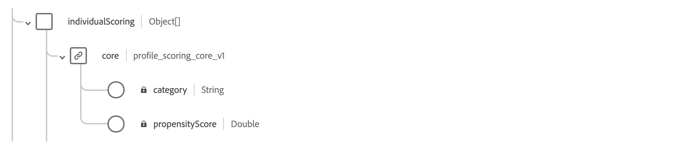

Given this, for a profile such as:

```
{"_salesvelocity": {"individualScoring": [
                    {"core": {
                            "category":"insurance",
                            "propensityScore": 96.9
                        }},
                    {"core": {
                            "category":"personalLoan",
                            "propensityScore": 45.3
                        }},
                    {"core": {
                            "category":"creditCard",
                            "propensityScore": 78.1
                        }}
                    ]}
}
```

+++

+++Boost offers based on a profile's ZIP code and annual income

In this example, the system always tries to show a ZIP-matching offer first, and falls back to a general offer if no match is found, avoiding showing offers meant for other ZIP codes.

``` pql

if( offer._luma.offerDetails.zipCode = _luma.zipCode,luma.annualIncome / 1000 + 10000, if( not offer.luma.offerDetails.zipCode,_luma.annualIncome / 1000, -9999) )

```

What the formula does:

*   If the offer has the same ZIP code as the user, give it a very high score so it gets picked first.
*   If the offer doesn't have a ZIP code at all (it's a general offer), give it a normal score based on the user's income.
*   If the offer has a different ZIP code than the user, give it a very low score so it's not selected.

+++

+++Boost offers based on context data

[!DNL Journey Optimizer] allows you to boost certain offers based on the context data being passed in the call. For example, if the `contextData.weather=hot` is passed, the priority of all offers with `attribute=hot` must be boosted.

>[!NOTE]
>
>For detailed information on how to pass context data<!-- using the **Edge Decisioning** and **Decisioning** APIs-->, refer to [this section](../context-data.md).

Note that when using the **Decisioning** API, the context data is added to the profile element in the request body, such as in the example below:

```
"xdm:profiles": [
{
    "xdm:identityMap": {
        "crmid": [
            {
            "xdm:id": "CRMID1"
            }
        ]
    },
    "xdm:contextData": [
        {
            "@type":"_xdm.context.additionalParameters;version=1",
            "xdm:data":{
                "xdm:weather":"hot"
            }
        }
    ]
    
}],
```

+++

## AI-powered formula optimization {#optimize}

[!DNL Journey Optimizer] can automatically analyze ranking formulas and suggest simplifications that preserve the original logic. Only formulas whose PQL expression is larger than **2 KB** (UTF-8 encoded) are eligible, smaller expressions are not analyzed. When a simplification is found, a red indicator appears next to the formula name in the list.


>[!NOTE]
>
>AI-powered formula optimization relies on the same generative AI capabilities as **Generate Content**, and uses the same access controls. Users must be granted the **[!UICONTROL Generate Content]** permission on the **[!UICONTROL AI Assistant]** resource. For details, refer to [Access Generate Content](../../content-management/gs-generative.md#generative-access).

To optimize a ranking formula:

1. In the ranking formulas list, click the red indicator icon next to the formula name.

1. The **[!UICONTROL Optimize]** window opens, displaying the original PQL expression alongside the AI-suggested version.

    

1. To validate that both expressions produce identical ranking results, click **[!UICONTROL Download Optimisation Analysis (TSV)]** to download a file showing how simulated profiles are evaluated against each version.

1. Once satisfied, click **[!UICONTROL Apply]** to replace the original expression with the optimized one.

## How-to video {#video}

Learn how to use the AI Formula Builder in Adobe Journey Optimizer to create custom offer ranking strategies.

>[!VIDEO](https://video.tv.adobe.com/v/3464446/?learn=on&enablevpops)
