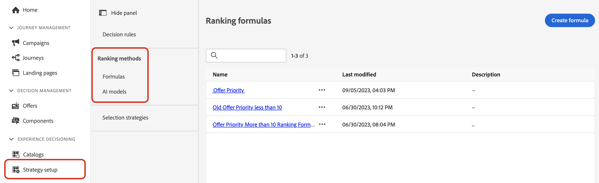

# Ranking methods {#rankings}

Ranking methods allow you to rank items to display for a given profile. Once a ranking method has been created, you can assign it to a selection strategy to define which items should be selected first.

Two types of ranking methods are available:

* **Formulas** allow you to define rules that will determine which item should be presented first, rather than taking into account the item's priority scores.

* **AI models** allow you to use trained model systems that will leverage multiple data points to determine which item should be presented first.

## Create ranking methods {#create}

To create a ranking method, follow these steps:

1. Navigate to the **[!UICONTROL Strategy setup]** menu, then select the **[!UICONTROL Formulas]** or **[!UICONTROL AI models]** menu depending on the type of ranking you want to use.

    

1. Click the **[!UICONTROL Create formula]** or **[!UICONTROL Create AI model]** button in the upper-right corner of the screen.

    Detailed information on how to create ranking formulas and AI models is available in the following sections:

    * [Ranking formulas](ranking-formulas.md)
    * [AI models](ai-models.md)

1. Configure the formula or AI model to suit your needs, then save it.

Your ranking method is now ready to be used in a [selection strategy](../selection-strategies.md) to rank eligible decision items.

