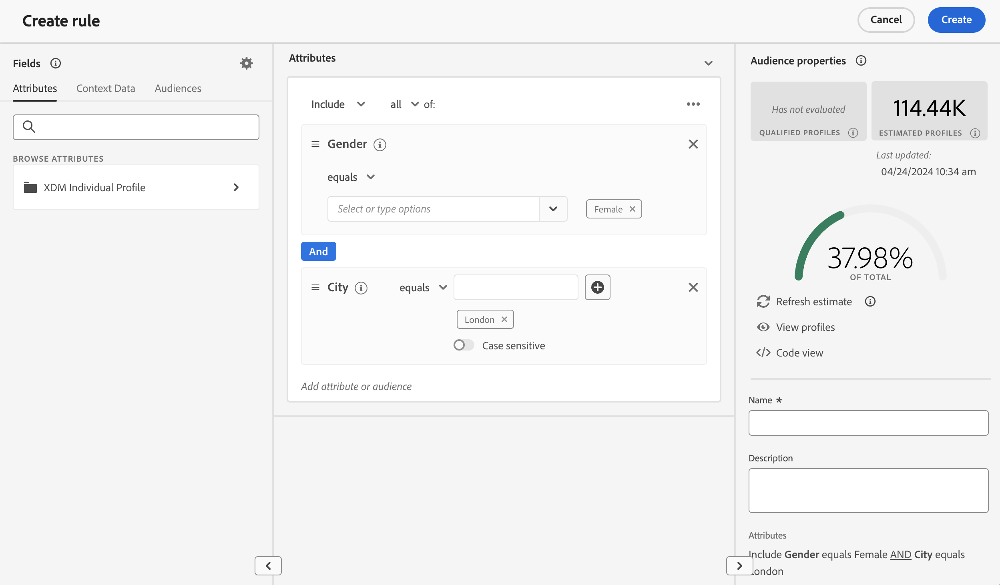

# Decision rules {#rules}

>[!CONTEXTUALHELP]
>id="ajo_exd_config_rules"
>title="Create decision rules"
>abstract="Decision rules allow you to define the audience for decision items by applying constraints, either directly at the decision item level or within a specific selection strategy. This enables you to precisely control which items should be presented to whom."

## About decision rules {#about}

Decision rules allow you to define the audience for decision items by applying constraints, either directly at the decision item level or within a specific selection strategy. This enables you to precisely control which items should be presented to whom.

For instance, let's consider a scenario where you have decision items featuring Yoga-related products designed for women. With decision rules, you can specify that these items should only be displayed to profiles whose gender is 'Female' and who have indicated a 'Point of Interest' in 'Yoga'.

>[!NOTE]
>
>In addition to item and selection strategy level decision rules, you can also define your intended audience at the campaign level. [Learn more](../campaigns/create-campaign.md#audience)

The list of decision rules is accessible in the **[!UICONTROL Strategy setup]** menu.

## Create a decision rule {#create}

To create a decision rule, follow these steps:

1. Navigate to **[!UICONTROL Strategy setup]** / **[!UICONTROL Decision rules]** then click **[!UICONTROL Create rule]** button.

1. The decision rules creation screen opens. Name your rule and provide a description.

1. Build the decision rule to suit your needs using the Adobe Experience Platform Segment Builder. To do this, tou can leverage various data sources such as profile attributes, audiences, or context data coming from Adobe Experience Platform. [Learn how to leverage context data](#context-data)

    

    >[!NOTE]
    >
    >The Segment Builder provided to create decision rules presents some specificities compared to the one used with the Adobe Experience Platform Segmentation service.  However, the global process described in the documentation is still valid to build decisions rules. [Learn how to build segment definitions](../audience/creating-a-segment-definition.md)

1. As you are adding and configuring new fields in the workspace, the **[!UICONTROL Audience properties]** pane displays information on the estimated profiles belonging to the audience. Click **[!UICONTROL Refresh estimate]** to update data.

    >[!NOTE]
    >
    >Profile estimates are unavailable when rule parameters include data not in the profile such as context data.

1. Once your decision rule is ready, click **[!UICONTROL Save]**. The created rule appears in the list and is available for use in decision items and selection strategies to govern the presentation of decision items to profiles.

    >[!NOTE]
    >
    >The nesting depth in an eligibility rule is limited to 30 levels. This is measured by counting the `)` closing parentheses in the PQL string. A rule string can be up to 15KB in size for UTF-8 encoded characters. This is equivalent to 15,000 ASCII characters (1 byte each), or 3,750–7,500 non-ASCII characters (2–4 bytes each). [Learn more on Decisioning guardrails & limitations](gs-experience-decisioning.md#guardrails)
