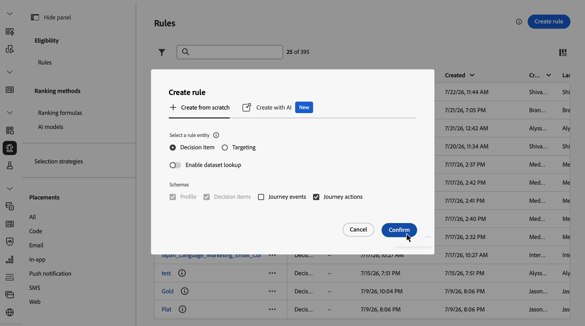
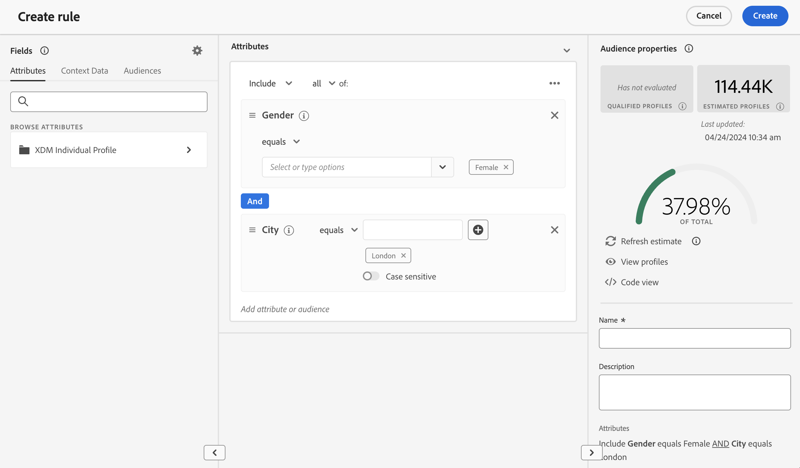

# Build rules {#rules}

>[!CONTEXTUALHELP]
>id="ajo_exd_config_rules"
>title="Create rules"
>abstract="You can create two types of rules: **decision rules** that can be used in decision items or selection strategies, to control which items should be presented to which audience, or **targeting rules** to determine specific audience segments eligible to receive personalized content, or to enter a specific journey path.  When creating a decision rule, you can select **[!UICONTROL Enable dataset lookup]** to use Adobe Experience Platform data. This allows you to define eligibility criteria based on dynamic, external attributes, ensuring decision items are only shown when relevant."

## About rules {#about}

In [!DNL Journey Optimizer], you can create two types of reusable rules:

* [Decision rules](#decision-rules)
* [Targeting rules](#targeting-rules)

### Decision rules {#decision-rules}

Decision rules allow you to define the audience for decision items by applying constraints, either directly at the decision item level, or within a specific selection strategy. This enables you to precisely control which items should be presented to whom.

For instance, let's consider a scenario where you have decision items featuring Yoga-related products designed for women. With decision rules, you can specify that these items should only be displayed to profiles whose gender is 'Female' and who have indicated a 'Point of Interest' in 'Yoga'.

>[!NOTE]
>
>In addition to item and selection strategy level decision rules, you can also define your intended audience at the campaign level. [Learn more](../campaigns/create-campaign.md#audience)

### Targeting rules {#targeting-rules}

>[!AVAILABILITY]
>
>Targeting rules are currently in Limited Availability. Contact your Adobe representative to gain access.
>
>Please note this capability is only available to organizations that have purchased the **Decisioning** add-on offering. It will be progressively rolled out to all customers.

Targeting rules allow to determine specific qualifications that must be met for a customer to be eligible to receive personalized content or to enter a specific journey path, based on specific audience segments, which enables you to target sub-audiences in your journeys and campaigns.

Many times, they are a combination of multiple attributes, in addition to customer behavior events and context data. To save you time and effort, you can create targeting rules once and reuse them across your journeys and campaigns, with the ability to quickly modify them inline at the time of authoring.

You can use these rules either:

* When creating [content optimization targeting](../campaigns/campaigns-message-optimization.md#targeting) in journeys or campaigns;
* When building [journey path optimization](../building-journeys/path-targeting.md).

➡️ [Discover this feature in video](#video)

## Access rules {#access}

The list of rules is accessible in the **[!UICONTROL Decisioning]** > **[!UICONTROL Strategy setup]** menu.

The following actions are available:

* You can filter on the rule entity (**[!UICONTROL Decision item]** or **[!UICONTROL Targeting]** - [Learn more](#about)).

* Select a rule by clicking its name and edit it using the rule builder. [Learn how](#create)

* From the **[!UICONTROL More actions]** button located next to each item, you can:

    * If you selected the **[!UICONTROL Decision item]** entity, add the rule to a package in order to export it to another sandbox. Learn how to [export objects to another sandbox](../configuration/copy-objects-to-sandbox.md).
    * Duplicate a rule.
    * Delete a rule.

{width=100%}

* Click the **[!UICONTROL More info]** icon to display the formula that makes up the rule.

{width=60%}

## Create a rule {#create}

To create a rule, follow these steps:

1. Navigate to **[!UICONTROL Decisioning]** > **[!UICONTROL Strategy setup]** > **[!UICONTROL Rules]**, then click the **[!UICONTROL Create rule]** button.

1. Select the rule entity to specify which type of object the rule is being created for.

    {width=90%}

    * **[!UICONTROL Decision item]** - The rule can be applied on a [decision item](#decision-rules) in the context of Decisioning;
    * **[!UICONTROL Targeting]** - The rule can be used when building [targeting](#targeting-rules) rules, either as part of [content optimization](../campaigns/campaigns-message-optimization.md#targeting) in a campaign or a journey, either in the [Optimize journey activity](../building-journeys/path-targeting.md).

1. If you create a **[!UICONTROL Decision item]** rule, you can select **[!UICONTROL Enable dataset lookup]** to use data from Adobe Experience Platform to enrich your decision logic with external data. This is especially useful for attributes that frequently change, such as product availability, or real-time pricing. [Learn how to use Adobe Experience Platform data for decisioning](../experience-decisioning/aep-data-exd.md)

1. The rule creation screen opens. Name your rule and provide a description.

1. Build the rule to suit your needs using the Adobe Experience Platform Segment Builder. To do this, you can leverage various data sources such as:
    * Profile attributes;
    * Decision item attributes - only available when creating a **[!UICONTROL Decision item]** rule;
    * Audiences;
    * Context data coming from Adobe Experience Platform. [Learn how to leverage context data](context-data.md)

    {width=85%}

    >[!NOTE]
    >
    >The Segment Builder provided to create rules presents some specificities compared to the one used with the Adobe Experience Platform Segmentation service. However, the global process described in the documentation is valid to build rules in [!DNL Journey Optimizer]. [Learn how to build segment definitions](../audience/creating-a-segment-definition.md)

1. As you are adding and configuring new fields in the workspace, the **[!UICONTROL Audience properties]** pane displays information on the estimated profiles belonging to the audience. Click **[!UICONTROL Refresh estimate]** to update data.

    {width=85%}

    >[!NOTE]
    >
    >Profile estimates are unavailable when the rule parameters include data that are not stored in the profile, such as context data.

1. Once your rule is ready, click **[!UICONTROL Create]**. The created rule appears in the list and, according to the entity you created, is available for use:

    * In **decision items** and **selection strategies** to govern the presentation of decision items to profiles;
    * Or when building **targeting** in content optimization or path optimization.

>[!NOTE]
>
>The nesting depth in a rule is limited to 30 levels. This is measured by counting the closing parentheses `)` in the PQL string.
>
>A rule string can be up to 15KB in size for UTF-8 encoded characters. This is equivalent to 15,000 ASCII characters (1 byte each), or 3,750–7,500 non-ASCII characters (2–4 bytes each).
>
>[Learn more about Eligibility rules Guardrails & limitations](decisioning-guardrails.md#eligibility-rules)

## How-to video {#video}

Learn how to create, duplicate, and apply reusable **targeting rules** in Adobe Journey Optimizer to efficiently personalize campaigns based on customer attributes like region, language, and behavior—saving time while enhancing audience precision.

>[!VIDEO](https://video.tv.adobe.com/v/3476127/?quality=12)
