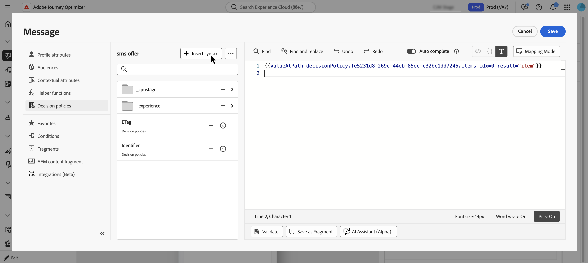
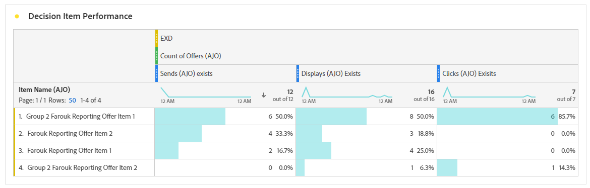

# Use decision policies in messages {#create-decision}

Once you've added a decision policy to your content, you can use attributes from returned decision items for personalization. To do so, first insert the decision policy code into your content.

>[!CAUTION]
>
>Decision policies are available to all customers for the **Code-based Experience**, **SMS**, and **Push notification** channels.
>
>Decisioning for the **Email** channel is available in Limited Availability only. To request access, contact your Adobe representative. Learn more about [availability labels](../rn/releases.md#availability-labels).

## Insert the decision policy code {#insert}

>[!BEGINTABS]

>[!TAB Code-based Experience]

1. Edit your code-based experience and navigate to **[!UICONTROL Decision policy]**.

2. Select **[!UICONTROL Insert policy]** to add the decision policy code.  

   

>[!NOTE]
>
>For code-based experiences, if your decision policy contains decision items including fragments, you can leverage these fragments in the decision policy code. [Learn how to leverage fragments](fragments-decision-policies.md)

>[!TAB Email]

1. Open the **Personalization Editor** and navigate to **[!UICONTROL Decision policies]**.

2. Select **[!UICONTROL Insert syntax]** to add the code for your decision policy.

   

   >[!NOTE]
   >
   >If the insertion option doesn't appear, a decision policy might already be configured for the parent component.

3. If no placement has been assigned yet to the component, select one from the list and click **[!UICONTROL Assign]**.  

   

>[!TAB SMS]

1. Open the **Personalization Editor** and navigate to **[!UICONTROL Decision policies]**.

2. Select **[!UICONTROL Insert syntax]** to add the code for your decision policy.

   

>[!TAB Push]

1. Open the **Personalization Editor** and navigate to **[!UICONTROL Decision policies]**.

2. Select **[!UICONTROL Insert syntax]** to add the code for your decision policy.

   

>[!IMPORTANT]
>
>Experience Decisioning with push notifications requires a specific version of the Mobile SDK. Before implementing this feature, check the [release notes](https://developer.adobe.com/client-sdks/home/release-notes/){target="_blank"} to identify the required version and ensure you have upgraded accordingly. You can also view all available SDK versions for your platform in [this section](https://developer.adobe.com/client-sdks/home/current-sdk-versions/){target="_blank"}.

>[!ENDTABS]

The decision policy code is added. You can now use attributes from the returned decision items to personalize your content.

>[!NOTE]
>
>For code-based experience and email channels, repeat this sequence once per decision item you want returned. For example, if you chose to return 2 items when [creating the decision](create-decision-policy.md), repeat the sequence twice. For SMS and Push channels, only one decision item can be returned.

## Personalize with decision item attributes {#attributes}

After you've added the code for a decision policy in your content, all attributes from the returned decision items become available for personalization. [Learn how to work with personalization](../personalization/personalize.md).

Attributes are stored in the "Offers" [catalog schema](catalogs.md). They display in the following folders from the personalization editor:
* **Custom attributes**: `_\<imsOrg\>` folder 
* **Standard attributes**: `_experience` folder

Decision item attributes and contextual attributes are not supported by default in [!DNL Journey Optimizer] fragments. However, you can use global variables instead, such as described below.

To add an attribute, click the **`+`** icon next to the attribute. You can add as many attributes as needed. You can also include other personalization attributes, such as profile data.

* For **Email** and **Code-based** channels, wrap the attributes within the `#each` loop using square brackets `[ ]`, and add a comma before the closing `/each` tag.

   +++See example

   

   +++

* For **SMS** and **Push** channels, make sure you insert attributes after the syntax code for the decision policy. This syntax should always be kept at line 1.

   +++See example

   

   +++

   >[!NOTE]
   >If you insert an image asset attribute in SMS or Push content (for example, in the title or body), the attribute value displays as a URL. The image itself is not rendered in those fields.

* To enable decision item tracking, add the `trackingToken` attribute: `trackingToken: {{item._experience.decisioning.decisionitem.trackingToken}}`

## Preview & test your content

After building your content, preview and test it before activating your journey or campaign. Decision items render based on selected profiles in the simulation interface. [Learn how to preview and test content](../content-management/preview-test.md).  

## Next steps {#final-steps}

Once your content is ready, review and publish your campaign or journey:

* [Publish a journey](../building-journeys/publish-journey.md)
* [Review and activate a campaign](../campaigns/review-activate-campaign.md)

For code-based experiences, as soon as your developer makes an API or SDK call to fetch content for the surface defined in your channel configuration, the changes will be applied to your web page or app.

>[!NOTE]
>
>You currently can't simulate decision-based content for [Code-based experience](../code-based/create-code-based.md) campaigns or journeys. A workaround is available [here](../code-based/code-based-decisioning-implementations.md).

## Use reporting dashboards

To see how your decisions are performing, you can view out-of-the-box decisioning metrics in the campaign or journey report, or build custom Customer Journey Analytics dashboards to measure performance and gain insights into how your decision policies and offers are delivered and engaged with. [Learn more about Decisioning reporting](cja-reporting.md).

