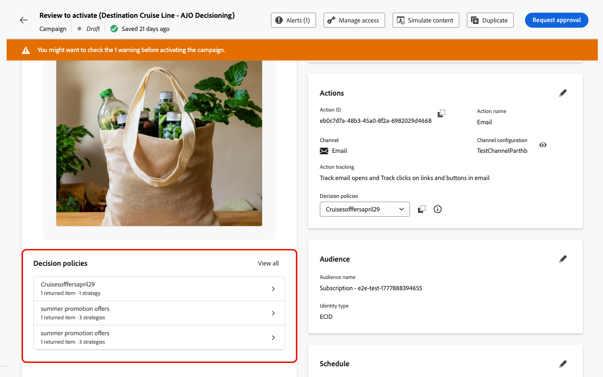
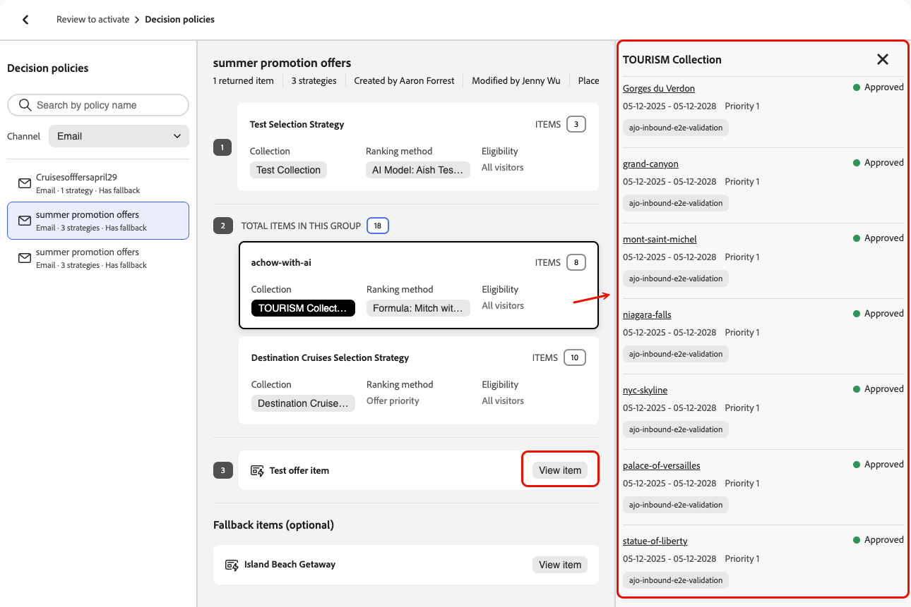

# Use decision policies in messages {#create-decision}

Once you've added a decision policy to your content, you can use attributes from returned decision items for personalization. To do so, first insert the decision policy code into your content.

>[!CAUTION]
>
>Decision policies are available to all customers for the **Code-based Experience**, **SMS**, **Push notification**, and **Email** channels.

## Insert the decision policy code {#insert}

>[!BEGINTABS]

>[!TAB Code-based Experience]

1. Edit your code-based experience and navigate to **[!UICONTROL Decision policy]**.

2. Select **[!UICONTROL Insert policy]** to add the decision policy code.  

   

>[!NOTE]
>
>For code-based experiences, if your decision policy contains decision items including fragments, you can leverage these fragments in the decision policy code. [Learn how to leverage fragments](fragments-decision-policies.md)

>[!TAB Email]

1. Open the **Personalization Editor** and navigate to **[!UICONTROL Decision policies]**.

2. Select **[!UICONTROL Insert syntax]** to add the code for your decision policy.

   

   >[!NOTE]
   >
   >If the insertion option doesn't appear, a decision policy might already be configured for the parent component.

3. If no placement has been assigned yet to the component, select one from the list and click **[!UICONTROL Assign]**.

   

   >[!NOTE]
   >
   >If you use multiple decision policies in the same email (for example, one for the header and one for the footer), the same offer is deduplicated across placements: it is not rendered twice. The second decision policy will not return any content and will display a blank space, unless you have configured a fallback offer, in which case the fallback will be displayed instead.

You can also insert the decision policy code when using the **[!UICONTROL Code your own]** mode in the Email Designer. Navigate to **[!UICONTROL Decision policies]** and select **[!UICONTROL Insert syntax]** — the placement selection UI will appear so you can assign a placement directly. [Learn how to code your own email content](../email/code-content.md).

>[!AVAILABILITY]
>
>Inserting decision policies in **[!UICONTROL Code your own]** mode is in Limited Availability.

>[!NOTE]
>
>In **[!UICONTROL Code your own]** mode, only one decision item can be returned per policy, because the **[!UICONTROL Repeat Grid]** component is not available.

>[!TAB SMS]

1. Open the **Personalization Editor** and navigate to **[!UICONTROL Decision policies]**.

2. Select **[!UICONTROL Insert syntax]** to add the code for your decision policy.

   

>[!TAB Push]

1. Open the **Personalization Editor** and navigate to **[!UICONTROL Decision policies]**.

2. Select **[!UICONTROL Insert syntax]** to add the code for your decision policy.

   

>[!IMPORTANT]
>
>Experience Decisioning with push notifications requires a specific version of the Mobile SDK. Before implementing this feature, check the [release notes](https://developer.adobe.com/client-sdks/home/release-notes){target="_blank"} to identify the required version and ensure you have upgraded accordingly. You can also view all available SDK versions for your platform in [this section](https://developer.adobe.com/client-sdks/home/current-sdk-versions){target="_blank"}.

>[!ENDTABS]

The decision policy code is added. You can now use attributes from the returned decision items to personalize your content.

>[!NOTE]
>
>For code-based experience and email channels, repeat this sequence once per decision item you want returned. For example, if you chose to return 2 items when [creating the decision](create-decision-policy.md), repeat the sequence twice. For SMS and Push channels, only one decision item can be returned.

## Personalize with decision item attributes {#attributes}

After you've added the code for a decision policy in your content, all attributes from the returned decision items become available for personalization. [Learn how to work with personalization](../personalization/personalize.md).

Attributes are stored in the "Offers" [catalog schema](catalogs.md). They display in the following folders from the personalization editor:
* **Custom attributes**: `_\<imsOrg\>` folder 
* **Standard attributes**: `_experience` folder

Decision item attributes and contextual attributes are not supported by default in [!DNL Journey Optimizer] fragments. However, you can use global variables instead, such as described below.

To add an attribute, click the **`+`** icon next to the attribute. You can add as many attributes as needed. You can also include other personalization attributes, such as profile data.

* For **Email** and **Code-based** channels, wrap the attributes within the `#each` loop using square brackets `[ ]`, and add a comma before the closing `/each` tag.

   +++See example

   

   +++

* For **SMS** and **Push** channels, make sure you insert attributes after the syntax code for the decision policy. This syntax should always be kept at line 1.

   +++See example

   

   +++

   >[!NOTE]
   >If you insert an image asset attribute in SMS or Push content (for example, in the title or body), the attribute value displays as a URL. The image itself is not rendered in those fields.

* To enable decision item tracking, add the `trackingToken` attribute: `trackingToken: {{item._experience.decisioning.decisionitem.trackingToken}}`

## Preview & test your content

After building your content, preview and test it before activating your journey or campaign. Decision items render based on selected profiles in the simulation interface. [Learn how to preview and test content](../content-management/preview-test.md).

## Next steps {#final-steps}

Once your content is ready, review and publish your campaign or journey:

* [Publish a journey](../building-journeys/publish-journey.md)
* [Review and activate a campaign](../campaigns/review-activate-campaign.md)

For code-based experiences, as soon as your developer makes an API or SDK call to fetch content for the surface defined in your channel configuration, the changes will be applied to your web page or app.

## View decision policy details from the campaign summary {#decision-policy-summary}

When an action or API-triggered [campaign](../campaigns/get-started-with-campaigns.md) uses decision policies in its content, the campaign summary page displays a **[!UICONTROL Decision policies]** section listing all policies used in the campaign.

You can also access each decision policy's technical details and copy them to the clipboard, which can be useful to troubleshoot issues with Adobe Support or your engineering team.

To access decision policy details and technical information, follow the steps below.

1. Open the campaign summary by clicking **[!UICONTROL Review to activate]** during [configuration](../campaigns/review-activate-campaign.md#action-campaign-review), or by opening a campaign from the **[!UICONTROL Campaigns]** list.

1. In the **[!UICONTROL Decision policies]** section, all the policies used in the campaign are listed.

    

1. Select a decision policy or click **[!UICONTROL View all]**. You can review the details for each policy, including:

    * The strategies used in the decision policy
    * The number of items to return
    * The collection, ranking method et eligibility rules used for each selection strategy
    * The fallback offer used if no decision item is eligible

    

1. Click a collection to display all the decision items that it contains.
    
1. Click a decision item to access its details and edit it if needed - it opens in a new browser tab. Alternatively, click **[!UICONTROL View item]** to display decision items that are not in a collection.

    

1. You can also view information about the ranking methods and eligibility rules used for each selection strategy.

    {width="80%"}

1. Back in the campaign summary, you can also select a decision policy from the **[!UICONTROL Actions]** section and click the **Information** icon to access the decision policy's technical details.

    

1. Click the **Copy to clipboard** icon to copy a JSON representation of the decision policy to the clipboard.

    The copied JSON includes your organization name and ID, sandbox name, decision policy ID, and the full decision policy structure. You can share this information with Adobe Support or your engineering team to troubleshoot decision policy issues faster.

## Use reporting dashboards

To see how your decisions are performing, you can view out-of-the-box decisioning metrics in the campaign or journey report, or build custom Customer Journey Analytics dashboards to measure performance and gain insights into how your decision policies and offers are delivered and engaged with. [Learn more about Decisioning reporting](cja-reporting.md).

