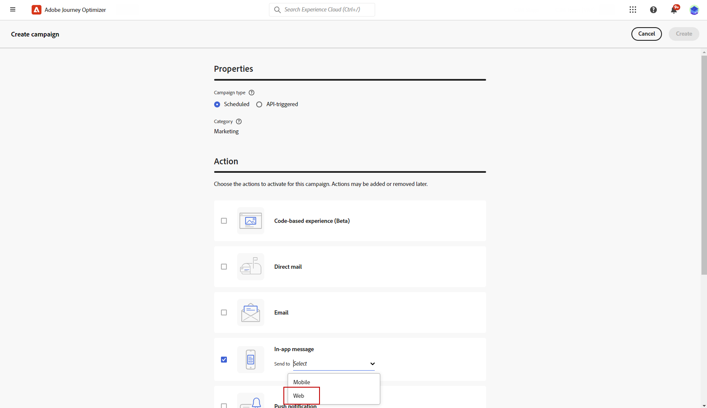
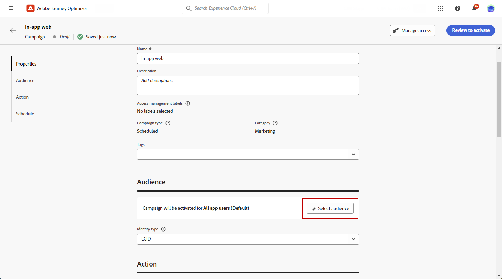
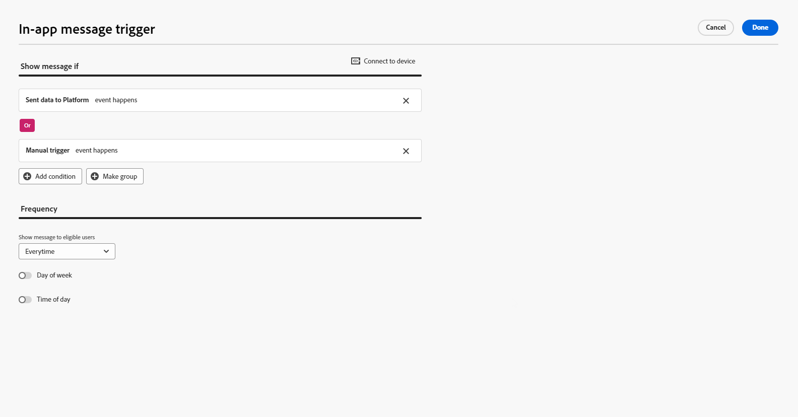
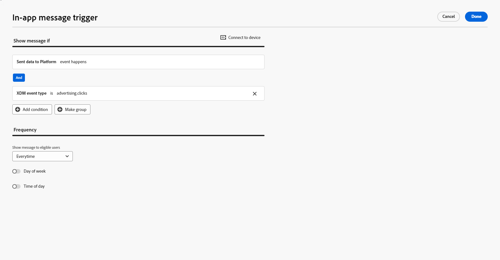
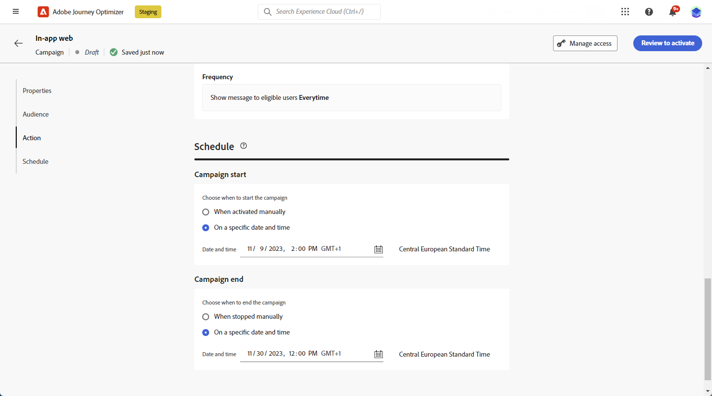
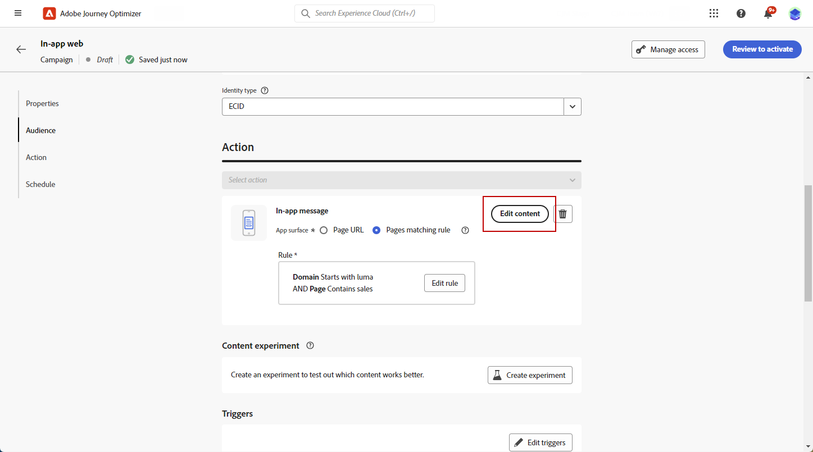

# Create a Web In-app message {#create-in-app-web}

>[!BEGINSHADEBOX]

**On this page:** Learn how to create a Web in-app message campaign in Adobe Journey Optimizer, from configuring the channel to defining the audience, triggers, and content.

>[!ENDSHADEBOX]

## Configure the Web In-app channel {#configure-web-inapp}

To set up your Web In-app channel, follow the steps below:

* Install the Web SDK tag extension to support Web In-app Messaging. [Learn more](https://experienceleague.adobe.com/docs/experience-platform/tags/extensions/client/web-sdk/web-sdk-extension-configuration.html){target="_blank"}

* Customize your triggers. Web In-app Messaging supports two types of triggers: Sent data to platform and Manual triggers. [Learn more](https://experienceleague.adobe.com/docs/experience-platform/edge/personalization/ajo/web-in-app-messaging.html){target="_blank"}

* Create your Web In-app configuration. [Learn more](inapp-configuration.md)

## Create your Web In-app message campaign {#create-inapp-web-campaign}

1. Access the **[!UICONTROL Campaigns]** menu, then click **[!UICONTROL Create campaign]**.

1. Choose your campaign execution type: Scheduled or API-triggered. Learn more about campaign types on [this page](../campaigns/create-campaign.md#campaigntype).

1. From the **[!UICONTROL Actions]** drop-down, choose the **[!UICONTROL In-app message]**. 

    

1. Choose or create your app configuration. [Learn more](inapp-configuration.md#channel-prerequisites)

## Define your Web In-app message campaign {#configure-inapp}

1. From the **[!UICONTROL Properties]** section, enter the **[!UICONTROL Title]** and the **[!UICONTROL Description]** description.

1. To assign custom or core data usage labels to the In-app message, select **[!UICONTROL Manage access]**. [Learn more](../administration/object-based-access.md).

1. Click the **[!UICONTROL Select audience]** button to define the audience to target from the list of available Adobe Experience Platform audiences. [Learn more](../audience/about-audiences.md).

    

1. In the **[!UICONTROL Identity namespace]** field, choose the namespace to use in order to identify the individuals from the selected audience. [Learn more](../event/about-creating.md#select-the-namespace).

1. In the **[!UICONTROL Action]** menu, you can find the settings previously configured as **[!UICONTROL App configuration]**. You can make changes here if necessary or update your rule by clicking **[!UICONTROL Edit Rule]**.

1. Click **[!UICONTROL Create experiment]** to start configuring your content experiment and create treatments to measure their performance and identify the best option for your target audience. [Learn more](../content-management/content-experiment.md)

1. Click **[!UICONTROL Edit triggers]** to choose the event(s) and criteria that will trigger your message. Rule builders enable users to specify criteria and values that, when met, trigger a set of actions, such as sending an in-app message.

    1. Click the event drop-down to change your Trigger if needed.

        +++See available Triggers.
        
        | Package | Trigger | Definition |
        |---|---|---|
        | Platform | Sent data to Platform | Triggered when the mobile app issues an edge experience event to send data to Adobe Experience Platform. Usually the API call [sendEvent](https://developer.adobe.com/client-sdks/documentation/edge-network/api-reference/#sendevent){target="_blank"} from the AEP Edge extension.|
        | Manual | Manual trigger | Two associated data elements: a key, which is a constant that defines the data set (e.g., gender, color, price), and a value, which is a variable that belongs to the set (e.g., male/female, green, 100). |

        +++

    1. Click **[!UICONTROL Add condition]** if you want the trigger to consider multiple events or criteria.

    1. Choose the **[!UICONTROL Or]** condition if you want to add more **[!UICONTROL Triggers]** to further expand your rule.

        

    1. Choose the **[!UICONTROL And]** condition if you want to add a custom **[!UICONTROL Trait]** and better fine-tune your rule.

        +++See available Traits.
        
        | Package | Trait | Definition |
        |---|---|---|
        | Platform | XDM event type | Triggered when the specified Event type is met. |
        | Platform | XDM value | Triggered when the specified XDM value is met.|
        
        +++

        

    1. Click **[!UICONTROL Make group]** to group triggers together.

1. Choose the frequency of your trigger when your In-app message is active. The following options are available:

    * **[!UICONTROL Everytime]**: Always show the message when the events selected in the **[!UICONTROL Mobile app trigger]** drop-down occur.
    * **[!UICONTROL Once]**: Only show this message the first time the events selected in the **[!UICONTROL Mobile app trigger]** drop-down occur.
    * **[!UICONTROL Until click through]**: Show this message when the events selected in the **[!UICONTROL Mobile app trigger]** drop-down occur until an interact event is sent by the SDK with an action of "clicked".
    * **[!UICONTROL X number of times]**: Show this message X time.

1. If needed, choose which **[!UICONTROL Day of the week]** or **[!UICONTROL Time of day]** the In-app message will be displayed.

1. Campaigns are designed to be executed on a specific date or on a recurring frequency. Learn how to configure the **[!UICONTROL Schedule]** of your campaign in [this section](../campaigns/create-campaign.md#schedule). 

    

1. You can now start designing your content with the **[!UICONTROL Edit content]** button. [Learn more](design-in-app.md)

    

**Related topics:**

* [Test and send your In-app message](send-in-app.md)
* [In-app report](../reports/campaign-global-report-cja-inapp.md)
* [In-app configuration](inapp-configuration.md)
