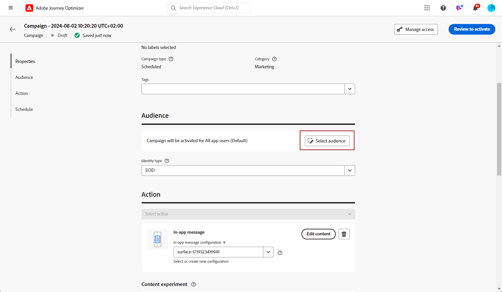

# Create an In-app message {#create-in-app}

<!--
>[!BEGINTABS]

>[!TAB Add an In-app message to a journey]

>[!AVAILABILITY]
>
>The In-app activity is currently available as a beta to select users only. To join the beta program, contact Adobe Customer Care.

1. Open your journey, then drag and drop an **[!UICONTROL In-app]** activity from the **[!UICONTROL Actions]** section of the palette.

    When a profile reaches the end of their journey, any in-app messages displayed to them will automatically expire. For that reason, a Wait activity is automatically added after your In-app activity to ensure proper timing.

    

1. Enter a **[!UICONTROL Label]** and **[!UICONTROL Description]** for your message.

1. Choose the [In-app surface](inapp-configuration.md) to use.

    

1. You can now start designing your content with the **[!UICONTROL Edit content]** button. [Learn more](design-in-app.md)

1. Click **[!UICONTROL Edit trigger]** to configure your Trigger. 

    

1. Choose the frequency of your trigger when your In-app message is active:

    * **[!UICONTROL Show every time]**: Always show the message when the events selected in the **[!UICONTROL Mobile app trigger]** drop-down occur.
    * **[!UICONTROL Show once]**: Only show this message the first time the events selected in the **[!UICONTROL Mobile app trigger]** drop-down occur.
    * **[!UICONTROL Show until click through]**: Show this message when the events selected in the **[!UICONTROL Mobile app trigger]** drop-down occur until an interact event is sent by the SDK with an action of "clicked".

1. From the **[!UICONTROL Mobile app trigger]** dropdown(s), choose the event(s) and criteria that will trigger your message:

    1. From the left drop-down, select the event required to trigger the message.
    1. From the right drop-down, select the validation required on the selected event.
    1. Click the **[!UICONTROL Add]** button if you want the trigger to consider multiple events or criteria. Then, repeat the steps above.
    1. Select how your events are linked, e.g. choose **[!UICONTROL And]** if you want **both** triggers to be true in order for a message to be shown or choose **[!UICONTROL Or]** if you want the message to be shown if **either** of the triggers are true.
    1. Click **[!UICONTROL Save]** when your Triggers have been configured.

    
    
1. If necessary, complete your journey flow by dragging and dropping additional actions or events. [Learn more](../building-journeys/about-journey-activities.md)

1. Once your In-app message is ready, finalize the configuration and publish your journey to activate it.

For more information on how to configure a journey, refer to [this page](../building-journeys/journey-gs.md).

>[!TAB Add an In-app message to a campaign]
-->

1. Access the **[!UICONTROL Campaigns]** menu, then click **[!UICONTROL Create campaign]**.

1. In the **[!UICONTROL Properties]** section, select when the campaign execution type: Scheduled or API-triggered. Learn more about campaign types in [this page](../campaigns/create-campaign.md#campaigntype).

1. In the **[!UICONTROL Actions]** section, choose the **[!UICONTROL In-app message]** and the **[!UICONTROL App surface]** previously configured for your In-app message. Then, click **[!UICONTROL Create]**. 

    Learn more about In-app configuration in [this page](inapp-configuration.md).

    

1. From the **[!UICONTROL Properties]** section, enter the **[!UICONTROL Title]** and the **[!UICONTROL Description]** description.

1. To assign custom or core data usage labels to the In-app message, select **[!UICONTROL Manage access]**. [Learn more](../administration/object-based-access.md).

1. Click the **[!UICONTROL Select audience]** button to define the audience to target from the list of available Adobe Experience Platform segments. [Learn more](../segment/about-segments.md).

    

1. In the **[!UICONTROL Identity namespace]** field, choose the namespace to use in order to identify the individuals from the selected segment. [Learn more](../event/about-creating.md#select-the-namespace).

1. Click **[!UICONTROL Edit triggers]** to choose the event(s) and criteria that will trigger your message:

    1. Click **Add condition** if you want the trigger to consider multiple events or criteria. 
    1. Select how your events are linked, e.g. choose **[!UICONTROL And]** if you want **both** triggers to be true in order for a message to be shown or choose **[!UICONTROL Or]** if you want the message to be shown if **either** of the triggers are true.
    1. Click **[!UICONTROL Make group]** to group triggers together.

    

1. Choose the frequency of your trigger when your In-app message is active. The following options are available:

    * **[!UICONTROL Everytime]**: Always show the message when the events selected in the **[!UICONTROL Mobile app trigger]** drop-down occur.
    * **[!UICONTROL Once]**: Only show this message the first time the events selected in the **[!UICONTROL Mobile app trigger]** drop-down occur.
    * **[!UICONTROL Until click through]**: Show this message when the events selected in the **[!UICONTROL Mobile app trigger]** drop-down occur until an interact event is sent by the SDK with an action of "clicked".
    * **[!UICONTROL X number of times]**: Show this message X time.

1. If needed, choose which **[!UICONTROL Day of the week]** or **[!UICONTROL Time of day]** the In-app message will be displayed.

1. Campaigns are designed to be executed on a specific date or on a recurring frequency. Learn how to configure the **[!UICONTROL Schedule]** of your campaign in [this section](../campaigns/create-campaign.md#schedule). 

    

1. You can now start designing your content with the **[!UICONTROL Edit content]** button. [Learn more](design-in-app.md)

    

<!--
>[!ENDTABS]
-->

## How-to video{#video}

The video below shows how to create, configure, and publish In-app messages in your campaigns.

>[!VIDEO](https://video.tv.adobe.com/v/3410430?quality=12&learn=on)

**Related topics:**

* [Design In-app message](design-in-app.md)
* [Test and send your In-app message](send-in-app.md)
* [In-app report](../reports/campaign-global-report.md#inapp-report)
* [In-app configuration](inapp-configuration.md)