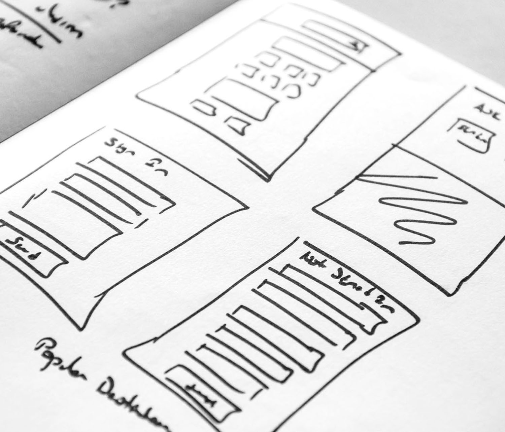

# Get started with In-app channel {#gs-in-app}

In-app messages are notifications that can be sent to users within your app, guiding them to specific points of interest. These notifications can be used for different purposes, such as promoting new features, presenting special offers, or facilitating user onboarding. By leveraging In-app messages, you can effectively engage with your audience and steer them towards important aspects of your application.

Use Journey Optimizer to create In-app notifications, and configure experience options, including the message layout and display, text, and button options.   

<table style="table-layout:fixed"><tr style="border: 0;">
<td>

<a href="inapp-configuration.md"><strong>Configure the In-app channel</strong></a>

</td>
<td>

<a href="create-in-app.md"><strong>Create an In-app message</strong>

</td>
<td>

<a href="design-in-app.md"><strong>Design your In-app content</strong></a>

</td>
<td>

<a href="../reports/campaign-global-report-cja-inapp.md"><strong>Access In-app reports</strong></a>

</td>
</tr></table>

## Additional resources

* **[Create in-app messages](create-in-app.md)** - Learn how to create and configure in-app messages for mobile applications.
* **[Configure in-app channel](inapp-configuration.md)** - Set up your in-app messaging channel with proper mobile app configurations.
* **[Design in-app content](design-in-app.md)** - Customize in-app message layouts, styles, buttons, and interactive elements.
* **[In-app for web](create-in-app-web.md)** - Discover how to create and deliver in-app messages for web applications.
* **[In-app channel tutorials](https://experienceleague.adobe.com/en/docs/journey-optimizer-learn/tutorials/channels/in-app-channel/in-app-messages-overview){target="_blank"}** - Explore step-by-step video tutorials on in-app messaging features and best practices.
