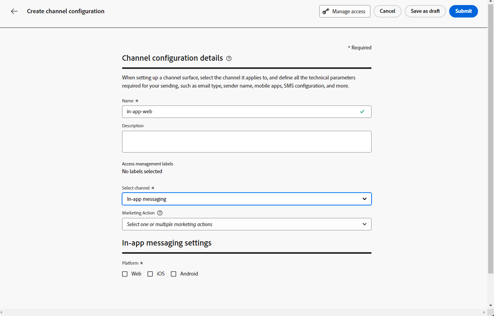

# Prerequisites and configuration {#inapp-configuration}

## Configuration steps {#inapp-steps}

To send In-app messages in your journeys and campaigns with [!DNL Journey Optimizer], you need to go through the following configuration steps.

1. Make sure you have the correct permissions on Journey Optimizer campaigns before starting, even if you plan to only use in-app messages in journeys. Campaign permissions are still required. [Learn more](../campaigns/get-started-with-campaigns.md#campaign-prerequisites).
1. Enable Adobe Journey Optimizer in your Adobe Experience Platform Data Collection datastream, and check your default merge policy in Adobe Experience Platform, as detailed in the [Delivery prerequisites](#delivery-prerequisites) below. 
1. Create an In-app message channel configuration in Administration > Channels > Channel configurations, as detailed in [this section](#channel-prerequisites). 
1. If you are using content experiments, make sure to follow the requirements listed in [this section](#experiment-prerequisite).

Once done, you can create, configure and sent your first In-app message. Learn how to achieve this in [this section](create-in-app.md).

## Delivery prerequisites {#delivery-prerequisites}

For the In-app messages to be delivered correctly, the following settings must be defined:

* In the [Adobe Experience Platform Data Collection](https://experienceleague.adobe.com/docs/experience-platform/edge/datastreams/overview.html){target="_blank"}, make sure you have a datastream defined such as under the **[!UICONTROL Adobe Experience Platform]** service you have the Adobe Experience Platform Edge and **[!UICONTROL Adobe Journey Optimizer]** option enabled.

    This ensures that the Journey Optimizer inbound events are correctly handled by the Adobe Experience Platform Edge. [Learn more](https://experienceleague.adobe.com/docs/experience-platform/edge/datastreams/configure.html){target="_blank"}

    

* In [Adobe Experience Platform](https://experienceleague.adobe.com/docs/experience-platform/profile/home.html){target="_blank"}, make sure you have the default merge policy with the **[!UICONTROL Active-On-Edge Merge Policy]** option enabled. To do this, select a policy under the **[!UICONTROL Customer]** > **[!UICONTROL Profiles]** > **[!UICONTROL Merge Policies]** Experience Platform menu. [Learn more](https://experienceleague.adobe.com/docs/experience-platform/profile/merge-policies/ui-guide.html#configure){target="_blank"}

    This merge policy is used by [!DNL Journey Optimizer] inbound channels to correctly activate and publish inbound campaigns on the edge. [Learn more](https://experienceleague.adobe.com/docs/experience-platform/profile/merge-policies/ui-guide.html){target="_blank"}
    
    >[!NOTE]
    >
    >When using a custom **[!UICONTROL Dataset preference]** merge policy, make sure to add the **[!UICONTROL Journey Inbound]** dataset within the specified merge policy.

    

* To troubleshoot the delivery of Journey Optimizer mobile experiences, you can use the **Edge Delivery** view within **Adobe Experience Platform Assurance**. This plugin enables you to inspect request calls in detail, verify whether the expected edge calls occur as anticipated, and examine profile data, including identity maps, segment memberships, and consent settings. Additionally, you can review the activities the request qualified for and identify those it did not.

    Using the **Edge Delivery** plugin helps you gain the insights needed to understand and troubleshoot your inbound implementations effectively.

    [Learn more on Edge Delivery view](https://experienceleague.adobe.com/en/docs/experience-platform/assurance/view/edge-delivery)

## Create an In-app configuration {#channel-prerequisites}

1. Access the **[!UICONTROL Channels]** > **[!UICONTROL General settings]** > **[!UICONTROL Channel configurations]** menu, then click **[!UICONTROL Create channel configuration]**.

    

1. Enter a name and a description (optional) for the configuration, then select the channel to configure.

    >[!NOTE]
    >
    > Names must begin with a letter (A-Z). It can only contain alpha-numeric characters. You can also use underscore `_`, dot`.` and hyphen `-` characters.

1. To assign custom or core data usage labels to the configuration, you can select **[!UICONTROL Manage access]**. [Learn more on Object Level Access Control (OLAC)](../administration/object-based-access.md).

1. Select **[!UICONTROL Marketing action]**(s) to associate consent policies to the messages using this configuration. All consent policies associated with the marketing action are leveraged in order to respect the preferences of your customers. [Learn more](../action/consent.md#surface-marketing-actions)

1. Select **In-app messaging** channel.

    

1. Select the platform for which you want to define the settings. This allows you to specify the target app for each platform and ensures consistent content delivery across multiple platforms.

    >[!NOTE]
    >
    >For iOS and Android platforms, delivery is based solely on the app ID. If both apps share the same app ID, content will be delivered to both, regardless of the platform selected in the **[!UICONTROL Channel configuration]**.

    

1. For Web: 

    * You can either input a **[!UICONTROL Page URL]** to apply changes to a specific page.

    * You can create a rule to target multiple URLs that follow the same pattern. 

        +++ How to build a Pages matching rule.

        1. Select **[!UICONTROL Pages matching rule]** as App configuration and enter your **[!UICONTROL Page URL]**.

        1. In the **[!UICONTROL Edit configuration rule]** window, define your criteria for the **[!UICONTROL Domain]** and **[!UICONTROL Page]** fields.
        1. From the condition dropdowns, further personalize your criteria.

            Here, for example, to edit elements that are displayed on all the sales product pages of your Luma website, select Domain > Starts with > luma and Page > Contains > sales.

            

        1. Click **[!UICONTROL Add another page rule]** to create another rule if needed.

        1. Select the **[!UICONTROL Default authoring and preview URL]**.

        1. Save your changes. The rule is displayed in the **[!UICONTROL Create campaign]** screen.

        +++

1. For iOS and Android:

    * Enter your **[!UICONTROL App id]**.

1. Submit your changes.

You can now select your configuration when creating your In-app message.

## Reporting prerequisites {#experiment-prerequisites}

>[!NOTE]
>
>The dataset is used read-only by the [!DNL Journey Optimizer] reporting system and doesn't affect data collection or data ingestion.

To enable reporting for In-app channel, you need to make sure the [dataset](../data/get-started-datasets.md) used in your In-app implementation [datastream](https://experienceleague.adobe.com/docs/experience-platform/datastreams/overview.html){target="_blank"} is also included in your reporting configuration.

In other words, when configuring reporting, if you add a dataset that is not present in your app datastream, app data will not display in your reports.

Learn how to add datasets for reporting in [this section](../reports/reporting-configuration.md#add-datasets).

If you are **not** using the following pre-defined [field groups](https://experienceleague.adobe.com/docs/experience-platform/xdm/tutorials/create-schema-ui.html#field-group){target="_blank"} for your dataset schema: `AEP Web SDK ExperienceEvent` and `Consumer Experience Event` (as defined in [this page](https://experienceleague.adobe.com/docs/platform-learn/implement-web-sdk/initial-configuration/configure-schemas.html#add-field-groups){target="_blank"}), make sure to add the following field groups: `Experience Event - Proposition Interactions`, `Application Details`, `Commerce Details`, and `Web Details`. These are needed by [!DNL Journey Optimizer] reporting as they are tracking which campaigns and journeys each profile is participating in.

[Learn more on reporting configuration](../reports/reporting-configuration.md)

>[!NOTE]
>
>Adding these field groups doesn't impact the normal data collection. It is additive only for the pages where a campaign or journey is running, leaving all the other tracking untouched

**Related topics:**

* [Create an In-app message](create-in-app.md)
* [Create a campaign](../campaigns/create-campaign.md)
* [Design In-app message](design-in-app.md)
* [In-app report](../reports/campaign-global-report-cja-inapp.md)

