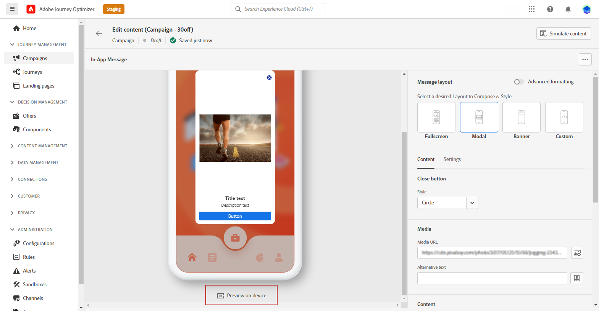
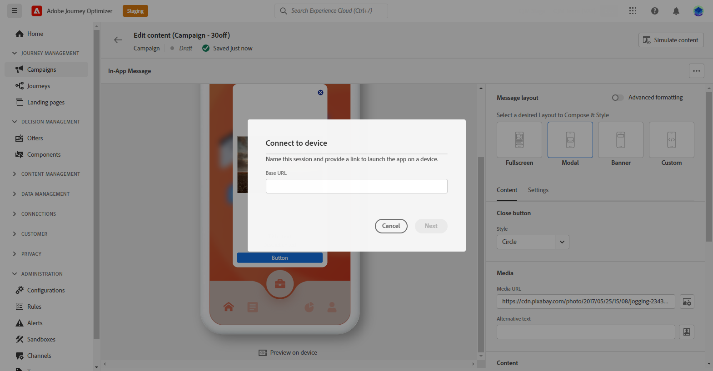
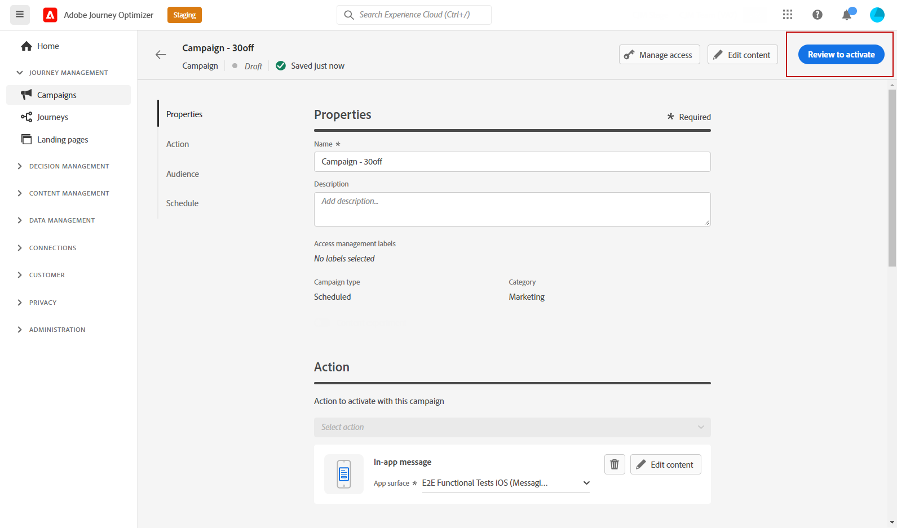

# Check & send your In-app notification {#create-in-app}

## Preview on device {#preview-device}

If you want to get a sneak peek of the In-app notification before it goes live for all users, you have the ability to preview it on a specific device. This functionality allows you to ensure that the notification looks and functions as intended on the chosen device, providing a better user experience for your audience.

To perform this, follow the steps below: 

1. Click **[!UICONTROL Preview on device]**.

    

1. From the **[!UICONTROL Connect to device]** window, click **[!UICONTROL Start]**.

1. Enter the **[!UICONTROL Base URL]** of your application and click **[!UICONTROL Next]**.

    

1. Scan the QR code with your device and enter the PIN code displayed. 
 
Your In-app message can now be triggered directly on your device allowing you to preview and review your message on an actual device. 

## Preview with test profiles {#simulate}

Once your in-app message has been defined, you can preview it using either simulation method:

* Click **[!UICONTROL Simulate content]** to test content variations with sample input data or AI auto-generation. [Learn how to simulate content variations](../test-approve/simulate-sample-input.md)
* Click **[!UICONTROL Simulate content]**, then select **[!UICONTROL Simulate content (AEP profiles)]** from the dropdown to preview with test profiles and add a test profile to check your message.

Detailed information on how to select test profiles and preview your content is available in the [Content Management](../content-management/preview-test.md) section.

## Review and activate your In-App notification{#in-app-review}

>[!IMPORTANT]
>
> If your campaign is subject to an approval policy, you will need to request approval in order to be able to send your In-App notification. [Learn more](../test-approve/gs-approval.md)

Once your In-App message is created, and its content defined and personalized, you can review and activate it.

To perform this, follow the steps below:

1. Use the **[!UICONTROL Review to activate]** button to display a summary of your message.

    The summary allows you to modify your campaign if necessary, and to check if any parameter is incorrect or missing.

    

1. Check that your campaign is correctly configured, then click **[!UICONTROL Activate]**.

Your campaign is now activated. The In-App notification configured in the campaign is sent immediately, or on the specified date.

Once sent, you can measure the impact of your In-App messages within the Campaign or Journey reports. For more on reporting, refer to [this section](../reports/campaign-global-report-cja-inapp.md).

**Related topics:**

* [Create an In-app message](create-in-app.md)
* [Design In-app message](design-in-app.md)
* [In-app report](../reports/campaign-global-report-cja-inapp.md)
* [In-app configuration](inapp-configuration.md)
