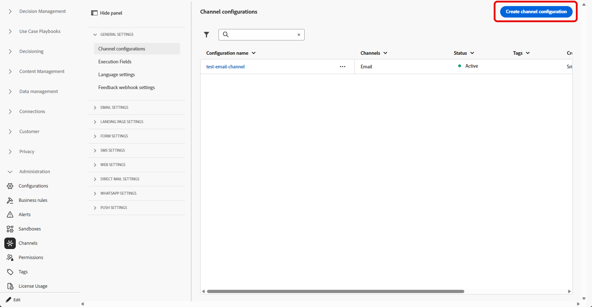
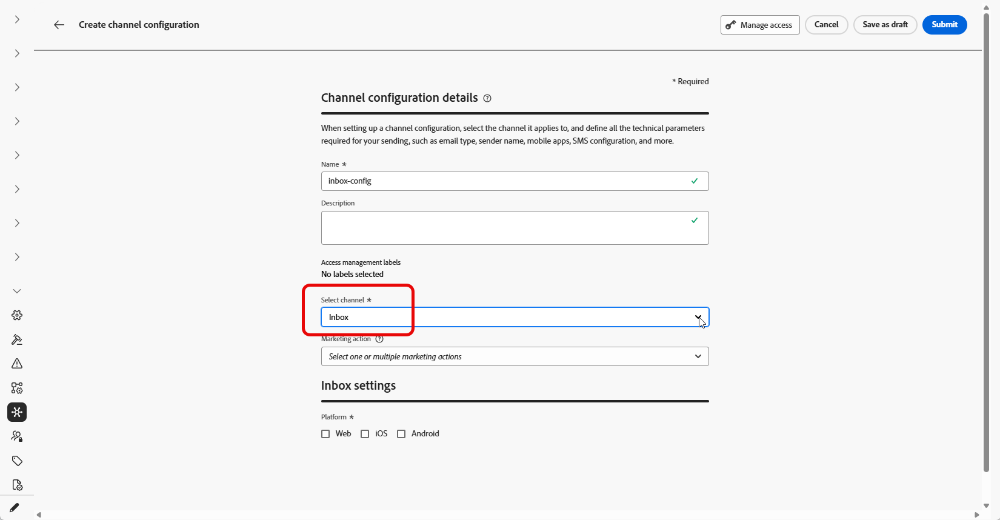
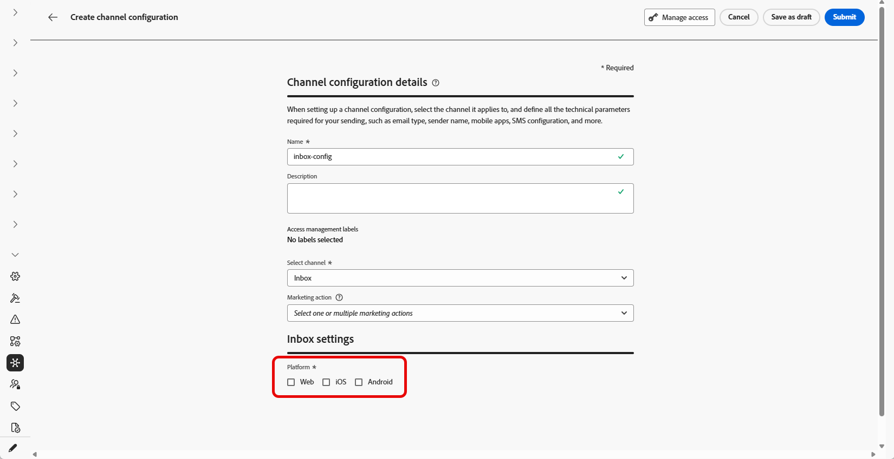
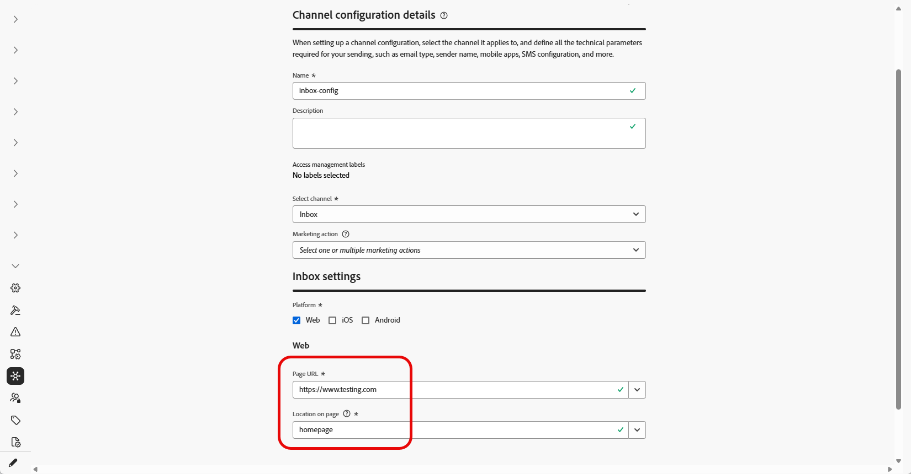

# Configure Inbox {#inbox-configuration}

Before you can deliver Content card experiences through the Inbox, you must define an **Inbox** channel configuration in **[!UICONTROL Channel configurations]**. That configuration ties the surface to consent, optional access labels, and where the experience appears on the web or in your iOS or Android app. Follow the steps below to create a configuration:

1. Access the **[!UICONTROL Channels]** > **[!UICONTROL General settings]** > **[!UICONTROL Channel configurations]** menu, then click **[!UICONTROL Create channel configuration]**.

    

1. Enter a name and a description (optional) for the configuration.

    >[!NOTE]
    >
    > Names must begin with a letter (A-Z). It can only contain alpha-numeric characters. You can also use underscore `_`, dot`.` and hyphen `-` characters.

1. To assign custom or core data usage labels to the configuration, you can select **[!UICONTROL Manage access]**. [Learn more about Object Level Access Control (OLAC)](../administration/object-based-access.md).

1. Select **[!UICONTROL Inbox]** channel.

    

1. Select **[!UICONTROL Marketing action]**(s) to associate consent policies to the messages using this configuration. All consent policies associated with the marketing action are leveraged in order to respect the preferences of your customers. [Learn more](../action/consent.md#surface-marketing-actions)

1. Select the platform for which the Inbox experience will be applied.

    

1. For Web:

    * In **[!UICONTROL Page URL]**, enter or select the URL of the page where the inbox should appear. Use this when the experience is limited to one page.

    * In **[!UICONTROL Location on page]**, define the in-page placement, for example, the region or identifier your site uses for the inbox surface. [Learn more](../web/web-configuration.md)

        

1. For iOS and Android:

    * In **[!UICONTROL App id]**, enter or select the identifier for your app so the configuration applies to the correct iOS or Android build.

    * In **[!UICONTROL Location or path inside the app]**, specify the screen, route, or container where users should open the inbox.

1. Submit your changes.

You can now select your configuration when creating your Inbox experience. 

➡️ [Follow the steps detailed in this page](inbox-create.md)
