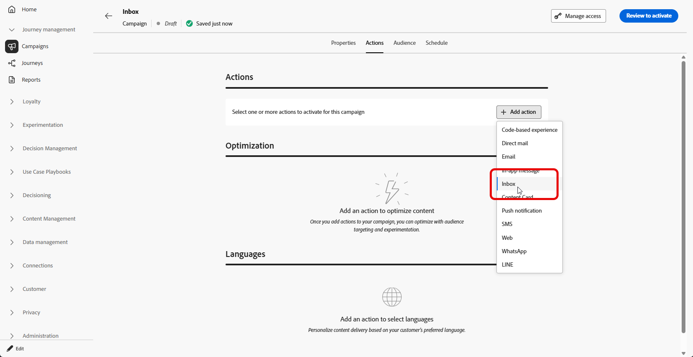

# Create an Inbox {#inbox-create}

Prior to creating an inbox, complete the steps in [Inbox configuration](inbox-configuration.md). The channel configuration identifies the target application or website, the page or rule, and the placement where the inbox is rendered.

To create a message inbox through a campaign, follow these steps:

1. Create a campaign. [Learn more](../campaigns/create-campaign.md)

1. Select the type of campaign you want to execute:

   * **[!UICONTROL Scheduled - Marketing]**: execute the campaign immediately or on a specified date. Scheduled campaigns are aimed at sending **marketing** messages. They are configured and executed from the user interface.

   * **[!UICONTROL API-triggered - Marketing/Transactional]**: execute the campaign using an API call. API-triggered campaigns are aimed at sending either **marketing**, or **transactional** messages, i.e. messages sent out following an action performed by an individual: password reset, cart purchase etc. [Learn how to trigger a campaign using APIs](../campaigns/api-triggered-campaigns.md)

1. In the **[!UICONTROL Properties]** tab, specify a name and a description for the campaign.

1. From the **[!UICONTROL Action]** tab, select the **[!UICONTROL Inbox]** action.

    

1. Select or create a new [Inbox configuration](inbox-configuration.md).

    

1. Access the Content tab to design your message using the content designer. [Learn more](inbox-design.md)

1. In the **[!UICONTROL Audience]** tab, click the **[!UICONTROL Select audience]** button to display the list of available Adobe Experience Platform audiences. [Learn more about audiences](../audience/about-audiences.md)

1. In the **[!UICONTROL Identity namespace]** field, choose the namespace to use in order to identify the individuals from the selected segment. [Learn more about namespaces](../event/about-creating.md#select-the-namespace)

1. You can schedule your campaign to a specific date or set to recur at regular intervals. [Learn more](../campaigns/create-campaign.md#schedule)

1. Review and activate your campaign to send messages to the inbox.

You can now choose this Inbox when creating your [Content card campaign](../content-card/create-content-card.md).
