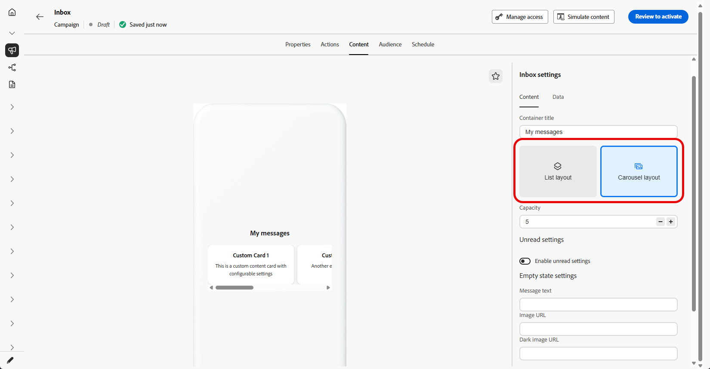
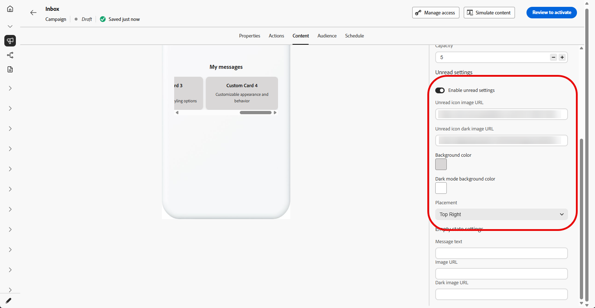
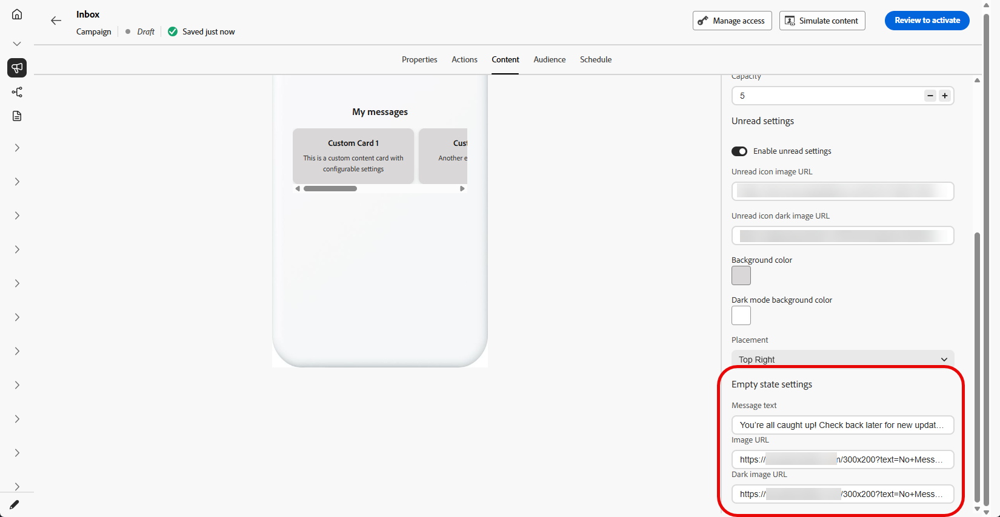
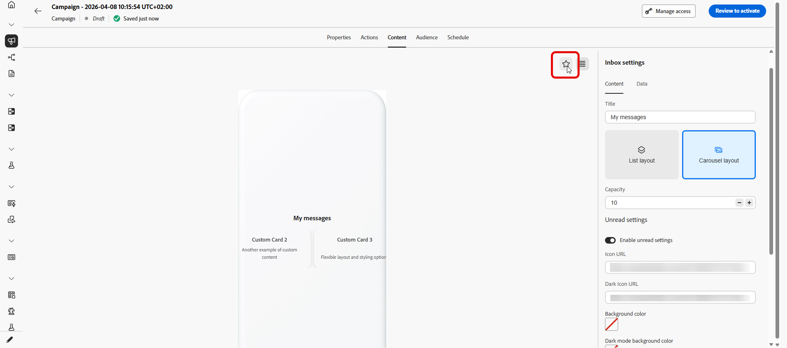

# Design an Inbox {#inbox-design}

Inbox design governs how each message is rendered to targeted profiles within the inbox surface. The configuration encompasses the inbox template, list and expanded presentations, and read-state indicators that distinguish new messages from those already viewed.

For the complete procedure to create an inbox campaign, refer to [Create an Inbox](inbox-create.md).

1. Open the **[!UICONTROL Content]** tab of the [Inbox campaign you created](inbox-create.md).

1. Set the **[!UICONTROL Container title]**.

1. Select an inbox layout:

   * **[!UICONTROL List layout]**: shows each content card in a vertical list so profiles can scroll through messages and open them one at a time.

   * **[!UICONTROL Carousel layout]**: shows cards in a horizontal carousel so profiles can swipe or move sideways through highlights without leaving the inbox surface.
   
    

1. Specify the inbox **capacity**, the maximum number of content cards the inbox is configured to hold.

1. Toggle **[!UICONTROL Unread settings]** and configure how unread messages are indicated:

   * **[!UICONTROL Unread icon image URL]**: Provide the image shown next to or on unread items; add a dark-mode URL so the icon stays visible and on-brand when the app or site uses a dark theme.

   * **[!UICONTROL Background colors]**: Set colors for light and, if needed, dark mode so the unread treatment matches your brand and remains readable against the inbox background.

   * **[!UICONTROL Placement]**: Use the drop-down to choose where the unread icon appears to align with your layout.

    

1. Under **[!UICONTROL Empty state]**, configure what profiles see when there are no messages to display:

   * **[!UICONTROL Message text]**: Short text that explains the inbox is empty or suggests a next step.

   * **[!UICONTROL Image URL]**: Optional illustration or graphic for light mode that reinforces the empty state instead of showing a blank area.

   * **[!UICONTROL Dark image URL]**: Optional image tuned for dark mode so the empty state looks correct without low contrast or harsh edges.

    

1. Click the  to open the preview panel and review how the empty inbox appears.

    

1. In the **[!UICONTROL Data]** section, click **[!UICONTROL Add meta]** to add custom key/value pairs to the payload.

1. Click the  icon to open a dark mode preview of the inbox and confirm your dark theme colors and images.

    

When you are ready, review your settings and activate the inbox. After activation, you can use it with [Content cards](../content-card/create-content-card.md).

