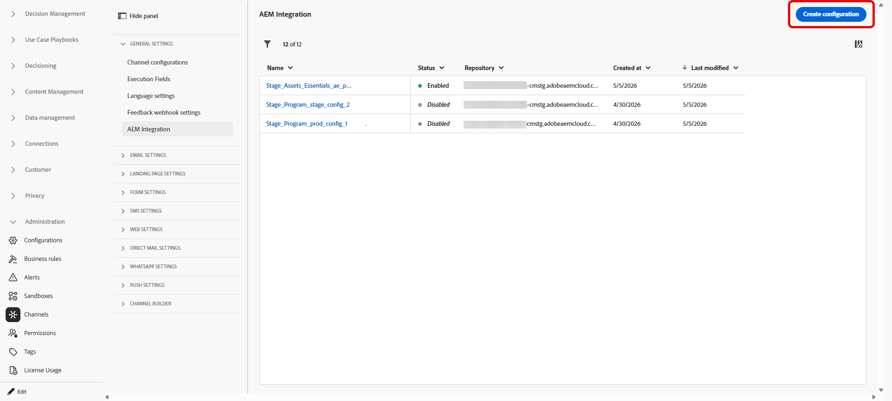
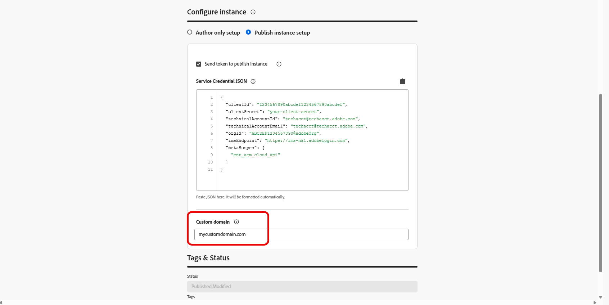

# Configure Adobe Experience Manager repository access {#aem-admin-settings}

>[!BEGINSHADEBOX]

**On this page:** Learn how administrators configure Adobe Experience Manager repository access per sandbox, including custom domains, author-only and publish instance setups, and authentication for Content Fragments in Journey Optimizer.

>[!ENDSHADEBOX]

Adobe Journey Optimizer integrates with **[!DNL Adobe Experience Manager as a Cloud Service]** so you can use **Content Fragments** in Journeys and Campaigns. **Content Fragments** are read from the Adobe Experience Manager publish repository by default, administrators can switch to author-only or adjust publish access in the **[!UICONTROL AEM Integration]** menu.

➡️ When the repository is configured, continue with [Work with Experience Manager Content Fragments](../integrations/aem-fragments.md) for authoring and selection tasks in Journey Optimizer.

## Configure repositories {#configure-ui}

>[!NOTE]
>
> **[!UICONTROL AEM Integration]** saves repository settings **per sandbox**. Each sandbox keeps its own integrations and they do not apply across sandboxes.
  
Journey Optimizer stores one integration per organization, sandbox, and Adobe Experience Manager repository. If you save a new integration for that same combination, it replaces the previous settings, only the latest configuration is kept.

To configure your repository:

1. Access **[!UICONTROL Administration]** > **[!UICONTROL Channels]** > **[!UICONTROL AEM Integration]**.

1. Click **[!UICONTROL Create integration]**.

   

1. If you use **[!DNL Adobe Experience Manager Managed Services]**, enter a repository hostname ending with `adobecqms.net` in the **[!UICONTROL Custom AMS Repo ID]** field.

   

1. Choose which repository to configure and click **[!UICONTROL Next]**.

    Additionally, you can click **[!UICONTROL View]** to access this repository.

    >[!IMPORTANT]
    >
    >Saving a new configuration for the same organization, sandbox, and repository **replaces** the default configuration, i.e **publish** repository. 

   

1. Enter a **[!UICONTROL Name]** and **[!UICONTROL Description]**.

1. Choose your setup:

    +++ Author only setup

    Select **[!UICONTROL Author only setup]** when Journey Optimizer should read Content Fragments from the Adobe Experience Manager **author** environment only. Replication from author to publish and live publish updates are not supported.

    
    
    +++

    +++ Publish instance setup

    1. Select **[!UICONTROL Publish instance setup]** to turn on publish instance settings.
        
        

    1. Optionally enable **[!UICONTROL Send token to publish instance]** so service credentials are included with requests to the publish instance.

    1. Paste a valid **[!UICONTROL Service Credential JSON]** for authentication.

    1. Optionally provide a custom domain if your organization cannot reach the default AEM publish host (`publish-XX-XX.adobeaemcloud.com`) to fetch content.

        

    +++

1. After you finish the instance setup, pick a Content Fragment to confirm that the integration works.

    

1. In the **Content Advisor** window, select the fragment you want to test, then click **[!UICONTROL Select]**.

1. Click **[!UICONTROL Save]**.

1. When you save with a test Content Fragment selected, validation runs automatically. If validation fails, an error list is displayed so you can fix the configuration.

    

1. To edit or disable this repository integration, access your previously created configuration from the **[!UICONTROL AEM Integration]** menu.

When you save this configuration, Journey Optimizer stores it for that repository in the current sandbox. You can then use that repository and its settings when browsing and selecting content in the **Content Advisor** selector.

