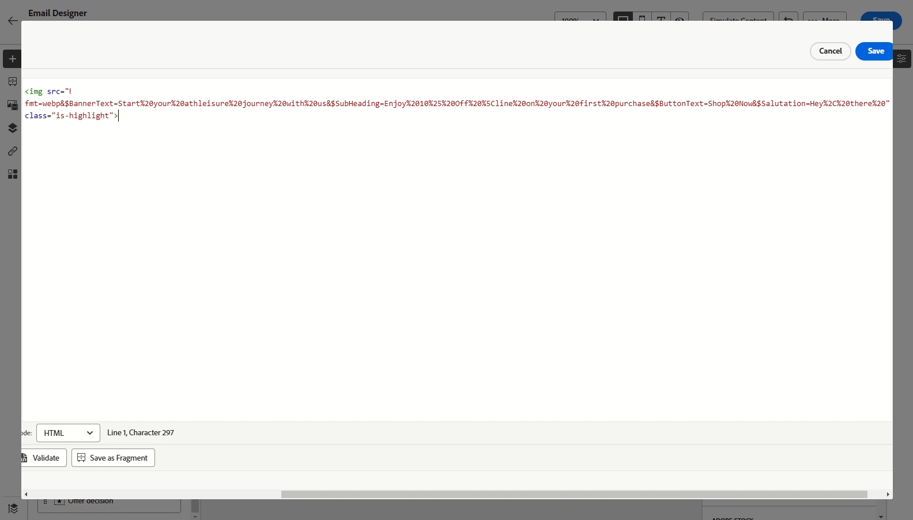

# Work with Dynamic Media {#aem-dynamic}

>[!AVAILABILITY]
>
>This integration is available exclusively for customers using Dynamic Media Manager as a Cloud Service.

The Asset selector now supports Dynamic media allowing you to seamlessly select and use approved dynamic media renditions within Journey Optimizer. Changes made to assets in Adobe Experience Manager are instantly reflected in your Journey Optimizer content, ensuring the most up-to-date versions are always in use without requiring manual updates.

To learn more on Dynamic Media in Adobe Experience Manager as a Cloud Service, refer to [Experience Manager documentation](https://experienceleague.adobe.com/en/docs/experience-manager-cloud-service/content/assets/dynamicmedia/dynamic-media).

## Add and manage Dynamic media {#dynamic-media}

Enhance and optimize your content for any screen or browser by inserting dynamic media from Adobe Experience Manager as a Cloud Service directly into your Journey Optimizer content.  You can then resize, crop, enhance, and make other adjustments as needed.

1. Drag and drop an **[!UICONTROL HTML component]** into your content.

1. Select **[!UICONTROL Show the source code]**.

    

1. In the **[!UICONTROL Edit HTML]** menu, navigate to **[!UICONTROL Assets]** then click **[!UICONTROL Open asset selector]**.

    Alternatively, you can copy and paste the URL of your asset.

    

1. Browse your AEM assets and select the one you wish to add to your content.

1. Adjust the image parameters (e.g., height, width, rotate, flip, brightness, hue, etc.) as needed to match your asset requirements.

    For a comprehensive list of image parameters that can be added to the URL, refer to  [Experience Manager documentation](https://experienceleague.adobe.com/en/docs/dynamic-media-developer-resources/image-serving-api/image-serving-api/http-protocol-reference/command-reference/c-command-reference).

    

1. Click **[!UICONTROL Save]**.

Your content now includes dynamic media. Any updates you make in Experience Manager will automatically appear in Journey Optimizer.

## Personalize your Text Overlay {#text-overlay}

Easily customize any dynamic media by replacing the existing text overlay with new text of your choice, allowing for seamless updates and personalization.

For example, using the experimentation functionality, you can update the existing text overlay by replacing it with a different text for each treatment, ensuring it is customized for each profile when they open their messages.

1. Drag and drop an **[!UICONTROL HTML component]** into your content.

1. Select **[!UICONTROL Show the source code]**.

1. From the **[!UICONTROL Edit HTML]** menu, access **[!UICONTROL Assets]** then **[!UICONTROL Open asset selector]**.

    You can also simply copy and paste your assets URL.

1. Browse through your AEM assets and select the one you want to add to your content.

1. Replace the overlay with the desired text.

    

1. Update the images parameters:

    * **Layer**: enter the base element where your text is placed.
    * **Size**: update the size of your text block.
    * **TextAttr**: adjust the size of your text font.
    * **Pos**: set the position of your text in the image.

    >[!WARNING]
    >
    >The Layer parameter is required to update your dynamic media.

    

1. Click **[!UICONTROL Save]**.

Your content now includes your updated text overlay.

## Add and Manage your Dynamic media template {#dynamic-media-template}

Easily add your Dynamic Media template in Journey Optimizer and update your media content whenever needed. You can now incorporate personalization fields into your media, allowing you to create more customized and engaging content within Journey Optimizer.

Learn more on [Dynamic media template](https://experienceleague.adobe.com/en/docs/dynamic-media-classic/using/template-basics/quick-start-template-basics).

### With image component {#image-component}

You can insert your dynamic template directly into your content using the Image component:

1. Open your campaign or journey and access your content.

1. Drag and drop an **Image component** into your layout. 

    For more information on Image component, refer to [this page](../email/content-components.md).

    

1. Browse through your AEM assets and select the Dynamic media template you want to add to your content.

    

1. In the **Image settings**, navigate to access the parameters of your dynamic media template.

    The available fields depend on the parameters added during the [template creation](https://experienceleague.adobe.com/en/docs/dynamic-media-classic/using/template-basics/creating-template-parameters#creating_template_parameters) in Adobe Experience Manager.

    

1. Fill in the different fields and use the personalization editor to add personalized content. You can use any attribute, such as the profile name, city, or other relevant details, to create a more customized experience.

    Learn more on personalization in [this page](../personalization/personalize.md).

    

1. Conditional content can be applied to the Dynamic Media component to generate different variants of the content. [Learn more](../personalization/dynamic-content.md)

1. Click **[!UICONTROL Save]**.

Once you have performed your tests and validated the content, you can send your message to your audience. 

### With HTML component {#html-component}

You can insert your dynamic template directly into your content using the HTML component:

1. Open your campaign or journey and access your content.

1. Drag and drop an **HTML component** into your layout. 

    

1. Select **[!UICONTROL Show the source code]**.

    

1. From the **[!UICONTROL Edit HTML]** menu, access **[!UICONTROL Assets]** then **[!UICONTROL Open asset selector]**.

    You can also simply copy and paste your assets URL.

1. Adjust the image text parameters as needed to match your asset requirements.

    

1. Click **[!UICONTROL Save]**.

Once you have performed your tests and validated the content, you can send your message to your audience. 

<!--
## Personalization with Text Overlay

Easily customize any dynamic media by replacing the existing text overlay with new text of your choice, allowing for seamless updates and personalization.

In this example, our goal is to update the existing text overlay by replacing it with a new validity date and adding a personalization block, ensuring it is customized for each profile when they open their messages.

1. Drag and drop an **[!UICONTROL HTML component]** into your content.

1. Select **[!UICONTROL Show the source code]**.

1. From the **[!UICONTROL Edit HTML]** menu, access **[!UICONTROL Assets]** then **[!UICONTROL Open asset selector]**.

    You can also simply copy and paste your assets URL.

1. Browse through your AEM assets and select the one you want to add to your content.

1. Replace the overlay with the desired text.

    Here we change the validity date from 31st December 2024 to the 1st July 2025.

1. Add the required personalization fields to your image.

1. Click **[!UICONTROL Save]**.

Your content now includes your updated text overlay and personalization.

## Add Dynamic media conditional content

Enable conditional content in your dynamic media to better target your audience and deliver a more personalized experience.

1. Drag and drop an **[!UICONTROL HTML component]** into your content.

1. Select **[!UICONTROL Show the source code]**.

1. From the **[!UICONTROL Edit HTML]** menu, access **[!UICONTROL Assets]** then **[!UICONTROL Open asset selector]**.

    You can also simply copy and paste your assets URL.

1. Browse through your AEM assets and select the one you want to add to your content.

1. Once your dynamic media is inserted to your content, select **[!UICONTROL Enable conditional]** content from your HTML component toolbar to create your different user experiences. 

1. From the Variant - 1, click **[!UICONTROL Select condition]** to fine tune your audience.

1. Choose your condition or create a new one if needed and click **[!UICONTROL Select]**.

    [Learn more on conditions](../personalization/create-conditions.md)

1. Select your **[!UICONTROL Component]** and access the **[!UICONTROL Settings]** menu.

1. In the **[!UICONTROL Custom Attributes]** menu, populate the Dynamic Media text and personalization fields to customize the content for your audience.

-->
