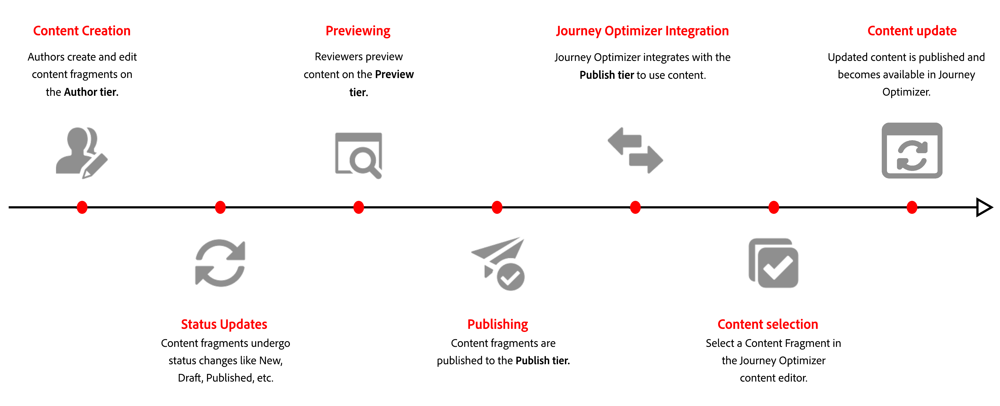

# Get started with Adobe Experience Manager Content Fragments {#aem-fragments}

By integrating Adobe Experience Manager as a Cloud Service with Adobe Journey Optimizer, you can now seamlessly incorporate your AEM Content Fragments into your Journey Optimizer content. This streamlined connection simplifies the process of accessing and leveraging AEM content, enabling the creation of personalized and dynamic campaigns and journeys.

To learn more about AEM Content Fragments, refer to [Working with Content Fragments](https://experienceleague.adobe.com/en/docs/experience-manager-cloud-service/content/sites/administering/content-fragments/content-fragments-with-journey-optimizer){target="_blank"} in the Experience Manager documentation.

## Before starting {#start}

>[!AVAILABILITY]
>
>For Healthcare customers, the integration is enabled only upon licensing the Journey Optimizer Healthcare Shield and Adobe Experience Manager Enhanced Security add-on offerings.

### Limitations {#limitations}

Note the following limitations when working with Adobe Experience Manager Content Fragments in Journey Optimizer:

* **Content Fragment Types**: Simple Content Fragments and nested Content Fragments are supported. Content Fragment variations are not currently supported.

* **Multilingual content**: Only the manual flow is supported. Each language variant must be independently authored in Adobe Experience Manager, tagged, published, and manually selected in Journey Optimizer. There is no automatic language resolution or fallback mechanism.

* **Repository access**: Journey Optimizer integrates exclusively with the Adobe Experience Manager Publish tier, where Content Fragments are available through a public, unauthenticated endpoint. While Author repositories may appear in the repository selector, only Content Fragments that are published to the Publish tier can be used in Journey Optimizer.

* **Content Fragment status**: Journey Optimizer displays Content Fragments with **Published** and **Modified** status. In all cases, only the latest published version is used. If a fragment is modified after publication, those changes will not be reflected in Journey Optimizer until the Content Fragment is republished in Adobe Experience Manager. There is no automatic version reconciliation between Adobe Experience Manager and Journey Optimizer.

* **Personalization**: Only profile attributes, contextual attributes, static strings, and pre-declared variables are supported. Derived or computed attributes are not supported.

* **Updates and versioning**: Content Fragment updates require manual republication from Adobe Experience Manager. There is no automatic version reconciliation between Adobe Experience Manager and Journey Optimizer. When a Content Fragment is published in Adobe Experience Manager, the Adobe Experience Managers publish action may experience delays. Once the Adobe Experience Manager [publish action](https://experienceleague.adobe.com/en/docs/experience-manager-cloud-service/content/assets/manage/manage-publication) is complete, Journey Optimizer receives an event and updates on the Journey Optimizer side. If successful, the update will be available after 5 minutes for Unitary Journeys and in the next batch for Batch use-cases.

* **Caching and proofing**: Journey Optimizer caches Adobe Experience Manager Content Fragments when a Content Fragment is added into a campaign or journey for the first time. When a Content Fragment that was previously added to another campaign or journey is selected via the  Adobe Experience Manager Content Fragments selector, Journey Optimizer fetches the Content Fragment from the Journey Optimizer cache. When an added Content Fragment receives a modification and is republished on the Adobe Experience Manager side, Journey Optimizer listens to the event and automatically reflects the update. Proofs for campaigns and journeys always reflect the most recently published version of the Content Fragment, and historical versions cannot be locked for proofing..

* **User access**: It is recommended to limit the number of users with access to publish Content Fragments to reduce the risk of accidental errors.

### Content Fragment lifecycle

Content Fragments follow different lifecycle stages depending on the Adobe Experience Manager tier in which they exist. [Learn more in Adobe Experience Manager documentation](https://experienceleague.adobe.com/en/docs/experience-manager-cloud-service/content/sites/authoring/author-publish)

Content is created and managed on the **Author tier**, where fragments can have statuses such as New, Draft, Published, Modified, or Unpublished. These statuses apply only on the **Author tier** and support content creation and review.

When a Content Fragment is published, a copy is created on the **Publish tier** and exposed through a public, unauthenticated endpoint. Journey Optimizer integrates exclusively with this **Publish tier**.

As a result, Journey Optimizer surfaces only Published or Modified Content Fragments and always uses the latest published version. Any changes made after publication are not reflected in Journey Optimizer until the Content Fragment is republished.

## Troubleshooting {#troubleshooting}

If you encounter issues when working with Adobe Experience Manager Content Fragments in Journey Optimizer, refer to the following common problems and resolutions:

| Issue | Cause | Resolution |
|-|-|-|
| **Tag not found** or **Content Fragment not visible in selector** | Adobe Experience Manager tag syntax does not match required format `ajo-enabled:{OrgId}/{SandboxName}` | Validate that the tag ID uses the correct **Organization ID** and **Sandbox Name**. Ensure there are no spaces or incorrect separators. Republish the Content Fragment after correcting the tag. |
| **Content Fragment not appearing in list** | Content Fragment is in draft state or not published| Only approved and published Content Fragments are displayed in the Journey Optimizer selector. Publish the Content Fragment in Adobe Experience Manager and ensure it has the published status. |
| **Variable undefined error** | Personalization placeholder not declared in fragment helper tag | Add all required parameters in the fragment helper tag. Each placeholder used in the Content Fragment must be explicitly declared with its mapping. |
| **Proof displays unexpected content** | Proof uses the latest published version from Adobe Experience Manager | Proofs always reflect the most recent publication of the Content Fragment in Adobe Experience Manager. If you made recent changes in Adobe Experience Manager, republish the fragment and refresh your proof. |
| **Access denied (CPES) error** | User role not authorized to access certain attributes | Contact your system administrator to verify that your role has the appropriate permissions for the profile or contextual attributes used in personalization. |
| **Fragment displays blank or missing content** | Missing required personalization parameters or fallback values | Ensure all required parameters are provided and consider adding fallback values for optional attributes. |

If the issue persists, contact your Adobe representative with details about your Content Fragment ID, campaign or journey ID, and any error messages displayed.
