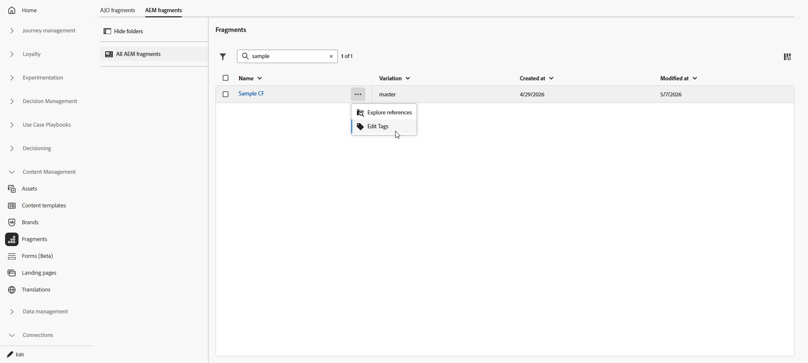

# Manage your Adobe Experience Manager Content fragments {#aem-fragments}

By integrating Adobe Experience Manager as a Cloud Service with Adobe Journey Optimizer, you can use AEM Content Fragments in your content and check Fragment statuses without leaving Journey Optimizer.

When you republish a Fragment already used in a Journey or Campaign, Journey Optimizer usually reflects the change within about **5 minutes**, see [Work with Adobe Experience Manager Content Fragments](aem-fragments.md). If delays occur, you can now manually sync that Fragment from Journey Optimizer to pull the latest published version.

## Access AEM Content Fragments {#access-aem-fragments}

1. From the **[!UICONTROL Content Management]** menu, select **[!UICONTROL Fragments]**.

1. Open the **[!UICONTROL AEM Fragments]** tab to view Content Fragments available from Adobe Experience Manager.

1. From the Fragment list, click  to **[!UICONTROL Explore references]** or **[!UICONTROL Edit Tags]**.

    

1. Select a Fragment to review its status and available actions:

    * **[!UICONTROL Explore references]**: see the Journeys and Campaigns that use the fragment.
    * **[!UICONTROL Open in AEM]**: open the Fragment in Adobe Experience Manager to edit or republish it.
    * **[!UICONTROL Sync]**: manually pull the latest published version when automatic sync has not completed.

      

1. The **[!UICONTROL Details]** menu allows you to review metadata and preview the synced payload:

    * **[!UICONTROL Name]**: title of the Content Fragment as shown in Journey Optimizer.
    * **[!UICONTROL Description]**: description imported from Adobe Experience Manager.
    * **[!UICONTROL Variation]**: published variation currently represented for this Fragment.
    * **[!UICONTROL Repo Id]**: repository identifier for the Fragment in Adobe Experience Manager.
    * **[!UICONTROL AEM Fragment Id]**: unique Content Fragment identifier in Adobe Experience Manager.
    * **[!UICONTROL Tags]**: tags assigned in Adobe Experience Manager, including Journey Optimizer enablement tags that determine whether the Fragment appears in selectors for your organization and sandbox. [Learn how to create and assign tags](aem-fragments.md#create-tag)
    * **[!UICONTROL JSON preview]**: read-only JSON structure of the Fragment content Journey Optimizer uses.

➡️ [Learn more about Content Fragment](aem-fragments.md)

