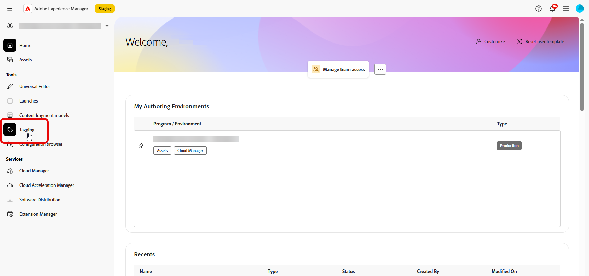
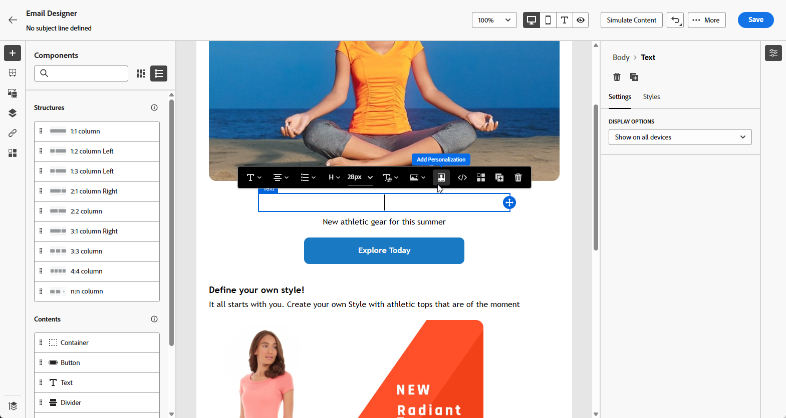
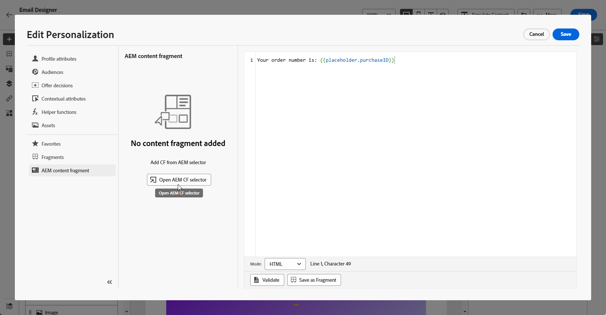
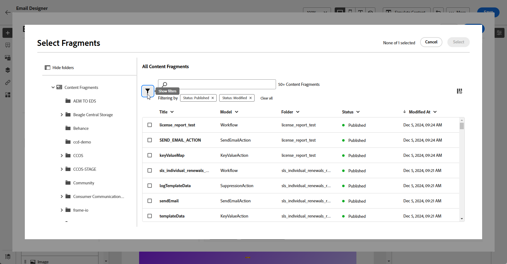
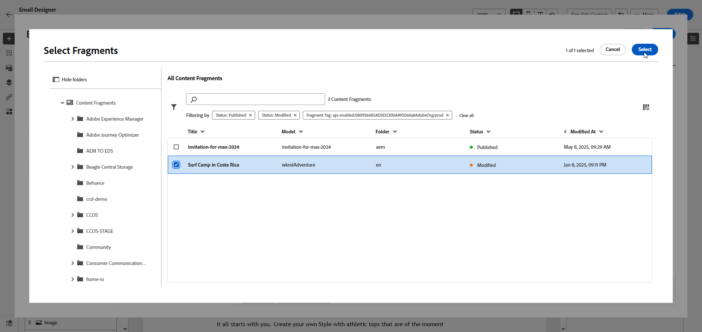
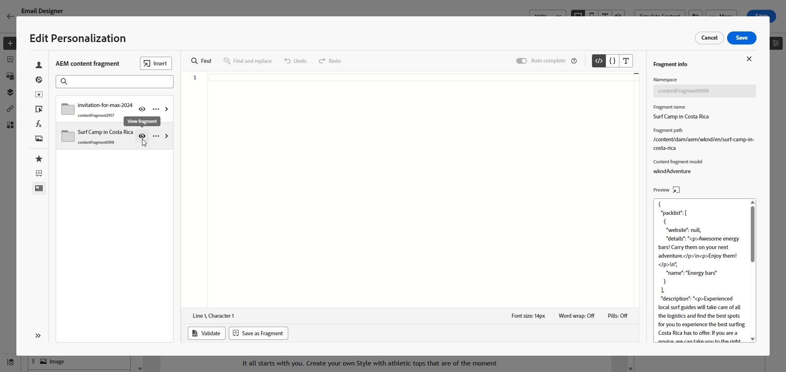
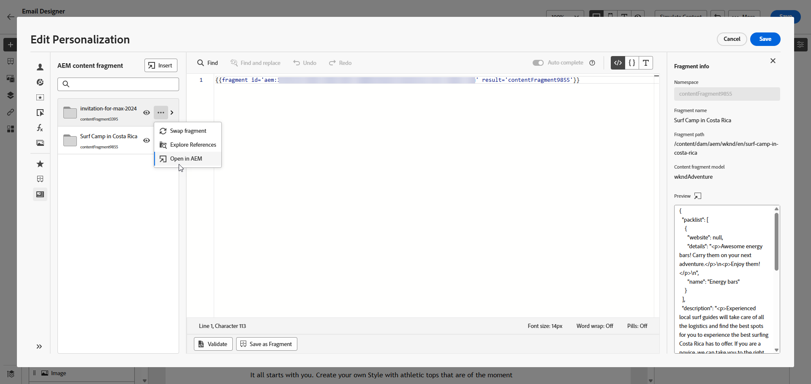
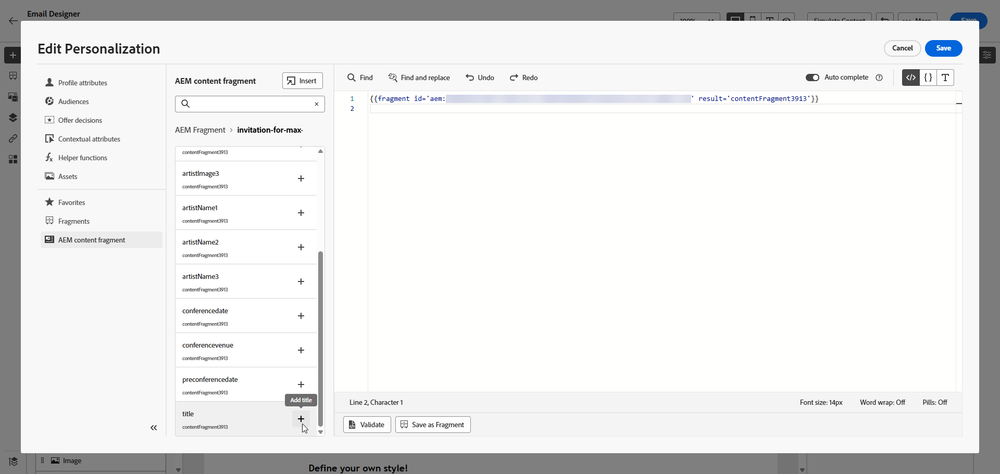
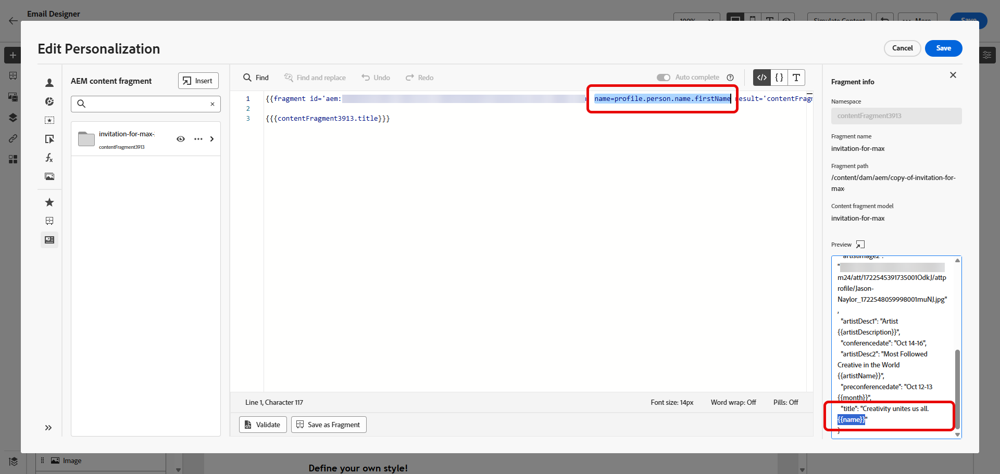

# Adobe Experience Manager Content Fragments {#aem-fragments}

By integrating Adobe Experience Manager as a Cloud Service with Adobe Journey Optimizer, you can now seamlessly incorporate your AEM Content Fragments into your Journey Optimizer content. This streamlined connection simplifies the process of accessing and leveraging AEM content, enabling the creation of personalized and dynamic campaigns and journeys.

To learn more about AEM Content Fragments, refer to [Working with Content Fragments](https://experienceleague.adobe.com/en/docs/experience-manager-cloud-service/content/sites/administering/content-fragments/content-fragments-with-journey-optimizer){target="_blank"} in the Experience Manager documentation.

>[!AVAILABILITY]
>
>For Healthcare customers, the integration is enabled only upon licensing the Journey Optimizer Healthcare Shield and Adobe Experience Manager Enhanced Security add-on offerings.

## Limitations {#limitations}

* It is recommended to limit the number of users with access to publish Content Fragments to reduce the risk of accidental errors.

* For multilingual content, only the manual flow is supported.

* Variations are not currently supported.

* Proof for published campaign and journey reflects data from the latest Experience Manager Content fragment publication.

## Create and assign a tag in Experience Manager

Before using your Content fragment in Journey Optimizer, you need to create a tag specifically for Journey Optimizer:

1. Access your **Experience Manager** environment.

1. From the **Tools** menu, select **Tagging**.

    

1. Click **Create Tag**.

1. Ensure the ID adheres to the following syntax: `ajo-enabled:{AJO-OrgId}/{AJO-SandboxName}`.

1. Click **Create**. 

1. Define your Content Fragment Model as detailed in [Experience Manager documentation](https://experienceleague.adobe.com/en/docs/experience-manager-cloud-service/content/sites/administering/content-fragments/content-fragment-models){target="_blank"} and assign your newly created Journey Optimizer tag.

You can now begin creating and configuring your Content Fragment for later use in Journey Optimizer. Learn more in [Experience Manager documentation](https://experienceleague.adobe.com/en/docs/experience-manager-cloud-service/content/sites/administering/content-fragments/managing){target="_blank"}.

## Add Experience Manager Content fragments {#aem-add}

After creating and personalizing your AEM Content Fragments, you can now import it to your Journey optimizer campaign or journey.

1. Create your [Campaign](../campaigns/create-campaign.md) or [Journey](../building-journeys/journey-gs.md).

1. To access your AEM content fragment, click  within any text field, or open the source code through an HTML content component.

    

1. From the **[!UICONTROL AEM Content Fragment]** menu in the left-pane, click **[!UICONTROL Open AEM CF selector]**.

    

1. Select a **[!UICONTROL Content Fragment]** from the available list to import into your Journey Optimizer content. 

1. Click **[!UICONTROL Show filters]** to fine tune your Content Fragments list. 

    By default, the Content Fragment filter is preset to display only approved Content.

    

1. After selecting your **[!UICONTROL Content Fragment]**, click **[!UICONTROL Select]** to open it.

    

1. Click **[!UICONTROL View fragment]** to display your Fragment information. Note that opening the **[!UICONTROL Fragment Info]** menu places the editor in read-only mode.

    Select **[!UICONTROL Preview]** from the right-hand menu to view your fragment in Adobe Experience Manager.

    

1. Click  to access the advanced menu of your Fragment:

    * **[!UICONTROL Swap fragment]**
    * **[!UICONTROL Explore references]**
    * **[!UICONTROL Open in AEM]**

    

1. Choose the desired fields from your **[!UICONTROL Fragment]** to add to your content.
    <!--
    Note that if you choose to copy the value, any future updates to the Content Fragment will not be reflected in your campaign or journey. However, using dynamic placeholders ensures real-time updates.-->

    

1. To enable real-time personalization, all placeholders used within a **[!UICONTROL Content fragment]** must be explicitly declared by the user as parameters in the fragment helper tag. You can map these placeholders to profile attributes, contextual attributes, static strings, or predefined variables using the following methods:

    1. **Profile or Contextual Attribute Mapping**: Assign the placeholder to a profile or contextual attribute, e.g. name = profile.person.name.firstName.

    1. **Static String Mapping**: Assign a fixed string value by placing it within double quotes, e.g. name = "John".

    1. **Variable Mapping**: Reference a variable declared earlier within the same HTML, e.g. name = 'variableName'.
    In this case, ensure **_variableName_** is declared before adding the fragment ID, using following syntax:

        ```html
         
        ```

    In the example below, the **_name_** placeholder is mapped to the **_profile.person.name.firstName_** attribute within the fragment.

    {zoomable="yes"}


1. Click **[!UICONTROL Save]**. You can now test and check your message content as detailed in [this section](../content-management/preview.md).

Once you have performed your tests and validated the content, you can [send your campaign](../campaigns/review-activate-campaign.md) or [publish your journey](../building-journeys/publish-journey.md) to your audience.

Adobe Experience Manager allows you to identify the Journey Optimizer campaigns or journeys where a Content Fragment is being used. Learn more in [Adobe Experience Manager documentation](https://experienceleague.adobe.com/en/docs/experience-manager-cloud-service/content/sites/administering/content-fragments/extension-content-fragment-ajo-external-references).
