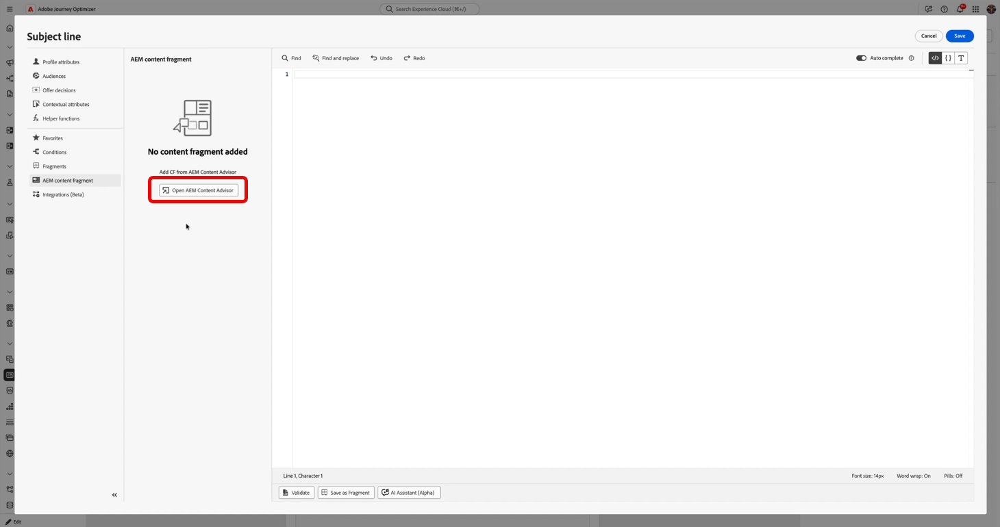
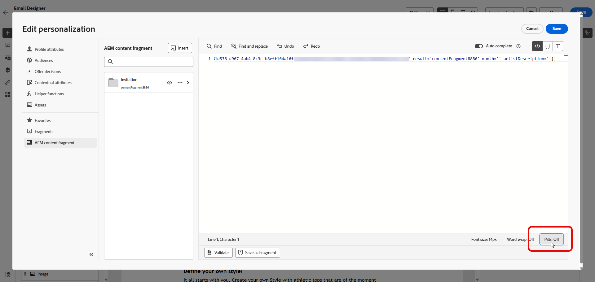
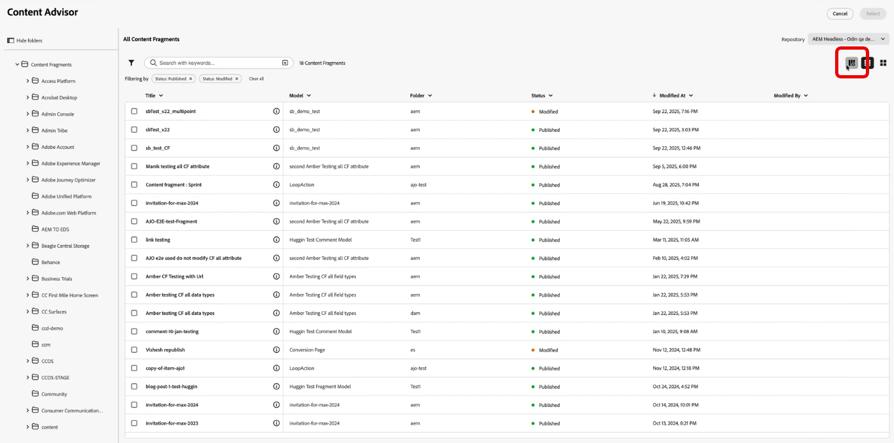
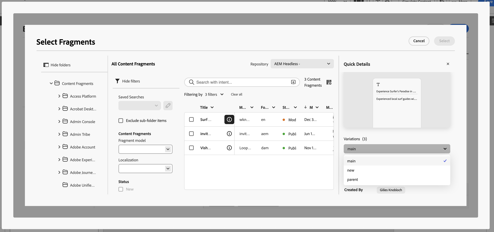

# Work with Adobe Experience Manager Content Fragments {#aem-fragments}

>[!BEGINSHADEBOX]

**On this page:** Learn how to tag, add, and personalize Adobe Experience Manager Content Fragments in Journey Optimizer campaigns and journeys, including working with variations and Experience Decisioning.

>[!ENDSHADEBOX]

>[!BEGINSHADEBOX]
 
The existing **Asset Selector** and **Content Fragment selector** experiences in Adobe Journey Optimizer workflows are being replaced by **Content Advisor**. Content Advisor provides an AI-powered, unified interface for discovering and selecting Assets, Content Fragments, and Dynamic Media directly within your AJO authoring workflows. Existing integrations will continue to work during the transition period.

>[!ENDSHADEBOX]

>[!NOTE]
>
>**AEM Content Fragments** are authored in Adobe Experience Manager and used in [!DNL Journey Optimizer]. They are different from:
>
>* **[Fragments](../content-management/fragments.md)** — reusable content components created in [!DNL Journey Optimizer] and used in emails across campaigns and journeys.
>* **[Journey Fragments](../building-journeys/journey-fragments.md)** — reusable sets of journey nodes inserted into journeys.

The integration between Adobe Experience Manager and Journey Optimizer follows this data flow:

1. **[Configure the Dispatcher](https://experienceleague.adobe.com/en/docs/experience-manager-cloud-service/content/sites/administering/content-fragments/content-fragments-with-journey-optimizer#dispatcher-configuration){target="_blank"}**: To enable Journey Optimizer to access Adobe Experience Manager Content Fragments via the Content Fragment Management API, you must first configure the Dispatcher. This is a prerequisite for the integration. 

1. **[Create and author](https://experienceleague.adobe.com/en/docs/experience-manager-cloud-service/content/sites/administering/content-fragments/managing#creating-a-content-fragment)**: Content is created and configured in Adobe Experience Manager as Content Fragments.

1. **[Tagging](https://experienceleague.adobe.com/en/docs/experience-manager-cloud-service/content/sites/administering/content-fragments/managing#manage-tags)**: Content Fragments must be tagged with the Journey Optimizer-specific tag (`ajo-enabled:{OrgId}/{SandboxName}`).

1. **[Publish](https://experienceleague.adobe.com/en/docs/experience-manager-cloud-service/content/sites/administering/content-fragments/managing#publishing-and-previewing-a-fragment)**: Content Fragments are published in Adobe Experience Manager, making them available to Journey Optimizer.

1. **[Access](#aem-add)**: Journey Optimizer fetches and displays available Content Fragments from Adobe Experience Manager publish instance in real-time.

1. **[Integration](#aem-add)**: Content Fragments are selected and integrated into campaigns or journeys.

When a Content Fragment is published in Adobe Experience Manager, an event is sent to update the content on the Journey Optimizer side. If the update is successful, the Content Fragment becomes available within approximately 5 minutes for Unitary journeys, and in the next processing batch for batch use cases. Once the update is available in Journey Optimizer, the latest published content is used across all applicable campaigns and journeys.

>[!AVAILABILITY]
>
>For Healthcare customers, the integration is enabled only upon licensing the Journey Optimizer Healthcare Shield and Adobe Experience Manager Extended Security for Healthcare add-on offerings.

## Create and assign a tag in Experience Manager {#create-tag}

>[!IMPORTANT]
>
>To enable Journey Optimizer to access Adobe Experience Manager Content Fragments via the Content Fragment Management API, you must first [configure the Dispatcher](https://experienceleague.adobe.com/en/docs/experience-manager-cloud-service/content/sites/administering/content-fragments/content-fragments-with-journey-optimizer#dispatcher-configuration){target="_blank"}.

Journey Optimizer displays a Content Fragment in the Content Fragment selector only when it carries a tag for your **organization** and **sandbox**. That requirement is deliberate: it keeps unrelated or unapproved Experience Manager content out of Journey Optimizer.

Assign a tag whose ID follows `ajo-enabled:{AJO-OrgId}/{AJO-SandboxName}`, using your Journey Optimizer organization ID and sandbox name in place of the placeholders, for example, `ajo-enabled:123A12A123A123A12A@AdobeOrg/prod`.

To create the tag in Experience Manager:

1. Go to **Tools** > **Tagging**.

    

1. Create a nested tag structure so the full tag ID matches the format above:

    1. At the root level, create a folder named `ajo-enabled`.

    1. Under `ajo-enabled`, create a tag for your organization ID, for example, `123A12A123A123A12A@AdobeOrg`.

    1. Under that organization tag, create a tag for your sandbox, for example, `prod`.

    The combined path yields a tag ID such as `ajo-enabled:123A12A123A123A12A@AdobeOrg/prod`.

1. To apply it to a Content Fragment, open the Content Fragment in the editor.

1. In **Properties**, add the tag you created.

1. Save the fragment.

➡️ [Learn more about Tags in Adobe Experience Manager documentation](https://experienceleague.adobe.com/en/docs/experience-manager-cloud-service/content/sites/administering/content-fragments/managing#manage-tags)

## Add Experience Manager Content fragments {#aem-add}

After creating and personalizing your AEM Content Fragments, you can now import it to your Journey optimizer campaign or journey.

1. Create your [Campaign](../campaigns/create-campaign.md) or [Journey](../building-journeys/journey-gs.md).

1. To access your AEM content fragment, click  within any text field, or open the source code through an HTML content component.

    

1. From the **[!UICONTROL AEM Content Fragment]** menu in the left-pane, click **[!UICONTROL Open AEM Content Advisor]**.

    

1. Browse the list and select a **[!UICONTROL Content Fragment]** to import into your Journey Optimizer content.

    >[!NOTE]
    >
    > If the fragment has one or more **published** variations, a **[!UICONTROL Variation]** dropdown appears in the selector. If no **[!UICONTROL Variation]** is selected, the **Main** variation is used automatically. Learn more in [Working with Content Fragment variations](#aem-variations).

1. Click **[!UICONTROL Show filters]** to fine tune your Content Fragments list. 

    By default, the Content Fragment filter is preset to display only approved Content.

    

1. After selecting your **[!UICONTROL Content Fragment]**, click **[!UICONTROL Select]** to add it.

    

1. Click **[!UICONTROL View fragment]** to display your Fragment information. Note that opening the **[!UICONTROL Fragment Info]** menu places the editor in read-only mode.

    Select **[!UICONTROL Preview]** from the right-hand menu to view your fragment in Adobe Experience Manager.

    

1. Click  to access the advanced menu of your Fragment:

    * **[!UICONTROL Swap fragment]**
    * **[!UICONTROL Explore references]**
    * **[!UICONTROL Open in AEM]**

    

1. Choose the desired fields from your **[!UICONTROL Fragment]** to add to your content.

    <!--
    Note that if you choose to copy the value, any future updates to the Content Fragment will not be reflected in your campaign or journey. However, using dynamic placeholders ensures real-time updates.
    
    -->

    

1. To surface an image URL that is stored in a Content Fragment attribute, e.g. a path or URL field from the fragment model, insert it in your HTML with an `` tag and the fragment attribute as the source, for example:

    ```html
    
    ```

    >[!NOTE]
    >
    >Relative image URLs from Adobe Experience Manager are not supported, use **absolute** URLs.

1. Select **Pills: Off** to enable the pills experience to improve readability by hiding long attribute paths. 

    

1. To use **personalization placeholders** authored in Adobe Experience Manager inside your fragment text, define them in the Content Fragment in Adobe Experience Manager as follows: `{{name}}`. 

    In Journey Optimizer, those tokens are placeholders. With the **pills** experience on, they appear in the **[!UICONTROL AEM Content Fragment]** section of the right rail alongside fragment fields.

1. To enable real-time personalization, all placeholders used within a **[!UICONTROL Content fragment]** must be explicitly declared by the user as parameters in the fragment helper tag. Map those placeholders to profile attributes, contextual attributes, static strings, or predefined variables as follows:

    1. **Profile or Contextual Attribute Mapping**: Assign the placeholder to a profile or contextual attribute, e.g. name = profile.person.name.firstName.

    1. **Static String Mapping**: Assign a fixed string value by placing it within double quotes, e.g. name = "John".

    1. **Variable Mapping**: Reference a variable declared earlier within the same HTML, e.g. name = 'variableName'.
    In this case, ensure **_variableName_** is declared before adding the fragment ID, using following syntax:

        ```html
         
        ```

    In the example below, the **_month_** placeholder is mapped to the **_profile.person.birthDate_** attribute within the fragment.

    {zoomable="yes"}

1. Click **[!UICONTROL Save]**. You can now test and check your message content as detailed in [this section](../content-management/preview.md).

    Note that the Content Fragment you selected stays active for this message. When you open the Personalization Editor in another field or content block, you can keep working with the same fragment from the **[!UICONTROL AEM Content Fragment]** section and add more fields without reopening **[!UICONTROL Open AEM Content Advisor]**.

Once you have performed your tests and validated the content, you can [send your campaign](../campaigns/review-activate-campaign.md) or [publish your journey](../building-journeys/publish-journey.md) to your audience.

Adobe Experience Manager allows you to identify the Journey Optimizer campaigns or journeys where a Content Fragment is being used. Learn more in [Adobe Experience Manager documentation](https://experienceleague.adobe.com/en/docs/experience-manager-cloud-service/content/sites/administering/content-fragments/extension-content-fragment-ajo-external-references){target="_blank"}. 

## Use AEM Content Fragments with Experience Decisioning {#aem-decisioning}


>[!AVAILABILITY]
>
>This feature is available for channels with Decisioning support.

AEM Content Fragments can also be used as offer item attributes in **Experience Decisioning**. By mapping Content Fragment fields to decision item attributes, you can use Journey Optimizer decisioning models, formulas, and ranking criteria to optimize which fragment is served to each profile.

### Prerequisites and guardrails

* Content Fragments must be tagged in Adobe Experience Manager with the `ajo-enabled:{OrgId}/{SandboxName}` tag before they appear in the decisioning selector. [Learn how to create and assign a tag](#create-tag)
* Only Content Fragments in a **published** state are available.
* You can add up to **five** AEM Content Fragments to a single decision item.

### Leverage AEM Content Fragments in Decisioning

Once the AEM Content Fragment has been created and published, you need to:

1. Tie it to a decision item by selecting it in the decision item's attributes.
1. Leverage it in a decision policy to surface the right content to the right customer.

➡️ [Tie an AEM Content Fragment to a decision item](../experience-decisioning/items.md#aem-fragments)

➡️ [Leverage AEM Content Fragments in a decision policy](../experience-decisioning/fragments-decision-policies.md#aem-fragments-decisioning)

## Working with content fragment variations {#aem-variations}

In Adobe Experience Manager, each Content Fragment is made up of the following:

* **Main**: the core content of the fragment which always exists, cannot be deleted, and is the basis for all variations.
* **Variations**: one or more permutations of **Main** that authors create for specific channels or scenarios. Variations live inside the fragment not as separate assets and can be compared and synchronized with **Main**.

Examples of variation use cases:

* A short version of copy for a push notification and a longer version for email.
* Regional tone adjustments without creating a separate fragment.
* Channel-specific messaging (for example web compared to mobile).

➡️ [Learn more in Adobe Experience Manager documentation](https://experienceleague.adobe.com/en/docs/experience-manager-65/content/assets/content-fragments/content-fragments-variations)

Journey Optimizer lets you choose which variation to use when you insert a fragment, so different campaigns or journeys can rely on different renditions of the same source content in Adobe Experience Manager without duplicating fragments.

To select a variation:

1. Open a [campaign](../campaigns/create-campaign.md) or [journey](../building-journeys/journey-gs.md). 

1. Click  in any text field, or open the HTML source from an HTML content component.

1. From **[!UICONTROL AEM Content Fragment]**, click **[!UICONTROL Open AEM Content Advisor]**.

    

1. To select a locale-specific Adobe Experience Manager Content Fragment in table view, use **[!UICONTROL Customize table]** to add the **[!UICONTROL Language]** column. Locale values are displayed in the table, enabling you to identify and select the appropriate fragment.

    

1. Select your **[!UICONTROL Content Fragment]**.

1. Click the  to open **[!UICONTROL Details]** menu. If the fragment has one or more published variations, a **[!UICONTROL Variation]** dropdown appears next to the fragment details.

    

1. From the **[!UICONTROL Quick details]** menu, click **[!UICONTROL Explore references]** to open related options in Adobe Experience Manager for variation details, preview, and proof when available.

1. Choose your variation, then click **[!UICONTROL Select]**.

    >[!NOTE]
    >
    > If you do not select a variation, or if the fragment was added before variation support was available, Journey Optimizer uses the **Main** variation automatically at delivery time.

After you insert a fragment with a variation, republishing it in Adobe Experience Manager updates every **referenced variation** in active campaigns or journeys automatically. Previews and proofs still use the variation you chose, with the latest published content for that variation.
