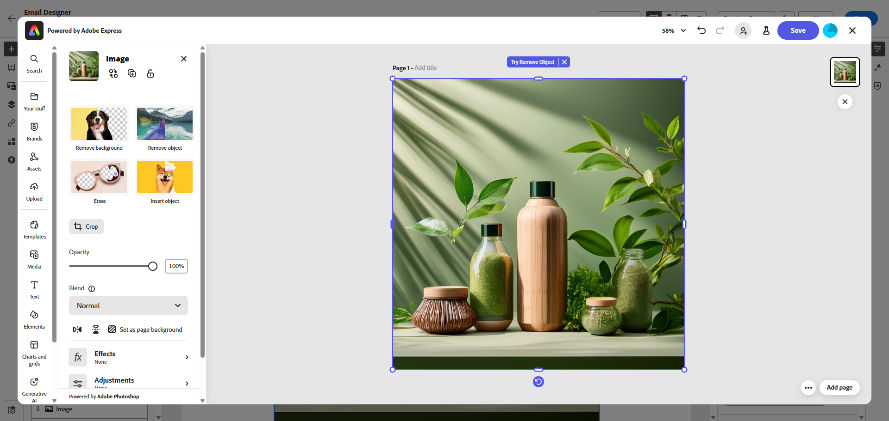

# Edit assets with [!DNL Adobe Express]{#express}

>[!CONTEXTUALHELP]
>id="ajo_express_menu"
>title="Adobe Express integration"
>abstract="Begin personalizing your assets with the Adobe Express integration. This feature allows you to resize images, remove backgrounds, crop visuals, and convert assets to JPEG or PNG."

The Adobe Express integration in Adobe Journey Optimizer allows you to easily access Adobe Express's powerful editing tools while creating content. This integration enables you to resize images, remove backgrounds, crop visuals, and convert assets to JPEG or PNG without needing to switch between solutions. 

>[!AVAILABILITY]
>
>Adobe Express integration in Adobe Journey Optimizer is currently unavailable for use with Healthcare Shield or Privacy and Security Shield.

To learn more about Adobe Express, refer to [this documentation](https://helpx.adobe.com/express/user-guide.html).

To access the **[!DNL Adobe Express]** menu, access your **Image settings** from the Email Designer and click **[!UICONTROL Edit in Adobe Express]**.

➡️ [Discover this feature in video](#video) 

## Using Adobe Express with an enterprise license {#licence}

The features detailed in the sections below are accessible to users without an Adobe Express Enterprise license.

With an Enterprise license, users have full access to the Adobe Express Web editor, enabling them to adjust asset settings, generate content with Firefly, add text, and apply additional customizations.

For more information on available use cases for users with an Enterprise license for Adobe Express, refer to [Adobe Express Web documentation](https://helpx.adobe.com/express/web.html).

## Using Adobe Express without an enterprise license  {#edit}

Without an Enterprise license, users have access to the following use cases available with Adobe Express:

* [Resize Image](#resize)
* [Remove Background](#background)
* [Crop Image](#crop-image)
* [Convert to JPEG or PNG](#convert)

### Resize Image {#resize}

1. From the Adobe Express menu, select **[!UICONTROL Resize image]**.

    

1. Select the **[!UICONTROL Aspect ratio]** that best fits your asset's proportions.

    

1. Use the slider to zoom and crop your asset, and drag to pan and adjust the visible area.

    

1. Click **[!UICONTROL Reset]** to restore your asset to its original state.

1. Click **[!UICONTROL Apply]** once the image resizing meets your needs. Then, **[!UICONTROL Save]** your modified asset. 

1. In the **[!UICONTROL Upload Image]** window, click **[!UICONTROL Next]** and select a folder to store your modified asset. 
    
    Then, click **[!UICONTROL Import]**.

Your image is now ready to be used in your content.

### Remove Background {#background}

1. From the Adobe Express menu, select **[!UICONTROL Remove background]**.

    

1. You asset is automatically displayed without its background. 

    Click **[!UICONTROL Apply]** to use this in your content.

    

1. Click **[!UICONTROL Save]**. 

1. In the **[!UICONTROL Upload Image]** window, click **[!UICONTROL Next]** and select a folder to store your modified asset. 
    
    Then, click **[!UICONTROL Import]**.

Your image is now ready to be used in your content.

### Crop Image {#crop-image}

1. From the Adobe Express menu, select **[!UICONTROL Crop image]**.

    

1. Drag the corner handles to adjust and crop the image as needed.

    

1. Click **[!UICONTROL Apply]** to use this in your content. Then, **[!UICONTROL Save]** your modified asset. 

1. In the **[!UICONTROL Upload Image]** window, click **[!UICONTROL Next]** and select a folder to store your modified asset. 
    
    Then, click **[!UICONTROL Import]**.

Your image is now ready to be used in your content.

### Convert to JPEG or PNG {#convert}

1. From the Adobe Express menu, select **[!UICONTROL Convert to JPEG]** or **[!UICONTROL Convert to PNG]** depending on your image original format.

    

1. Click **[!UICONTROL Apply]** to start the conversion.

    

1. Click **[!UICONTROL Save]**. 

1. With the format change, you can save it as a new image with a different name. Update the **[!UICONTROL Name]** and click **[!UICONTROL Save]**.

    

1. In the **[!UICONTROL Upload Image]** window, click **[!UICONTROL Next]** and select a folder to store your modified asset. 
    
    Then, click **[!UICONTROL Import]**.

Your image is now ready to be used in your content.

## How-to video {#video}

Learn how to edit your assets in Adobe Journey Optimizer using Adobe Express tools.

>[!VIDEO](https://video.tv.adobe.com/v/3455523/?quality=12)

