# Work with Integrations {#external-sources}

>[!BEGINSHADEBOX]

Table of content:

* **[Work with Integrations](using/integrations/external-sources.md)**
* [Get started with Vendors integration](using/integrations/vendor-integration.md)
* [Available vendors](using/integrations/vendor-integration.md)
* [FAQ](using/integrations/vendor-integration-faq.md) 

>[!ENDSHADEBOX]

## Overview

The **Integrations** feature enables seamless integration of third-party data sources into Adobe Journey Optimizer. This feature streamlines the integration of external data and content sources into your campaigns, empowering you to deliver highly personalized and dynamic messaging across multiple channels.

You can use this feature to access external data and pull content from third-party tools such as:

* **Rewards Points** from loyalty systems.
* **Price Information** for products.
* **Product Recommendations** from recommendation engines.
* **Logistics Updates** like delivery status.

## Beta limitations {#limitations}

The beta release has the following limitations:

* Outbound channels are supported only.

* Only JSON format is supported for API call responses. HTML and raw binary image outputs are not available.

* Only retrieval APIs targeting specific content are supported, listing APIs are not available.

* Integrations feature is available for both Journeys and Campaigns but is not supported in Fragments.

## Configure your Integration {#configure}

As an administrator, you can set up external integrations by following these steps:

1. Navigate to the **[!UICONTROL Configurations]** section in the left menu and click **[!UICONTROL Manage]** from the **[!UICONTROL Integrations]** card.
    
    Then, click **[!UICONTROL Create Integration]** to start a new configuration.

    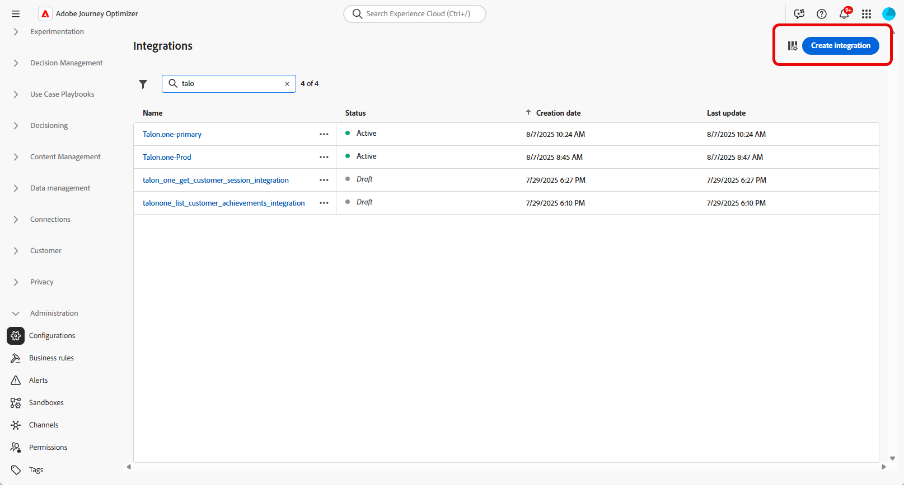

1. Provide a **[!UICONTROL Name]** and **[!UICONTROL Description]** for your integration. 

    >[!NOTE]
    >
    >These fields cannot contain spaces.

1. Enter the API endpoint **[!UICONTROL URL]**, which may include path parameters with variables that can be defined using labels and default values.

1. Configure the **[!UICONTROL Path Template]** with **[!UICONTROL Name]** and **[!UICONTROL Default value]**.

    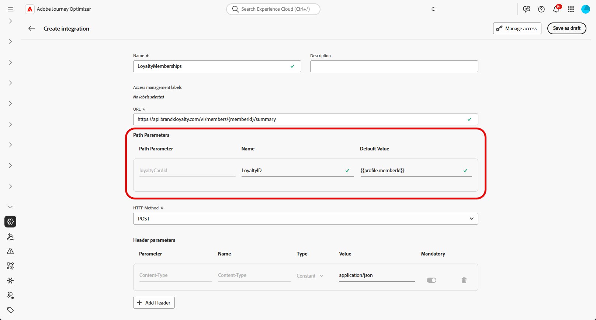

1. Select the **[!UICONTROL HTTP Method]** between GET and POST.

1. Click **[!UICONTROL Add Header]** and/or **[!UICONTROL Add Query Parameters]** as needed for your integration. For each parameter, provide the following details:

    * **[!UICONTROL Parameter]**:: A unique identifier used internally to reference the parameter.

    * **[!UICONTROL Name]**: The actual name of the parameter as expected by the API.

    * **[!UICONTROL Type]**: Choose **Constant** for a fixed value or **Variable** for dynamic input.

    * **[!UICONTROL Value]**: Enter the value directly for constants, or select a variable mapping.

    * **[!UICONTROL Mandatory]**: Specify whether this parameter is required.

    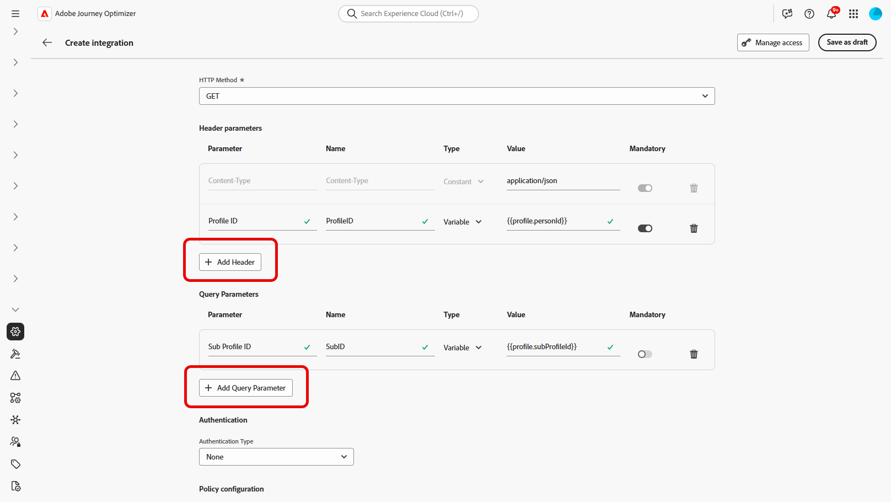

1. Choose an **[!UICONTROL Authentication Type]**:

    * **[!UICONTROL No Authentication]**: For open APIs that do not require any credentials.

    * **[!UICONTROL API key]**: Authenticate requests using a static API key. Enter your **[!UICONTROL API Key Name ​]**, **[!UICONTROL API Key Value ​]** and specify your **[!UICONTROL Location]**.

    * **[!UICONTROL Basic Auth]**: Use standard HTTP Basic Authentication. Enter **[!UICONTROL Username]** and **[!UICONTROL Password]**.

    * **[!UICONTROL OAuth 2.0]**: Authenticate using the OAuth 2.0 protocol. Click the  icon to configure or update the **[!UICONTROL Payload]**.

    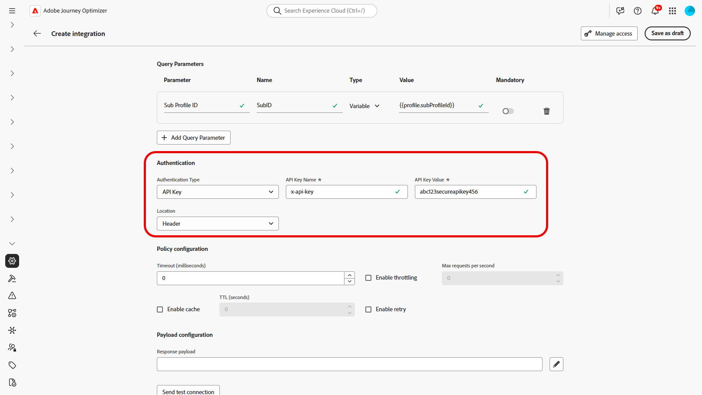

1. Set  **[!UICONTROL Policy configuration]** such **[!UICONTROL Timeout]** period for API requests and choose to enable throttling, cache and/or retry.

1. With the **[!UICONTROL Response payload]** field, you can decide which fields of the sample output needs to be used for message personalization. 
    
    Click the  icon and paste a sample JSON response payload to automatically detect data types.

1. Choose the fields to expose for personalization and specify their corresponding data types.

    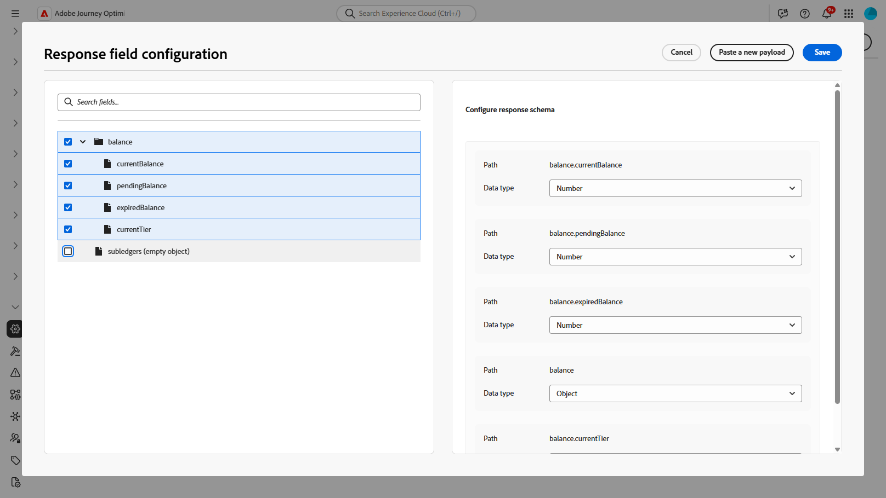

1. Use **[!UICONTROL Send test connection]** to validate the integration.
    
    Once validated, click **[!UICONTROL Activate]**.

## Using External integrations for personalization {#personalization}

As a marketer, you can use configured integrations to personalize your content. Follow these steps:

1. Access your campaign content and click **[!UICONTROL Add personalization]** from your Text or HTML **[!UICONTROL Components]**. 

    [Learn more on components](../email/content-components.md)

    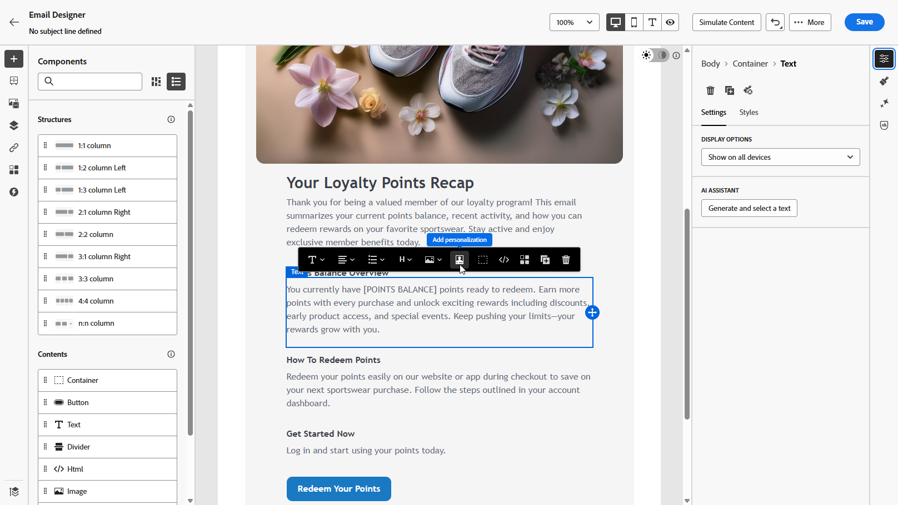

1. Navigate to the **[!UICONTROL Integrations]** section and click **[!UICONTROL Open integrations]** to view all active integrations.

    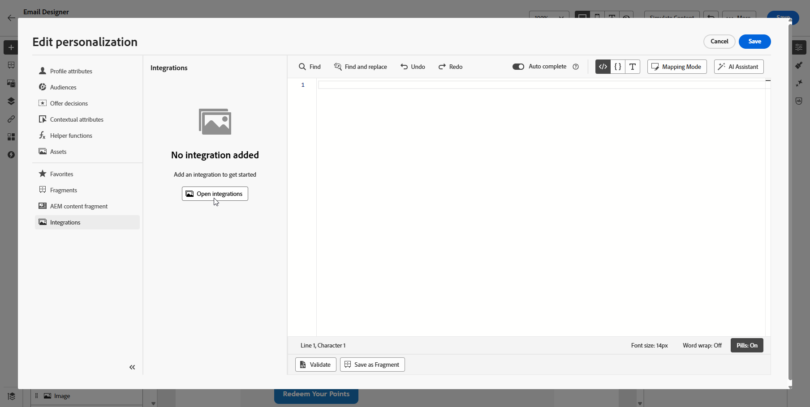

1. Select an integration and click **[!UICONTROL Save]**.
    
    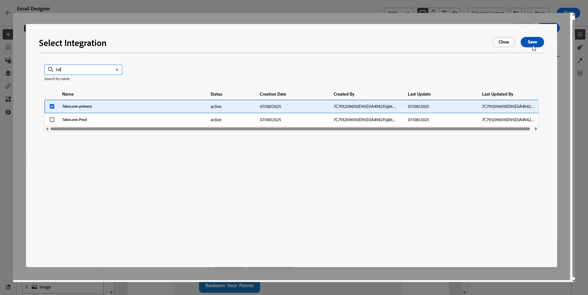

1. Enable the **[!UICONTROL Pills]** mode to unlock the advanced integration menu.

    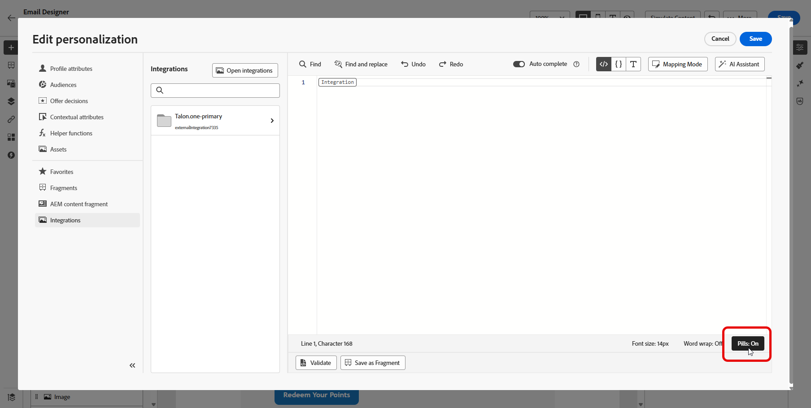

1. To complete your integration setup, define your integration attributes, which were previously specified during [configuration](#configure). 

    You can assign values to these attributes using either static values, which remain constant, or profile attributes, which dynamically pull information from user profiles.

    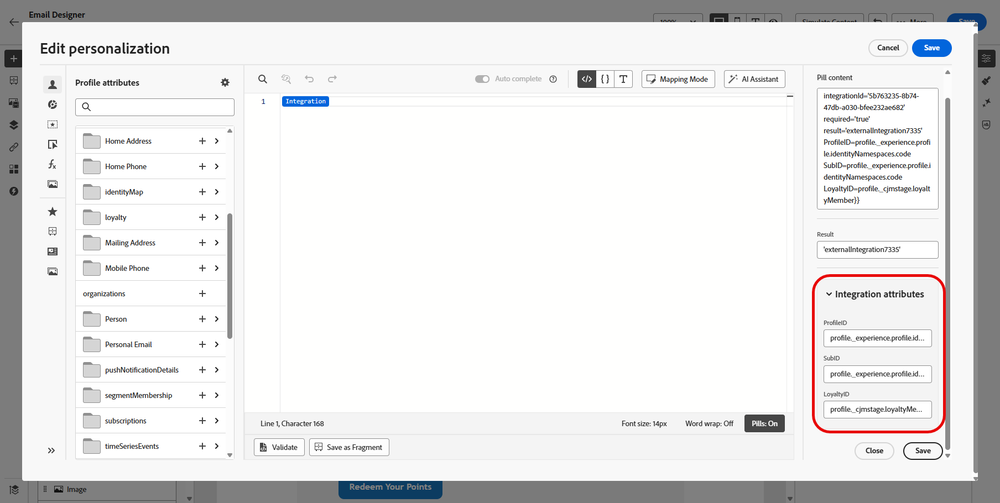

1. Once integration attributes are defined, you can now use the integration fields in your content for personalized messaging by clicking the  icon.

    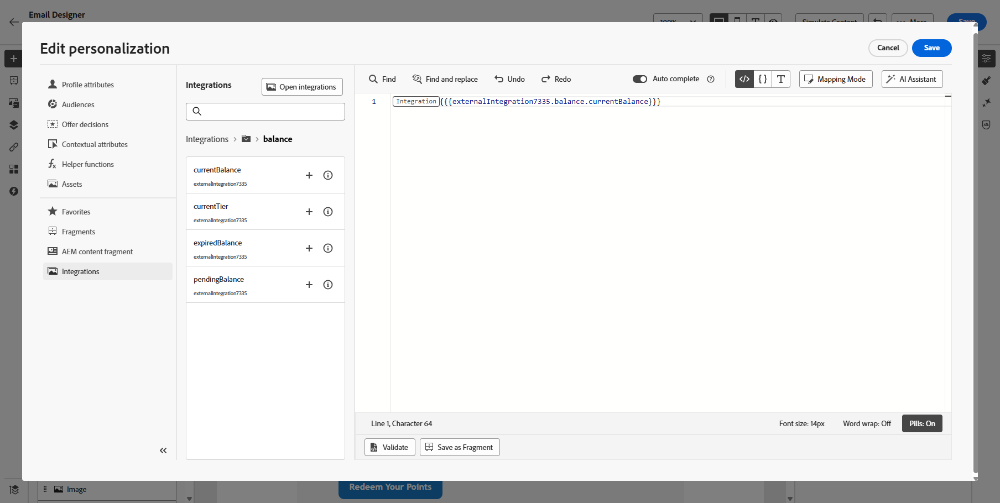

1. Click **[!UICONTROL Save]**.

Your integration personalization is now successfully applied to your content, ensuring each recipient receives a tailored, relevant experience based on the attributes you have configured.

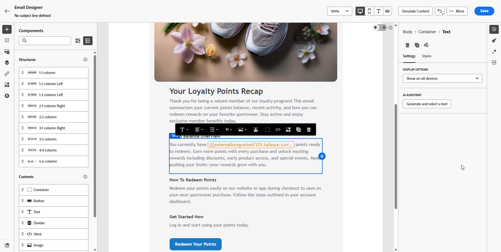
