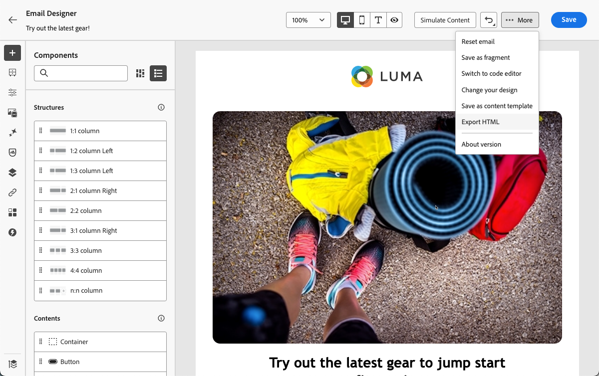
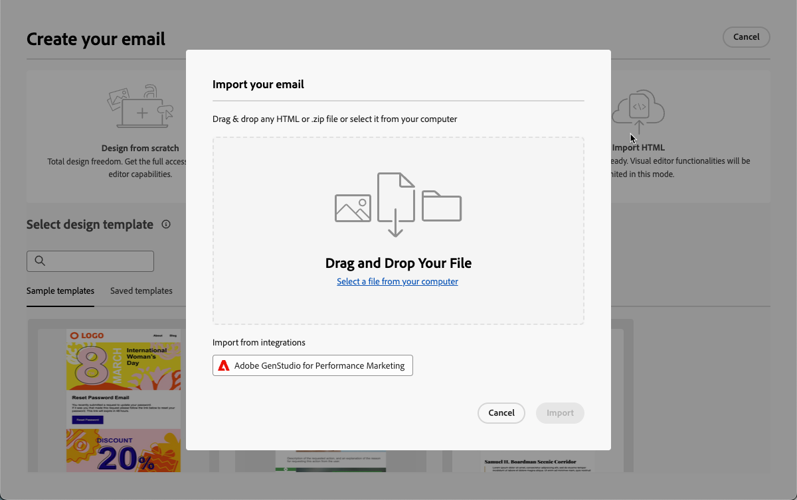
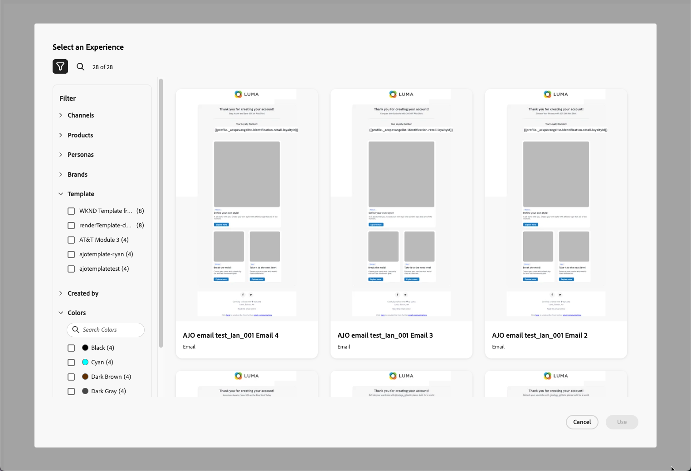
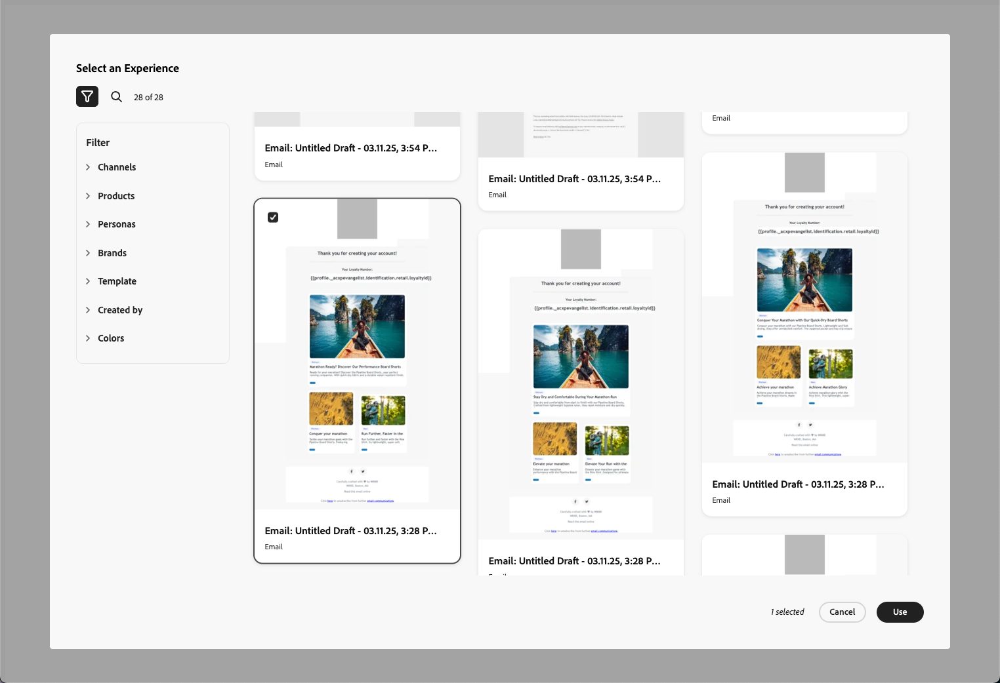
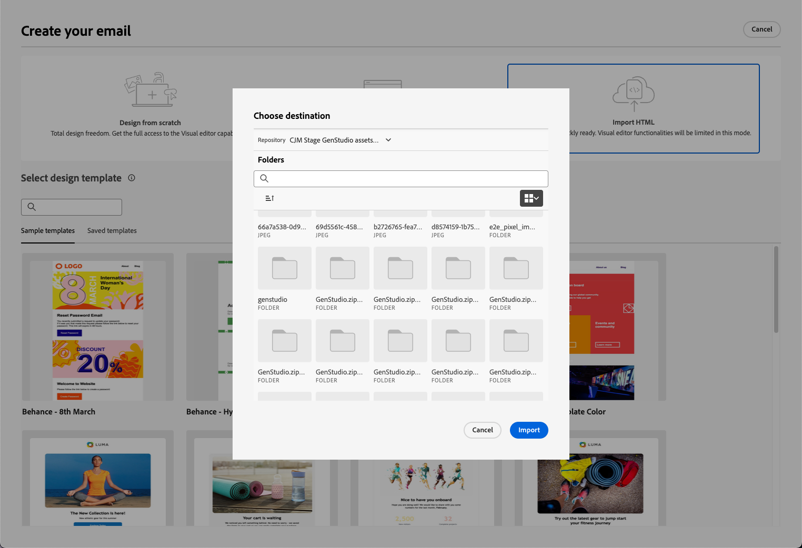
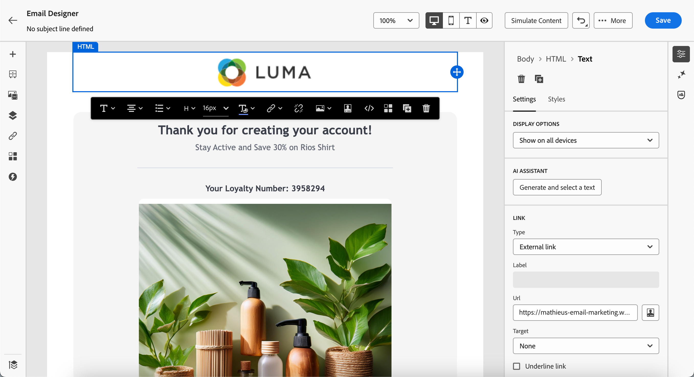
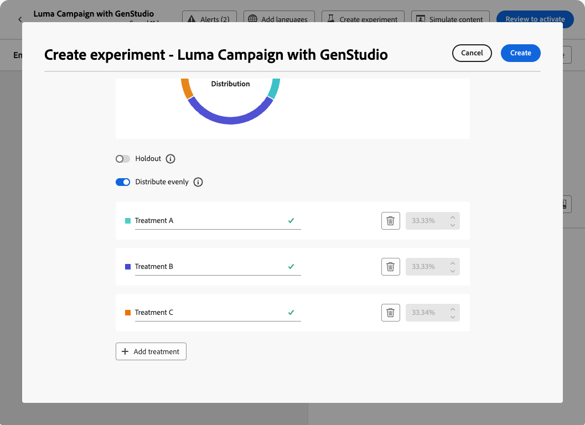
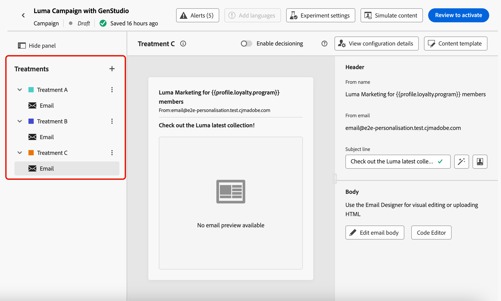

# Get started with the GenStudio integration {#gs-genstudio}

>[!CONTEXTUALHELP]
>id="ajo_genstudio_button"
>title="Use a template built with GenStudio"
>abstract="Thanks to the seamless integration with Adobe GenStudio for Performance Marketing, you can easily import a GenStudio template enhanced with the Adobe AI technology."

>[!AVAILABILITY]
>
>The GenStudio integration in [!DNL Adobe Journey Optimizer] is currently unavailable for use with the **Healthcare Shield** or **Privacy and Security Shield** add-on offerings.
>
>The GenStudio integration is available for the email channel only.

[Adobe GenStudio for Performance Marketing](https://business.adobe.com/products/genstudio-for-performance-marketing.html){target="_blank"} is a generative AI-first application that lets marketing teams create their own ads and emails to drive impactful, personalized marketing campaigns that adhere to your brand standards and complies with your enterprise policies. By leveraging Adobe AI technology, it provides a comprehensive suite of tools that simplify the complexities of content creation and management so that creatives can focus on innovation.

Learn more on [!DNL GenStudio for Performance Marketing] in the dedicated [documentation](https://experienceleague.adobe.com/en/docs/genstudio-for-performance-marketing/user-guide/home){target="_blank"}.

>[!INFO]
>
>To go further, check out this [overview](https://business.adobe.com/products/genstudio-for-performance-marketing.html#watch-overview){target="_blank"} and a [demo](https://business.adobe.com/products/genstudio-for-performance-marketing.html#demo){target="_blank"} of [!DNL Adobe GenStudio for Performance Marketing].
 
<!--To access the GenStudio integration in [!DNL Adobe Journey Optimizer] feature, users need to be granted the **xxx** permission. [Learn more](../administration/permissions.md)

>[!IMPORTANT]
>
>* Before starting using this capability, read out related [Guardrails and Limitations](#generative-guardrails).-->

To enhance marketing efficiciency and to maintain brand consistency, you can seamlessly integrate [!DNL **GenStudio for Performance Marketing**] experiences with [!DNL **Adobe Journey Optimizer**]. This enable you to leverage [!DNL GenStudio]'s AI-power content creation alongside [!DNL Journey Optimizer]'s advanced orchestration capabilities.

<!---->

<!--Guardrails and limitations {#genstudio-guardrails}

General guidelines for using the GenStudio integration in [!DNL Adobe Journey Optimizer] for email generation are listed below:

See if guidelines/limitations such as the ones listed [here](gs-generative.md#generative-guardrails) for the AI Assistant can apply.

The following limitations apply to GenStudio integration in [!DNL Adobe Journey Optimizer]:-->

## Leverage the GenStudio capabilities in Journey Optimizer {#use-genstudio}

The [!DNL GenStudio for Performance Marketing] and [!DNL Journey Optimizer] integration enables you to have marketers from your company work better together to streamline processes.

For example, a technical marketer, who uses [!DNL Journey Optimizer] to develop and automate email campaigns, can collaborate with a performance marketer who creates content using [!DNL GenStudio].

With this integration, both can work together to easily integrate on-brand content from [!DNL GenStudio] into [!DNL Journey Optimizer], delivering engaging emails that target specific customer segments and drive sales.

### Export an HTML template from Journey Optimizer to GenStudio {#export-from-ajo-to-genstudio}

First, you can export a [!DNL Journey Optimizer] HTML template including your brand's guidelines to [!DNL GenStudio for Performance Marketing]. Follow the steps below.

1. In [!DNL Journey Optimizer], access the content of your email in a journey or campaign. [Learn how](../email/get-started-email-design.md#key-steps)

1. In the Email Designer, select **[!UICONTROL Export HTML]** from the **[!UICONTROL More]** button.

    {zoomable="yes"}

1. Upload this HTML exported template into [!DNL GenStudio for Performance Marketing]. <!--Make sure you detect the fields that the generative AI uses to insert content in order to create an actionable template.-->

    >[!NOTE]
    >
    >Learn how to upload an HTML template into [!DNL GenStudio] in the [Adobe GenStudio for Performance Marketing User Guide](https://experienceleague.adobe.com/en/docs/genstudio-for-performance-marketing/user-guide/content/templates/use-templates#templates-from-ajo-and-marketo){target="_blank"} dedicated section.

1. In GenStudio, use this template to create several email variations with AI prompts and save them.

    >[!NOTE]
    >
    >Learn how to create email experiences in the GenStudio dedicated [section](https://experienceleague.adobe.com/en/docs/genstudio-for-performance-marketing/user-guide/create/create-email-experience){target="_blank"}.
 
### Leverage GenStudio experiences in Journey Optimizer {#leverage-genstudio-experiences}

To leverage the [!DNL GenStudio] email variations that you just created by importing them into [!DNL Journey Optimizer], follow the steps below.

1. In [!DNL Journey Optimizer], [add an email](../email/create-email.md) to a campaign.

1. From the campaign configuration screen, go through the [Edit content screen](../email/create-email.md#define-email-content) and click **[!UICONTROL Edit email body]** to open the Email Designer. [Learn how](../email/get-started-email-design.md#key-steps)

1. On the Email Designer home page, select **[!UICONTROL Import HTML]** and click the **[!UICONTROL Adobe GenStudio for Performance Marketing]** button.

    {zoomable="yes"}

1. Browse the GenStudio experiences to start building your content. You can filter the experiences on several criteria such as products, personas, brands, or even colors.

    <!--{zoomable="yes"}-->

1. Select an experience and click **[!UICONTROL Use]**.

    {zoomable="yes"}

1. Select the folder where you want to import the GenStudio experience.

    {zoomable="yes"}

1. The selected content displays in the Email Designer.

    {zoomable="yes"}

    >[!NOTE]
    >
    >GenStudio experiences [created from a [!DNL Journey Optimizer] template](#export-from-ajo-to-genstudio) are imported directly into the Email Designer. GenStudio experiences created without a [!DNL Journey Optimizer] template are imported into [compatibility mode](../email/existing-content.md).

    Use the [email content editing tools](../email/content-from-scratch.md) and [personalization fields](../personalization/personalize.md) to edit your email as wanted. Save your content.

1. Go back to the campaign summary page, and click **[!UICONTROL Create experiment]** to use experimentation. [Learn how to create a content experiment](../content-management/content-experiment.md)

    <!--{zoomable="yes"}-->

1. Create several treatments and repeat the steps above to import and quickly leverage the other email experience variations that you created in [!DNL GenStudio].

    {zoomable="yes"}

1. Save your changes and [activate](../campaigns/review-activate-campaign.md) the campaign.

After running the experiment, track how your campaign treatments are performing with the [experimentation campaign report](../reports/campaign-global-report-cja-experimentation.md). You can then interpret the results of your experiment. [Learn how](../content-management/get-started-experiment.md#interpret-results)