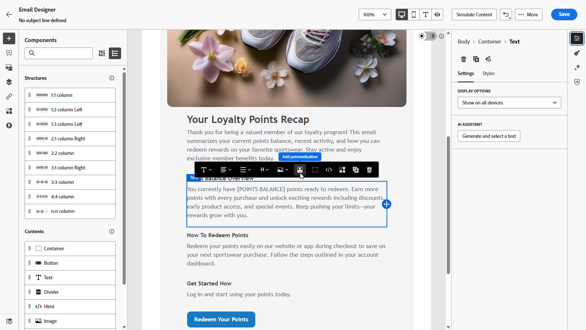

# Work with Browsing integrations {#Browsing}

>[!BEGINSHADEBOX]

**On this page:** Learn how administrators configure Browsing integrations that let marketers search, browse, and select items from external APIs directly in the authoring experience, and how to link them to Standard integrations.

>[!ENDSHADEBOX]

In addition to Standard integrations, you can create **Browsing** integrations. A Browsing integration lets marketers search, browse, and paginate through items returned by an external API, then select a specific item directly in the authoring experience instead of manually entering a parameter value.

## Create a Browsing integration {#create-browsing}

As an administrator, you create a Browsing integration from the **[!UICONTROL Browsing]** tab of the **[!UICONTROL Integrations]** configuration, using the same [step-by-step instructions](integrations-create.md#configure) as for Standard integrations. 

Once the integration information is provided, configure the following Browsing-specific settings:

1. From the **[!UICONTROL Items configuration]** menu, choose the **[!UICONTROL Items path]** where the list of items is located.

    

1. In the **[!UICONTROL Search configuration]** drop-down, **[!UICONTROL Enable search]** and select which parameter carries the search query, then provide a description for marketers.

    

1. In the **[!UICONTROL Pagination configuration]** menu, enable **[!UICONTROL Pagination]** and choose a pagination type:

    * +++ Offset

        Fill in the following details for Offset pagination: 

        * **[!UICONTROL Total path]**: Path to the total result count in the response body
        * **[!UICONTROL Offset parameter]**: Request parameter for the number of items to skip
        * **[!UICONTROL Limit parameter]**: Request parameter for the number of items to return
        * **[!UICONTROL Page size]**: Number of items requested per page
        
        

        +++

    * +++ Page

        Fill in the following details for Page pagination: 

        * **[!UICONTROL Total path]**: Path to the total result count in the response body
        * **[!UICONTROL Page parameter]**: Request parameter for the page number
        * **[!UICONTROL Page size parameter]**: Request parameter for the number of items per page
        * **[!UICONTROL Page size]**: Number of items requested per page
        * **[!UICONTROL First page is]**: Whether the first page in the sequence is numbered 0 or 1
        * **[!UICONTROL Total pages path]**: Path to the total page count in the response body. This field is optional if the total count path is provided.

        

        +++

    * +++ Cursor

        Fill in the following details for Cursor pagination: 

        * **[!UICONTROL Total path]**: Path to the total result count in the response body
        * **[!UICONTROL Cursor parameter]**: Request parameter that carries the cursor value
        * **[!UICONTROL Limit parameter]**: Request parameter for the number of items to return
        * **[!UICONTROL Page size]**: Number of items requested per page
        * **[!UICONTROL Next cursor source]**: Where the next cursor value is read from in the response
        * **[!UICONTROL Next cursor path]**: Path to the next cursor value in the response body

        

        +++

1. From the **[!UICONTROL Render]** menu, choose how items are displayed to marketers:

    * +++ Table

        For each column, choose the **[!UICONTROL Label]** and the **[!UICONTROL Data path]**. Optionally, select **[!UICONTROL Quick map]** to add several fields as columns at once.

        You can reorder columns as needed, or select  to remove a column.

        

        +++

    * +++ List

        Fill in the following details:

        * **[!UICONTROL Primary path]**: Data key for the main label of each item
        * **[!UICONTROL Secondary path]**: Data key for the subtitle
        * **[!UICONTROL Tag path]**: Data key for the tag badge

        

        +++

    * +++ Avatar

        Fill in the following details:

        * **[!UICONTROL Name path]**: Data key for the display name shown below the avatar
        * **[!UICONTROL Image path]**: Data key for the avatar image URL (optional — initials shown as fallback)
        * **[!UICONTROL Description path]**: Data key for the subtitle shown below the name

        

        +++

1. Click **[!UICONTROL Test browsing]** to preview the search and pagination behavior with the configured settings.

1. Save the Browsing integration, then click **[!UICONTROL Publish]** and **[!UICONTROL Activate]**.

## Link a Browsing integration to a Standard integration {#use-Browsing}

You can let marketers pick an item from a Browsing integration to populate a parameter value in a Standard integration.

1. While configuring a parameter on a Standard integration, enable **[!UICONTROL Browsing]**.

1. Choose the Browsing integration to link.

    

1. Save and publish the Standard integration.

## Select items during authoring {#select-Browsing-items}

When a parameter is linked to a Browsing integration, marketers can pick its value from a selector in the message or journey editor, rather than typing it manually.

1. Access your campaign content and click **[!UICONTROL Add personalization]** from your Text or HTML **[!UICONTROL Components]**. 

    [Learn more on components](../email/content-components.md)

    

1. Navigate to the **[!UICONTROL Integrations]** section and click **[!UICONTROL Open integrations]** to view all active integrations.

    

1. Select an integration.

1. Search and browse the paginated list of items returned by the Browsing integration, then select the item you want and confirm your selection.

    The corresponding **[!UICONTROL Reference path]** value is then automatically inserted into the integration parameter.

    

1. Click **[!UICONTROL Save]**.

**See also**

* [Work with Standard integrations](integrations-create.md)
* [Integrations troubleshooting FAQ](vendor-integration-faq.md#troubleshooting)
* [Monitoring & Troubleshooting](../../rp_landing_pages/troubleshoot-journey-landing-page.md)
