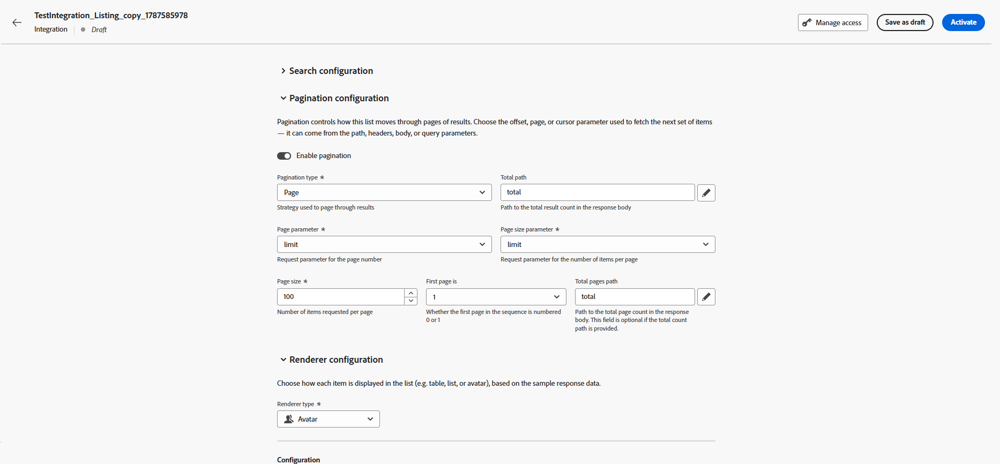
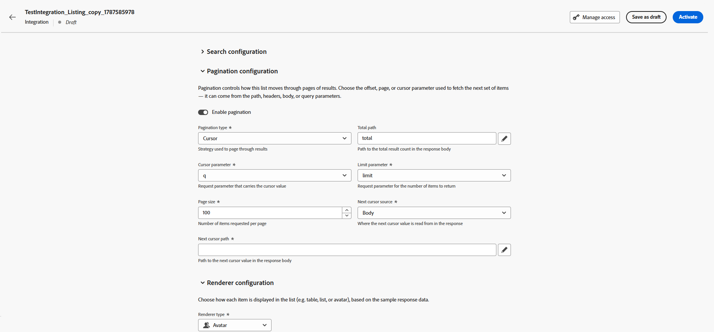
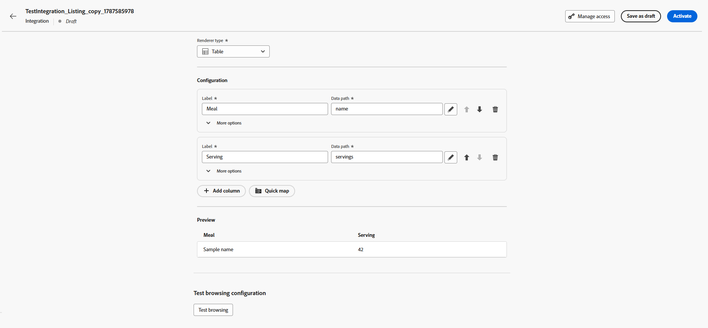
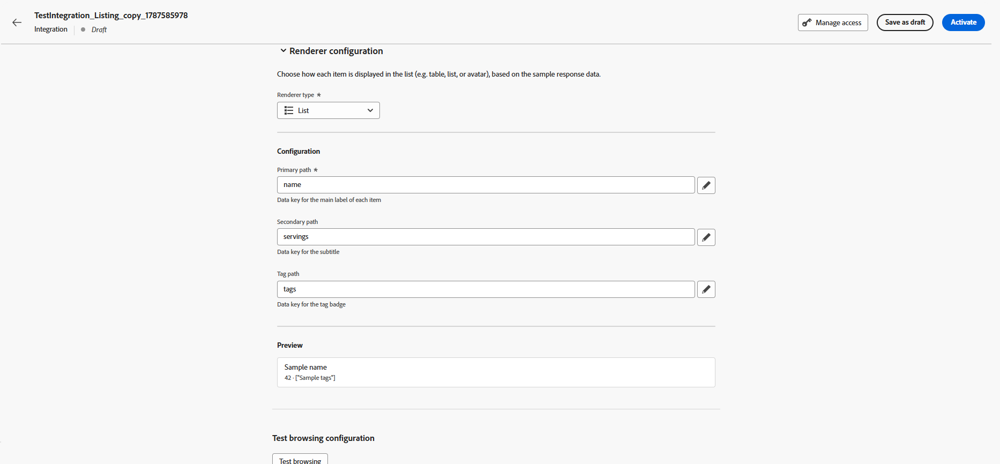
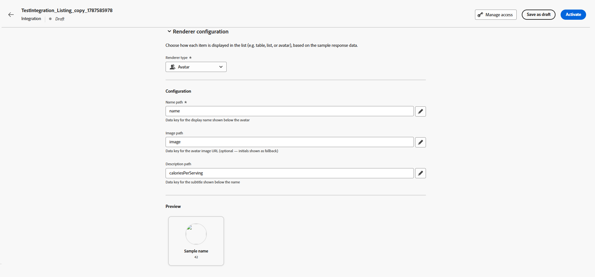
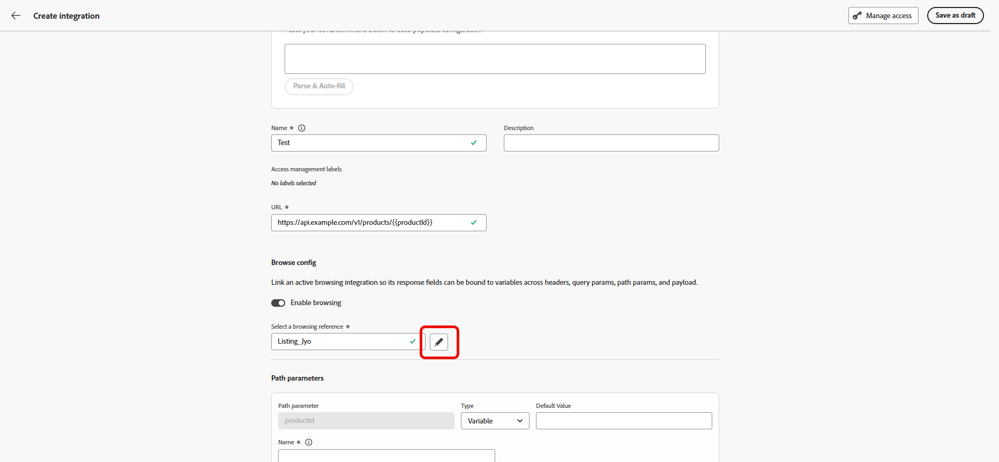
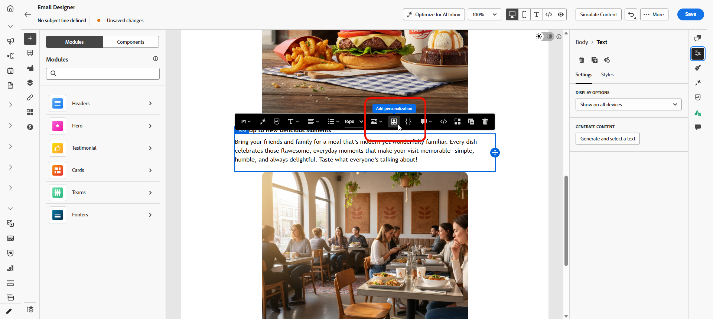
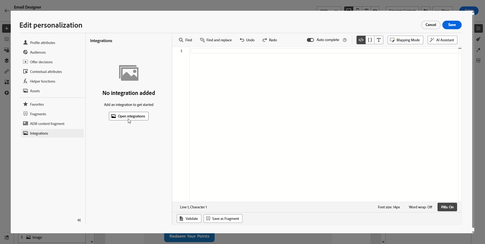
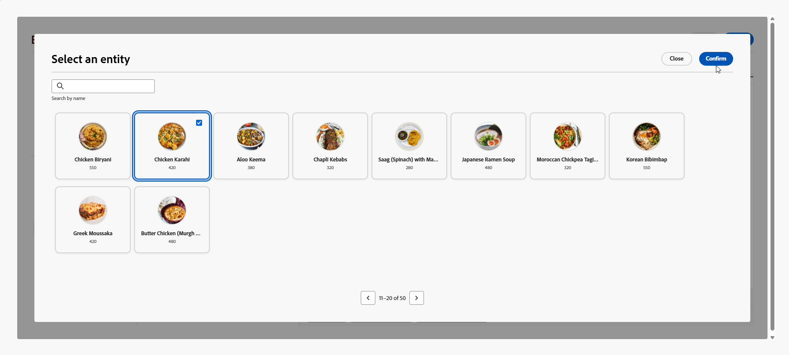

# Work with Browsing integrations {#Browsing}

>[!BEGINSHADEBOX]

**On this page:** Learn how administrators configure Browsing integrations that let marketers search, browse, and select items from external APIs directly in the authoring experience, and how to link them to Standard integrations.

>[!ENDSHADEBOX]

In addition to Standard integrations, you can create **Browsing** integrations. A Browsing integration lets marketers search, browse, and paginate through items returned by an external API, then select a specific item directly in the authoring experience instead of manually entering a parameter value.

## Create a Browsing integration {#create-browsing}

As an administrator, you create a Browsing integration from the **[!UICONTROL Browsing]** tab of the **[!UICONTROL Integrations]** configuration, using the same [step-by-step instructions](integrations-create.md#configure) as for Standard integrations. 

Once the integration information is provided, configure the following **Browsing**-specific settings:

1. From the **[!UICONTROL Items configuration]** menu, choose the **[!UICONTROL Items path]** where the list of items is located.

    {zoomable="yes"}

1. In the **[!UICONTROL Search configuration]** drop-down, **[!UICONTROL Enable search]** and select which parameter carries the search query, then provide a description for marketers.

    {zoomable="yes"}

1. In the **[!UICONTROL Pagination configuration]** menu, enable **[!UICONTROL Pagination]** and choose a pagination type:

    +++ Offset

    Configure the following fields to set up **[!UICONTROL Offset]** pagination:

    * **[!UICONTROL Total path]**: Provide the path to the total result count in the response body.
    * **[!UICONTROL Offset parameter]**: Specify the request parameter that indicates the number of items to skip.
    * **[!UICONTROL Limit parameter]**: Specify the request parameter that indicates the number of items to return.
    * **[!UICONTROL Page size]**: Set the number of items to request per page.
        
        {zoomable="yes"}

    +++

    +++ Page

    Configure the following fields to set up **[!UICONTROL Page]** pagination:

    * **[!UICONTROL Total path]**: Provide the path to the total result count in the response body.
    * **[!UICONTROL Page parameter]**: Specify the request parameter that indicates the page number.
    * **[!UICONTROL Page size parameter]**: Specify the request parameter that indicates the number of items per page.
    * **[!UICONTROL Page size]**: Set the number of items to request per page.
    * **[!UICONTROL First page is]**: Select whether the first page in the sequence is numbered 0 or 1.
    * **[!UICONTROL Total pages path]**: Provide the path to the total page count in the response body. Optional if you've provided the total count path.

        {zoomable="yes"}

    +++

    +++ Cursor

    Configure the following fields to set up **[!UICONTROL Cursor]** pagination:

    * **[!UICONTROL Total path]**: Provide the path to the total result count in the response body.
    * **[!UICONTROL Cursor parameter]**: Specify the request parameter that carries the cursor value.
    * **[!UICONTROL Limit parameter]**: Specify the request parameter that indicates the number of items to return.
    * **[!UICONTROL Page size]**: Set the number of items to request per page.
    * **[!UICONTROL Next cursor source]**: Select where the next cursor value is read from in the response.
    * **[!UICONTROL Next cursor path]**: Provide the path to the next cursor value in the response body.

        {zoomable="yes"}

    +++

1. From the **[!UICONTROL Render]** menu, choose how items are displayed to marketers:

    +++ Table

    For each column, choose the **[!UICONTROL Label]** and the **[!UICONTROL Data path]**. Optionally, select **[!UICONTROL Quick map]** to add several fields as columns at once.

    You can reorder columns as needed, or select  to remove a column.

    {zoomable="yes"}

    +++

    +++ List

    Fill in the following details:

    * **[!UICONTROL Primary path]**: Provide the data key for the main label of each item.
    * **[!UICONTROL Secondary path]**: Specify the data key for the subtitle.
    * **[!UICONTROL Tag path]**: Specify the data key for the tag badge.

    {zoomable="yes"}

    +++

    +++ Avatar

    Fill in the following details:

    * **[!UICONTROL Name path]**: Specify the data key for the display name shown below the avatar.
    * **[!UICONTROL Image path]**: Specify the data key for the avatar image URL.
    * **[!UICONTROL Description path]**: Provide the data key for the subtitle shown below the name.

    {zoomable="yes"}

    +++

1. Click **[!UICONTROL Test browsing]** to preview the search and pagination behavior with the configured settings.

1. Save the **[!UICONTROL Browsing]** integration, then click **[!UICONTROL Publish]** and **[!UICONTROL Activate]**.

## Link a Browsing integration to a Standard integration {#use-Browsing}

You can let marketers pick an item from a **[!UICONTROL Browsing]** integration to populate a parameter value in a Standard integration.

1. While configuring a parameter on a **[!UICONTROL Standard]** integration, enable **[!UICONTROL Browsing]**.

1. Choose the Browsing integration to link.

    {zoomable="yes"}

1. Save and publish the **[!UICONTROL Standard]** integration.

## Select items during authoring {#select-Browsing-items}

When a parameter is linked to a **[!UICONTROL Browsing]** integration, marketers can pick its value from a selector in the message or journey editor, rather than typing it manually.

1. Access your campaign content and click **[!UICONTROL Add personalization]** from your Text or HTML **[!UICONTROL Components]**. 

    [Learn more on components](../email/content-components.md)

    {zoomable="yes"}

1. Navigate to the **[!UICONTROL Integrations]** section and click **[!UICONTROL Open integrations]** to view all active integrations.

    {zoomable="yes"}

1. Select an integration.

1. Search and browse the paginated list of items returned by the **[!UICONTROL Browsing integration]**, then select an entity and confirm your selection.

    The corresponding **[!UICONTROL Reference path]** value is then automatically inserted into the integration parameter.

    {zoomable="yes"}

1. Click **[!UICONTROL Save]**.

**See also**

* [Work with Standard integrations](integrations-create.md)
* [Integrations troubleshooting FAQ](vendor-integration-faq.md#troubleshooting)
* [Monitoring & Troubleshooting](../../rp_landing_pages/troubleshoot-journey-landing-page.md)
