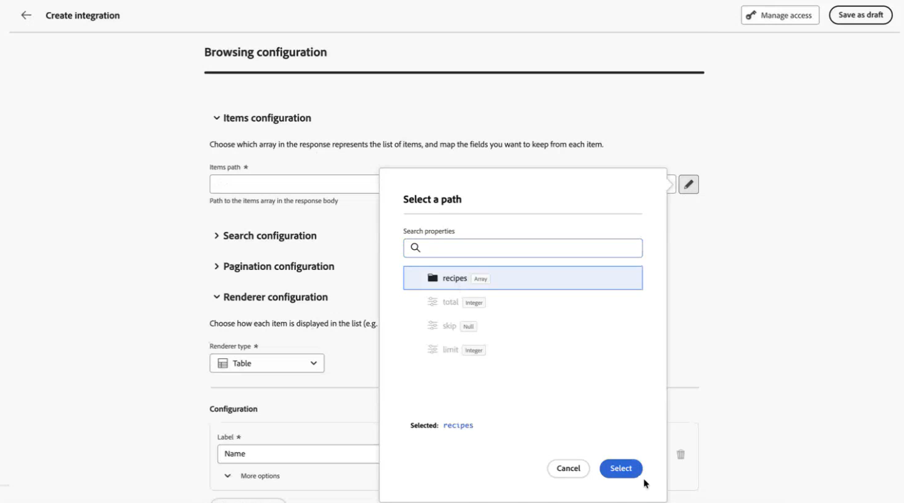
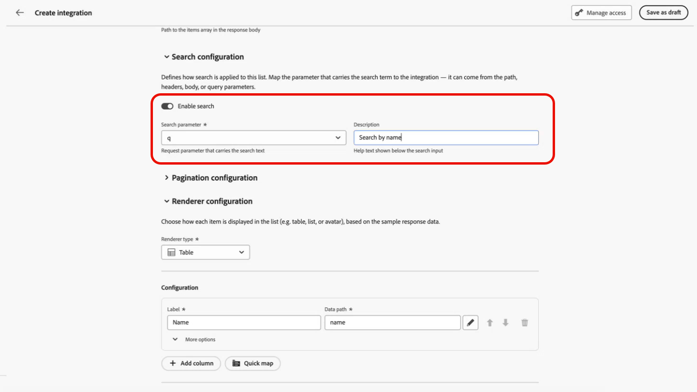
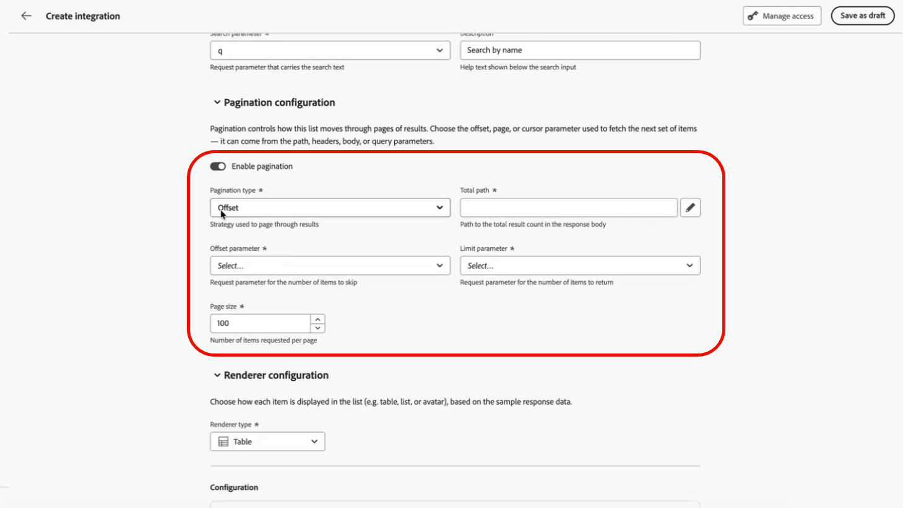

# Work with Listing integrations {#listing}

>[!BEGINSHADEBOX]

**On this page:** Learn how administrators configure Listing integrations that let marketers search, browse, and select items from external APIs directly in the authoring experience, and how to link them to Standard integrations.

>[!ENDSHADEBOX]

In addition to Standard integrations, you can create **Listing** integrations. A Listing integration lets marketers search, browse, and paginate through items returned by an external API, then select a specific item directly in the authoring experience instead of manually entering a parameter value.

## Create a Listing integration {#create-listing}

As an administrator, you can set up external Listing integrations by following these steps:

1. Navigate to the **[!UICONTROL Configurations]** section in the left menu, click **[!UICONTROL Manage]** from the **[!UICONTROL Integrations]** card, then select the **[!UICONTROL Browsing]** tab.

1. Click **[!UICONTROL Create Integration]** to start a new Listing integration.

1. Provide the integration information as detailed in the [step-by-step instructions](integrations.md#configure) for standard integrations.

1. From the **[!UICONTROL Browsing]** menu, choose the **[!UICONTROL Items path]** where the list of items is located.

    

1. In the **[!UICONTROL Search]** drop-down, **[!UICONTROL Enable search]** and select which parameter carries the search query, then provide a description for marketers.

    

1. Enable the **[!UICONTROL Pagination]** to choose a pagination type

    

1. From the **[!UICONTROL Render]** menu, choose how you want your items to be displayed.

1. Select which fields to display as columns when marketers browse the list of items.

1. Click **[!UICONTROL Test browsing]** to preview the search and pagination behavior with the configured settings.

1. Save the Listing integration, then click **[!UICONTROL Publish]** and **[!UICONTROL Activate]**.

## Link a Listing integration to a Standard integration {#use-listing}

You can let marketers pick an item from a Listing integration to populate a parameter value in a Standard integration.

1. While configuring a parameter on a Standard integration, enable **[!UICONTROL Browsing]**.

1. Click the selector button and choose the Listing integration to link.

    The parameters exposed by the linked Listing integration are fetched, and you can set default values for them.

1. Set the **[!UICONTROL Reference path]** to the field of the listed item that should be passed as the parameter value, for example an **ID**.

1. Save and publish the Standard integration.

## Select items during authoring {#select-listing-items}

When a parameter is linked to a Listing integration, marketers see a selector in the message or journey editor instead of a plain input field. They can search and browse the paginated list of items returned by the Listing integration, select the item they want, and confirm their selection. The corresponding **[!UICONTROL Reference path]** value is then automatically inserted into the integration parameter.

