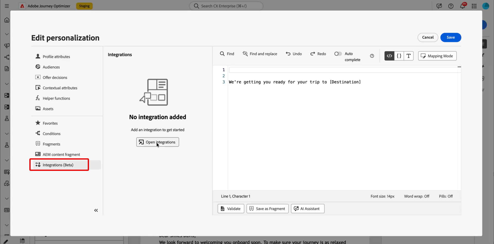
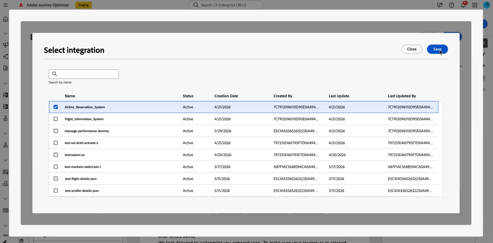
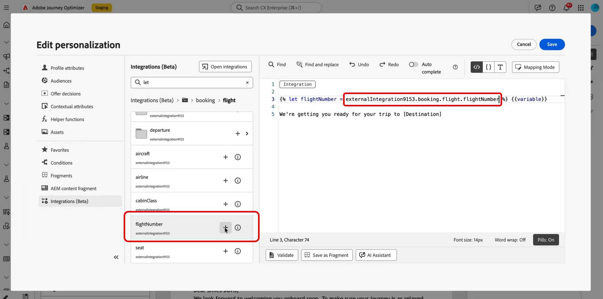
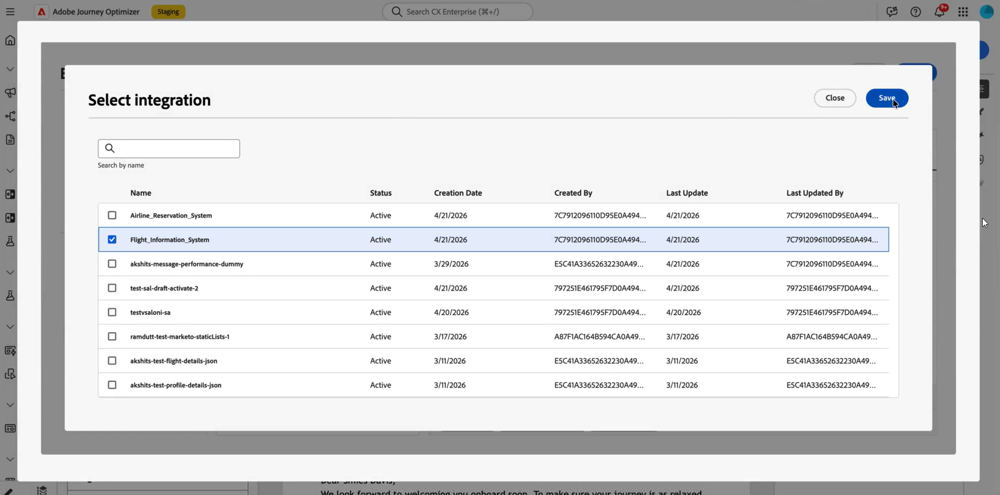
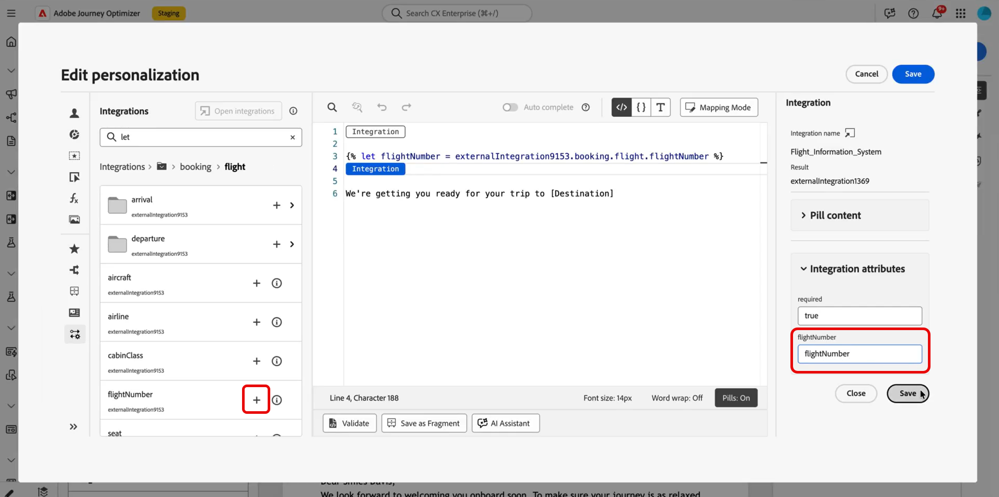
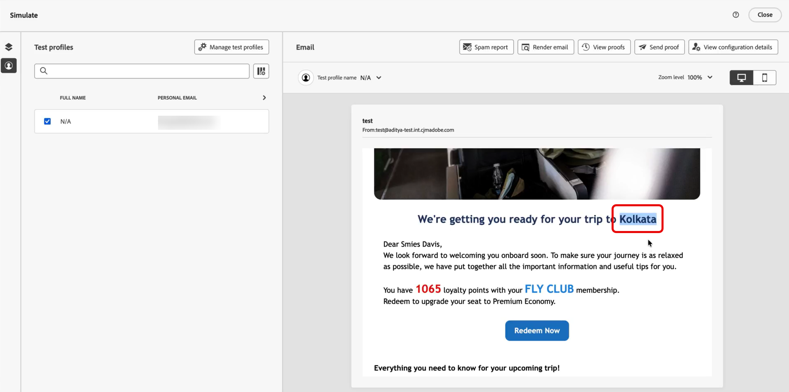

# Using External integrations for personalization {#integrations-personalization}

Before you use external integrations in your content, confirm an administrator has **configured and activated** each integration (endpoint, authentication, policies, response payload, and activation) as described in [Work with Integrations](integrations.md).

You can add up to **3** integrations per **[!UICONTROL Fragment]** and up to **5** on the message. Integrations that come only from fragments do not count toward the **5**.

## Apply integration personalization to your content {#apply-integration-personalization}

As a marketer, you can use configured integrations to personalize your content. Follow these steps:

1. Access your campaign content and click **[!UICONTROL Add personalization]** from your Text or HTML **[!UICONTROL Components]**. 

    [Learn more on components](../email/content-components.md)

    

1. Navigate to the **[!UICONTROL Integrations]** section and click **[!UICONTROL Open integrations]** to view all active integrations.
    
    Note that **Journey Optimizer Fragments** are available with Integrations but support outbound channels only. Once a fragment is published, adding and saving new integrations is disabled to avoid impact on existing journeys and campaigns.

    

1. Select an integration and click **[!UICONTROL Save]**.
    
    

1. Enable the **[!UICONTROL Pills]** mode to unlock the advanced integration menu.

    

1. When you author integration personalization, the Integrations helper includes a **`required`** field that defines how failures or missing data interact with default content:

    * **`required=true`** (default): Rendering stops for that message. The send is excluded with **`ExternalDataLookupExclusion`**, and that exclusion is recorded in the **message feedback dataset**.
    * **`required=false`**: The result variable is set to **`null`** and rendering continues. Use default text, fallbacks, or conditional logic in your template so profiles do not receive empty content when the integration does not return data.

        

1. To complete your integration setup, define your integration attributes, which were previously specified during [configuration](integrations.md#configure). 

    You can assign values to these attributes using either static values, which remain constant, or profile attributes, which dynamically pull information from user profiles.

    

1. Once integration attributes are defined, you can now use the integration fields in your content for personalized messaging by clicking the  icon.

    

    >[!NOTE]
    >
    >Tokens in your template must use only fields the administrator exposed in the integration configuration. For example, `{{weatherResponse.temperature}}` is valid when `temperature` is exposed; `{{weatherResponse.humidity}}` is rejected in the editor if `humidity` was not exposed.

1. Click **[!UICONTROL Save]**.

Your integration personalization is now successfully applied to your content, ensuring each recipient receives a tailored, relevant experience based on the attributes you have configured.

## Map one API call to another {#map-integration-chain}

You can chain integrations so one call's results feed the next, for example, path segments, headers, or query parameters. The calls run in order in the same message, which supports richer personalization without custom code.
 
Before you start, make sure that:

* An administrator has configured and activated every integration you need. See [Configure your Integration](integrations.md).
* Variable path placeholders, headers, and query parameters are set up in the integration configuration with marketer-facing labels.
* The administrator exposed the response fields you need in each integration's **[!UICONTROL Response payload]** so they appear when authoring.

The example below uses a reservation integration that returns a flight number from the profile's booking, then a flight information integration that uses that number for live status (delays, destination). You map the second integration's inputs to the first call's response.

1. Open your message or fragment and open the personalization editor.

    

1. In **[!UICONTROL Integrations]**, click **[!UICONTROL Open integrations]**.

    
    
1. Add the integration whose response will feed the next call, for example, reservation or booking data that includes the flight identifier.

    

1. (Optional) Open the **[!UICONTROL Helper function]** menu and add a helper, for example, the `Let` function, if you want to bind a named variable to the reservation response.

    >[!NOTE]
    >
    > Only fields exposed in the administrator-defined **[!UICONTROL Response payload]** are available. You cannot reference properties that were not exposed in configuration.

1. If you use a helper variable, map that variable to the field the reservation integration returns for downstream use, for example, the flight number in the passenger or booking payload.

    

1. From the **[!UICONTROL Open integrations]** menu, add the second integration, for example, flight status.

    

1. In the second integration, open **[!UICONTROL Integrations attributes]**. For each input that must reuse data from the first call, such as a path variable, header, or query parameter, select a mapping source from the first integration response.

    In the **[!UICONTROL Pills]** experience, you can map first-call output directly to second-call input without a `Let` statement. If you used `Let`, you can map through that variable instead.

    

1. Insert tokens from the second integration into your content with the  control, for example, destination from the flight information response.

    

1. Save your content.

On **[!UICONTROL Simulation]** or send, Journey Optimizer runs integrations in order: the first call uses your configured profile context, and its result builds the second request. Whether a given integration runs at simulation or send time depends on your setup and channel.

## How-to video {#video}

This video shows how **Integrations** connect Adobe Journey Optimizer to external APIs so you can pull live data and content into **outbound** channels, Email, SMS, and Push, for more relevant personalization.

>[!VIDEO](https://video.tv.adobe.com/v/3484118/?learn=on)
