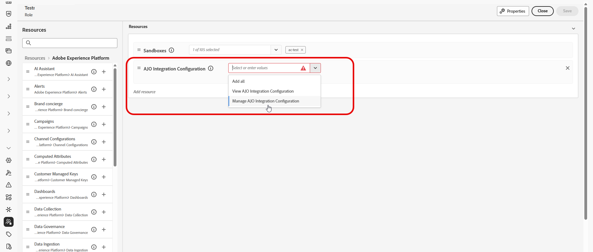
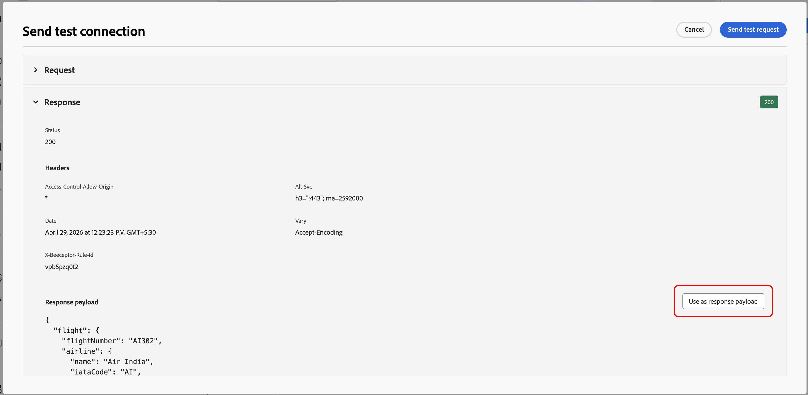

# Work with Integrations {#external-sources}

>[!BEGINSHADEBOX]

**On this page:** Learn how administrators configure, test, and activate external integrations that connect Adobe Journey Optimizer to third-party APIs for personalized, dynamic content in outbound channels.

>[!ENDSHADEBOX]

## Overview

The **Integrations** feature links Adobe Journey Optimizer to third-party systems whose data and composable content you already manage elsewhere. You can surface that material during authoring and at send time, which supports more responsive, personalized experiences across the channels you use in Journey Optimizer.

You can use this feature to access external data and pull content from third-party tools such as:

* **Rewards Points** from loyalty systems.
* **Price Information** for products.
* **Product Recommendations** from recommendation engines.
* **Logistics Updates** like delivery status.

To start using Integrations, users need to be granted the **[!UICONTROL Manage AJO integration configuration]** and **[!UICONTROL View AJO integration configuration]** permissions. [Learn more on permissions](../administration/permissions.md)

+++ Learn how to assign Integrations related permissions

1. In the **[!UICONTROL Permissions]** product, go to the **[!UICONTROL Roles]** tab and select the desired **[!UICONTROL Role]**.

1. Click **[!UICONTROL Edit]** to modify the permissions.

1. Add the **[!UICONTROL AJO Integration Configuration]** resource, then select the appropriate Integrations permissions from the drop-down menu.

    

1. Click **[!UICONTROL Save]** to apply changes.

    Any users already assigned to this role will have their permissions automatically updated.

1. To assign this role to new users, navigate to the **[!UICONTROL Users]** tab within the **[!UICONTROL Roles]** dashboard and click **[!UICONTROL Add User]**.

1. Enter the user's name, email address, or choose from the list, then click **[!UICONTROL Save]**.

If the user was not previously created, refer to [this documentation](https://experienceleague.adobe.com/en/docs/experience-platform/access-control/abac/permissions-ui/users).

+++

## Configure your Integration {#configure}

>[!AVAILABILITY]
>
> This integration feature is restricted to outbound channels (Email, SMS, and Push) and supports pulling JSON or HTML.

As an administrator, you can set up external integrations by following these steps:

1. Navigate to the **[!UICONTROL Configurations]** section in the left menu and click **[!UICONTROL Manage]** from the **[!UICONTROL Integrations]** card.
    
    Then, click **[!UICONTROL Create Integration]** to start a new configuration.

    

1. Optionally, paste a **cURL** command to auto-fill the URL, HTTP method, headers, and query parameters.

1. Provide a **[!UICONTROL Name]** and **[!UICONTROL Description]** for your integration. 

    >[!NOTE]
    >
    >**[!UICONTROL Name]** field cannot contain spaces.

1. Enter the API endpoint **[!UICONTROL URL]**. 

    For path variables, wrap a label in double curly braces in the URL, for example, `https://api.example.com/v1/products/{{productId}}`, then set each placeholder in **[!UICONTROL Path Template]**.

1. Configure the **[!UICONTROL Path Template]** with **[!UICONTROL Name]** and **[!UICONTROL Default value]** for every placeholder you added in the URL.

    Note that the **[!UICONTROL Name]** is a marketer-facing label in the editor only, it is not sent on the API request.

    

1. Select the **[!UICONTROL HTTP Method]** between GET and POST.

1. Click **[!UICONTROL Add Header]** and/or **[!UICONTROL Add Query Parameters]** as needed for your integration. For each parameter, provide the following details:

    * **[!UICONTROL Parameter]**: The actual header or query parameter name as expected by the API.

    * **[!UICONTROL Name]**: A marketer-friendly label for this parameter, authors select it when mapping values in campaigns.

    * **[!UICONTROL Type]**: Choose **Constant** for a fixed value or **Variable** for dynamic input.

    * **[!UICONTROL Value]**: Enter the value directly for constants, or select a variable mapping.

    * **[!UICONTROL Mandatory]**: Specify whether this parameter is required. For mandatory **[!UICONTROL Variable]** parameters, if no value is resolved at runtime and no default is provided, request generation fails with an error and the outbound API call is not made.

    

1. Choose an **[!UICONTROL Authentication Type]**:

    * **[!UICONTROL No Authentication]**: For open APIs that do not require any credentials.

    * **[!UICONTROL API key]**: Authenticate requests using a static API key. Enter your **[!UICONTROL API Key Name ​]**, **[!UICONTROL API Key Value ​]** and specify your **[!UICONTROL Location]**.

    * **[!UICONTROL Basic Auth]**: Use standard HTTP Basic Authentication. Enter **[!UICONTROL Username]** and **[!UICONTROL Password]**.

    * **[!UICONTROL OAuth 2.0]**: Authenticate using the OAuth 2.0 protocol. Click the  icon to configure or update the **[!UICONTROL Payload]**.

    

1. Set  **[!UICONTROL Policy configuration]** such as **[!UICONTROL Timeout]** period for API requests and choose to enable throttling, cache and/or retry.

    >[!NOTE]
    >
    >With throttling enabled, supported rates are 50 to 5000 TPS. Limits apply to the **integration**, not each API endpoint.
    >
    >With retry enabled, other failures retry **three** times by default, with **200 ms**, **400 ms**, and **800 ms** between attempts.

1. With the **[!UICONTROL Response payload]** field, you can decide which fields of the sample output needs to be used for message personalization. 
    
    Click the  icon and paste a sample JSON response payload to automatically detect data types.

1. Choose the fields to expose for personalization and specify their corresponding data types.

    

    >[!NOTE]
    >
    >The **[!UICONTROL Response payload]** configuration defines the expected response for authoring including any schema applied in that step. Marketers may reference only exposed fields, tokens for other paths fail validation in the editor.

1. Use **[!UICONTROL Send test connection]** to validate the integration. [Learn more on how to test your connection](#connection)
    
    Once validated, click **[!UICONTROL Activate]**.

1. Access your newly created Integration to:

    * **Update**: Change **Authentication** details and **Policy configuration** only. Updates apply to live journeys and campaigns. Before you save changes, use the **[!UICONTROL Explore references]** menu to confirm where the integration is used.
    * **Archive**: Archive an Integration configuration.

    

After activation, click the  icon to access the **[!UICONTROL Explore references]** menu and to review usage for this configuration, including journeys and campaigns that depend on it.

### Send-time limits and behavior {#configure-send-time}

At send time, responses from the external API may be up to **4 MB** by default. Anything larger is treated as an integration error, and **retries are not attempted** when the failure is caused by response size. 

Calls honor the **throttling** rate you configured: Journey Optimizer schedules attempts up to that limit even when the external system is down or returning errors. If **cache** is enabled, only **successful** responses are stored and reused until the cache **TTL** you defined expires; failed responses are never cached.

Each queued message also carries a validity window (TTL). If processing falls behind and a message sits past that window, the system **discards** it and emits a **`MessageValidityExclusion`** event so stale work clears from the queue and resources stay available.

## Testing your connection {#connection}

**[!UICONTROL Send test connection]** validates the endpoint URL, authentication, and request structure against the target API prior to activation, which reduces the risk of runtime failures during message processing. 

1. When the URL, HTTP method, headers, and query parameters are defined, click **[!UICONTROL Send test connection]** to run a connectivity test and confirm the configuration.

1. In the **[!UICONTROL Send test connection]** dialog, enter default values for any **[!UICONTROL Variable]** placeholders in the URL path, headers, and query parameters.
    
    Those values are included in the test request. Journey Optimizer invokes the endpoint and reports whether the connection succeeded or failed.

    

1. If the test returns a successful response, select **[!UICONTROL Use as response payload]** to copy the response body into the **[!UICONTROL Response payload]** field, see step 10 under [Configure your Integration](#configure), where data types can be detected and fields can be selected for personalization.

    

1. If the test does not succeed, expand the **[!UICONTROL Error]** drop-down to review the failure details, update the integration configuration as needed, and run **[!UICONTROL Send test connection]** again.

    

After the test succeeds, select **[!UICONTROL Activate]** in the integration configuration. See [Configure your Integration](#configure).

