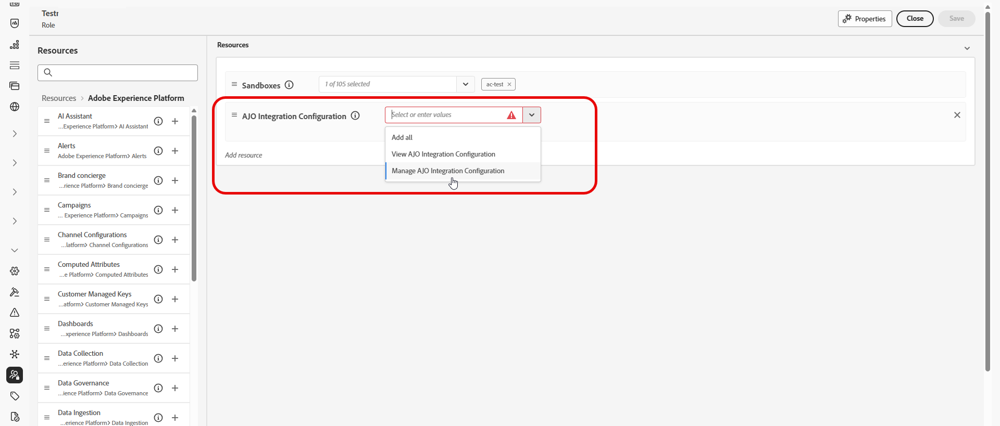

# Work with Integrations {#external-sources}

>[!BEGINSHADEBOX]

**On this page:** Learn how administrators configure, test, and activate external integrations that connect Adobe Journey Optimizer to third-party APIs, so marketers can use them to build personalized, dynamic content in outbound channels.

>[!ENDSHADEBOX]

## Overview {#overview}

The **Integrations** feature links Adobe Journey Optimizer to third-party systems whose data and composable content you already manage elsewhere. You can surface that material during authoring and at send time, which supports more responsive, personalized experiences across the channels you use in Journey Optimizer.

You can use this feature to access external data and pull content from third-party tools such as:

* **Rewards Points** from loyalty systems.
* **Price Information** for products.
* **Product Recommendations** from recommendation engines.
* **Logistics Updates** like delivery status.

To start using Integrations, users need to be granted the **[!UICONTROL Manage AJO integration configuration]** and **[!UICONTROL View AJO integration configuration]** permissions. [Learn more on permissions](../administration/permissions.md)

+++ Learn how to assign Integrations related permissions

1. In the **[!UICONTROL Permissions]** product, go to the **[!UICONTROL Roles]** tab and select the desired **[!UICONTROL Role]**.

1. Click **[!UICONTROL Edit]** to modify the permissions.

1. Add the **[!UICONTROL AJO Integration Configuration]** resource, then select the appropriate Integrations permissions from the drop-down menu.

    

1. Click **[!UICONTROL Save]** to apply changes.

    Any users already assigned to this role will have their permissions automatically updated.

1. To assign this role to new users, navigate to the **[!UICONTROL Users]** tab within the **[!UICONTROL Roles]** dashboard and click **[!UICONTROL Add User]**.

1. Enter the user's name, email address, or choose from the list, then click **[!UICONTROL Save]**.

If the user was not previously created, refer to [this documentation](https://experienceleague.adobe.com/en/docs/experience-platform/access-control/abac/permissions-ui/users).

+++

## Standard vs Browsing {#standard-browsing}

When you access the **[!UICONTROL Integrations]** menu, the page is split into two tabs: **[!UICONTROL Standard]** and **[!UICONTROL Browsing]**. Understanding the difference between the two helps you choose the right configuration for your use case.

* **[!UICONTROL Standard]** integrations connect Journey Optimizer directly to a third-party API to pull data or content for personalization at authoring or send time. Parameter values are either fixed constants or resolved from variables you map in your campaign or journey.

  ➡️ See [Create Standard integrations](integrations-create.md)

* **[!UICONTROL Browsing]** integrations let marketers search, browse, and paginate through a list of items returned by an external API, then select a specific item directly in the authoring experience instead of typing a value. A Browsing integration is linked to a Standard integration's parameter so the value marketers select is automatically passed to the API call.

  ➡️ See [Create Browsing integrations](integrations-browsing.md)

## Step-by-step {#set-up}

Setting up an integration involves administrators and marketers, each playing a distinct role from configuration to content personalization.

1. Make sure you have the **[!UICONTROL Manage AJO integration configuration]** and **[!UICONTROL View AJO integration configuration]** permissions before you start. 

    [Learn more on permissions](../administration/permissions.md).

1. As an administrator, create a **[!UICONTROL Standard]** integration, and optionally link it to a **[!UICONTROL Browsing]** integration so marketers can select items instead of entering values manually. 

    See [Create Standard integrations](integrations-create.md) and [Create Browsing integrations](integrations-browsing.md).

1. As a marketer, apply your configured integrations to personalize Email, SMS, and Push content.

    See [Use External integrations for personalization](integrations-personalization.md)

