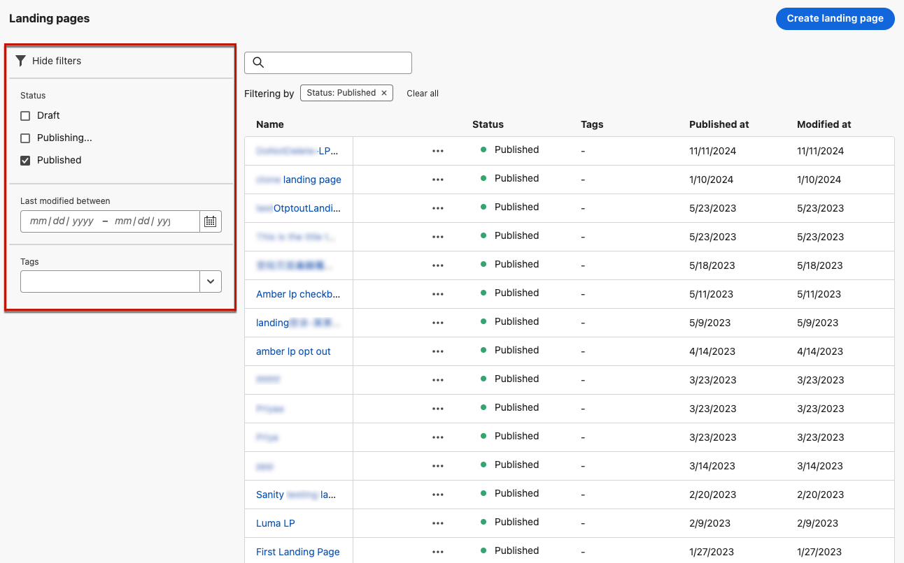
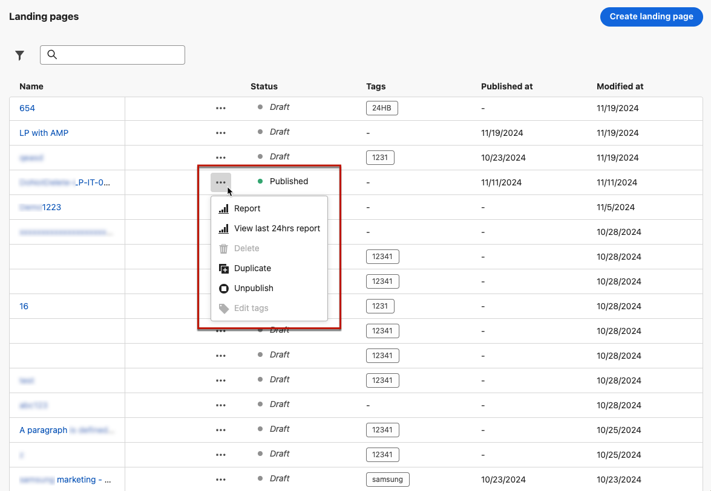
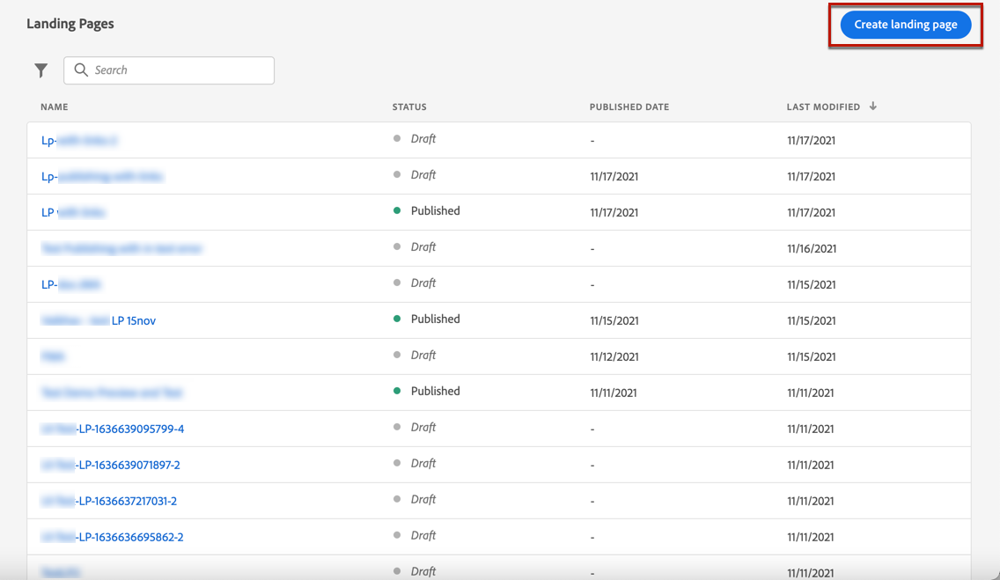
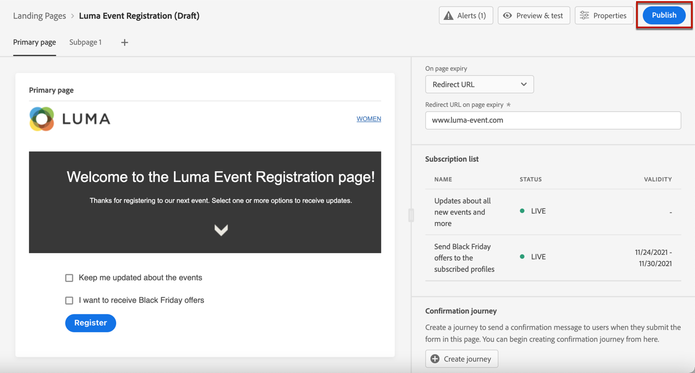

# Create and publish landing pages {#create-lp}

To direct your customers to a defined web page that you want to display when they click a specific link, create a landing page in [!DNL Journey Optimizer], configure the primary page and any subpages, test it and publish it.

The main steps to create landing pages are as follows:

## Access landing pages {#access-landing-pages}

To access the landing page list, select **[!UICONTROL Content Management]** > **[!UICONTROL Landing pages]** from the left menu.

The **[!UICONTROL Landing Pages]** list displays all the existing landing pages. You can filter them based on their status, modification date, or tags.

From this list, you can access also duplicate, delete, unpublish a landing page, or access the landing page reports. For this, click the three dots next to a landing page and select the desired action:

You can:

* Access the following **reports**, for published landing pages: [landing page report](../reports/lp-report-global-cja.md) and [last 24 hours live report](../reports/lp-report-live.md).

* **Delete** or **duplicate** a landing page. You cannot delete a [published](#publish-landing-page) landing page. To delete it, you must first **unpublish** it.

* **Unpublish** landing page.

    >[!CAUTION]
    >
    >If you unpublish a landing page which is referenced in a message, the link to the landing page will be broken and users will get an error page if they try to access it.

* Edit a landing page's associated [tags](../start/search-filter-categorize.md#tags).

## Create a landing page {#create-landing-page}

>[!CONTEXTUALHELP]
>id="ajo_lp_create"
>title="Define and configure your landing page"
>abstract="To create a landing page, you need to select a preset, then configure the primary page and subpages, and finally test your page before publishing it."

>[!CONTEXTUALHELP]
>id="ajo_lp_access_management_labels"
>title="Assign labels to your landing page"
>abstract="To protect sensitive digital assets, you can define authorizations to manage data access to your landing page using labels."
>additional-url="https://experienceleague.adobe.com/docs/journey-optimizer/using/access-control/object-based-access.html" text="Object level access control"

To create a landing page, you must select a preset, then configure the primary page and subpages, and finally test your page before publishing it. These steps are detailed below:

1. Browse to **[!UICONTROL Content Management]** > **[!UICONTROL Landing pages]** from the left menu.

1. From the landing page list, click **[!UICONTROL Create landing page]**.

    

1. Add a title. You can add a description if needed.

    

1. To assign custom or core data usage labels to the landing page, select **[!UICONTROL Manage access]**. [Learn more on Object Level Access Control (OLAC)](../administration/object-based-access.md)

1. Select or create Adobe Experience Platform tags from the **[!UICONTROL Tags]** field to categorize your landing page for improved search. [Learn more](../start/search-filter-categorize.md#tags)

1. Select a preset. Learn how to create landing page presets in [this section](../landing-pages/lp-presets.md#lp-create-preset).

    

1. Click **[!UICONTROL Create]**.

1. The primary page and its properties display. Learn how to configure the primary page settings [here](#configure-primary-page).

    

1. Click the + icon to add a subpage. Learn how to configure the subpage settings [here](#configure-subpages).

    

Once you configured and designed the [primary page](#configure-primary-page), and the [subpages](#configure-subpages) if any, you can [test](#test-landing-page) and [publish](#publish-landing-page) your landing page.

>[!CAUTION]
>
>You cannot access your landing page by simply copy-pasting the defined URL into a web browser, even if published. Instead you can test it using the preview function such as described in [this section](#test-landing-page).

## Configure the primary page {#configure-primary-page}

>[!CONTEXTUALHELP]
>id="ajo_lp_primary_page"
>title="Define your primary page settings"
>abstract="The primary page is immediately displayed to the users after they click the link to your landing page, such as from an email or a website."
>additional-url="https://experienceleague.adobe.com/docs/journey-optimizer/using/landing-pages/landing-pages-design/design-lp.html" text="Design the landing page content"

>[!CONTEXTUALHELP]
>id="ajo_lp_access_settings"
>title="Define your landing page URL"
>abstract="In this section, define a unique landing page URL. The first part of the URL requires you previously set up a landing page subdomain as part of the preset you selected."
>additional-url="https://experienceleague.adobe.com/en/docs/journey-optimizer/using/landing-pages/lp-configuration/lp-subdomains" text="Configure landing page subdomains"
>additional-url="https://experienceleague.adobe.com/docs/journey-optimizer/using/landing-pages/lp-configuration/lp-presets.html#lp-create-preset" text="Create landing page presets"

The primary page is the page that is immediately displayed to the users after they click the link to your landing page, such as from an email or a website.

To define the primary page settings, follow the steps below.

1. You can change the page name, which is **[!UICONTROL Primary page]** by default.

1. Edit the content of your page using the content designer. Learn how to define landing page content [here](design-lp.md).

    

1. Define your landing page URL. The first part of the URL requires you previously set up a landing page subdomain as part of the [preset](../landing-pages/lp-presets.md#lp-create-preset) you selected. [Learn more](../landing-pages/lp-subdomains.md)

    >[!CAUTION]
    >
    >The landing page URL must be unique.
    >
    >You cannot access your landing page by simply copy-pasting this URL into a web browser, even if published. Instead you can test it using the preview function such as described in [this section](#test-landing-page).

    

1. If you want the landing page to preload the form data that is already available, select the **[!UICONTROL Pre-fill form fields with profile information]**.

    

    When this option is enabled, if a profile has already opted in/out or was already added to a subscription list, their choices will be reflected upon displaying the landing page.

    For example, if a profile has opted in to receive communications about future events, the corresponding checkbox will be already selected the next time the landing page is displayed to that profile.

    

1. You can define an expiry date for your page. In that case, you must select an action upon page expiry:

    * **[!UICONTROL Redirect URL]**: Enter the URL of the page the users will be redirected to when the page expires.
    * **[!UICONTROL Custom page]**: [Configure a subpage](#configure-subpages) and select it from the drop-down list that displays.
    * **[!UICONTROL Browser error]**: Type the error text that will be displayed instead of the page.

    

1. In the **[!UICONTROL Additional data]** section, define one or more keys and their corresponding parameter values. You will be able to leverage these keys in the content of your primary page and subpages using the [personalization editor](../personalization/personalization-build-expressions.md). Learn more in [this section](lp-content.md#use-form-component#use-additional-data).

    

1. If you selected one or more subscription lists when [designing the primary page](design-lp.md), they display in the **[!UICONTROL Subscription list]** section.

    

1. From the landing page, you can directly [create a journey](../building-journeys/journey-gs.md#jo-build) that will send a confirmation message to users when they submit the form. Learn how to build such a journey at the end of this [use case](lp-use-cases.md#subscription-to-a-service).

    

    Click **[!UICONTROL Create journey]** to be redirected to the **[!UICONTROL Journey Management]** > **[!UICONTROL Journeys]** list.

## Configure subpages {#configure-subpages}

>[!CONTEXTUALHELP]
>id="ajo_lp_subpage"
>title="Define the subpage settings"
>abstract="You can add up to 2 subpages. For example, you can create a 'thank you' page that will display once the users submit the form, and you can define an error page that will be called if a problem occurs with the landing page."
>additional-url="https://experienceleague.adobe.com/en/docs/journey-optimizer/using/landing-pages/landing-pages-design/design-lp" text="Design the landing page content"

>[!CONTEXTUALHELP]
>id="ajo_lp_access_settings-subpage"
>title="Define your landing page URL"
>abstract="In this section, define a unique landing page URL. The first part of the URL requires you previously set up a landing page subdomain as part of the preset you selected."
>additional-url="https://experienceleague.adobe.com/docs/journey-optimizer/using/landing-pages/lp-configuration/lp-subdomains.html" text="Configure landing page subdomains"
>additional-url="https://experienceleague.adobe.com/docs/journey-optimizer/using/landing-pages/lp-configuration/lp-presets.html#lp-create-preset" text="Create landing page presets"

You can add up to 2 subpages. For example, you can create a 'thank you' page that will display once the users submit the form, and you can define an error page that will be called if a problem occurs with the landing page.

To define the subpage settings, follow the steps below.

1. You can change the page name, which is **[!UICONTROL Subpage 1]** by default.

1. Edit the content of your page using the content designer. Learn how to define landing page content [here](design-lp.md).

    >[!NOTE]
    >
    >You can insert a link to the primary page from any subpage of the same landing page. For example, to redirect users who made a mistake and want to subscribe again, you can add a link from the confirmation subpage to the subscription primary page. Learn how to insert links in [this section](../email/message-tracking.md#insert-links).

1. Define your landing page URL. The first part of the URL requires you previously set up a landing page subdomain. [Learn more](../landing-pages/lp-subdomains.md)

    >[!CAUTION]
    >
    >The landing page URL must be unique.
    >
    >You cannot access your subpage by simply copy-pasting this URL into a web browser, even if published. Instead you can test it using the preview function such as described in [this section](#test-landing-page).

## Test the landing page {#test-landing-page}

>[!CONTEXTUALHELP]
>id="ac_preview_lp_profiles"
>title="Preview and test your landing page"
>abstract="Once you defined your landing page settings and content, you can use test profiles to preview it."
>additional-url="https://experienceleague.adobe.com/docs/journey-optimizer/using/audiences-profiles-identities/profiles/creating-test-profiles.html" text="Select test profiles"

Once your landing page settings and content have been defined, you can use test profiles to preview it. If you inserted [personalized content](../personalization/personalize.md), you will be able to check how this content is displayed in the landing page, using test profile data.

>[!CAUTION]
>
>To be able to test landing pages, you must have the **[!UICONTROL Publish Messages]** permission.
>
>You must have test profiles available to be able to preview your messages and send proofs. Learn how to [create test profiles](../audience/creating-test-profiles.md).

1. From the landing page interface, click the **[!UICONTROL Simulate content]** button to access the test profile selection.

    

    >[!NOTE]
    >
    >The **[!UICONTROL Simulate content]** button is also accessible from the content designer.

1. From the **[!UICONTROL Simulate]** screen, select one or more test profiles.

    

    The steps to select test profiles are the same as when testing a message. They are detailed in the [Content Management](../content-management/test-profiles.md) section.

1. Select **[!UICONTROL Open preview]** to test your landing page.

    

1. The preview of your landing page opens in a new tab. Personalized elements are replaced by the selected test profile data.

    <!---->

1. Select other test profiles to preview the rendering for each variant of your landing page.

## Check alerts {#check-alerts}

While you are creating your landing page, alerts warn you when you must take important actions before publishing.

Alerts are displayed on top right of the screen, as shown below:

>[!NOTE]
>
>If you do not see this button, no alert has been detected.

Two types of alerts can happen:

* **Warnings** refer to recommendations and best practices. <!--For example, a message will display if -->

* **Errors** prevent you from publishing the landing page as long as they are not resolved. For example, you will get a warning if the primary page URL is missing.

<!--All possible warnings and errors are detailed [below](#alerts-and-warnings).-->

>[!CAUTION]
>
> You must resolve all **error** alerts before publication.

<!--The settings and elements checked by the system are listed below. You will also find information on how to adapt your configuration to resolve the corresponding issues.

**Warnings**:

* 

**Errors**:

-->

## Publish the landing page {#publish-landing-page}

>[!CAUTION]
>
>To publish landing pages, users must have the **[!UICONTROL Publish Messages]** permission. 

Once your landing page is ready, you can publish it to make it available for use in a message.

>[!CAUTION]
>
>Before publishing, check and resolve alerts. [Learn more](#check-alerts)

Once your landing page is published, it is added to the landing page list with the **[!UICONTROL Published]** status.

It is now live and ready to be used in a [!DNL Journey Optimizer] message that will be sent through a [journey](../building-journeys/journey.md).

>[!NOTE]
>
>You cannot access your landing page by simply copy-pasting into a web browser the URL defined when [creating the page](#create-landing-page), even if published. Instead you can test it using the preview function such as described in [this section](#test-landing-page).

You can monitor your landing page impacts through specific reports. [Learn more](../reports/lp-report-live.md)
